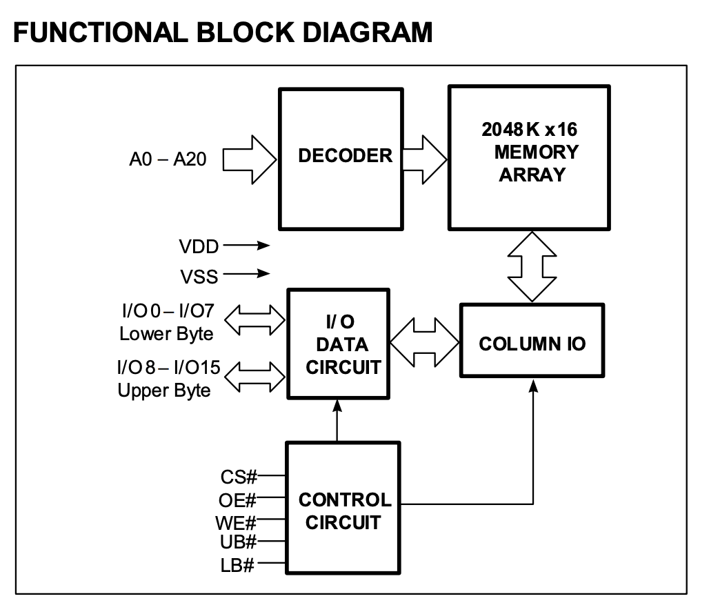
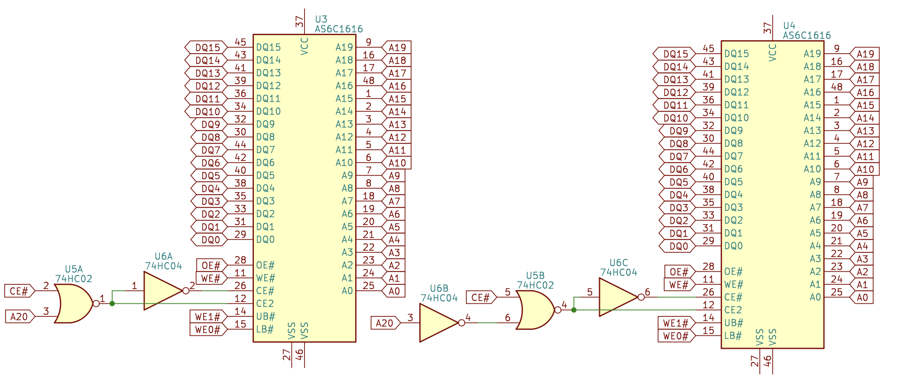
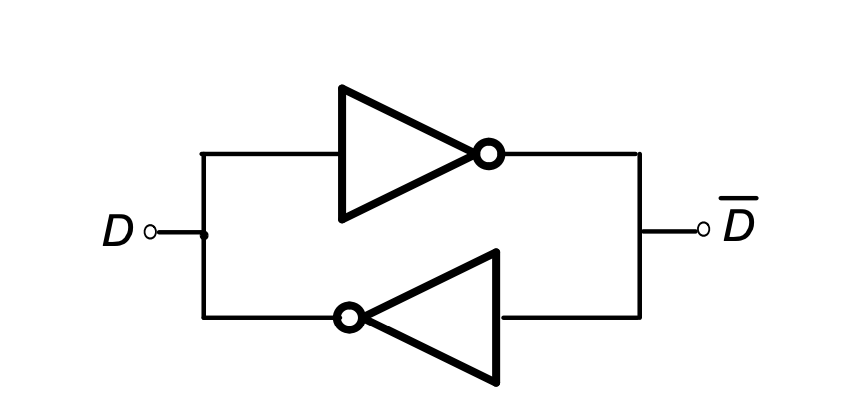

# Asynchronous SRAM

## Features

Features of asynchronous SRAM:

1. Simple interface: the controller gives the address and control signals, and the data is available after a fixed delay, no calibration is required
2. MB level RAM available: single chip can provide KB to MB level RAM, larger capacity can be obtained by connecting multiple SRAMs in parallel
3. High-speed asynchronous SRAM with latency in the 10ns range

## Structure

The asynchronous SRAM holds data internally as an array. For example, a 2048K x 16 asynchronous SRAM has 2048K rows, each row holds 16 bits of data, for a total of $2048\mathrm{K} * 16\mathrm{b} = 32 \mathrm{Mb}$ of data.

The structure of the asynchronous SRAM is shown in Figure 1. When the controller accesses the asynchronous SRAM, it gives a row address and the asynchronous SRAM reads a row of data. Since there are 2048K rows, the number of bits needed for the address is $\log_2(2048\mathrm{K})=21$, which corresponds to `A0-A20` in the figure below. The address is passed to `DECODER`, which takes the data to be accessed from the array and puts it in `COLUMN IO`.

<figure markdown>
  { width="400" }
  <figcaption>Asynchronous SRAM Diagram (Source <a href="https://www.issi.com/WW/pdf/61-64WV204816ALL_BLL.pdf">ISSI Datasheet</a>)</figcaption>
</figure>

For read operations, the memory controller provides the address on `A0-A20`, reads the data through `DECODER` from `2048K x 16 MEMORY ARRAY` to `COLUMN IO`, and the control logic `CONTROL CIRCUIT` outputs the data to `I/O DATA CIRCUIT` according to the read operation (`WE#=1, OE#=0`).

For write operations, the memory controller provides the address on `A0-A20`, the data to be written on `I/O`, and the byte enable on `UB#/LB#`. The asynchronous SRAM reads the existing data in the array from `MEMORY ARRAY`, combines `UB#/LB#` with `I/O`, calculates the new value, and writes it to memory. The `UB#` and `LB#` are byte enables (active-low) for high 8 bits and low 8 bits respectively. If the old data is `1234` and the value to be written by the memory controller is `5678`, then the value in memory is updated to

| UB# | LB# | Result | Description            |
|-----|-----|--------|------------------------|
| 0   | 0   | 5678   | New Value              |
| 1   | 0   | 1278   | Only low byte written  |
| 0   | 1   | 5634   | Only high byte written |
| 1   | 1   | 1234   | Unchanged              |

## Interface

Asynchronous SRAM exposes a single-port RAM interface that can only read or write at a time. A typical asynchronous SRAM includes the following signals:

1. Address signal A: the bit width is determined by the depth, for example, 2048K depth corresponds to 21-bit address
2. Data signal I/O: the bit width is equal to the width of SRAM, e.g. 8 or 16 bits
3. Chip select CS# (or CE#): active-low, works when CS# is equal to 0
4. Output enable OE#: active-low, SRAM output when OE# equals 0, SRAM input when OE# equals 1
5. Write enable WE#: active-low, WE# equals 0 for write, WE# equals 1 for read
6. Byte enable UB#/LB#: active-low, corresponding to two bytes, update when equal to 0, unchanged when equal to 1

Some asynchronous SRAMs are 8 bits wide, where there is no byte enable signal.

## Concatenation

If you want a larger asynchronous SRAM, you can concatenate multiple asynchronous SRAMs. Concatenation can be done in two ways:

One is to concatenate in width, e.g. concatenate two asynchronous SRAMs of the same depth and width of 16 to get an asynchronous SRAM of width 32:

<figure markdown>
  { width="400" }
  <figcaption>Concatenate asynchronous SRAM in width</figcaption>
</figure>

The address signal (A) and control signals (OE#, WE#, CE#) are connected to all asynchronous SRAMs, while the data signal (DQ) and byte enable signals (WE0-3#) are connected to different asynchronous SRAMs to form twice the data width.

The other is to concatenate in the depth, keeping the width the same, to increase the storage capacity. For example, concatenate two asynchronous SRAMs to get an asynchronous SRAM with doubled depth. For each access, only one of the asynchronous SRAMs will be accessed, distinguished by the address.

For example, to concatenate two asynchronous SRAMs with 21-bit addresses to get a asynchronous SRAM with 22-bit addresses, if the highest bit of the address is used to select which asynchronous SRAM to access, then you can set: `CS0#=CS# | A[21], CS1#=CS# | ~A[21]`, and the rest of the signals are connected to all the asynchronous SRAMs. When `CS#=1`, the output pins are in the high resistance state, so multiple chips can share a single data bus and only need to ensure that only one chip on the bus is outputting at the same time:

<figure markdown>
  { width="600" }
  <figcaption>Concatenate asynchronous SRAM in depth</figcaption>
</figure>

In practice, it is possible to mix the two methods.

## Timing

### Read Timing

The asynchronous SRAM is called asynchronous because it has no clock signal. In this case, the read timing is reflected as the delay between the controller giving the address and the asynchronous SRAM giving the data. Take [IS61/64WV204816ALL Asynchronous SRAM chip](https://www.issi.com/WW/pdf/61-64WV204816ALL_BLL.pdf) as an example, the read timing is shown in the following figure:

<figure markdown>
  { width="600" }
  <figcaption>Read Timing of Asynchronous SRAM (Source <a href="https://www.issi.com/WW/pdf/61-64WV204816ALL_BLL.pdf">ISSI Datasheet</a>)</figcaption>
</figure>

- $t_{RC}$: read cycle time, the address remains unchanged during this time, Min 10ns
- $t_{AA}$: address access time, the data is given after the address change in $t_{AA}$ time, Max 10ns
- $t_{OHA}$: output hold time, the data remains unchanged during this time, Min 2.5ns

The output data is uncertain during the period between the end of $t_{OHA}$ and the end of $t_{AA}$.

### Write timing

The write timing is more complicated, and there can be multiple write conditions, one of which is listed below:

<figure markdown>
  { width="600" }
  <figcaption>Write timing of asynchronous SRAM (Source <a href="https://www.issi.com/WW/pdf/61-64WV204816ALL_BLL.pdf">ISSI Datasheet</a>)</figcaption>
</figure>

The core of the write timing is the rising edge of `WE#`. Compared with this time point, there are the following important timing requirements:

- $t_{WC}$: The address needs to remain unchanged for $t_{WC}$, Min 10ns
- $t_{AW}$: The setup time of the address relative to the rising edge of `WE#`, Min 8ns
- $t_{HA}$: Hold time of the address relative to the rising edge of `WE#`, Min 0ns
- $t_{PWE}$: The time when `WE#` maintains 0, Min 8ns
- $t_{SD}$: Setup time of data relative to the rising edge of `WE#`, Min 6ns
- $t_{HD}$: Hold time of data relative to the rising edge of `WE#`, Min 0ns
- $t_{SA}$: Setup time of the address relative to the falling edge of `WE#`, Min 0ns

## SRAM Cell

A typical SRAM Cell consists of 6 transistors, and the internal structure is as follows:

<figure markdown>
  { width="400" }
  <figcaption>Internal Structure of 6T SRAM Cell (Source <a href="https://inst.eecs.berkeley.edu/~eecs151/sp19/files/lec16-ram.pdf">Berkeley EECS 151/251A Spring 2019</a>)</figcaption>
</figure>

Among them, M1 and M2 form an inverter, M3 and M4 form another inverter, and two inverters form the following equivalent circuit:

<figure markdown>
  { width="400" }
  <figcaption>Circuit in SRAM Cell (Source <a href="https://inst.eecs.berkeley.edu/~eecs151/sp19/files/lec16-ram.pdf">Berkeley EECS 151/251A Spring 2019</a>)</figcaption>
</figure>

This is a latch that can stably store 1 bit of data. The two transistors M5 and M6 are used for reading and writing. When WL is enabled, M5 and M6 are turned on, BL and Q are connected, and BLbar and Qbar are connected. At this point, you can read and write through BL and BLbar.

## Acknowledgement

The English version is kindly translated with the help of DeepL Translator and Google Translate.
