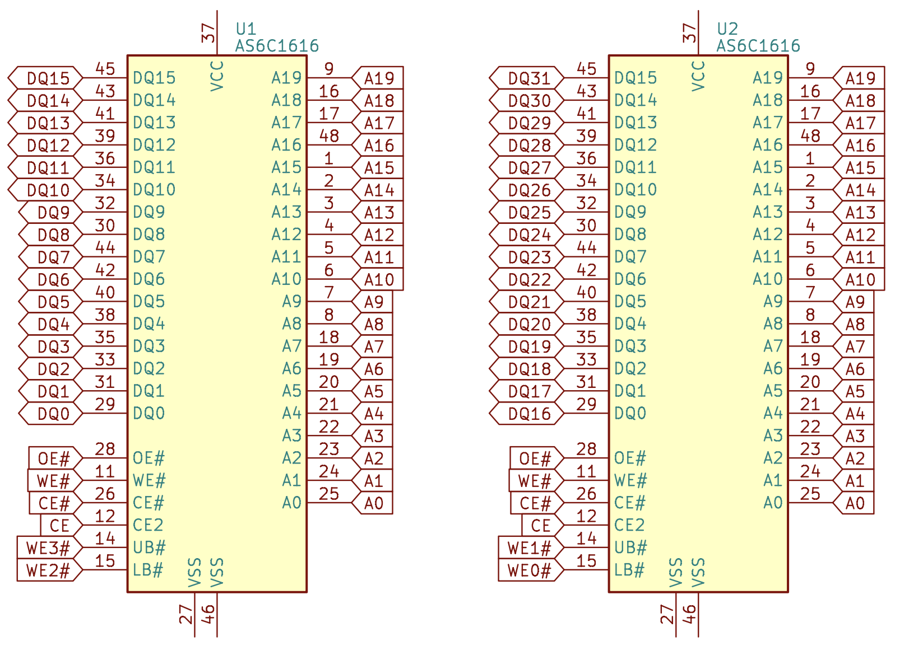

# 异步 SRAM

## 特点

异步 SRAM 的特点：

1. 接口简单：控制器给出地址和控制信号，经过固定延迟后就可以得到数据，不需要校准
2. 提供 MB 级别的 RAM：单芯片可以提供 KB 到 MB 级别的 RAM，通过并联多个 SRAM，可以得到更大的容量
3. 高速异步 SRAM 延迟在 10ns 的级别

## 结构

异步 SRAM 内部以一个数组的形式保存数据。例如一个 2048K x 16 的异步 SRAM，有 2048K 个行，每行保存了 16 位的数据，总共保存了 $2048\mathrm{K} * 16\mathrm{b} = 32 \mathrm{Mb}$ 的数据。

异步 SRAM 的结构见图 1。控制器在访问异步 SRAM 的时候，给出一个行的地址，异步 SRAM 就会读取一行的数据。由于一共有 2048K 个行，所以地址需要的位数是 $\log_2(2048\mathrm{K})=21$，对应下图的 `A0-A20`。地址通过 `DECODER`，从数组中取出要访问的数据，放到 `COLUMN IO` 中。

<figure markdown>
  { width="400" }
  <figcaption>图 1：异步 SRAM 的结构框图（图源 <a href="https://www.issi.com/WW/pdf/61-64WV204816ALL_BLL.pdf">ISSI Datasheet</a>）</figcaption>
</figure>

对于读操作，内存控制器在 `A0-A20` 上提供地址，经过 `DECODER` 从 `2048K x 16 MEMORY ARRAY` 中读取数据到 `COLUMN IO`，控制逻辑 `CONTROL CIRCUIT` 根据读操作（`WE#=1, OE#=0`），把数据输出到 `I/O DATA CIRCUIT`。

对于写操作，内存控制器在 `A0-A20` 上提供地址，在 `I/O` 上提供要写入的数据，在 `UB#/LB#` 上提供字节使能。异步 SRAM 从 `MEMORY ARRAY` 中读取数组中现有的数据，结合 `UB#/LB#` 与 `I/O`，计算出新的值，再写入内存。其中 `UB#` 和 `LB#` 分别是高 8 位和低 8 位的字节使能（低有效）。如果旧数据是 `1234`，内存控制器要写入的值是 `5678`，那么内存中的值更新为：

| UB# | LB# | 结果 | 解释         |
|-----|-----|------|--------------|
| 0   | 0   | 5678 | 全部采用新值 |
| 1   | 0   | 1278 | 仅写入低字节 |
| 0   | 1   | 5634 | 仅写入高字节 |
| 1   | 1   | 1234 | 全部采用旧值 |

## 接口

异步 SRAM 暴露了一个单口 RAM 接口，同时只能进行读或者写其中一个操作。典型的异步 SRAM 包括如下的信号：

1. 地址信号 A：位数根据深度决定，例如 2048K 的深度对应 21 位地址
2. 数据信号 I/O：位数等于宽度，例如 8 或 16 位
3. 片选信号 CS#（或者叫 CE#）：低有效，CS# 等于 0 时工作
4. 输出使能信号 OE#：低有效，OE# 等于 0 时 SRAM 输出，OE# 等于 1 时 SRAM 输入
5. 写使能信号 WE#：低有效，WE# 等于 0 时写，WE# 等于 1 时读
6. 字节使能信号 UB#/LB#：低有效，对应两个字节，等于 0 时更新，等于 1 时不变

一些异步 SRAM 的宽度是 8 位，此时没有字节使能信号。

## 拼接

如果想要更大容量的异步 SRAM，可以拼接多个异步 SRAM。拼接的时候可以采用两种方式：

一种是在宽度上拼接，例如拼接两个相同深度、宽度为 16 的异步 SRAM，得到一个宽度为 32 的异步 SRAM：

<figure markdown>
  { width="400" }
</figure>

地址信号（A）和控制信号（OE#、WE#、CE#）连接到所有异步 SRAM，数据信号（DQ）和字节使能信号（WE0-3#）则是拼接不同的异步 SRAM，形成两倍的数据宽度。

另一种是在深度上拼接，保持宽度不变，增加存储容量。例如拼接两个异步 SRAM，得到一个深度翻倍的异步 SRAM。每次访问的时候，只会访问其中一个异步 SRAM，通过地址来区分。

例如要拼接两个 21 位地址的异步 SRAM，得到一个 22 位地址的异步 SRAM，如果用地址的最高位来选择访问哪个异步 SRAM，那么可以设定：`CS0#=CS# | A[21], CS1#=CS# | ~A[21]`，其余的信号都连接到所有的异步 SRAM。由于异步 SRAM 在 `CS#=1` 的时候，输出引脚处于高阻态状态，所以多个芯片可以共享一个数据总线，只需要保证总线上同时只有一个芯片在输出：

<figure markdown>
  { width="600" }
</figure>

实践中，可以混合两种拼接方法。
