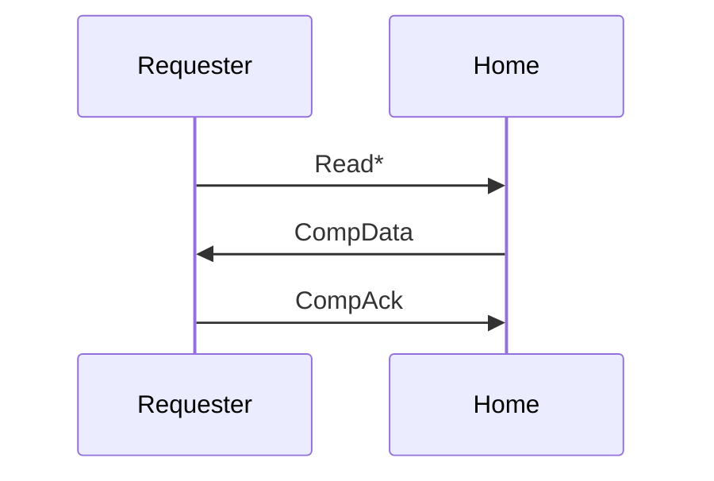
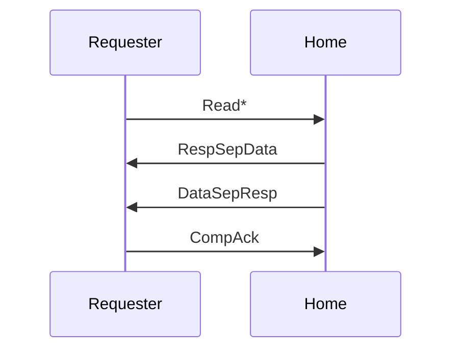
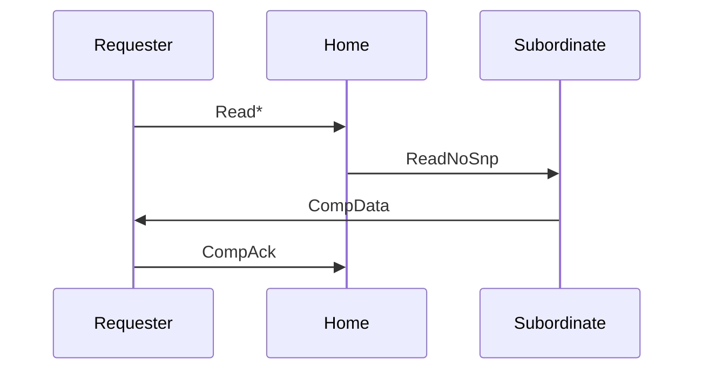
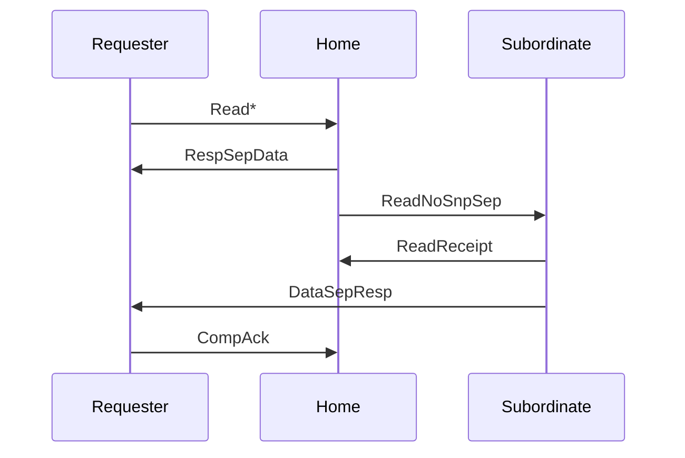
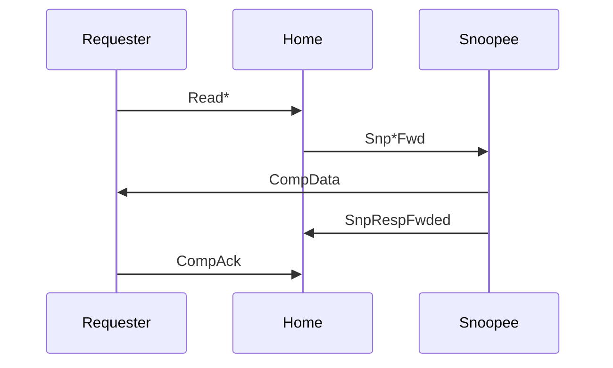
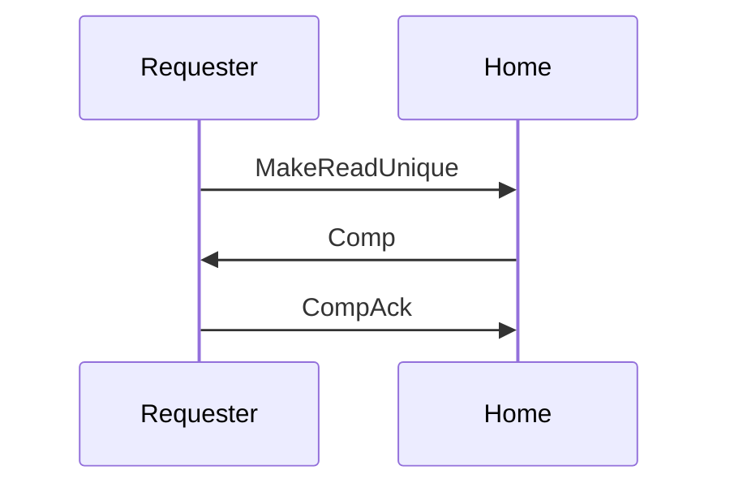
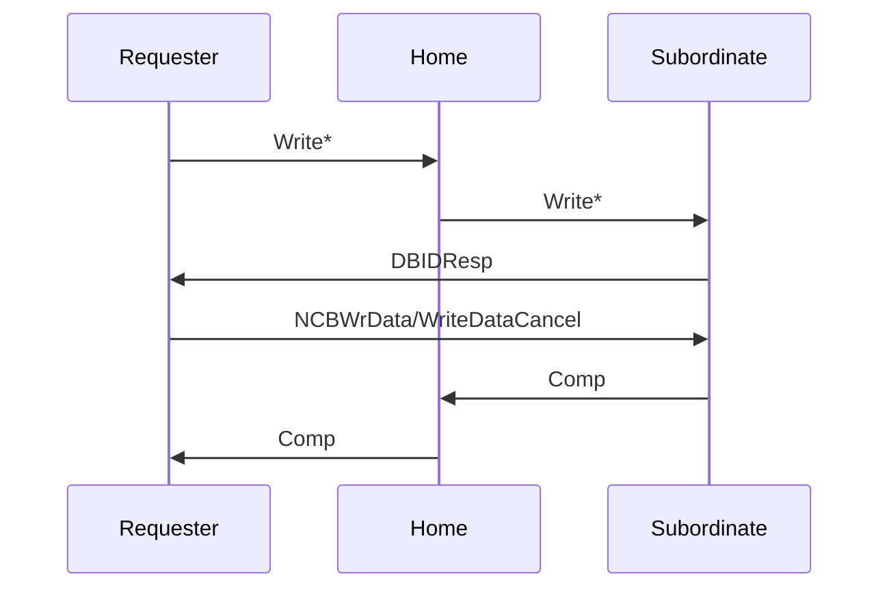
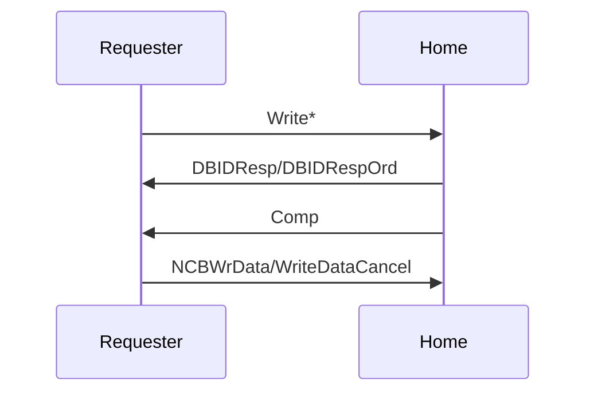
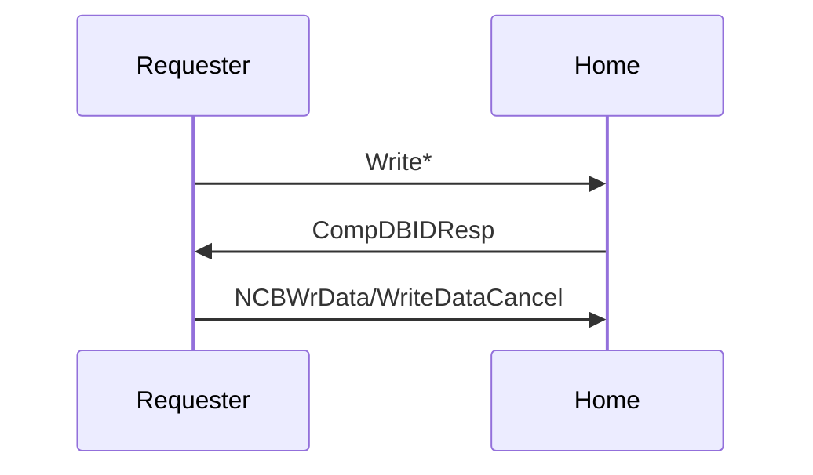

# 缓存一致性协议

缓存一致性协议的场景是，多核 CPU 中，每个核心都有自己的缓存，为了保证这些缓存的数据一致，设计了缓存一致性协议。

## 理论分析

首先从理论的角度，分析如何设计一个缓存一致性协议。

### Write-invalidate 和 Write-update

最基础的缓存一致性思想有两种：

1. Write-invalidate：写入数据的时候，将其他 Cache 中这条 Cache Line 设为 Invalid
2. Write-update：写入数据的时候，把新的结果写入到有这条 Cache Line 的其他 Cache

### Write-once 协议

Write-once 协议定义了四个状态：

1. Invalid：表示这个块不合法
2. Valid：表示这个块合法，并可能是共享的，同时数据没有修改
3. Reserved：表示这个块合法，不是共享的，同时数据没有更改
4. Dirty：表示这个块合法，不是共享的，数据做了修改，和内存不同。

可见，当一个缓存状态在 R 或者 D，其他缓存只能是 I；而缓存状态是 V 的时候，可以有多个缓存在 V 状态。

Write-once 协议的特点是，第一次写的时候，会写入到内存（类似 Write-through），连续写入则只写到缓存中，类似 Write-back。

当 Read hit 的时候，状态不变。

	Read hit: The information is supplied by the current cache. No state
	change.

当 Read miss 的时候，会查看所有缓存，如果有其他缓存处于 Valid/Reserved/Dirty 状态，就从其他缓存处读取数据，然后设为 Valid，其他缓存也设为 Valid。如果其他缓存处于 Dirty 状态，还要把数据写入内存。

	Read miss: The data is read from main memory. The read is snooped by
	other caches; if any of them have the line in the Dirty state, the read
	is interrupted long enough to write the data back to memory before it is
	allowed to continue. Any copies in the Dirty or Reserved states are set
	to the Valid state.

当 Write hit 的时候，如果是 Valid 状态，首先写入内存，把其他 Cache 都设为 Invalid，进入 Reserved 状态，这意味着第一次写是 Write-through。如果是 Reserved/Dirty 状态，则不修改内存，进入 Dirty 状态，这表示后续的写入都是 Write-back。

	Write hit: If the information in the cache is in Dirty or Reserved
	state, the cache line is updated in place and its state is set to Dirty
	without updating memory. If the information is in Valid state, a
	write-through operation is executed updating the block and the memory
	and the block state is changed to Reserved. Other caches snoop the write
	and set their copies to Invalid.

当 Write miss 的时候，这个行为 Wikipedia 上和上课讲的不一样。按照 Wikipedia 的说法，首先按照 Read miss 处理，再按照 Write hit 处理，类似于 Write Allocate 的思路。如果是这样的话，那么首先从其他缓存或者内存读取数据，然后把其他缓存都设为 Invalid，把更新后的数据写入内存，进入 Reserved 状态。相当于 Write miss 的时候，也是按照 Write-through 实现。

	Write miss: A partial cache line write is handled as a read miss (if
	necessary to fetch the unwritten portion of the cache line) followed by
	a write hit. This leaves all other caches in the Invalid state, and the
	current cache in the Reserved state.

教材上则是 Write miss 的时候按照 Write-back 处理。如果其他缓存都是 Invalid 时，从内存里读取数据，然后写入到缓存中，进入 Dirty 状态。如果其他缓存是 Valid/Reserved/Dirty 状态，就从其他缓存里读取数据，让其他缓存都进入 Invalid 状态，然后更新自己的数据，进入 Dirty 状态。

### MSI 协议

MSI 协议比较简单，它定义了三个状态：

1. Modified：表示数据已经修改，和内存里不一致
2. Shared：数据和内存一致，可以有一到多个缓存同时处在 Shared 状态
3. Invalid：不在缓存中

当 Read hit 的时候，状态不变。

当 Read miss 的时候，检查其他缓存的状态，如果都是 Invalid，就从内存里读取，然后进入 Shared 状态。如果有 Shared，就从其他缓存处读取。如果有 Dirty，那就要把其他缓存的数据写入内存和本地缓存，然后进入 Shared 状态。

当 Write hit 的时候，如果现在是 Shared 状态，则要让其他的 Shared 缓存进入 Invalid 状态，然后更新数据，进入 Modified 状态。如果是 Modified 状态，那就修改数据，状态保持不变。

当 Write miss 的时候，如果有其他缓存处于 Modified/Shared 状态，那就从其他缓存处读取数据，并让其他缓存进入 Invalid 状态，然后修改本地数据，进入 Modified 状态。如果所有缓存都是 Invalid 状态，那就从内存读入，然后修改缓存数据，进入 Modified 状态。

### MESI 协议

MESI 协议定义了四种状态：

1. Modified：数据与内存不一致，并且只有一个缓存有数据
2. Exclusive：数据与内存一致，并且只有一个缓存有数据
3. Shared：数据与内存一致，可以有多个缓存同时有数据
4. Invalid：不在缓存中

当 Read hit 的时候，状态不变。

当 Read miss 的时候，首先会检查其他缓存的状态，如果有数据，就从其他缓存读取数据，并且都进入 Shared 状态，如果其他缓存处于 Modified 状态，还需要把数据写入内存；如果其他缓存都没有数据，就从内存里读取，然后进入 Exclusive 状态。

当 Write hit 的时候，进入 Modified 状态，同时让其他缓存进入 Invalid 状态。

当 Write miss 的时候，检查其他缓存的状态，如果有数据，就从其他缓存读取，否则从内存读取。然后，其他缓存都进入 Invalid 状态，本地缓存更新数据，进入 Modified 状态。

值得一提的是，Shared 状态不一定表示只有一个缓存有数据：比如本来有两个缓存都是 Shared 状态，然后其中一个因为缓存替换变成了 Invalid，那么另一个是不会受到通知变成 Exclusive 的。Exclusive 的设置是为了减少一些总线请求，比如当数据只有一个核心访问的时候，只有第一次 Read miss 会发送总线请求，之后一直在 Exclusive/Modified 状态中，不需要发送总线请求。

### MOESI 协议

MOESI 定义了五个状态：

1. Modified：数据经过修改，并且只有一个缓存有这个数据
2. Owned：同时有多个缓存有这个数据，但是只有这个缓存可以修改数据
3. Exclusive：数据没有修改，并且只有一个缓存有这个数据
4. Shared：同时有多个缓存有这个数据，但是不能修改数据
5. Invalid：不在缓存中

状态中，M 和 E 是独占的，所有缓存里只能有一个。此外，可以同时有多个 S，或者多个 S 加一个 O，但是不能同时有多个 O。

它的状态转移与 MESI 类似，区别在于：当核心写入 Owned 状态的缓存时，有两种方式：1）通知其他 Shared 的缓存更新数据；2）把其他 Shared 缓存设为 Invalid，然后本地缓存进入 Modified 状态。在 Read miss 的时候，则可以从 Owned 缓存读取数据，进入 Shared 状态，而不用写入内存。它相比 MESI 的好处是，减少了写回内存的次数。

AMD64 文档里采用的就是 MOESI 协议。AMBA ACE 协议其实也是 MOESI 协议，只不过换了一些名称，表示可以兼容 MEI/MESI/MOESI 中的一个协议。ACE 对应关系如下：

1. UniqueDirty: Modified
2. SharedDirty: Owned
3. UniqueClean: Exclusive
4. SharedClean: Shared
5. Invalid: Invalid

需要注意的是，SharedClean 并不代表它的数据和内存一致，比如说和 SharedDirty 缓存一致，它只是说缓存替换的时候，不需要写回内存。

### Dragon 协议

Dragon 协议是一个基于更新的协议，意味着写入缓存的时候，会把更新的数据同步到拥有这个缓存行的其他核心。它定义了四个状态：

1. Exclusive clean(E)：独占，并且数据和内存一致
2. Shared clean(Sc)：数据同时存在多个缓存中，并且自己不是最后一个写入该缓存数据的
3. Shared modified(Sm)：数据同时存在多个缓存中，并且自己设最后一个写入该缓存数据的，类似于前面 MOESI 协议的 Owner 状态
4. Modify(M)：独占，并且数据和内存不一致

可以看到，E 和 M 都是独占的，如果出现了多个缓存有同一个缓存行，那就是若干个 Sc 和一个 Sm。

当 Read miss 的时候，在总线上检查是否有缓存已经有这个缓存行的数据，如果没有，则从内存读取并转到 Exclusive clean 状态；如果已经在其他缓存中，则从其他缓存读取，将其他缓存转移到 Shared clean/Shared modified 状态，然后该缓存转移到 Shared clean 状态。

当 Write miss 的时候，同样检查其他缓存的状态，如果是第一个访问的，就从内存读取，更新数据，然后转到 Modify 状态；如果不是第一个访问的，就进入 Shared modified 状态，并且让原来 Shared modified 的缓存进入 Shared clean 状态。

当 Write hit 的时候，如果状态是 Shared modified，这时候需要通知其他缓存更新数据；如果状态是 Shared clean，则要通知其他缓存更新数据的同时，让原来 Shared modified 的缓存进入 Shared clean 状态；如果状态是 Exclusive clean，则进入 Modify 状态。

在这里，Shared modified 的缓存负责在换出的时候，写入数据到内存中。

### 基于目录的缓存一致性

上面的缓存一致性协议中，经常有这么一个操作：向所有有这个缓存行的缓存发送/接受消息。简单的方法是直接广播，然后接受端自己判断是否处理。但是这个方法在核心很多的时候会导致广播流量太大，因此需要先保存下来哪些缓存会有这个缓存的信息，然后对这些缓存点对点地发送。这样就可以节省一些网络流量。

怎么记录这个信息呢？一个简单的办法（Full bit vector format）是，有一个全局的表，对每个缓存行，都记录一个大小为 N（N 为核心数）的位向量，1 表示对应的核心中有这个缓存行。但这个方法保存数据量太大：缓存行数正比于 N，还要再乘以一次 N，总容量是 $O(N^2)$ 的。

一个稍微好一些的方法（Coarse bit vector format）是，我把核心分组，比如按照 NUMA 节点进行划分，此时每个缓存行都保存一个大小为 M（M 为 NUMA 数量）的位向量，只要这个 NUMA 节点里有这个缓存行，对应位就取 1。这样相当于是以牺牲一部分流量为代价（NUMA 节点内部广播），来节省一些目录的存储空间。

但实际上，通常情况下，一个缓存行通常只会在很少的核心中保存，所以这里有很大的优化空间。比如说，可以设置一个缓存行同时出现的缓存数量上限（Limited pointer format），然后保存核心的下标而不是位向量，这样的存储空间就是 $O(N\log_2N)$。但是呢，这样限制了缓存行同时出现的次数，如果超过了上限，需要替换掉已有的缓存，可能在一些场景下性能会降低。

还有一种方式，就是链表 (Chained directory format)。目录中保存最后一次访问的核心编号，然后每个核心的缓存里，保存了下一个保存了这个缓存行的核心编号，或者表示链表终止。这样存储空间也是 $O(N\log_2N)$，不过发送消息的延迟更长，因为要串行遍历一遍，而不能同时发送。类似地，可以用二叉树（Number-balanced binary tree format）来组织：每个缓存保存两个指针，指向左子树和右子树，然后分别遍历，目的还是加快遍历的速度，可以同时发送消息给多个核心。

## 协议分析

下文结合实际的协议，分析缓存一致性协议是如何在硬件中实现的。

### TileLink 协议

TileLink 为了实现缓存一致性，在已有的 A 和 D channel 以外，它引入了三个 channel：B、C 和 E，支持三种操作：

- Acquire：M->S 在 A channel 上发送 Acquire，S->M 在 D channel 上发送 Grant，然后 M->S 在 E channel 上发送 GrantAck；功能是获取一个 copy，可以看到这个和 Get 是类似的，都是在 A channel 上发送请求，在 D channel 上接受响应，只不过额外需要在 E channel 上发送 GrantAck。
- Release：M->S 在 C channel 上发送 Release，S->M 在 D channel 上发送 ReleaseAck；功能是删除自己的 copy，一般是缓存行要被换出的时候，发送 ReleaseData 来写回 Dirty 数据
- Probe：S->M 在 B channel 上发送 Probe，M->S 在 C channel 上发送 ProbeAck；功能是要求 M 删除自己的 copy，通常是有某一个缓存发送了 Acquire，导致其他缓存需要降低权限

可以看到，A C E 三个 channel 是 M->S，B D 两个 channel 是 S->M。

假如一个缓存（Master A）要写入一块只读数据，或者读取一块 miss 的缓存行，如果是广播式的缓存一致性协议，那么需要经历如下的过程：

- Master A -> Slave: Acquire
- Slave -> Master B: Probe
- Master B -> Slave: ProbeAck
- Slave -> Master A: Grant
- Master A -> Slave: GrantAck

首先 Master A 发出 Acquire 请求，然后 Slave 向其他 Master 广播 Probe，等到其他 Master 返回 ProbeAck 后，再向 Master A 返回 Grant，最后 Master A 发送 GrantAck 给 Slave。这样 Master A 就获得了这个缓存行的一份拷贝，并且让 Master B 的缓存行失效或者状态变成只读。

TileLink 的缓存行有三个状态：None，Branch 和 Trunk(Tip)。基本对应 MSI 模型：None->Invalid，Branch->Shared 和 Trunk->Modified。Rocket Chip 代码中 [ClientStates](https://github.com/chipsalliance/rocket-chip/blob/850e1d5d56989f031fe3e7939a15afa1ec165d64/src/main/scala/tilelink/Metadata.scala#L10=) 还定义了 Dirty 状态，大致对应 MESI 模型：None->Invalid，Branch->Shared，Trunk->Exclusive，Dirty->Modified。

此外，标准还说可以在 B 和 C channel 上进行 TL-UH 的操作。标准这么设计的意图是可以让 Slave 转发操作到拥有缓存数据的 Master 上。比如 Master A 在 A channel 上发送 Put 请求，那么 Slave 向 Master B 的 B channel 上发送 Put 请求，Master B 在 C channel 上发送 AccessAck 响应，Slave 再把响应转回 Master A 的 D channel。这就像是一个片上的网络，Slave 负责在 Master 之间路由请求。

接下来看 Rocket Chip 自带的基于广播的缓存一致性协议实现。核心实现是 [TLBroadcast](https://github.com/chipsalliance/rocket-chip/blob/850e1d5d56989f031fe3e7939a15afa1ec165d64/src/main/scala/tilelink/Broadcast.scala)，核心的逻辑就是，如果一个 Master A 发送了 Acquire，那么 TLBroadcast 需要发送 Probe 到其他的 Master，当其他的 Master 都响应了 ProbeAck 后，再返回 Grant 到 Master A。

首先来看 B channel 上的 Probe [逻辑](https://github.com/chipsalliance/rocket-chip/blob/850e1d5d56989f031fe3e7939a15afa1ec165d64/src/main/scala/tilelink/Broadcast.scala#L214=)。它记录了一个 todo bitmask，表示哪些 Master 需要发送 Probe，这里采用了 Probe Filter 来减少发送 Probe 的次数，因为只需要向拥有这个缓存行的 Master 发送 Probe：

```scala
val probe_todo = RegInit(0.U(max(1, caches.size).W))
val probe_line = Reg(UInt())
val probe_perms = Reg(UInt(2.W))
val probe_next = probe_todo & ~(leftOR(probe_todo) << 1)
val probe_busy = probe_todo.orR()
val probe_target = if (caches.size == 0) 0.U else Mux1H(probe_next, cache_targets)

// Probe whatever the FSM wants to do next
in.b.valid := probe_busy
if (caches.size != 0) {
	in.b.bits := edgeIn.Probe(probe_line << lineShift, probe_target, lineShift.U, probe_perms)._2
}
when (in.b.fire()) { probe_todo := probe_todo & ~probe_next }
```

这里 `probe_next` 就是被 probe 的那个 Master 对应的 bitmask，`probe_target` 就是 Master 的 Id。这个 Probe FSM 的输入就是 Probe Filter，它会[给出](https://github.com/chipsalliance/rocket-chip/blob/850e1d5d56989f031fe3e7939a15afa1ec165d64/src/main/scala/tilelink/Broadcast.scala#L256=)哪些 Cache 拥有当前的缓存行的信息：

```scala
val leaveB = !filter.io.response.bits.needT && !filter.io.response.bits.gaveT
val others = filter.io.response.bits.cacheOH & ~filter.io.response.bits.allocOH
val todo = Mux(leaveB, 0.U, others)
filter.io.response.ready := !probe_busy
when (filter.io.response.fire()) {
	probe_todo  := todo
	probe_line  := filter.io.response.bits.address >> lineShift
	probe_perms := Mux(filter.io.response.bits.needT, TLPermissions.toN, TLPermissions.toB)
}
```

这里又区分两种情况：如果 Acquire 需要进入 Trunk 状态（比如是个写入操作），意味着其他 Master 需要进入 None 状态，所以这里要发送 toN；如果 Acquire 不需要进入 Trunk 状态（比如是个读取操作），那么只需要其他 Master 进入 Branch 状态，所以这里要发送 toB。

在 B channel 发送 Probe 的同时，也要[处理](https://github.com/chipsalliance/rocket-chip/blob/850e1d5d56989f031fe3e7939a15afa1ec165d64/src/main/scala/tilelink/Broadcast.scala#L152=) C channel 上的 ProbeAck 和 ProbeAckData：

```scala
// Incoming C can be:
// ProbeAck     => decrement tracker, drop 
// ProbeAckData => decrement tracker, send out A as PutFull(DROP)
// ReleaseData  =>                    send out A as PutFull(TRANSFORM)
// Release      => send out D as ReleaseAck
```

由于这里采用的是 invalidation based，所以如果某个 Master 之前处于 Dirty 状态，那么它会发送 ProbeAckData，此时需要把数据写回，所以需要用 PutFull 把数据写出去。

### ACE 协议

ACE 在 AXI 协议的基础上，实现了缓存一致性协议。首先列出 ACE 的缓存状态模型，它定义了这么五种状态，其实就是 MOESI 的不同说法：

1. UniqueDirty: Modified
2. SharedDirty: Owned
3. UniqueClean: Exclusive
4. SharedClean: Shared
5. Invalid: Invalid

文档中的定义如下：

- Valid, Invalid: When valid, the cache line is present in the cache. When invalid, the cache line is not present in the cache.
- Unique, Shared: When unique, the cache line exists only in one cache. When shared, the cache line might exist in more than one cache, but this is not guaranteed.
- Clean, Dirty: When clean, the cache does not have responsibility for updating main memory. When dirty, the cache line has been modified with respect to main memory, and this cache must ensure that main memory is eventually updated.

大致理解的话，Unique 表示只有一个缓存有这个缓存行，Shared 表示有可能有多个缓存有这个缓存行；Clean 表示它不负责更新内存，Dirty 表示它负责更新内存。下面的很多操作都是围绕这些状态进行的。

文档中也说，它支持 MOESI 的不同子集：MESI, ESI, MEI, MOESI，所以也许在一个简化的系统里，一些状态可以不存在，实现会有所不同。

换位思考，作为协议的设计者，应该如何添加信号来实现缓存一致性协议？从需求出发，缓存一致性协议需要实现：

1. 读或写 miss 的时候，需要请求这个缓存行的数据，并且更新自己的状态，比如读取到 Shared，写入到 Modified 等。
2. 写入一个 valid && !dirty 的缓存行的时候，需要升级自己的状态，比如从 Shared 到 Modified。
3. 需要 evict 一个 valid && dirty 的缓存行的时候，需要把 dirty 数据写回，并且降级自己的状态，比如 Modified -> Shared/Invalid。如果需要 evict 一个 valid && !dirty 的缓存行，可以选择通知，也可以选择不通知下一级。
4. 收到 snoop 请求的时候，需要返回当前的缓存数据，并且更新状态。
5. 需要一个方法来通知下一级 Cache/Interconnect，告诉它第一和第二步完成了。

首先考虑上面提到的第一件事情：读或写 miss 的时候，需要请求这个缓存行的数据，并且更新自己的状态，比如读取到 Shared，写入到 Modified 等。

AXI 已经有 AR 和 R channel 用于读取数据，那么遇到读或者写 miss 的时候，可以在 AR channel 上捎带一些信息，让下一级的 Interconnect 知道自己的意图是读还是写，然后 Interconnect 就在 R channel 上返回数据。

具体要捎带什么信息呢？“不妨”用这样一种命名方式：`操作 + 目的状态`，比如读 miss 的时候，需要读取数据，进入 Shared 状态，那就叫 ReadShared；写 miss 的时候，需要读取数据（通常写入缓存的只是一个缓存行的一部分，所以先要把完整的读进来），就叫 ReadUnique。这个操作可以编码到一个信号中，传递给 Interconnect。

再来考虑上面提到的第二件事情：写入一个 valid && !dirty 的缓存行的时候，需要升级自己的状态，比如从 Shared 到 Modified。

这个操作，需要让 Interconnect 把其他缓存中的这个缓存行数据清空，并且把自己升级到 Unique。根据上面的 `操作 + 目的状态` 的命名方式，可以讲其命名为 CleanUnique，即把其他缓存都 Clean 掉，然后自己变成 Unique。

接下来考虑上面提到的第三件事情：需要 evict 一个 valid && dirty 的缓存行的时候，需要把 dirty 数据写回，并且降级自己的状态，比如 Modified -> Shared/Invalid。

按照前面的 `操作 + 目的状态` 命名法，可以命名为 WriteBackInvalid。ACE 实际采用的命名是 WriteBack。

第四件事情：收到 snoop 请求的时候，需要返回当前的缓存数据，并且更新状态。

既然 snoop 是从 Interconnect 发给 Master，在已有的 AR R AW W B channel 里没办法做这个事情，不然会打破已有的逻辑。那不得不添加一对 channel：规定一个 AC channel 由 Interconnect 发送 snoop 请求，一个 C channel 让 Master 发送响应。这就相当于 TileLink 里面的 B channel（Probe 请求）和 C channel（ProbeAck 响应）。实际 ACE 和刚才设计的实际有一些区别，把 C channel 拆成了两个：CR 用于返回所有响应，CD 用于返回那些需要数据的响应。这就像 AW 和 W 的关系，一个传地址，一个传数据；类似地，CR 传状态，CD 传数据。

那么 AC channel 上要发送什么请求呢？回顾一下上面已经用到的请求类型：需要 snoop 的有 ReadShared，ReadUnique 和 CleanUnique，不需要 snoop 的有 WriteBack。那么直接通过 AC channel 把 ReadShared，ReadUnique 和 CleanUnique 这三种请求原样发送给需要 snoop 的 Cache 即可。Cache 在 AC channel 收到这些请求的时候，再做相应的动作。

第五件事情：需要一个方法来通知下一级 Cache/Interconnect，告诉它第一和第二步完成了。TileLink 添加了一个额外的 E channel 来做这个事情，ACE 更加粗暴：直接用一对 RACK 和 WACK 信号来分别表示最后一次读和写已经完成。关于 WACK 和 RACK 的讨论，详见 [What's the purpose for WACK and RACK for ACE and what's the relationship with WVALID and RVALID?](https://community.arm.com/support-forums/f/soc-design-and-simulation-forum/9888/what-s-the-purpose-for-wack-and-rack-for-ace-and-what-s-the-relationship-with-wvalid-and-rvalid) 。

这时候已经基本把 ACE 协议的信号和大体的工作流程推导出来了。从信号上来看，ACE 协议在 AXI 的基础上，添加了三个 channel：

1. AC: Coherent address channel, Input to master: ACADDR, ACSNOOP, ACPROT
2. CR: Coherent response channel, Output from master: CRRESP
3. CD: Coherent data channel, Output from master: CDDATA, CDLAST

此外，已有的 Channel 也添加了信号：

1. ARSNOOP[3:0]/ARBAR[1:0]/ARDOMAIN[1:0]
2. AWSNOOP[3:0]/AWBAR[1:0]/AWDOMAIN[1:0]/AWUNIQUE
3. RRESP[3:2]
4. RACK/WACK

ACE 协议还设计了一个 ACE-Lite 版本：ACE-Lite 只在已有 Channel 上添加了新信号，没有添加新的 Channel。因此它内部不能有 Cache，但是可以访问一致的缓存内容。

### CHI 协议

#### 介绍

CHI 协议是 AMBA 5 标准中的缓存一致性协议，前身是 ACE 协议。最新的 CHI 标准可以从 [AMBA 5 CHI Architecture Specification](https://developer.arm.com/documentation/ihi0050/latest) 处下载。

相比 AXI，CHI 更加复杂，进行了分层：协议层，物理层和链路层。因此，CHI 适用于片上网络，支持根据 Node ID 进行路由，而不像 AXI 那样只按照物理地址进行路由。CHI 的地位就相当于 Intel 的环形总线。CHI 也可以桥接到 CCIX 上，用 CCIX 连接 SMP 的的多个 Socket，或者连接支持 CCIX 的显卡等等。

#### 缓存行状态

首先回顾 ACE 的缓存行状态，共有五种，与 MOESI 相对应：

1. UniqueDirty: Modified
2. SharedDirty: Owned
3. UniqueClean: Exclusive
4. SharedClean: Shared
5. Invalid: Invalid

在此基础上，CHI 考虑缓存行只有部分字节有效的情况，即 Full，Partial 或者 Empty。因此 CHI 的缓存行状态共有七种：

1. UniqueDirty: Modified
2. UniqueDirtyPartial: 新增，可能有部分字节合法，在写回的时候，需要和下一级缓存或者内存中的合法缓存行内容进行合并
3. SharedDirty: Owned
4. UniqueClean: Exclusive
5. UniqueCleanEmpty: 新增，所有字节都不合法，但是本缓存占有该缓存行，如果要修改的话，不需要通知其他缓存
6. SharedClean: Shared
7. Invalid: Invalid

可以看到，比较特别的就是 UniqueDirtyPartial 和 UniqueCleanEmpty。CHI 标准在 4.1.1 章节给出了使用场景：如果一个 CPU 即将要写入一片内存，那么可以先转换到 UniqueCleanEmpty 状态中，把其他缓存中的数据都清空，这样后续写入的时候，不需要询问其他缓存，性能比较好。但此时因为数据还没写进去，所以就是 Empty，只更新状态，不占用缓存的空间。另一方面，如果 CPU 只写了缓存行的一部分字节，其他部分没有碰，那么引入 UniqueDirtyPartial 以后，可以把合并新旧缓存行数据这一步，下放到比较靠近内存的层级上，减少了数据搬运的次数。

#### CHI 网络节点

CHI 的节点组织成一个网络，可能是片上网络，也可能是片间的连接。CHI 的节点分成三种类型：

1. Request Node：发起 CHI 请求的节点，对应 CPU 的缓存，或者是网卡等外设
2. Home Node：管理 Request Node 来的请求，对应最后一级缓存
3. Subordinate Node：处理 Home Node 来的请求，对应内存或者显存等有内存的外设

在这种设计下，Node 之间可以互相通信，因此方便做一些新的优化。例如传统的缓存层次里，请求是一级一级下去，响应再一级一级上来。但是 CHI 可能是 Request Node 发给 Home Node 的请求，响应直接由 Subordinate Node 发送回 Request Node 了。

#### 读请求

CHI 提供了复杂性的同时，也带来了很多的灵活性，也意味着潜在的性能优化的可能。例如在 CHI 中实现一个读操作，可能有很多种过程（CHI 标准第 2.3.1 章节）：

第一种是 Home Node 直接提供了数据（Combined response from home）：



第二种是 Home Node 把响应拆成两份，一份表示读取结果，一份携带读取的数据（Separate data and response from Home）：



第三种是 Home Node 没有数据，转而询问 Subordinate，Subordinate 把结果直接发回给了 Requester（Combined response from Subordinate）：



第四种是 Home Node 没有数据，转而询问 Subordinate，但这次提前告诉 Requester 读取的结果，最后 Subordinate 把结果发回给了 Requester（Response from Home, Data from Subordinate）：



第五种是数据在其他的 Requester Node 中，此时 Home 负责 Snoop（Forwarding snoop）：



第六种是 MakeReadUnique，此时只更新权限，不涉及数据的传输（MakeReadUnique only）：



#### 写请求

CHI 标准第 2.3.2 描述了写请求的流程。和读请求一样，写请求也有很多类型，下面进行介绍。与读请求不同的点在于，写入的时候，并不是直接把写入的地址和数据等一次性发送过去，而是先发一个写消息，对方回复可以发送数据了（DBIDResp），再把实际的数据传输过去（NCBWrData）。当然了，也可以中途反悔（WriteDataCancel）。

第一种是 Direct Write-data Transfer，意思是数据要从 Requester 直接传到 Subordinate 上：



第二种比较常规，就是把数据写给 Home Node，其中 Comp 表示读取结果，DBIDResp 表示可以发写入的内容了：



第三种是把第二种的 DBIDResp 和 Comp 合并成一个响应：




## 参考文档

- [Cache coherence](https://en.wikipedia.org/wiki/Cache_coherence)
- [MSI protocol](https://en.wikipedia.org/wiki/MSI_protocol)
- [Write-once (cache coherence)](https://en.wikipedia.org/wiki/Write-once_(cache_coherence))
- [MESI protocol](https://en.wikipedia.org/wiki/MESI_protocol)
- [MOESI protocol](https://en.wikipedia.org/wiki/MOESI_protocol)
- [Dragon protocol](https://en.wikipedia.org/wiki/Dragon_protocol)
- [A Strategy to Verify an AXI/ACE Compliant Interconnect (2 of 4)](https://blogs.synopsys.com/vip-central/2014/12/23/a-strategy-to-verify-an-axi-ace-compliant-interconnect-part-2-of-4/)
- [Directory-based cache coherence](https://en.wikipedia.org/wiki/Directory-based_cache_coherence)
- [TileLink spec](https://github.com/chipsalliance/omnixtend/blob/master/OmniXtend-1.0.3/spec/TileLink-1.8.0.pdf)
- [rocket-chip](https://github.com/chipsalliance/rocket-chip)
- [IHI0022E-AMBA AXI and ACE](https://developer.arm.com/documentation/ihi0022/e/)
