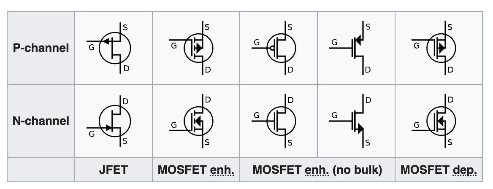
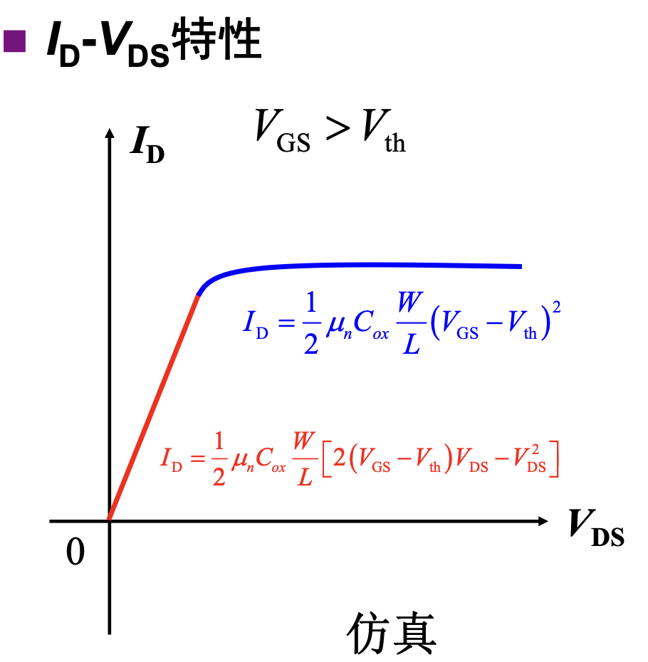
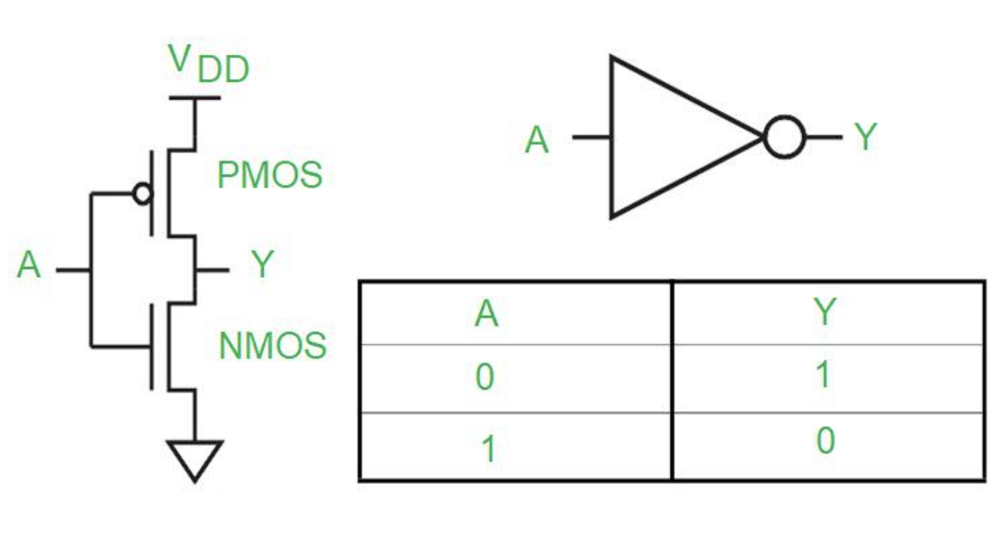
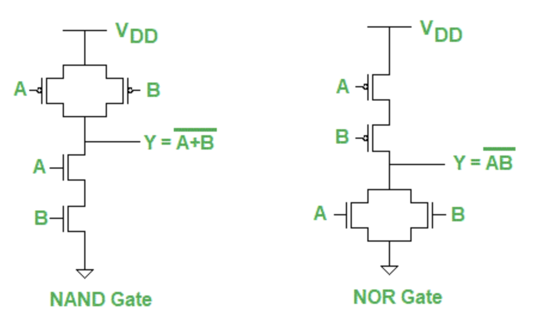
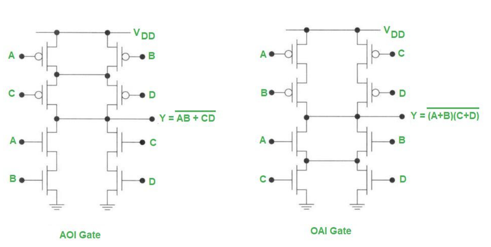
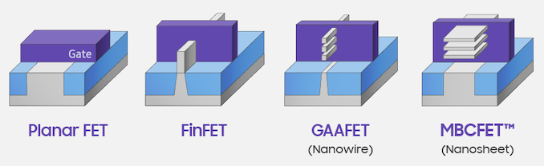
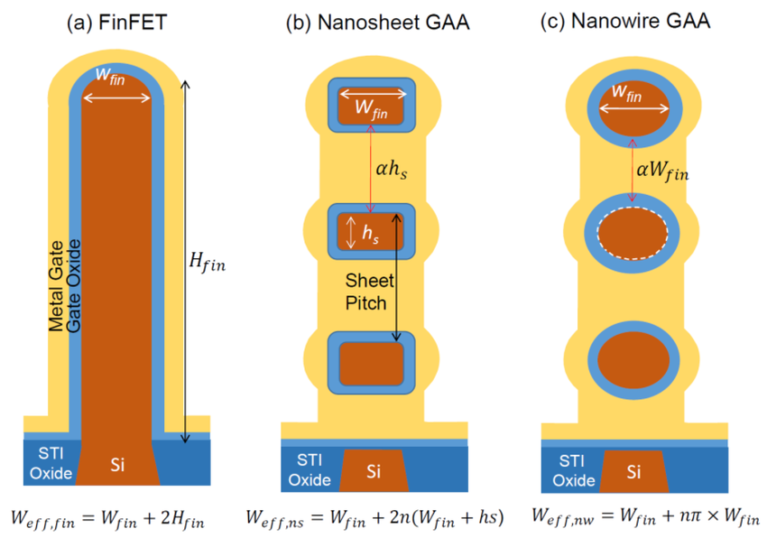

# CMOS (Complementary Metal Oxide Semiconductor)

## MOSFET

MOSFET 有两种：NMOS 和 PMOS，电路符号如下：

<figure markdown>
  { width="400" }
  <figcaption>PMOS 和 NMOS 的电路符号（图源 <a href="https://en.wikipedia.org/wiki/MOSFET">Wikipedia</a>）</figcaption>
</figure>

PMOS 和 NMOS 都有三个电极，分别是源级（Source），栅级（Gate）和漏级（Drain）。MOSFET 的特点是，在 $D$ 到 $S$ 的电流受到 $G$ 也就是栅级的电压的控制：

1. 当 $V_{GS} < V_{th}$ 时，$I_D=0$，此时 MOSFET 处于断开的状态
2. 当 $V_{GS} > V_{th}, V_{GD} > V_{th}$ 时，$I_D=\frac{1}{2}\mu_nC_{ox}\frac{W}{L}(2(V_{GS}-V_{th})V_{DS}-V_{DS}^2)$，此时 MOSFET 处于线性区
3. 当 $V_{GS} > V_{th}, V_{GD} < V_{th}$ 时，$I_D=\frac{1}{2}\mu_nC_{ox}\frac{W}{L}(V_{GS}-V_{th})^2[1+\lambda(V_{DS}-V_{DSsat})]$，此时 MOSFET 处于饱和区

这里的线性区和饱和区是在 $I_D - V_{DS}$ 特性曲线上说的（见下图），意思是当 $V_{GS} > V_{th}$ 的时候，随着 $V_{DS}$ 的增大，$I_D$ 首先会增大，直到 $V_{GD} > V_{th}$ 的时候，$I_D$ 饱和，几乎不再增加。严格来讲，所谓的线性区，实际上也不是直线，而是抛物线。

<figure markdown>
  { width="400" }
  <figcaption> ID - VDS 特征曲线（图源清华大学张雷老师电子学基础课程的课件）</figcaption>
</figure>

PMOS 和 NMOS 的区别是电流的方向不同。PMOS 电流从 S 流向 D，NMOS 电流从 D 和 S。如果注意到上面 MOSFET 的符号的画法，会发现电流都是从上面往下流。此外还有一个规律，箭头连接的那一侧就是 S。

## 数字电路中的 CMOS

CMOS 全称是 Complementary metal–oxide–semiconductor，意思就是拿 PMOS 和 NMOS 的组合来实现电路。当 CMOS 被用来实现数字电路的时候，PMOS 和 NMOS 经常成对出现，PMOS 接到 $V_{DD}$，NMOS 接到 $GND$ 上。例如用 PMOS 和 NMOS 实现一个非门（NOT gate）：

<figure markdown>
  { width="400" }
  <figcaption> CMOS 实现非门（图源 <a href="https://www.geeksforgeeks.org/cmos-logic-gate/">CMOS Logic Gate - Geeks for Geeks</a>）</figcaption>
</figure>

当输入为高电平的时候，NMOS 导通，PMOS 断开，此时输出通过 NMOS 接到了地上，所以输出低电平。当输入为低电平的时候，PMOS 导通，NMOS 断开，此时输出通过 PMOS 接到了电源上，所以输出高电平。用类似的方法，还可以设计出与非门（NAND gate）和或非门（NOR gate）：

<figure markdown>
  { width="400" }
  <figcaption> CMOS 实现与非门和或非门（图源 <a href="https://www.geeksforgeeks.org/cmos-logic-gate/">CMOS Logic Gate - Geeks for Geeks</a>）</figcaption>
</figure>

以及在工艺库里常见的 AOI（And Or Invert）和 OAI（Or And Invert）门：

<figure markdown>
  { width="400" }
  <figcaption> CMOS 实现 AOI 和 OAI 门（图源 <a href="https://www.geeksforgeeks.org/cmos-logic-gate/">CMOS Logic Gate - Geeks for Geeks</a>）</figcaption>
</figure>

CMOS 在实现数字电路的时候，并没有用到它的线性区和饱和区的特性，只用到了 $V_{GS}$ 和 $V_{th}$ 的大小以及是否有电流的关系，可以认为 PMOS 和 NMOS 就是一个用电压控制的开关。

## Planar FET, FinFET, GAAFET and MBCFET

下面来讨论一下 CMOS 电路的工艺。前面讲到，CMOS 有三个源（S），栅（G）和漏（D），当 G 施加足够高的电压时，S 和 D 之间可以有电流通过。从物理上，这三个电级的位置就决定了它生产的难度以及能够实现的晶体管密度：

<figure markdown>
  { width="400" }
  <figcaption> 不同的 FET 物理构造 3D 示意图（图源 <a href="https://www.anandtech.com/show/14333/samsung-announces-3nm-gaa-mbcfet-pdk-version-01">Samsung</a>）</figcaption>
</figure>

<figure markdown>
  { width="400" }
  <figcaption> 不同的 FET 物理构造 2D 切面图（图源 <a href="https://www.researchgate.net/publication/360743373_On_the_Vertically_Stacked_Gate-All-Around_Nanosheet_and_Nanowire_Transistor_Scaling_beyond_the_5_nm_Technology_Node">On the Vertically Stacked Gate-All-Around Nanosheet and Nanowire Transistor Scaling beyond the 5 nm Technology Node</a>）</figcaption>
</figure>

1. Planar FET：前后是 S 和 D，然后 G 盖在上面，当 G 施加电压时，在 G 下部、S 和 D 之间聚集电子，形成电流。
2. FinFET：前后是 S 和 D，G 从上方、左侧和右侧来夹住 S 和 D 之间的通道，三面环绕。
3. GAAFET(Nanowire)/MBCFET(Nanosheet)：前后三条是 S 和 D，G 从四个方向夹住三对 S 和 D 之间的通道，四面环绕。

随着制程发展，G 和 S-D 之间通道的接触面越来越多，实现更高的晶体管密度，生产工艺也更加复杂。
