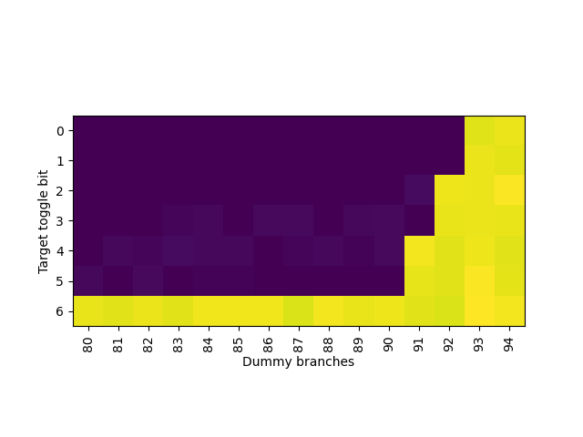
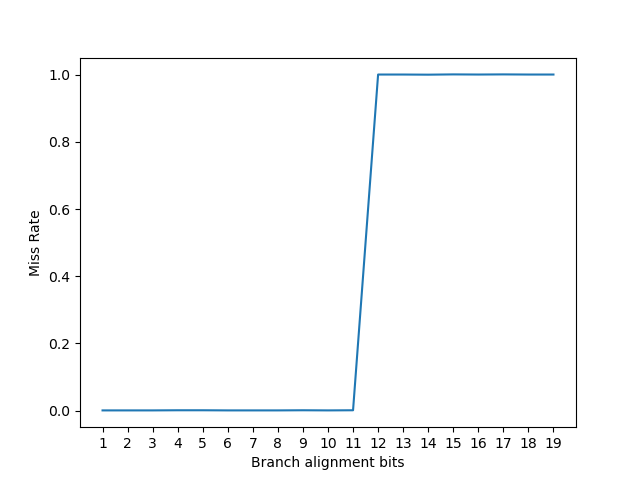
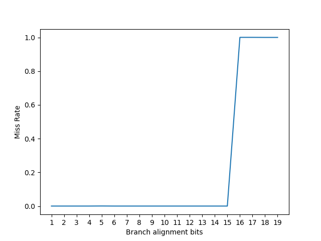
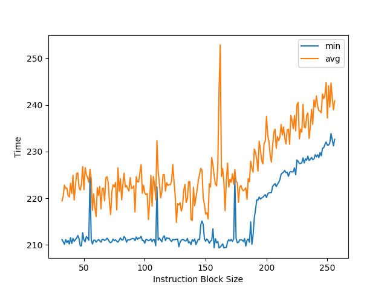
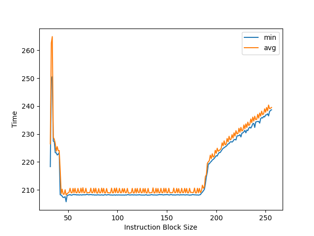
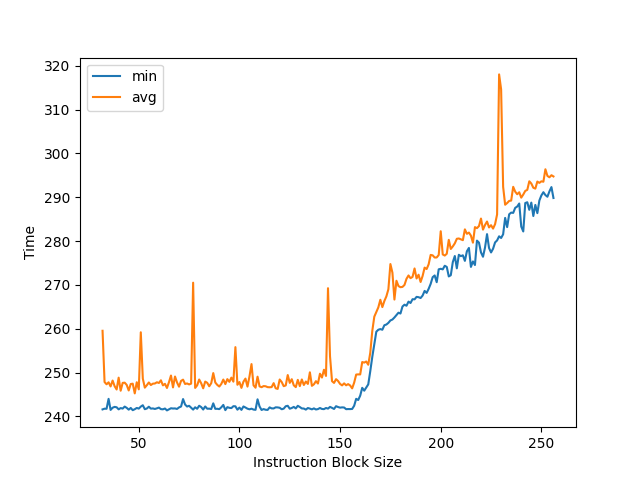

# CPU 微架构分析

## 复现 Intel 条件分支预测器逆向论文

### 背景

最近看到一系列对 Intel 分支预测器的逆向以及对应的攻防的论文：

- [Half&Half: Demystifying Intel's Directional Branch Predictors for Fast, Secure Partitioned Execution](https://halfandhalf.cpusec.org/)
- [Pathfinder: High-Resolution Control-Flow Attacks Exploiting the Conditional Branch Predictor ](https://pathfinder.cpusec.org/)
- [Indirector: High-Precision Branch Target Injection Attacks Exploiting the Indirect Branch Predictor](https://indirector.cpusec.org/)

因其逆向的精细程度而感到好奇，因此尝试进行复现，主要是针对条件分支预测器。复现平台为 Alder Lake 架构的 i9-12900KS 和 Skylake 架构的 Xeon D-2146NT。

### 复现

由于 Pathfinder 和 Indirector 论文都在网上公开了代码，它们都是基于 [agner 的性能测试框架](https://www.agner.org/optimize/#testp) 修改而来，因此我也是在 agner 的性能测试框架的基础上做的复现。

### PHR 记录的分支个数

现代的分支预测器会记录全局的分支历史信息，因此论文里第一步是测试能够记录多少个分支的历史信息。它的测试思路是这样的：

1. 根据随机数，以 50% 的概率让一个分支跳转或不跳转
2. 插入一系列的总是跳转的分支（下称 dummy branch）
3. 根据第一步的随机数，让一个分支和第一个分支以相同方向跳转或不跳转

如果分支预测器的历史长度足够记录第一步和第二步的所有分支，那么就可以准确地预测第三步的分支，因为它的跳转方向和第一步相同；如果历史长度不够，那么预测第三步的分支时，历史里没有第一步的分支，导致预测第三步的分支的准确率只会有 50%。通过这个差别，可以测试出历史长度有多少。用 NASM 编写这个测试：

```nasm
; number of dummy branches
%ifndef dummybranches
    %define dummybranches 200
%endif

%macro testinit3 0
    mov rdi, 1000
    ; read performance counters before loops
    READ_PMC_START

loop_begin:

    ; train branch
    rdrand eax
    and eax, 1
    jnz first_target
first_target:

    ; dummy branches
    %assign i 0
    %rep dummybranches
    jmp dummy_branch_%+ i
dummy_branch_%+ i:
    %assign i i+1
    %endrep

    ; test branch
    test eax, eax
    jnz second_target
second_target:

    dec rdi
    jnz loop_begin

    ; read performance counters after loops
    READ_PMC_END
%endmacro
```

通过测试，发现 dummy branch 数量在 193 及以下的时候，最后一个分支的错误预测率接近 0%，而第一个分支的错误预测率大约 50%，平均下来是 25%；而 dummy branch 数量在 194 及以上的时候，最后一个分支的错误预测率大约 50%，和第一个分支平均下来错误预测率是 25%：


说明 Intel Alder Lake 架构下，分支预测的历史只能记录最多 194 个分支。把中间的 dummy branch 的总是跳转改成总是不跳转，发现总的错误预测率一直是 25%，说明 Intel Alder Lake 的分支预测历史不记录不跳转的分支。而 Path History Register(PHR) 是符合这个特性的一种设计，猜测 Intel 采用了这个方案。

在 Skylake 下测试：


可以得出 Skylake 架构下分支预测的历史只能记录最近 93 个跳转的分支。

### PHR 采用的分支地址和目的地址位数

PHR 在记录跳转的分支的时候，会记录分支指令自身的地址，以及分支跳转的目的地址。目的地址很好理解，但是分支指令自身的地址却不好说是哪一个，例如：

```asm
0x10000 75 00  jnz target
```

这条 jnz 指令从 0x10000 开始占用了两个字节的空间，那么 PHR 在记录分支地址的时候，用的是哪个呢？有以下的猜想：

1. 起始地址（0x10000）
2. 下一跳指令的起始地址（0x10002）

阅读 Pathfinder 和 Indirector 的代码，以及和论文作者通过邮件沟通后（感谢论文作者的详细指导！），发现以上两个猜想都不对：实际上用的是分支指令的最后一个字节的地址（0x10001）。考虑到 x86 是变长指令集，这也合理：通过记录最后一个字节的地址，避免了处理不同长度的 jnz 指令的情况（例如 jnz 有携带 4 字节的立即数的版本，此时 jnz + 立即数一共是 6 个字节，这时候就是用的 6 个字节里最后一个字节的地址）。

接下来，为了测试 PHR 采用了哪些地址位数，办法是：把分支地址和目的地址的一些位设成 0，构造以下的指令序列，看看最后一个分支的预测准确率如何：

1. 循环若干次，保证这些次循环分支地址和目的地址的大部分位都是 0，目的是把 PHR 设置为全 0
2. 把一个依赖随机数的分支指令，放置到特定的位置，使得分支地址和目的地址的一些位设成 0，一些位设成 1
3. 再添加一个分支指令，也依赖第二步的随机数选择跳转或不跳转

这么做的目的是，先让 PHR 清零，再执行一个条件分支指令，如果这个条件分支指令跳转了，那么 PHR 将会根据这个分支指令的分支地址计算出新的值；如果这个条件分支指令没有跳转，由于 PHR 只记录跳转了的分支的信息，那么 PHR 不变，依然是零。在预测第三个分支的时候，PHR 的取值就很重要了：

1. 假如第二步跳转了以后，得到了非零的 PHR，那么分支预测器就可以根据 PHR 等于零还是不等于零去预测第三步的分支，那么第三步的分支错误预测率就会接近 0%
2. 假如第二步跳转了以后，得到的 PHR 依然是零，那么分支预测器在预测第三步的分支的时候，无法区分第二步往跳转了还是没跳转，于是第三步的分支预测错误率就会接近 50%

首先测试分支地址和目的地址最多用了多少位，此时就从低位往高位不断设置一个更大的 alignment，NASM 编写代码测试如下：

```nasm
; reproduce Figure 3 of Half&Half

; alignment bits of branch instruction address
%ifndef branchalign
    %define branchalign 18
%endif

; alignment bits of branch target address
%ifndef targetalign
    %define targetalign 5
%endif

%macro testinit3 0
    mov rdi, 1000

    ; loop 300 times to clear phr
    ; since we only consider branch misprediction of the last two branches
    ; we do not have to be accurate here e.g. 93/194
loop_begin:
    mov eax, 300
    align 64
    jmp dummy_target

    align 1<<19
    %rep (1<<19)-(1<<8)
        nop
    %endrep

    ; dummy_target aligned to 1<<8
dummy_target:
    %rep (1<<8)-7
        nop
    %endrep
    dec eax ; 2 bytes
    ; the last byte of jnz aligned to 1<<19
    ; jnz dummy_target
    db 0x0f
    db 0x85
    dd dummy_target - $ - 4

    READ_PMC_START
    rdrand eax
    and eax, 1

    ; READ_PMC_START: 166
    ; rdrand eax: 3 bytes
    ; and eax, 1: 3 bytes
    ; jnz first_target: 6 bytes

    %rep (1<<branchalign)-166-6-6
        nop
    %endrep

    ; the last byte of jnz aligned to 1<<branchalign
    ; jnz first_target
    db 0x0f
    db 0x85
    dd first_target - $ - 4

    %rep (1<<targetalign)-1
        nop
    %endrep
    ; target aligned to 1<<targetalign
first_target:

    align 64
    jnz second_target
second_target:

    READ_PMC_END

    align 64
    dec rdi
    jnz loop_begin
%endmacro
```

得到的结果如下，当固定目的地址对齐到 2^6 字节时，让分支地址从 2^0 到 2^19 字节对齐，得到如下结果：


可以看到分支地址只有低 16 位参与到了 PHR 计算当中。反过来，固定分支地址对齐到 2^16 字节，让目的地址从 2^0 到 2^18 字节对齐，得到如下结果：


说明目的地址只有低 6 位参与到了 PHR 计算当中。

那么 PHR 计算涉及到了分支地址的低 16 位和目的地址的低 6 位，接下来就要进一步分析它们具体怎么参与到 PHR 计算当中。

### PHR 中分支地址和目的地址各 bit 的位置

接下来，要测试分支地址和目的地址如何参与到 PHR 计算当中。PHR 是一个移位寄存器，而 16 位的分支地址不可能一个分支就全部移位出去，因此可以修改分支地址的部分位，观察经过多少个分支，才会从 PHR 里被移位出去，通过不同 bit 移位出去的分支个数，可以推断出 PHR 的结构。

于是修改代码，去修改分支地址和目的地址的一个 bit，然后在两个随机跳转的分支中间插入可变个数的 dummy branch：

```nasm
; reproduce Table 2 of Half&Half

; alignment bits of branch instruction address
%ifndef branchalign
    %define branchalign 18
%endif

; alignment bits of branch target address
%ifndef targetalign
    %define targetalign 5
%endif

; toggle bit of branch address (-1 means do not toggle)
%ifndef branchtoggle
    %define branchtoggle 0
%endif

; toggle bit of target address (-1 means do not toggle)
%ifndef targettoggle
    %define targettoggle 0
%endif

; number of dummy branches
%ifndef dummybranches
    %define dummybranches 5
%endif

%macro testinit3 0
    mov rdi, 1000

loop_begin:

    ; loop to clear phr
    mov eax, 200
    align 64
    jmp clear_phr_dummy_target

    align 1<<16
    %rep (1<<16)-(1<<8)
        nop
    %endrep

    ; dummy_target aligned to 1<<8
clear_phr_dummy_target:
    %rep (1<<8)-7
        nop
    %endrep
    dec eax ; 2 bytes
    ; the last byte of jnz aligned to 1<<18
    ; jnz clear_phr_dummy_target
    db 0x0f
    db 0x85
    dd clear_phr_dummy_target - $ - 4

    ; train branch

    READ_PMC_START
    rdrand ebx
    and ebx, 1
    ; READ_PMC_START: 166 bytes
    ; rdrand ebx: 3 bytes
    ; and ebx, 1: 3 bytes
    ; jnz first_target: 6 bytes
    %rep (1<<branchalign)-166-6-6
        nop
    %endrep

    %if branchtoggle != -1
    %rep (1<<branchtoggle)
        nop
    %endrep
    %endif
    ; the last byte of jnz - 1<<branchtoggle aligned to 1<<branchalign
    ; jnz first_target
    db 0x0f
    db 0x85
    dd first_target - $ - 4

    ; target aligned to 1<<targetalign
    %if branchtoggle != -1
    %rep (1<<targetalign)-1-(1<<branchtoggle)
        nop
    %endrep
    %else
    %rep (1<<targetalign)-1
        nop
    %endrep
    %endif

    %if targettoggle != -1
    %rep (1<<targettoggle)
        nop
    %endrep
    %endif
first_target:

    ; loop to shift phr
    mov eax, dummybranches+1

    align 1<<16
    %rep (1<<16)-(1<<8)
        nop
    %endrep

    ; dummy_target aligned to 1<<8
shift_phr_dummy_target:
    %rep (1<<8)-7
        nop
    %endrep
    dec eax ; 2 bytes
    ; the last byte of jnz aligned to 1<<18
    ; jnz shift_phr_dummy_target
    db 0x0f
    db 0x85
    dd shift_phr_dummy_target - $ - 4

    ; test branch

    align 64
    and ebx, 1
    jnz second_target
second_target:
    READ_PMC_END

    align 64
    dec rdi
    jnz loop_begin

%endmacro
```

经过测试，调整分支地址的位，以及控制两个随机跳转分支之间的分支数量，得到如下的结果：


跳转目的地址的位和控制两个随机跳转分支之间的分支数量，得到：


颜色比较浅的部分代表 50% 分支预测错误率，颜色比较深的部分代表 25% 分支预测错误率。性能有一些波动，直接看颜色的界限即可。总结以上信息（Bx 表示分支地址的 x 位，Ty 表示目的地址的 y 位）：

| Flipped bit     | dummy branches |
|-----------------|----------------|
| B14, B15        | 186            |
| B12, B13        | 187            |
| B2, B11, T4, T5 | 188            |
| B0, B1, T2, T3  | 189            |
| B9, B10         | 190            |
| B7, B8          | 191            |
| B5, B6          | 192            |
| B3, B4, T0, T1  | 193            |

dummy branch 越少，说明越早被移位出 PHR。由于它们总是 2 位一组，猜测 PHR 每个 taken 分支会左移 2 位。再根据移位出去的顺序，可以预测高位是 B15 和 B14，接下来是 B13 和 B12，最后到低位是 B3、B4、T0 和 T1。

用同样的方法在 Skylake 上测试，首先测试分支地址：


可见 Skylake 也是每个跳转的分支 PHR 移 2 位，然后从低位到高位的顺序是：B3 B4 B7 B8 B11 B12 B5 B6 B9 B10 B13 B14 B15 B16 B17 B18。

再测试 Skylake 上目的地址：



那么 T0 T1 是和 B3 B4 在一起，T2 T3 是和 B7 B8 在一起，T4 T5 是和 B11 B12 在一起。

### PHR 中分支地址和目的地址各 bit 的异或关系

由于 PHR 里每 2 位可能涉及到分支地址或者目的地址一共 4 位信息，推测里面有异或的计算存在，那就枚举这些位的 pair，如果某个 pair 下，分支预测错误率 50%，而不是 25%，说明它们在 PHR 里相互抵消，也就是出现 xor 的关系。编写 NASM 测试：

```nasm
; reproduce Figure 4 of Half&Half

; alignment bits of branch instruction address
%ifndef branchalign
    %define branchalign 18
%endif

; alignment bits of branch target address
%ifndef targetalign
    %define targetalign 5
%endif

; toggle bit of branch address
%ifndef branchtoggle
    %define branchtoggle 0
%endif

; toggle bit of target address
%ifndef targettoggle
    %define targettoggle 0
%endif

%macro testinit3 0
    mov rdi, 1000

    ; loop 300 times to clear phr
    ; since we only consider branch misprediction of the last two branches
    ; we do not have to be accurate here e.g. 93/194
loop_begin:
    mov eax, 300
    align 64
    jmp dummy_target

    align 1<<19
    %rep (1<<19)-(1<<8)
        nop
    %endrep

    ; dummy_target aligned to 1<<8
dummy_target:
    %rep (1<<8)-7
        nop
    %endrep
    dec eax ; 2 bytes
    ; the last byte of jnz aligned to 1<<19
    ; jnz dummy_target
    db 0x0f
    db 0x85
    dd dummy_target - $ - 4

    READ_PMC_START
    rdrand eax
    and eax, 1

    ; READ_PMC_START: 166
    ; rdrand eax: 3 bytes
    ; and eax, 1: 3 bytes
    ; jnz first_target: 6 bytes

    %rep (1<<branchalign)-166-6-6
        nop
    %endrep

    %rep (1<<branchtoggle)
        nop
    %endrep

    ; the last byte of jnz minus 1<<branchtoggle aligned to 1<<branchalign
    ; jnz first_target
    db 0x0f
    db 0x85
    dd first_target - $ - 4

    %rep (1<<targetalign)-1-(1<<branchtoggle)
        nop
    %endrep
    %rep (1<<targettoggle)
        nop
    %endrep
    ; target minus 1<<targettoggle aligned to 1<<targetalign
first_target:

    align 64
    jnz second_target
second_target:

    READ_PMC_END

    align 64
    dec rdi
    jnz loop_begin
%endmacro
```

测试这些 pair，找到哪些 pair 会出现分支预测错误率 50%：


其中颜色浅的黄色就代表分支预测错误率 50%，从图中可以发现这些关系：

1. B0 xor T2: 和论文一致
2. B1 xor T3: 和论文一致
3. B2 xor T4: 和论文一致
4. B3 xor T0: 和论文一致
5. B3 xor T5
6. B4 xor T1: 和论文一致
7. B11 xor T0
8. B11 xor T5: 和论文一致
9. B12 xor T1

和论文不一致的多出来的三组 xor 关系，通过邮件和论文作者联系后，得知：这三组关系在 PHR 阶段没有 XOR 关系，但是在 tag 计算的时候，这三组关系最终会计算出相同的 tag，导致 PHT（Pattern History Table）出现冲突，分支预测错误率 50%。根据论文作者的建议，在两个随机跳转的分支中间加入 8 次对齐的跳转，使得 PHR 左移 16 位，那么多出来的三组 xor 关系就会计算出不同的 PHT index，不再导致 50% 的分支预测错误率，此时真正的在 PHR 中有 xor 关系的组得到保留：


说明实际有 xor 关系的只有：

1. B0 xor T2: 和论文一致
2. B1 xor T3: 和论文一致
3. B2 xor T4: 和论文一致
4. B3 xor T0: 和论文一致
5. B4 xor T1: 和论文一致
6. B11 xor T5: 和论文一致

结合以上信息，就可以判断出每个分支参与到 PHR 计算的有 16 位，从高到低（每 2 位内的顺序可以替换，对测试结果不影响）：

1. B15
2. B14
3. B13
4. B12
5. B11 xor T5
6. B2 xor T4
7. B1 xor T3
8. B0 xor T2
9. B10
10. B9
11. B8
12. B7
13. B6
14. B5
15. B4 xor T1
16. B3 xor T0

并且每个 taken branch 会使得 PHR 左移 2 位。这就验证了 Half&Half 论文里 Figure 4(b) 的结果。Indirector 论文里提供了三种微架构的 PHR 更新规则：


在 [Reading privileged memory with a side-channel](https://googleprojectzero.blogspot.com/2018/01/reading-privileged-memory-with-side.html) 里可以看到 Haswell 架构的 PHR（文章里写的是 BHB）更新方法：

```cpp
void bhb_update(uint58_t *bhb_state, unsigned long src, unsigned long dst) {
  // B19 B18 B17 B16 B13 B12 B9 B8 B5 B4 B15+T5 B14+T4 B11+T3 B10+T2 B7+T1 B6+T0
  *bhb_state <<= 2;
  *bhb_state ^= (dst & 0x3f);
  *bhb_state ^= (src & 0xc0) >> 6;
  *bhb_state ^= (src & 0xc00) >> (10 - 2);
  *bhb_state ^= (src & 0xc000) >> (14 - 4);
  *bhb_state ^= (src & 0x30) << (6 - 4);
  *bhb_state ^= (src & 0x300) << (8 - 8);
  *bhb_state ^= (src & 0x3000) >> (12 - 10);
  *bhb_state ^= (src & 0x30000) >> (16 - 12);
  *bhb_state ^= (src & 0xc0000) >> (18 - 14);
}
```

这和 Half&Half 论文里的 Figure 14 也是一致的：


不过 Haswell 架构的 PHR 的位数，Half&Half 与 Reading privileged memory with a side-channel 的结果对不上，前者认为是 93x2，后者认为是 29x2。我在 Broadwell 和 Ivy Bridge EP 架构的处理器上测出来都是 93 个分支。

### PHT 的 Index 或 Tag 函数用到的分支地址位数

得到 PHR 的计算过程后，下一步就是对 PHT 进行分析。PHT 采用组相连结构，PC 和 PHR 计算出 Index，找到 Set，然后在 Set 内部找到 Tag 匹配的项目，而 Tag 也是用 PC 和 PHR 计算出来的。那么，如果 Index 和 Tag 的计算函数都只涉及到了 PC 的部分位数，那么当两个分支的 PC 的这部分位数相同，且 PHR 也相同的时候，PHT 将无法区分这两个分支，导致分支预测错误率提高。

按照这个思路，论文设计了 Listing 6 的实验：构造两个方向相反的分支，采用相同的 PHR，然后这两个分支的低若干位都是 0，然后观察 PC 多少位是 0 的时候，分支预测错误率提高。

在 Skylake 上进行测试，复现了论文中的结果：



说明 Index 或 Tag 函数只用到了 PC 的低 12 位。

在 Alder Lake 上测试，得到的结果如图：



说明 Index 或 Tag 函数只用到了 PC 的低 16 位。这个结果也和 Indirector 里得到的 Intel IBP 的 PHT Tag 函数计算方式一致，说明 CBP 和 IBP 可能采用了类似的 Tag 函数设计。


### 其他测试

未完待续。。。

### 参考文献

- [Half&Half: Demystifying Intel's Directional Branch Predictors for Fast, Secure Partitioned Execution](https://halfandhalf.cpusec.org/)
- [Pathfinder: High-Resolution Control-Flow Attacks Exploiting the Conditional Branch Predictor ](https://pathfinder.cpusec.org/)
- [Indirector: High-Precision Branch Target Injection Attacks Exploiting the Indirect Branch Predictor](https://indirector.cpusec.org/)
- [现代分支预测：从学术界到工业界](https://blog.eastonman.com/blog/2023/12/modern-branch-prediction-from-academy-to-industry/)

## Apple M1

Apple M1 是大小核架构，大核 Firestorm 架构，小核 Icestorm 架构。

注：Apple M1 和 Apple A14 Bionic 用的都是 Firestorm+Icestorm 架构，Apple M2 和 Apple A15 Bionic 用的都是 Avalanche+Blizzard 架构。

### Linux PMU

在 Linux 下用 perf_event_open 访问 Apple M1 的 PMU 需要传特殊的参数：

1. perf_event_attr 的 type 必须是 0xA(Icestorm) 或者 0xB(Firestorm)，根据要 Profile 的核决定传哪个
2. perf_event_attr 的 config 的取值见 [dougallj/applecpu](https://github.com/dougallj/applecpu/blob/0e6bc3f6038fa7b3959ab66b33ae25b707edc186/timer-hacks/bench.py#L85) 的 COUNTER_NAMES，例如测量周期数就是 0x02，测量分支错误预测次数就是 0xcb
3. perf_event_attr 的 exclude_guest 必须设为 1，否则会得到 EOPNOTSUPP

counter 计数器的值，也可以在 macOS 上从 `plutil -p /usr/share/kpep/a14.plist` 命令输出里看到：

- RETIRE_UOP (1, 0x1): All retired uops
- CORE_ACTIVE_CYCLE (2, 0x2): Cycles while the core was active
- L1I_TLB_FILL (4, 0x4): Translations filled into the L1 Instruction TLB
- L1D_TLB_FILL (5, 0x5): Translations filled into the L1 Data TLB
- MMU_TABLE_WALK_INSTRUCTION (7, 0x7): Table walk memory requests on behalf of instruction fetches
- MMU_TABLE_WALK_DATA (8, 0x8): Table walk memory requests on behalf of data accesses
- L2_TLB_MISS_INSTRUCTION (10, 0xa): Instruction fetches that missed in the L2 TLB
- L2_TLB_MISS_DATA (11, 0xb): Loads and stores that missed in the L2 TLB
- MMU_VIRTUAL_MEMORY_FAULT_NONSPEC (13, 0xd): Memory accesses that reached retirement that triggered any of the MMU virtual memory faults
- SCHEDULE_UOP (82, 0x52): Uops issued by the scheduler to any execution unit
- INTERRUPT_PENDING (108, 0x6c): Cycles while an interrupt was pending because it was masked
- MAP_STALL_DISPATCH (112, 0x70): Cycles while the Map Unit was stalled because of Dispatch back pressure
- MAP_REWIND (117, 0x75): Cycles while the Map Unit was blocked while rewinding due to flush and restart
- MAP_STALL (118, 0x76): Cycles while the Map Unit was stalled for any reason
- MAP_INT_UOP (124, 0x7c): Mapped Integer Unit uops
- MAP_LDST_UOP (125, 0x7d): Mapped Load and Store Unit uops, including GPR to vector register converts
- MAP_SIMD_UOP (126, 0x7e): Mapped Advanced SIMD and FP Unit uops
- FLUSH_RESTART_OTHER_NONSPEC (132, 0x84): Pipeline flush and restarts that were not due to branch mispredictions or memory order violations
- INST_ALL (140, 0x8c): All retired instructions
- INST_BRANCH (141, 0x8d): Retired branch instructions including calls and returns
- INST_BRANCH_CALL (142, 0x8e): Retired subroutine call instructions
- INST_BRANCH_RET (143, 0x8f): Retired subroutine return instructions
- INST_BRANCH_TAKEN (144, 0x90): Retired taken branch instructions
- INST_BRANCH_INDIR (147, 0x93): Retired indirect branch instructions including indirect calls
- INST_BRANCH_COND (148, 0x94): Retired conditional branch instructions (counts only B.cond)
- INST_INT_LD (149, 0x95): Retired load Integer Unit instructions
- INST_INT_ST (150, 0x96): Retired store Integer Unit instructions
- INST_INT_ALU (151, 0x97): Retired non-branch and non-load/store Integer Unit instructions
- INST_SIMD_LD (152, 0x98): Retired load Advanced SIMD and FP Unit instructions
- INST_SIMD_ST (153, 0x99): Retired store Advanced SIMD and FP Unit instructions
- INST_SIMD_ALU (154, 0x9a): Retired non-load/store Advanced SIMD and FP Unit instructions
- INST_LDST (155, 0x9b): Retired load and store instructions
- INST_BARRIER (156, 0x9c): Retired data barrier instructions
- L1D_TLB_ACCESS (160, 0xa0): Load and store accesses to the L1 Data TLB
- L1D_TLB_MISS (161, 0xa1): Load and store accesses that missed the L1 Data TLB
- L1D_CACHE_MISS_ST (162, 0xa2): Stores that missed the L1 Data Cache
- L1D_CACHE_MISS_LD (163, 0xa3): Loads that missed the L1 Data Cache
- LD_UNIT_UOP (166, 0xa6): Uops that flowed through the Load Unit
- ST_UNIT_UOP (167, 0xa7): Uops that flowed through the Store Unit
- L1D_CACHE_WRITEBACK (168, 0xa8): Dirty cache lines written back from the L1D Cache toward the Shared L2 Cache
- LDST_X64_UOP (177, 0xb1): Load and store uops that crossed a 64B boundary
- LDST_XPG_UOP (178, 0xb2): Load and store uops that crossed a 16KiB page boundary
- ATOMIC_OR_EXCLUSIVE_SUCC (179, 0xb3): Atomic or exclusive instruction successfully completed
- ATOMIC_OR_EXCLUSIVE_FAIL (180, 0xb4): Atomic or exclusive instruction failed (due to contention)
- L1D_CACHE_MISS_LD_NONSPEC (191, 0xbf): Retired loads that missed in the L1 Data Cache
- L1D_CACHE_MISS_ST_NONSPEC (192, 0xc0): Retired stores that missed in the L1 Data Cache
- L1D_TLB_MISS_NONSPEC (193, 0xc1): Retired loads and stores that missed in the L1 Data TLB
- ST_MEMORY_ORDER_VIOLATION_NONSPEC (196, 0xc4): Retired stores that triggered memory order violations
- BRANCH_COND_MISPRED_NONSPEC (197, 0xc5): Retired conditional branch instructions that mispredicted
- BRANCH_INDIR_MISPRED_NONSPEC (198, 0xc6): Retired indirect branch instructions including calls and returns that mispredicted
- BRANCH_RET_INDIR_MISPRED_NONSPEC (200, 0xc8): Retired return instructions that mispredicted
- BRANCH_CALL_INDIR_MISPRED_NONSPEC (202, 0xca): Retired indirect call instructions mispredicted
- BRANCH_MISPRED_NONSPEC (203, 0xcb): Retired branch instructions including calls and returns that mispredicted
- L1I_TLB_MISS_DEMAND (212, 0xd4): Demand instruction fetches that missed in the L1 Instruction TLB
- MAP_DISPATCH_BUBBLE (214, 0xd6): Bubble detected in dispatch stage
- L1I_CACHE_MISS_DEMAND (219, 0xdb): Demand fetch misses that require a new cache line fill of the L1 Instruction Cache
- FETCH_RESTART (222, 0xde): Fetch Unit internal restarts for any reason. Does not include branch mispredicts
- ST_NT_UOP (229, 0xe5): Store uops that executed with non-temporal hint
- LD_NT_UOP (230, 0xe6): Load uops that executed with non-temporal hint

以上结果是用 [python3 cpu_microarchitecture_apple_pmc_dump.py /usr/share/kpep/a14.plist](./cpu_microarchitecture_apple_pmc_dump.py) 命令跑出来的。

### RAS 大小

RAS 大小的测试方法是构造不同深度的递归函数调用，通过观察性能来判断 RAS 是否保存了所有返回地址。

Apple M1 Firestorm:


拐点为 50 的调用深度，说明 Apple M1 Firestorm 的 RAS 有 50 项。

Apple M1 Icestorm:


拐点为 32 的调用深度，说明 Apple M1 Icestorm 的 RAS 有 32 项。

### BTB 大小

BTB 大小的测试方法是构造一系列的分支（无条件跳转）指令，如果 BTB 不够大，无法保存下所有跳转指令的目的地址，性能就会出现下降。由于很多 BTB 采用组相连的方式组织，因此跳转指令的地址也会影响 BTB 的实际容量：如果这些跳转指令的地址都映射到了 BTB 的一部分 Set 上，那么其余的 Set 将无法利用。因此测试 BTB 的时候，不仅要修改分支的数量，还要修改分支的地址间隔（stride）。

Apple M1 Firestorm:

首先看 Stride=4B，也就是所有跳转指令地址上都是连续的，没有额外的空间，此时跳转指令数量和每个跳转指令的周期数关系是：


可以看到，在 1024 个分支之前都可以做到每周期一个分支指令，说明这是第一级的 BTB，大小为 1024；之后很长一段都是三周期一个分支指令，直到 40000+ 才开始超过三周期，而正好 M1 Firestorm 的 L1 指令缓存是 192KB，按 4B 一个分支算就是 49152 个分支，基本和 40000+ 的拐点一致，说明 M1 Firestorm 的 L1 指令是作为第二级 BTB 存在的。

进一步，通过插入 NOP 指令增加分支的间距，可以观察到不同 stride 下拐点出现了变化：


- stride=4B 时，第一级 BTB 拐点为 1024，第二级 BTB 拐点为 49152
- stride=8B 时，第一级 BTB 拐点为 512，第二级 BTB 拐点为 24576
- stride=16B 时，第一级 BTB 拐点为 256，第二级 BTB 拐点为 12288

这是典型的组相连的场景：假如 Index 位取的是地址的 `[n:2]` 位，当 stride=8B 时，地址的 `[2]` 位必然为 0，此时 Index 只能是偶数，那么奇数 Index 的项就被浪费了，表现出来的容量只有原来 1024 的一半，也就是 512。进一步，stride=16B 时，Index 只能是 4 的倍数，容量只有 1024 的四分之一，也就是 256。

不断增加 stride，stride=1024B 时拐点为 4，stride=2048B 拐点为 2，stride=4096B 拐点依然为 2，说明第一级 BTB 是 2 Way，此时 Index 位数取的是地址的 `[10:2]` 位。

Apple M1 Icestorm:


和 Firestorm 类似，stride=4B 时，第一级 BTB 大小可以看出也是 1024 项，并且从 stride=8B 时第一个拐点前推，可知第一级 BTB 也是组相连；第二级 BTB 依然由 L1 指令缓存提供，Icestorm 的指令缓存是 128KB，对应 32768 个分支，当 stride=4B 时即使超过 32768 个分支也没有看到明显的性能下降，预计预取器起到了作用；当 stride=8B 时第二个拐点是 16384，说明 L1 指令缓存是组相连，符合预期。

不过在 stride 增大时，第一级 BTB 的拐点并不总是相应除以 2:

| stride | size |
|--------|------|
| 4      | 1024 |
| 8      | 512  |
| 16     | 256  |
| 32     | 1024 |
| 64     | 512  |
| 128    | 256  |
| 256    | 128  |
| 512    | 64   |
| 1024   | 32   |
| 2048   | 16   |
| 4096   | 8    |
| 8192   | 4    |
| 16384  | 2    |
| 32768  | 2    |
| 65536  | 2    |

目测是 Index 位数做了一些哈希，而不是直接取地址的位数，地址涉及了 `[15:2]`。第一级 BTB 是 2 Way。

### ROB/PRF 大小

ROB 按程序执行顺序保存了乱序执行的指令，以保证异常时可以精确恢复。测试 ROB 大小时，通常方法是构造一系列 pointer chasing 的 load 指令，它需要很长的时间执行，然后在这些 load 之间插入很多 nop 指令，当 ROB 可以容纳下多个 load 指令时，性能会比较好；当 ROB 只能容纳下一个 load 指令时，性能会下降。

使用这个方法测量，使用 nop 填充 ROB 时，可以得到 Icestorm 的 ROB 容量在 412-415 左右：


但在网上可以看到 M1 Firestorm ROB 大小的不同的分析，这是因为 M1 Firestorm 的 ROB 不是传统的每条指令一个 ROB 表项的设计，而是允许多条指令放在同一个表项里，但又对同一个表项里的多条指令添加了一些限制，因此用不同指令序列测出来的 ROB 大小就会不一样：大量的 NOP 大概率可以紧密地填满表项里的多条指令，因此表现出来的 ROB 容量就很大；如果可以构造出一个指令序列，使得每条指令都独占一个 ROB 条目，那才可以测出真实的 ROB 大小。

把 NOP 修改成整数 add 指令，可以看到拐点在 77-79 左右：


用 add 指令测试的则是物理通用寄存器堆（Physical Register File，PRF）的大小：寄存器重命名时，会给目的寄存器分配一个新的物理通用寄存器，同时记录下该架构寄存器原来映射的旧物理通用寄存器，当指令从 ROB 中提交时，旧的物理通用寄存器才得到释放。由于 load 指令堵塞了 ROB 的提交，导致 ROB 里有大量的 add 指令，每条 add 指令都分配了一个物理通用寄存器，并且都还没有释放，此时拐点出现，说明物理通用寄存器堆已经慢了，新的 add 指令阻塞在重命名阶段。

### 参考文献

- [Apple Microarchitecture Research by Dougall Johnson](https://dougallj.github.io/applecpu/firestorm.html)
- [Apple M1 Icestorm 微架构评测（上）:重铸小核荣光](https://zhuanlan.zhihu.com/p/611213899)
- [Apple M1 Icestorm 微架构（下）:重铸小核荣光](https://zhuanlan.zhihu.com/p/613097964)

## 多种处理器架构的 ROB 测试

AMD Zen 1: 大约 192 条



AMD Zen 2: 大约 224 条


ARM Neoverse N1: 大约 128 条


Intel Broadwell: 大约 192 条



Intel Ivy Bridge EP: 大约 168 条


