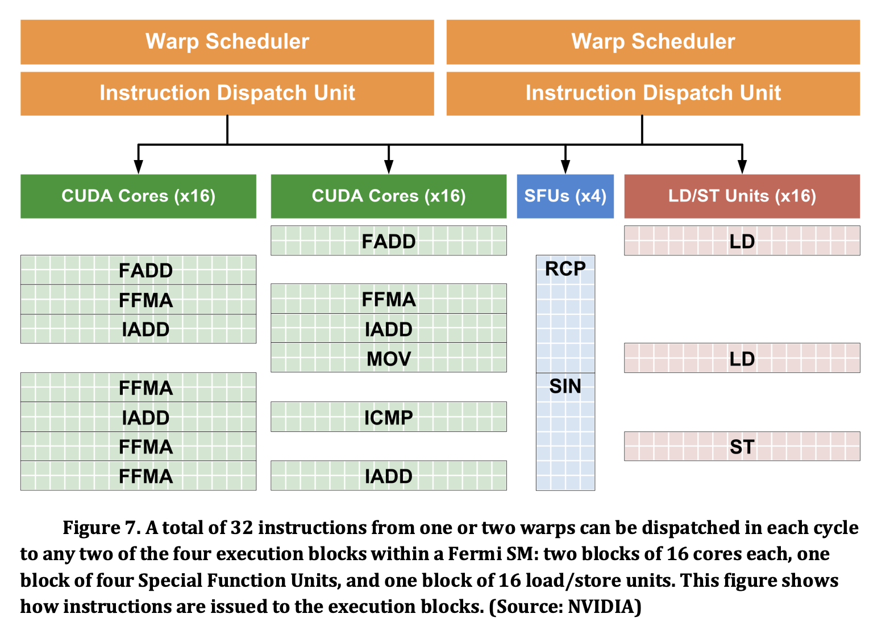
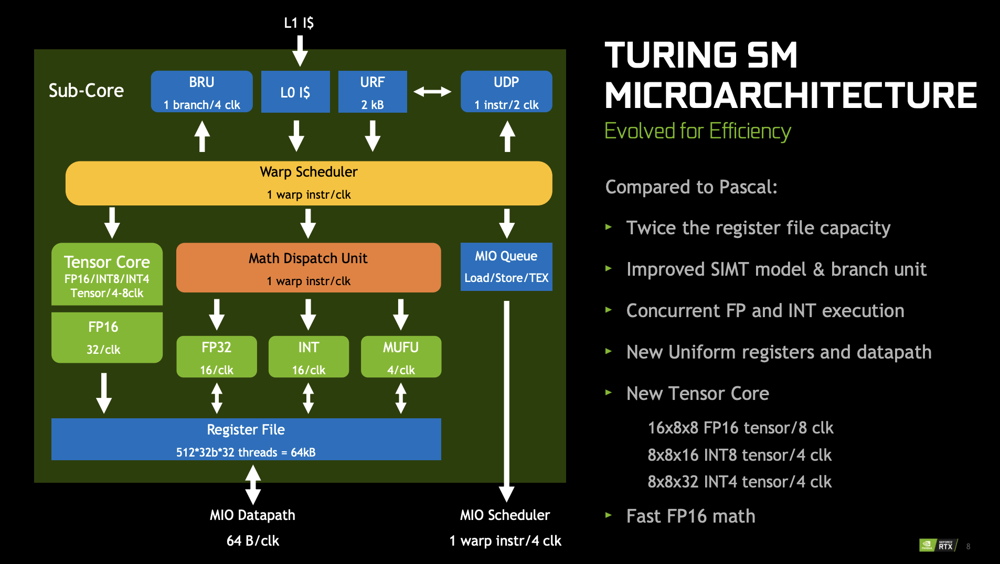
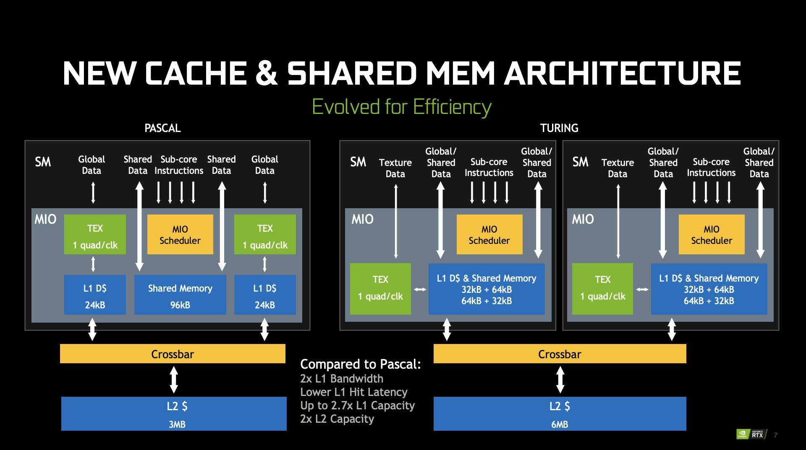

# GPGPU (General Purpose Graphics Processing Unit)

GPGPU 是 General Purpose Graphics Processing Unit 的缩写，意思是支持通用用途的图形处理单元，是在显卡的基础上，通过 CUDA 等编程接口，使得用户可以对显卡进行编程，在显卡上执行自定义的程序。

下面分析一些经典的 GPGPU 的架构。

## NVIDIA Tesla

论文：E. Lindholm, J. Nickolls, S. Oberman and J. Montrym, "NVIDIA Tesla: A Unified Graphics and Computing Architecture," in IEEE Micro, vol. 28, no. 2, pp. 39-55, March-April 2008, doi: 10.1109/MM.2008.31.

NVIDIA Tesla 架构是第一代支持 CUDA 的 NVIDIA 显卡架构，也是从纯粹的显卡到支持通用计算的 GPGPU 转变的开始。

传统的显卡执行的是固定的流程，如果学习过 OpenGL，会知道图形渲染会采用 Graphics Pipeline，所以显卡也是针对这个 Pipeline 去实现的。这个 Pipeline 中的 vertex shader 和 fragment shader 部分已经有了可编程的能力，所以早期的 GPU 就分别给这两部分设计处理器，所以 GPU 里面既有 vertex processor，又有 pixel-fragment processor。分开的好处是可以分别优化，缺点是很多时候 processor 任务量不匹配，导致硬件资源的浪费。

因此 Tesla 的设计目的就是用一个单独的 processor 完成所有可编程的任务，既可以完成已有的 vertex shader 和 fragment shader 的执行，又可以实现未来 Graphics Pipeline 可能会增加的新的 shader 类型，例如论文中提到的 DX10 引入的 geometry shader。如不做合并，那么每次图形 API 要添加 shader，硬件就要加一个单独的单元，这个复杂度不可接受，而且旧硬件也没办法兼容新的 API。合并了以后，如果合并以后的 processor 足够通用，那就可以实现各种 shader，至少计算能力上不会有问题，只是说是否需要针对某些 shader 去做优化。

既然确定了要用一个单独的 processor 来完成所有的可编程的计算，下面就来介绍这个 processor 是怎么实现的。以 GeForce 8800 GPU (G80) 为例，它有 8 个 Texture Processor Cluster (TPC)，每个 TPC 内部有两个 Streaming Multiprocessor（SM），每个 SM 里面有 8 个 Streaming Processor（SP）。（`a GeForce 8800 GPU with 128 streaming-processor (SP) cores organized as 16 streaming multiprocessors (SMs) in eight independent processing units called texture/processor clusters (TPCs).`）而具体执行计算的就是 SP，进行整数、浮点运算等等。架构图如下：

<figure markdown>
  { width="600" }
  <figcaption>Tesla 架构总览（来源：NVIDIA Tesla: A Unified Graphics and Computing Architecture Figure 1）</figcaption>
</figure>

图的上方是 Host CPU，CPU 通过 PCIe 等方式访问 GPU。根据要进行的任务类型，经过不同类型的预处理，但最终 Vertex/Pixel/Compute 任务都会通过 Streaming Processor Array (SPA)，也就是 TPC-SM-SP 三层次组成的大量计算核心来进行。这其实就是前面说的，把原来分别完成的任务，统一到相同的 processor 来完成。除了计算以外，针对 texture 和 raster 等图形相关的需求，设计了单独的硬件来加速，例如每个 TPC 都有自己的 Texture unit 和 Texture L1，在 L2 Slice 旁边还有 Raster operation processor (ROP)。虽然有 L2 缓存，但是这个缓存仅用于纹理处理，而没有用于 SPA。

在这个框架下，就可以去实现 Graphics Pipeline 了。图中的 Input assembler 收集 vertex shader 计算需要的各种图形信息，然后 Vertex work distribution 通过 round-robin 的方式 把 vertex shader 计算任务分发到 SPA 上。于是 SPA 就会执行 vertex shader 的代码。vertex shader 的输出会继续留在 GPGPU 上，到 pixel-fragment processing 的时候，又是由 SPA 来执行 fragment shader 的代码。

那么接下来来看 TPC 的内部架构。

<figure markdown>
  { width="600" }
  <figcaption>Tesla TPC 架构（来源：NVIDIA Tesla: A Unified Graphics and Computing Architecture Figure 2）</figcaption>
</figure>

每个 TPC 包括一个 Geometry controller 和一个 SM Controller (SMC)，下面是两个 SM，最后是 Texture unit 和它内部的 Texture L1。每个 SM 有 8 个 SP。Geometry controller 是用于配合 vertex shader 和 geometry shader 的，这里就不深入分析了。下面主要分析 SM。

SM 是执行计算的主要部件，内部有 8 个 SP，两个 Special Function Unit（SFU，用于计算三角函数等特殊数学函数以及插值），一个多线程的取指令和 Issue 单元（MT Issue），一个指令缓存（I Cache），一个常量缓存（C Cache）和 16 KB 的共享内存（Shared memory）。注意 SM 内部没有数据缓存。每个 SP 包括一个浮点乘加单元（MAD，Multiply Add，没有乘加融合），每个 SFU 包括四个浮点乘法器。SP 工作在 1.5 GHz 的频率下，每个 SM 的单精度浮点峰值性能是 36 GFLOPS。这个 36 GFLOPS 包括了 SP 内的 MAD 单元的 $8 * 2 * 1.5 = 24$ GFLOPS 以及 SFU 内的浮点加法单元的 $2 * 4 * 1.5 = 12$ GFLOPS。（`The GeForce 8800 Ultra clocks the SPs and SFU units at 1.5 GHz, for a peak of 36 Gflops per SM. To optimize power and area efficiency, some SM non-data-path units operate at half the SP clock rate.`）

SM 以 warp 为单位来并行执行多个线程，一个 warp 有 32 个线程，每个 SM 可以同时执行 768 个线程，也就是 24 个 warp。SM 在执行的时候，会选择一个准备好执行下一条指令的 warp 去发射指令。当 warp 分叉的时候，先完成分支一个方向的执行，再完成分支另一个方向，直到两边重新汇聚到同一条指令，此时整个 warp 又可以继续同时执行。

负责 warp 调度的就是 SM warp scheduler。它运行在 1.5GHz 的一半频率，也就是 750MHz。它每个周期会从 24 个 warp 中选择一个去调度（`The SM warp scheduler operates at half the 1.5-GHz processor clock rate. At each cycle, it selects one of the 24 warps to execute a SIMT warp instruction`），被调度的 warp 的 32 个线程会被拆成两组，每组 16 个线程，然后用四个 1.5GHz 频率的周期去执行：因为 SP 只有 8 个，所以每个周期最多进行 8 个线程的执行，32 个线程的话就需要 4 个周期（`An issued warp instruction executes as two sets of 16 threads over four processor cycles.`）。在实现 warp 调度的时候，warp scheduler 采用了 scoreboard 机制，跟踪哪些 warp 可以被 issue。调度的时候，在可以被 issue 的 warp 里面，根据优先级、指令类型和公平性等原则去调度 warp。

每个 SP 上执行的指令支持：浮点，整数，位运算，类型转换，特殊函数，控制流，内存读写和 Texture。现在找不到 Tesla 架构的指令集列表，但是在 [Fermi Instruction Set](https://docs.nvidia.com/cuda/archive/8.0/cuda-binary-utilities/index.html#fermi) 可以看到 Tesla 的下一代架构 Fermi 的指令集列表。

为了提升内存访问带宽，SM 会对同一个 warp 对 local 或者 global memory 的访问进行合并，把连续的访问合并成一个大的访问，从而提升性能。Tesla 架构还引入了原子指令，包括整数加法、整数最小最大值、逻辑运算、swap 和 Compare-And-Swap（CAS）。关于原子指令的部分，可以阅读 [原子指令](../software/atomic_instructions.md) 的介绍。

内存部分，Tesla 架构的 DRAM 宽度是 384 位，分为 6 组，每组 64 位，也对应了六分之一的显存容量，以及物理地址空间。Tesla 架构已经引入了虚拟内存，所有指令涉及到的地址都是虚拟地址。页表保存在 local memory 里，并且也有相应的 TLB 层次来减少 page table walk 的次数。Tesla 架构没有数据缓存，因为按照传统的图形流程，一般是从内存中读取纹理，进行一系列计算，然后写入结果到内存中。因此 Tesla 架构只针对纹理读取设置了 L1 和 L2 缓存。

CUDA 中，有 thread block 的概念，也就是 cooperative thread array（CTA），cooperative 指的是这些 thread 可以通过 shared memory 和 __syncthreads 来协同完成一些计算。因为它们需要使用 shared memory，自然 CTA 会被归到某个 SM 下面，而不会跨越多个 SM 去执行。每个 SM 可以支持最多同时执行 8 个 CTA。

CUDA 中线程一共有三个层次：第一个是 Grid，第二个是 Block（Thread Block，Cooperative Thread Array），第三个是 Thread。Thread 独享自己的 local memory，Block 内的所有 Thread 共享 Shared memory，Grid 内的所有 Thread 共享 Global memory。这样三个线程层次就和三种类型的内存对应上了。Local memory 虽然是线程局部的，但实际上也是保存在显存中，只不过不会被其他线程访问，用来保存栈和临时变量。只有 Shared memory 是放在 SM 内部的，供同一个 CTA 内的线程共享。

最后，论文总结了采用 Tesla 架构的 GeForce 8800 Ultra GPU 的参数：

- 681 million transistors, 470 mm^2;
- TSMC 90-nm CMOS;
- 128 SP cores in 16 SMs; 每个 SM 内有 8 个 SP，所以 $8 * 16 = 128$
- 12,288 processor threads; 每个 SM 可以调度 24 个 warp，所以 $16 * 24 * 32 = 12288$
- 1.5-GHz processor clock rate;
- peak 576 Gflops in processors; 每个 SM 是 36 Gflops，所以 $36 * 16 = 576$
- 768-Mbyte GDDR3 DRAM; 每个 GDDR3 channel 内存有 128MB，一共 6 个 channel，所以 $128 * 6 = 768$
- 384-pin DRAM interface; 每个 GDDR3 channel 是 64 位，所以 $64 * 6 = 384$
- 1.08-GHz DRAM clock;
- 104-Gbyte/s peak bandwidth; 每个 GDDR3 channel 是 64 位，所以 $1.08 * 64 / 8 * 2 * 6 = 103.68$
- typical power of 150W at 1.3V.

在 G80 之后，还有一个 Tesla 架构的芯片：GT200，采用了 Tesla 2.0 架构，65nm 制程工艺。Tesla 2.0 相比 Tesla 1.0，引入了双精度浮点计算。

## NVIDIA Fermi

论文：C. M. Wittenbrink, E. Kilgariff and A. Prabhu, "Fermi GF100 GPU Architecture," in IEEE Micro, vol. 31, no. 2, pp. 50-59, March-April 2011, doi: 10.1109/MM.2011.24.

PPT: C.M. Wittenbrink, E. Kilgariff, and A. Prabhu, ‘‘Fermi GF100: A Graphics Processing Unit (GPU) Architecture for Compute Tessellation, Physics, and Computational Graphics,’’ IEEE Hot Chips, presentation, 2010; <https://old.hotchips.org/wp-content/uploads/hc_archives/hc22/HC22.23.110-1-Wittenbrink-Fermi-GF100.pdf>.

Whitepaper: [Fermi: NVIDIA’s Next Generation CUDA Compute Architecture](https://www.nvidia.com/content/pdf/fermi_white_papers/nvidia_fermi_compute_architecture_whitepaper.pdf)

Whitepaper: [NVIDIA’s Fermi: The First Complete GPU Computing Architecture](https://www.nvidia.com/content/PDF/fermi_white_papers/P.Glaskowsky_NVIDIA's_Fermi-The_First_Complete_GPU_Architecture.pdf)

Fermi 是 Tesla 的下一代 NVIDIA 显卡架构。Tesla 虽然支持了通用计算，但依然保留了很多图形计算的遗留设计。相比之下，Fermi 针对通用计算做出了更多的改变：数据缓存、更多的访存单元、双精度浮点计算、ECC 内存以及更快的原子指令。通过引入 Unified Address Space，Fermi 架构能够支持更多使用指针的 C++ 程序。

GF100 是 Fermi 架构的一款核心，它的配置如下：

- 16 SM, 32 CUDA cores/SM, 512 CUDA cores in total
- 3 billion transistors, 40nm TSMC process
- 6Gbytes GDDR5 memory
- 384-bit memory interface, 6 channels
- 16 PolyMorph engines
- 4 raster units
- 64 texture units
- 48 ROP(raster operation processor) units

从微架构方面，Fermi 架构把 Tesla 架构的 TPC 改名为 Graphics Processor Clusters（GPC），毕竟 Texture 现在显得不再那么重要。GT100 有 4 个 GPC，每个 GPC 有 4 个 SM，所以一共是 16 个 SM。SM 个数相比 Tesla 架构没有变化，但是从 8 TPC 乘以 2 SM/TPC 变成了 4 GPC 乘以 4 SM/GPC。内存依然是 6 通道。新增了一个 GigaThread engine，每个 GPC 内有一个 PolyMorph engine 和 rasterizer（Tesla 架构整个 GPU 只有一个 rasterizer）。架构图见下：

<figure markdown>
  { width="600" }
  <figcaption>Fermi 架构总览（来源：Fermi GF100 GPU Architecture Figure 2）</figcaption>
</figure>

Fermi 架构在 SM 内部相比 Tesla 变化比较大：Tesla 每个 SM 只有 8 个 SP，而 Fermi 每个 SM 里面有 32 个 CUDA core，CUDA core 约等于 Tesla 的 SP，也就是说是四倍的关系。虽然 Fermi 架构的 SM 数量和 Tesla 相同，都是 16，但是从 CUDA core 的数量上看，从 $16 * 8 = 128$ 提升到了 $16 * 32 = 512$ 个。SFU 单元也从 Tesla 的每个 SM 两个，提升到了每个 SM 四个。Fermi 的 CUDA core 实现了浮点乘加融合（FMA），每个 SM 每周期可以进行 16 个双精度浮点乘加操作。Tesla 的浮点并没有完全按照 IEEE754 标准实现，例如不支持 subnormal 浮点，而 Fermi 实现了完整的支持，并且实现了 IEEE754 标准的 rounding mode。

此外，Fermi 架构还把 Load/Store（LD/ST）单元独立出来，每个 SM 有 16 个 LD/ST 单元，地址空间也从 32 位扩大到了 64 位。寄存器堆保存了 32768 个 32 位寄存器。

Tesla 架构有图形处理的惯性，只考虑了图形处理的场景，所以没有设置数据缓存，认为程序只会从内存中读取纹理，因此只设置了纹理的 L1 和 L2 缓存。但是缺少数据缓存对于基于 CUDA 的通用计算程序是致命的。Fermi 架构引入了 L1 和 L2 数据缓存。Fermi 架构的 Shared Memory 和 L1 数据缓存大小是可配置的，二者共享 64 KB 的空间，可以选择 48KB Shared Memory 加 16KB 的 L1 数据缓存，也可以选择 16KB Shared Memory 和 48KB 的 L1 数据缓存。Fermi 架构的 L2 缓存采用的是写回（write-back）策略。

<figure markdown>
  { width="600" }
  <figcaption>Fermi 架构 SM（来源：Fermi GF100 GPU Architecture Figure 3）</figcaption>
</figure>

<figure markdown>
  { width="600" }
  <figcaption>Fermi 架构 SM 发射（来源：NVIDIA’s Fermi: The First Complete GPU Computing Architecture Figure 7）</figcaption>
</figure>

可以看到，SM 内部设置了两个 Warp Scheduler，可以同时从两个独立的 warp 去发射指令。每个 warp 只会去用 16 个 CUDA core 或者 16 个 LD/ST 单元或者 4 个 SFU 单元去执行，一共有 4 个 dispatch port，每个 dispatch port 每个周期只能接受最多一条指令。图中表示的是，一条浮点或者整数指令，会进入某一组 CUDA core 执行，执行的时候需要两个周期，每个周期对应 16 个线程，也意味着 dispatch port 需要占用两个周期；如果是 SIN 或者 RCP 指令，则需要八个周期，每个周期对应 4 个线程；如果是访存指令，那就需要两个周期。

GigaThread engine 负责把 thread block 分发给 SM，同时可以提高上下文切换的速度，使得 GPGPU 可以高效地处理来自不同应用的 kernel，根据 Fermi whitepaper：

- 10x faster application context switching: below 25 microseconds
- Concurrent kernel execution: different kernels of the same application context can execute on the GPU at the same time
- Out of Order thread block execution
- Dual overlapped memory transfer engines

下面是 Tesla 1.0、Tesla 2.0 和 Fermi 架构的 GPU 的对比表格：

<figure markdown>
  { width="600" }
  <figcaption>Tesla 和 Fermi 架构对比（来源：Fermi Whitepaper Summary Table）</figcaption>
</figure>

## NVIDIA Kepler

Whitepaper: [NVIDIA’s Next Generation CUDA Compute Architecture: Kepler TM GK110/210](https://www.nvidia.com/content/dam/en-zz/Solutions/Data-Center/tesla-product-literature/NVIDIA-Kepler-GK110-GK210-Architecture-Whitepaper.pdf)

Datasheet: [NVIDIA® KEPLER GK110 NEXT-GENERATION CUDA® COMPUTE ARCHITECTURE](https://www.nvidia.com/content/dam/en-zz/Solutions/Data-Center/documents/NV-DS-Tesla-KCompute-Arch-May-2012-LR.pdf)

Kepler 相比 Fermi 架构的主要改进：

1. Dynamic Parallelism 和 Grid Management Unit：不仅 CPU 可以提交任务到 GPU 执行，GPU 自己也可以提交任务到自己上去执行
2. Hyper-Q：允许多个 CPU 核心同时向 GPU 提交任务，把硬件任务队列从 1 增加到了 32 个。每个 CUDA stream 会对应到一个硬件任务队列，因此增加硬件任务队列，可以减少 false dependency。
3. GPUDirect：支持 RDMA

和前两代不同的是，Kepler 去掉了 TPC/GPC 这一个层级，而是把 SM 做的很大，称为 SMX，一个 GK110/GK210 有 15 个 SMX，每个 SMX 里面有：

- 一个 SM 有 192 个单精度 CUDA Core，64 个双精度计算单元，32 个 SFU，32 个 LD/ST 单元
- 一个 SM 有四个 Warp Scheduler，每个 Warp Scheduler 选出同一个 Warp 的两条指令去发射
- 一个 SM 有 65536 或者 131072 个 32 位寄存器

<figure markdown>
  { width="600" }
  <figcaption>Kepler 架构 SM（来源：NVIDIA’s Next Generation CUDA Compute Architecture: Kepler TM GK110/210）</figcaption>
</figure>

不过根据 [Inside Kepler, Nvidia’s Strong Start on 28 nm](https://chipsandcheese.com/2023/11/24/inside-kepler-nvidias-strong-start-on-28-nm/)，Kepler 每个 SM 内部分为四个 Partition（SMSP，Streaming Multiprocessor Sub Partition），每个 Partition 包括一个双发射的 Warp Scheduler，32 个 FP32 core，8 个 SFU。四个 Partition 以外还有 64 个 shared FP32 core。或许 SMSP 的概念从 Kepler 这一代就有了（`For all GPUs since Kepler (with exception to GP100) there are 4 SMSP per SM.`，见 [https://forums.developer.nvidia.com/t/question-about-smsp-and-sm/154560/2](https://forums.developer.nvidia.com/t/question-about-smsp-and-sm/154560)），只不过在绘制它的 SM 图示的时候，还没有分开画。或许是觉得共享的 FP32 不容易画吧。从 Kepler 的下一代 Maxwell 开始，就没有共享的 FP32 单元了，所有计算单元都是归到某个 partition 下。（`As with SMX, each SMM has four warp schedulers. Unlike SMX, however, all SMM core functional units are assigned to a particular scheduler, with no shared units. Along with the selection of a power-of-two number of CUDA Cores per SM, which simplifies scheduling and reduces stall cycles, this partitioning of SM computational resources in SMM is a major component of the streamlined efficiency of SMM.`，来源 [Tuning CUDA Applications for Maxwell](https://docs.nvidia.com/cuda/maxwell-tuning-guide/index.html#instruction-scheduling)）。

Kepler 为了要支持四个 Warp Scheduler，每个周期 Dispatch 8 条指令，简化了 Warp Scheduler 的工作方式：由于计算指令的延迟是固定的，因此可以由编译器来计算一些指令的调度，从而减轻了硬件调度的负担，硬件可以直接从指令中读取预先计算好的信息，然后在调度 Warp 的时候，根据这些信息防止一些 Warp 被调度。这个信息应该是保存在 Control Code/Instruction 中的，网上也有一些针对 Control Code/Instruction 编码的研究：

- <https://github.com/cloudcores/CuAssembler/blob/master/UserGuide.md>
- <https://github.com/NervanaSystems/maxas/wiki/Control-Codes>
- <https://zhuanlan.zhihu.com/p/166180054>

Control Code 主要包括如下的信息：

- Stall Count: 当前指令发射后，预计等待多少个周期再发射下一条指令
- Yield Hint：当前指令发射后，建议切换到其他 Warp
- Read Dependency Barrier：设置一个 Dependency Barrier，表示这条指令需要延迟读某个寄存器，如果后续有指令会修改同一个寄存器，那就需要保证后续的指令要等待这个 Dependency Barrier，否则可能后面的指令修改了前面指令所需要的操作数
- Write Dependency Barrier：设置一个 Dependency Barrier，表示这条指令需要写入某个寄存器，但是指令执行的实现不确定，用 stall count 不能保证数据在后续依赖它的指令发射前准备好，就让后续指令等待这个 Dependency Barrier
- Wait Dependency Barrier：等待若干个 Dependency Barrier，当设置该 Barrier 上的指令执行完成，才可以调度当前指令

内存层级方面，Kepler 引入了一个额外的 48KB 只读 Data Cache，用于保存只读的数据，可以提供相比 Shared/L1 cache 更高的性能。根据 <https://arxiv.org/pdf/1804.06826.pdf>，Kepler 架构每个周期每个 SM 可以读取 256 字节的数据，也就是说，每个 LD/ST unit 每周期可以读取 $128 / 32 = 4$ 字节的数据。

GK110 有 1536 KB 的 L2 缓存。

## NVIDIA Maxwell

Whitepaper: [NVIDIA GeForce GTX 980](https://www.microway.com/download/whitepaper/NVIDIA_Maxwell_GM204_Architecture_Whitepaper.pdf)

PPT: [New GPU Features of NVIDIA’s Maxwell Architecture](https://developer.download.nvidia.cn/assets/events/GDC15/GEFORCE/Maxwell_Archictecture_GDC15.pdf)

Blog: [5 Things You Should Know About the New Maxwell GPU Architecture](https://developer.nvidia.com/blog/5-things-you-should-know-about-new-maxwell-gpu-architecture/)

虽然 Kepler 把 GPC 层次去掉了，但是 Maxwell 架构又把 GPC 加回来了。Maxwell 分为两代，第一代的 GM107 以及第二代的 GM204。GM204 是一个 Maxwell 架构的 GPU 芯片：

- 4 GPC，每个 GPC 有一个 raster engine 和四个 SMM
- 16 SMM，每个 SMM 有 128 个 CUDA core，一个 PolyMorph engine 和 8 个 texture unit
- 4 Memory Controller，一共 256 位宽，7Gbps GDDR5 内存，每个 Memory Controller 带有 16 ROP 单元和 512KB 的 L2 缓存
- 28nm 制程

Maxwell 的 SM 叫做 SMM，它依然是四个 Warp Scheduler，但是和 Kepler 不同的是，它把计算单元也划分成了四份，每一份叫做一个 Processing Block（PB）。每个 Processing Block 里面有一个 Instruction Buffer，一个每周期 Dispatch 两条指令的 Warp Scheduler，32 个 CUDA core，1 个双精度计算单元，8 个 LD/ST unit 以及 8 个 SFU。也就是说，每个 SM 有 128 个 CUDA core，数量比 Kepler 的 192 CUDA core/SM 变少了，但是 Maxwell 也配置了更多的 SM。这些计算单元只会被 Processing Block 内的 Warp scheduler 使用。

<figure markdown>
  { width="600" }
  <figcaption>Maxwell 架构 SM（来源：NVIDIA GeForce GTX 980 Whitepaper）</figcaption>
</figure>

Maxwell 架构的 L1 缓存和 Shared Memory 不再共享，Shared Memory 独占 96KB，然后 L1 缓存和 Texture 缓存共享空间。根据 <https://arxiv.org/pdf/1804.06826.pdf>，Maxwell 架构每个周期每个 SM 可以读取 256 字节的数据，也就是说，每个 LD/ST unit 每周期可以读取 $128 / 4 / 8 = 4$ 字节的数据。

GM200 有 3072 KB 的 L2 缓存。

## NVIDIA Pascal

Whitepaper: [NVIDIA Tesla P100](https://images.nvidia.cn/content/pdf/tesla/whitepaper/pascal-architecture-whitepaper.pdf)

GP100 是 Pascal 架构的芯片，改进如下：

- 支持 NVLink，双向带宽 160 GB/s
- 使用 HBM2 作为显存，替代了 GDDR 内存
- TSMC 16nm FinFET 工艺
- 支持 Unified Memory，使得 CPU 和 GPU 可以共享虚拟地址空间，让数据自动进行迁移
- 支持 Compute Preemption，使得 kernel 可以在指令级别做抢占，而不是 thread block 级别，这样就可以让调试器等交互式的任务不会阻碍其他计算任务的进行；在 Kepler 架构中，只有等一个 thread block 的所有 thread 完成，硬件才可以做上下文切换，但是如果中间遇到了调试器的断点，这时候 thread block 并没有完成，那么此时只有调试器可以使用 GPU，其他任务就无法在 GPGPU 上执行
- GP100 有 6 个 GPC，每个 GPC 内部有 5 个 TPC，每个 TPC 内部有 2 个 SM；GP100 总共有 $6*5*2=60$ 个 SM（`A full GP100 consists of six GPCs, 60 Pascal SMs, 30 TPCs (each including two SMs)`）
- 每个 SM 有 64 个单精度 CUDA core，32 个双精度 CUDA core，4 个 texture unit
- 8 个 512 位的内存控制器（`eight 512-bit memory controllers (4096 bits total)`），每个内存控制器附带 512 KB L2 缓存，总共有 4096 KB 的 L2 缓存。每两个内存控制器为一组，连接到 4 个 1024 位的 HBM2 内存（`Each memory controller is attached to 512 KB of L2 cache, and each HBM2 DRAM stack is controlled by a pair of memory controllers. The full GPU includes a total of 4096 KB of L2 cache.`）
- 支持 FP16 计算，两个 FP16 打包起来用一条指令进行计算

可以看到，GP100 每个 SM 只有 64 个单精度 CUDA core，而 Maxwell 有 128 个，Kepler 有 192 个，Fermi 有 32 个，Tesla 有 8 个。GP100 的一个 SM 里有两个 Processing Block，每个 Processing Block 有一个 Instruction Buffer、一个双发射 Warp Scheduler、32 个单精度 CUDA core、16 个双精度 CUDA core、8 个 LD/ST Unit 和 8 个 SFU，和 Maxwell 基本一样。只不过 Pascal 架构每个 SM 只有两个 Processing Block，而 Maxwell 每个 SM 有四个 Processing Block。但 Pascal 架构每个 SM 有 64 KB 的 Shared memory，并且 SM 的数量比 Maxwell 的两倍还要多，因此实际上是在变相地增加 Shared memory 的数量、容量以及带宽。

<figure markdown>
  { width="600" }
  <figcaption>Pascal 架构 SM（来源：NVIDIA Tesla P100 Whitepaper）</figcaption>
</figure>

根据 <https://arxiv.org/pdf/1804.06826.pdf>，Pascal 架构每个周期每个 SM 可以读取 128 字节的数据，也就是说，每个 LD/ST unit 每周期可以读取 $128 / 2 / 8 = 8$ 字节的数据。

## NVIDIA Volta

Whitepaper: [NVIDIA TESLA V100 GPU ARCHITECTURE](https://images.nvidia.cn/content/volta-architecture/pdf/volta-architecture-whitepaper.pdf)

Tuning Guide: [Tuning CUDA Applications for Volta](https://docs.nvidia.com/cuda/volta-tuning-guide/index.html)

PPT: [VOLTA: PROGRAMMABILITY AND PERFORMANCE](https://old.hotchips.org/wp-content/uploads/hc_archives/hc29/HC29.21-Monday-Pub/HC29.21.10-GPU-Gaming-Pub/HC29.21.132-Volta-Choquette-NVIDIA-Final3.pdf)

GV100 是 Volta 架构的 GPU，它的改进包括：

- TSMC 12nm FFN 工艺，815 mm^2 面积，21.1 billion transistors
- 把 Tensor Core 引入到 SM 中
- 支持 Independent Thread Scheduling，改变了 Warp 的分叉方法，原来 Warp 分叉的时候，只能先走一个分支，再走另一个分支；从 Volta 开始，Warp 分叉以后会变成两个 Warp，因此分支的两个方向可以 Interleaved 方式执行
- 6 个 GPC，每个 GPC 有 7 个 TPC，每个 TPC 有 2 个 SM；一共有 84 个 SM（`Six GPCs, Each GPC has: Seven TPCs (each including two SMs), 14 SMs`）
- 每个 SM 有 64 个 FP32 CUDA core，64 个 INT32 CUDA core，32 个 FP64 CUDA core，8 个 Tensor Core 和 4 个 Texture Unit（`Each SM has: 64 FP32 cores, 64 INT32 cores, 32 FP64 cores, 8 Tensor Cores, Four texture units`）
- 8 个 512-bit Memory Controller（`Eight 512-bit memory controllers (4096 bits total)`）

GV100 又回到了每个 SM 拆分成 4 个 Processing Block，每个 Processing Block 包括（`The GV100 SM is partitioned into four processing blocks, each with 16 FP32 Cores, 8 FP64 Cores, 16 INT32 Cores, two of the new mixed-precision Tensor Cores for deep learning matrix arithmetic, a new L0 instruction cache, one warp scheduler, one dispatch unit, and a 64 KB Register File. Note that the new L0 instruction cache is now used in each partition to provide higher efficiency than the instruction buffers used in prior NVIDIA GPUs. (See the Volta SM in Figure 5).`）：

- L0 Instruction Cache
- 一个单发射 Warp Scheduler
- Register File
- 16 个 FP32 core，16 个 INT32 core，8 个 FP64 core，8 个 LD/ST unit，2 个 Tensor Core，4 个 SFU

<figure markdown>
  { width="600" }
  <figcaption>Volta 架构 SM（来源：NVIDIA TESLA V100 GPU ARCHITECTURE Figure 5）</figcaption>
</figure>

注意 Volta 的 Warp Scheduler 又回到了单发射，这是因为每个 Processing Block 的 FP32 core 变少了（GP100 是 32 个，GV100 是 16 个），例如一条涉及 32 条线程的指令被发射，那么它需要两个周期来完成，第二个周期的时候，Warp Scheduler 也会同时发射其他指令，从而实现指令级并行。

根据 [Understanding instruction dispatching in Volta architecture](https://forums.developer.nvidia.com/t/understanding-instruction-dispatching-in-volta-architecture/108896/6)，实际上 LD/ST unit 并不是分布在四个 Processing Block 内，而是在 SM 级别共享，也就是说 SM 有公共的 32 个 LD/ST unit，这 32 个公共的 LD/ST unit 供四个 Processing Block 共享。

在 Volta 架构中，L1 Data Cache 和 Shared memory 再次共享。同时引入了 L0 Instruction Cache，每个 Processing Block 内部都有一个。此外，FP32 单元从 INT32 单元独立出来，使得它们可以同时进行计算（` the Volta GV100 SM includes separate FP32 and INT32 cores, allowing simultaneous execution of FP32 and INT32 operations at full throughput`）。根据 <https://arxiv.org/pdf/1804.06826.pdf>，Volta 架构每个周期每个 SM 可以读取 256 字节的数据，也就是说，每个 LD/ST unit 每周期可以读取 $256 / 4 / 8 = 8$ 字节的数据。但根据 <https://github.com/te42kyfo/gpu-benches> 实测，每个 SM 每周期只能读取不到 128 字节（14 TB/s，80 个 SM，时钟频率 1530 MHz，每个 SM 每周期读取 $14 / 80 / 1530 * 1e6 = 114$ 字节）的数据。

GV100 有 6144 KB 的 L2 缓存（`The full GV100 GPU includes a total of 6144 KB of L2 cache.`），分为 64 个 L2 slice，每个 slice 是 96 KB 的大小。每个 slice 每周期可以读取 32 B 的数据（`32 B/clk/slice`），因此整个 L2 缓存的读带宽是 $64 * 32 = 2048$ 字节每周期（`compared to V100 L2 cache read bandwidth of 2048 Bytes/clk.`）。L2 缓存工作在和 SM 同一个频率下，按 1530 MHz 频率来算，L2 缓存带宽是 $2048 * 1530 = 3.133$ TB/s，V100 的内存带宽是 0.9 TB/s，每个 SM 每个周期可以分到的 L2 带宽是 $2048 / 80 = 25.6$ 字节（`V100 has a peak math rate of 125 FP16 Tensor TFLOPS, an off-chip memory bandwidth of approx. 900 GB/s, and an on-chip L2 bandwidth of 3.1 TB/s, giving it a ops:byte ratio between 40 and 139, depending on the source of an operation’s data (on-chip or off-chip memory).`）。

## NVIDIA Turing

Whitepaper: [NVIDIA TURING GPU ARCHITECTURE](https://images.nvidia.cn/aem-dam/en-zz/Solutions/design-visualization/technologies/turing-architecture/NVIDIA-Turing-Architecture-Whitepaper.pdf)

PPT: [RTX ON – THE NVIDIA TURING GPU](https://old.hotchips.org/hc31/HC31_2.12_NVIDIA_final.pdf)

TU102 是 Turing 架构的一款 GPGPU 芯片，它包括了：

- 6 GPC，每个 GPC 有 6 个 TPC，每个 TPC 有 2 个 SM；一共是 72 个 SM（`The TU102 GPU includes six Graphics Processing Clusters (GPCs), 36 Texture Processing Clusters (TPCs), and 72 Streaming Multiprocessors (SMs).`）
- 每个 GPC 有一个 raster engine（`Each GPC includes a dedicated raster engine`）
- 每个 SM 有 64 个 CUDA core，8 个 tensor core，4 个 texture unit，256 KB 寄存器堆和 96KB 的 L1/Shared Memory（`Each SM contains 64 CUDA Cores, eight Tensor Cores, a 256 KB register file, four texture units, and 96 KB of L1/shared memory`）
- 12 个 32-bit GDDR6 memory controller（`12 32-bit GDDR6 memory controllers (384-bits total)`）

Turing 架构的 SM 分成四个 Processing Block，每个 Processing Block 包括（`The Turing SM is partitioned into four processing blocks, each with 16 FP32 Cores, 16 INT32 Cores, two Tensor Cores, one warp scheduler, and one dispatch unit. Each block includes a new L0 instruction cache and a 64 KB register file. The four processing blocks share a combined 96 KB L1 data cache/shared memory.`）：

- 16 个 FP32 core，16 个 INT32 core，2 个 Tensor Core
- 一个单发射 Warp Scheduler
- L0 指令缓存
- 64KB 寄存器堆

<figure markdown>
  { width="600" }
  <figcaption>Turing 架构 SM（来源：NVIDIA TURING GPU ARCHITECTURE Figure 4）</figcaption>
</figure>

TU102 GPU 每个 SM 还有两个 FP64 单元，因此 TU102 的双精度性能只有单精度性能的 1/32。（`The TU102 GPU also features 144 FP64 units (two per SM), which are not depicted in this diagram. The FP64 TFLOP rate is 1/32nd the TFLOP rate of FP32 operations. The small number of FP64 hardware units are included to ensure any programs with FP64 code operates correctly.`）

下面是 Turing 架构的 SM 的微架构，可以看到，它的访存部分（Memory I/O，MIO）是由放在 Processing Block 外面、SM 里面的 MIO 单元完成：

<figure markdown>
  { width="600" }
  <figcaption>Turing 架构 SM 微架构（来源：RTX ON – THE NVIDIA TURING GPU）</figcaption>
</figure>

<figure markdown>
  { width="600" }
  <figcaption>Turing 架构 MIO 微架构（来源：RTX ON – THE NVIDIA TURING GPU）</figcaption>
</figure>

Turing 架构的每 TPC 的 L1 带宽是 Pascal 架构的两倍。（`increasing its hit bandwidth by 2x per TPC compared to Pascal`）


## NVIDIA Ampere

Whitepaper: [NVIDIA A100 Tensor Core GPU Architecture](https://images.nvidia.cn/aem-dam/en-zz/Solutions/data-center/nvidia-ampere-architecture-whitepaper.pdf)

PPT: [NVIDIA A100 GPU: PERFORMANCE & INNOVATION FOR GPU COMPUTING](https://hc32.hotchips.org/assets/program/conference/day1/HotChips2020_GPU_NVIDIA_Choquette_v01.pdf)

论文：[The A100 Datacenter GPU and Ampere Architecture](https://ieeexplore.ieee.org/abstract/document/9365803)

论文：[Demystifying the Nvidia Ampere Architecture through Microbenchmarking and Instruction-level Analysis](https://ieeexplore.ieee.org/abstract/document/9926299/)

### GA100

完整的 GA100 芯片包括：

- 8 个 GPC，每个 GPC 有 8 个 TPC，每个 TPC 有 2 个 SM：一共 128 个 SM（`8 GPCs, 8 TPCs/GPC, 2 SMs/TPC, 16 SMs/GPC, 128 SMs per full GPU`）
- 每个 SM 有 4 个 Processing Block，每个 PB 有：16 个 INT32 core，16 个 FP32 core，8 个 FP64 core，1 个第三代 Tensor Core，8 个 LD/ST unit 和 4 个 SFU
- 6 个 HBM2 stack，对应 12 个 512-bit memory controller（`6 HBM2 stacks, 12 512-bit Memory Controllers`）

每个 SM 的 L1 Data Cache/Shared Memory 总量增加到了 192 KB。（`192 KB of combined shared memory and L1 data cache, 1.5x larger than V100 SM`）

<figure markdown>
  { width="600" }
  <figcaption>Ampere 架构 GA100 SM（来源：NVIDIA A100 Tensor Core GPU Architecture Figure 7）</figcaption>
</figure>

A100 GPU 有 40 MB 的 L2 缓存（`The A100 GPU in the A100 Tensor Core GPU includes 40 MB of L2 cache, which is 6.7x larger than Tesla V100 L2 cache.`），分为两个 partition，每个 partition 有 40 个 L2 slice，每个 slice 是 512 KB 的大小，每 8 个 L2 slice 对应一个 memory controller（`Each L2 cache partition is divided into 40 L2 cache slices. Eight 512 KB L2 slices are associated with each memory controller.`）。每个 slice 每周期可以读取 64B 的数据，因此整个 L2 缓存的读带宽是 $2 * 40 * 64 = 5120$ 字节每周期（`The A100 L2 read bandwidth is 5120 Bytes/clk`）。L2 缓存工作在和 SM 同一个频率下，按 1410 MHz 频率来算，L2 缓存带宽是 $5120 * 1410 = 7.219$ TB/s，A100 的内存带宽是 1.555 TB/s，每个 SM 每个周期可以分到的 L2 带宽是 $5120 / 108 = 47.4$ 字节。

根据 <https://github.com/te42kyfo/gpu-benches> 实测，每个 SM 每周期只能读取不到 128 字节（19 TB/s，108 个 SM，时钟频率 1410 MHz，每个 SM 每周期读取 $19 / 108 / 1410 * 1e6 = 125$ 字节）的数据。

A100 GPU 有 108 个 SM，一共 432 个 Tensor Core，每个 Tensor Core 每周期可以进行 256 个 FP16 FMA 计算，SM 频率 1410 MHz，因此 A100 的 FP16 Tensor Core 峰值性能是 `432 * 256 FLOPS * 2 * 1410 MHz = 312 TFLOPS`。

### GA102

Whitepaper: [NVIDIA AMPERE GA102 GPU ARCHITECTURE](https://www.nvidia.com/content/PDF/nvidia-ampere-ga-102-gpu-architecture-whitepaper-v2.pdf)

GA102 的 SM 包括四个 PB，每个 PB 包括 16 个 FP32/INT32 core，16 个 FP32 core，一个 Tensor Core，4 个 LD/ST unit 和 4 个 SFU。也就是从这一代开始，出现了 FP32/INT32 混合的 core，使得 FP32 峰值性能翻倍，但是这个峰值也更难达到，因为达到峰值意味着不用到 FP32/INT32 core 的 INT32 部分。（`GA10X includes FP32 processing on both datapaths, doubling the peak processing rate for FP32 operations. One datapath in each partition consists of 16 FP32 CUDA Cores capable of executing 16 FP32 operations per clock. Another datapath consists of both 16 FP32 CUDA Cores and 16 INT32 Cores, and is capable of executing either 16 FP32 operations OR 16 INT32 operations per clock. As a result of this new design, each GA10x SM partition is capable of executing either 32 FP32 operations per clock, or 16 FP32 and 16 INT32 operations per clock. `）

<figure markdown>
  { width="600" }
  <figcaption>Ampere 架构 GA102 SM（来源：NVIDIA NVIDIA AMPERE GA102 GPU ARCHITECTURE Figure 3）</figcaption>
</figure>

GA102 有 12 个 32 位的内存控制器，一共是 384 位宽度。GA102 12 组 512KB 的 L2 缓存，每组对应一个内存控制器，L2 一共是 6144 KB。（`The memory subsystem of GA102 consists of twelve 32-bit memory controllers (384-bit total). 512 KB of L2 cache is paired with each 32-bit memory controller, for a total of 6144 KB on the full GA102 GPU.`）。

GA102 的 shared memory 带宽是每个 SM 每个时钟 128 字节，而 Turing 架构的这个值是 64。（`GA10x also features double the shared memory bandwidth compared to Turing (128 bytes/clock per SM versus 64 bytes/clock in Turing)`）GeForce RTX 3080 (GA102) 的每 SM L1 带宽是 219 GB/s（一个 SM 有 16 个 LD/ST unit，每个 LD/ST unit 每个周期读取 8B 的数据，所以带宽是 $1710 * 16 * 8 = 219$ GB/s），而 GeForce RTX 2080 Super (TU104) 的每 SM L1 带宽是 116 GB/s（每个 SM 有 16 个 LD/ST unit，每个 LD/ST unit 每个周期读取 4B 的数据，带宽是 $1815 * 16 * 4 = 166$ GB/s）。（`Total L1 bandwidth for GeForce RTX 3080 is 219 GB/sec versus 116 GB/sec for GeForce RTX 2080 Super.`）

## NVIDIA Ada Lovelace

Whitepaper: [NVIDIA ADA GPU ARCHITECTURE](https://images.nvidia.cn/aem-dam/Solutions/Data-Center/l4/nvidia-ada-gpu-architecture-whitepaper-v2.1.pdf)

Ada Lovelace 架构的 AD102 包括：

- 12 个 GPC，每个 GPC 有 6 个 TPC，每个 TPC 有 2 个 SM：一共 144 个 SM（`The full AD102 GPU includes 12 Graphics Processing Clusters (GPCs), 72 Texture Processing Clusters (TPCs), 144 Streaming Multiprocessors (SMs)`）
- 12 个 32 位内存控制器，一共 384 位（`a 384-bit memory interface with 12 32-bit memory controllers`）
- 每个 SM 有四个 Processing Block，每个 PB 包括 16 个 FP32/INT32 core，16 个 FP32 core，1 个第四代 Tensor Core，4 个 LD/ST unit，4 个 SFU（`Each SM in AD10x GPUs contain 128 CUDA Cores, one Ada Third-Generation RT Core, four Ada Fourth-Generation Tensor Cores, four Texture Units, a 256 KB Register File, and 128 KB of L1/Shared Memory`，`Like prior GPUs, the AD10x SM is divided into four processing blocks (or partitions), with each partition containing a 64 KB register file, an L0 instruction cache, one warp scheduler, one dispatch unit, 16 CUDA Cores that are dedicated for processing FP32 operations (up to 16 FP32 operations per clock), 16 CUDA Cores that can process FP32 or INT32 operations (16 FP32 operations per clock OR 16 INT32 operations per clock), one Ada Fourth-Generation Tensor Core, four Load/Store units, and a Special Function Unit (SFU) which executes transcendental and graphics interpolation instructions.`）
- 此外每个 SM 还有 2 个 FP64 core（`The AD102 GPU also includes 288 FP64 Cores (2 per SM) which are not depicted in the above diagram. The FP64 TFLOP rate is 1/64th the TFLOP rate of FP32 operations. The small number of FP64 Cores are included to ensure any programs with FP64 code operate correctly, including FP64 Tensor Core code.`）

<figure markdown>
  { width="600" }
  <figcaption>Ada Lovelace 架构 SM（来源：NVIDIA ADA GPU ARCHITECTURE Figure 5）</figcaption>
</figure>

## NVIDIA Hopper

Whitepaper: [NVIDIA H100 Tensor Core GPU Architecture](https://resources.nvidia.com/en-us-tensor-core)

PPT: [NVIDIA HOPPER GPU: SCALING PERFORMANCE](https://hc34.hotchips.org/assets/program/conference/day1/GPU%20HPC/HC2022.NVIDIA.Choquette.vfinal01.pdf)

H100 SXM5 参数如下：

- TSMC 4N 制程，80 billion transistor（`The full GH100 GPU that powers the H100 GPU is fabricated using TSMC’s 4N process customized for NVIDIA, with 80 billion transistors, a die size of 814 mm2, and higher frequency design.`）
- HBM3 DRAM，5 个 stack，10 个 512-bit memory controller，总共 80 GB 容量（`6 HBM3 or HBM2e stacks, 12 512-bit Memory Controllers`）
- H100 SXM5 有 8 个 GPC，66 个 TPC，每个 TPC 有两个 SM；一共 132 个 SM（`8 GPCs, 66 TPCs, 2 SMs/TPC, 132 SMs per GPU`）
- 每个 SM 内部有 16 个 INT32 单元，32 个 FP32 单元，16 个 FP64 单元，一个 Tensor Core，四个 SFU

<figure markdown>
  { width="600" }
  <figcaption>Hopper 架构 SM（来源：NVIDIA H100 Tensor Core GPU Architecture Figure 7）</figcaption>
</figure>

H100 有 50MB 的 L2 缓存，而完整版的 GH100 芯片有 60MB 的 L2 缓存。（`A 50 MB L2 cache in H100 is 1.25x larger than A100’s 40 MB L2.`）

根据 <https://github.com/te42kyfo/gpu-benches> 实测，每个 SM 每周期只能读取略多于 128 字节（25 TB/s，114 个 SM，时钟频率 1620 MHz，每个 SM 每周期读取 $25 / 114 / 1620 * 1e6 = 135$ 字节）的数据。

CUDA Kernel 之前是三个层次：Grid、Thread Block 和 Thread，分别对应整个 GPU、SM 和 CUDA Core，而这一代引入了 Thread Block Cluster 的层次，变成了四个层次：Grid、Thread Block Cluster、Thread Block 和 Thread。（`H100 introduces a new Thread Block Cluster architecture that exposes control of locality at a granularity larger than a single Thread Block on a single SM.`）其中 Thread Block 对应 GPC，每个 GPC 有多个 TPC，每个 TPC 有多个 SM。（`The Clusters in H100 run concurrently across SMs within a GPC. A GPC is a group of SMs in the hardware hierarchy that are always physically close together.`）

## SM 发展历史

下面列出了各架构的 SM 发展历程，发射数表示方法为 Warp 数量（W）乘以每个 Warp 的发射指令数（I）：

| 架构                        | 单精度 | 双精度 | SFU | LD/ST | 发射数    | 单精度/发射数 |
|-----------------------------|--------|--------|-----|-------|-----------|---------------|
| Tesla 1.0 G80               | 8      | 0      | 2   | N/A   | 1 W * 1 I | 8             |
| Tesla 2.0 GT200             | 8      | 1      | 2   | N/A   | 1 W * 1 I | 8             |
| Fermi GF100                 | 32     | 16     | 4   | 16    | 2 W * 1 I | 16            |
| Kepler GK210                | 192    | 64     | 32  | 32    | 4 W * 2 I | 24            |
| Maxwell GM204 (per PB)      | 32     | 1      | 8   | 8     | 1 W * 2 I | 16            |
| Maxwell GM204 (per SM)      | 128    | 4      | 32  | 32    | 4 W * 2 I | 16            |
| Pascal GP100 (per PB)       | 32     | 16     | 8   | 8     | 1 W * 2 I | 16            |
| Pascal GP100 (per SM)       | 64     | 32     | 16  | 16    | 2 W * 2 I | 16            |
| Volta GV100 (per PB)        | 16     | 8      | 4   | 8     | 1 W * 1 I | 16            |
| Volta GV100 (per SM)        | 64     | 32     | 16  | 32    | 4 W * 1 I | 16            |
| Turing TU102 (per PB)       | 16     | 0      | 4   | 4     | 1 W * 1 I | 16            |
| Turing TU102 (per SM)       | 64     | 2      | 16  | 16    | 4 W * 1 I | 16            |
| Ampere GA100 (per PB)       | 16     | 8      | 4   | 8     | 1 W * 1 I | 16            |
| Ampere GA100 (per SM)       | 64     | 32     | 16  | 32    | 4 W * 1 I | 16            |
| Ampere GA102 (per PB)       | 32     | 0      | 4   | 4     | 1 W * 1 I | 32            |
| Ampere GA102 (per SM)       | 128    | 2      | 16  | 16    | 4 W * 1 I | 32            |
| Ada Lovelace AD102 (per PB) | 32     | 0      | 4   | 4     | 1 W * 1 I | 32            |
| Ada Lovelace AD102 (per SM) | 128    | 2      | 16  | 16    | 4 W * 1 I | 32            |
| Hopper GH100 (per PB)       | 32     | 16     | 4   | 8     | 1 W * 1 I | 32            |
| Hopper GH100 (per SM)       | 128    | 64     | 16  | 32    | 4 W * 1 I | 32            |

注：TU102、GA102 和 AD102 等显卡是游戏卡，因此 FP64 单元很少，每个 SM 只有两个。

各架构 SM 的浮点计算性能（参考 [Throughput of Native Arithmetic Instructions](https://docs.nvidia.com/cuda/cuda-c-programming-guide/index.html#arithmetic-instructions-throughput-native-arithmetic-instructions) 和 [Matching CUDA arch and CUDA gencode for various NVIDIA architectures](https://arnon.dk/matching-sm-architectures-arch-and-gencode-for-various-nvidia-cards/) 和 [Throughput of Native Arithmetic Instructions CUDA 8.0](https://docs.nvidia.com/cuda/archive/8.0/cuda-c-programming-guide/index.html#arithmetic-instructions) 和 [CUDA - Wikipedia](https://en.wikipedia.org/wiki/CUDA)）

| 架构                                 | 半精度 | 单精度 | 双精度 | 特殊函数 |
|--------------------------------------|--------|--------|--------|----------|
| Fermi (SM 2.0, GF100/GF110)          | N/A    | 32     | 16     | 4        |
| Fermi (SM 2.1, GF104-108, GF114-119) | N/A    | 48     | 4      | 8        |
| Kepler (SM 3.0, GK104-GK107)         | N/A    | 192    | 8      | 32       |
| Kepler (SM 3.2, GK20A)               | N/A    | 192    | 8      | 32       |
| Kepler (SM 3.5, GK110, GK208)        | N/A    | 192    | 64     | 32       |
| Kepler (SM 3.7, GK210)               | N/A    | 192    | 64     | 32       |
| Maxwell (SM 5.0, GM107-108)          | N/A    | 128    | 4      | 32       |
| Maxwell (SM 5.2, GM200-206)          | N/A    | 128    | 4      | 32       |
| Maxwell (SM 5.3, GM20B)              | 256    | 128    | 4      | 32       |
| Pascal (SM 6.0, GP100)               | 128    | 64     | 32     | 16       |
| Pascal (SM 6.1, GP102-GP108)         | 2      | 128    | 4      | 32       |
| Pascal (SM 6.2, GP10B)               | 256    | 128    | 4      | 32       |
| Volta (SM 7.0, GV100)                | 128    | 64     | 32     | 16       |
| Volta (SM 7.2, GV10B-GV11B)          | 128    | 64     | 32     | 16       |
| Turing (SM 7.5, TU102-TU117)         | 128    | 64     | 2      | 16       |
| Ampere (SM 8.0, GA100)               | 256    | 64     | 32     | 16       |
| Ampere (SM 8.6, GA102-GA107)         | 256    | 128    | 2      | 16       |
| Ada Lovelace (SM 8.9, AD102-AD107)   | 128    | 128    | 2      | 16       |
| Hopper (SM 9.0, GH100)               | 256    | 128    | 64     | 16       |

各架构每个 PB 中包括的单元数量：

| 架构                 | FP32 | INT32 | FP32/INT32 | FP64 | LD/ST | Tensor Core | SFU |
|----------------------|------|-------|------------|------|-------|-------------|-----|
| Maxwell (GM204)      | 0    | 0     | 32         | 0    | 8     | 0           | 8   |
| Pascal (GP100)       | 0    | 0     | 32         | 16   | 8     | 0           | 8   |
| Volta (GV100)        | 16   | 16    | 0          | 8    | 8     | 2x 1st Gen  | 4   |
| Turing (TU102)       | 16   | 16    | 0          | 0    | 4     | 2x 2nd Gen  | 4   |
| Ampere (GA100)       | 16   | 16    | 0          | 8    | 8     | 1x 3rd Gen  | 4   |
| Ampere (GA102)       | 16   | 0     | 16         | 0    | 4     | 1x 3rd Gen  | 4   |
| Ada Lovelace (AD102) | 16   | 0     | 16         | 0    | 4     | 1x 4th Gen  | 4   |
| Hopper (GH100)       | 32   | 16    | 0          | 16   | 8     | 1x 4th Gen  | 4   |

注：Volta 把 FP32/INT32 core 拆分，使得可以同时执行两类指令，而 Pascal 不行。（`Unlike Pascal GPUs, which could not execute FP32 and INT32 instructions simultaneously, the Volta GV100 SM includes separate FP32 and INT32 cores, allowing simultaneous execution of FP32 and INT32 operations at full throughput, while also increasing instruction issue throughput.`）

各芯片的 SM 数量和 CUDA Core 数量：

- G80: 16 SM(8 TPC * 2 SM/TPC) * 8 = 128 CUDA core
- GF100: 16 SM(4 GPC * 4 SM/GPC) * 32 = 512 CUDA core
- GK210: 15 SM(15 SM) * 192 = 2730 CUDA core
- GM204: 16 SM(4 GPC * 4 SM/GPC) * 128(4 PB * 32 Core/PB) = 2048 CUDA core
- GP100: 60 SM(6 GPC * 5 TPC/GPC * 2 SM/TPC) * 64(2 PB * 32 Core/PB) = 3840 CUDA core
- GV100: 84 SM(6 GPC * 7 TPC/GPC * 2 SM/TPC) * 64(4 PB * 16 Core/PB) = 5376 CUDA core
- TU102: 72 SM(6 GPC * 6 TPC/GPC * 2 SM/TPC) * 64(4 PB * 16 Core/PB) = 4608 CUDA core
- GA100: 128 SM(8 GPC * 8 TPC/GPC * 2 SM/TPC) * 64(4 PB * 16 Core/PB) = 8192 CUDA core
- GA102: 84 SM(7 GPC * 6 TPC/GPC * 2 SM/TPC) * 128(4 PB * 32 Core/PB) = 10752 CUDA core
- AD102: 144 SM(12 GPC * 6 TPC/GPC * 2 SM/TPC) * 128(4 PB * 32 Core/PB) = 18432 CUDA core
- GH100: 144 SM(8 GPC * 9 TPC/GPC * 2 SM/TPC) * 128(4 PB * 32 Core/PB) = 18432 CUDA core

很有意思的是，这里出现了不同的层次结构：

- SM
- TPC - SM
- GPC - SM
- GPC - TPC - SM


## SM/PB 发展历史

如果以 SM 或 PB 的最小粒度来看，它的发展历史是：

- Tesla：一个 SM 只有 Instruction cache 和 Constant cache，8 个 CUDA core，2 个 SFU，16KB 的 shared memory
- Fermi：Instruction Cache，两个单发射的 Warp Scheduler，有 32 个 CUDA core，16 个 LD/ST unit，4 个 SFU，64 KB 的 shared memory/L1 cache
- Kepler：Instruction Cache，四个双发射的 Warp Scheduler，有 192 个 CUDA core，64 个 DP unit，32 个 SFU，32 个 LD/ST，65536 或 131072 * 32 bit 的寄存器堆，64KB 或者 128KB 的 shared memory/L1 cache，48KB 的 readonly data cache
- Maxwell：开始拆分 Processing Block，每个 PB 内部有 Instruction Buffer，一个双发射的 Warp Scheduler，16384 * 32-bit 的寄存器堆，32 个 CUDA core，1 个 DP unit，8 个 LD/ST unit，8 个 SFU
- Pascal：每个 PB 内部有 Instruction Buffer，一个双发射的 Warp Scheduler，32768 * 32-bit 的寄存器堆，32 个 CUDA core，16 个 DP unit，8 个 LD/ST unit，8 个 SFU
- Volta：每个 PB 内部有 L0 Instruction Cache，一个单发射的 Warp Scheduler，16384 * 32-bit 的寄存器堆，16 个 FP32 core，16 个 INT32 core，8 个 FP64 core，8 个 LD/ST unit，2 个 Tensor Core，4 个 SFU
- Turing：每个 PB 内部有一个单发射的 Warp Scheduler，16384 * 32-bit 的寄存器堆，16 个 FP32 core，16 个 INT32 core，2 个 Tensor Core，4 个 LD/ST unit，4 个 SFU
- Ampere：每个 PB 内部有一个单发射的 Warp Scheduler，16384 * 32-bit 的寄存器堆，16 个 FP32 core，16 个 INT32 core，8 个 FP64 core，1 个 Tensor Core，8 个 LD/ST unit，4 个 SFU
- Ada Lovelace：每个 PB 内部有一个单发射的 Warp Scheduler，16384 * 32-bit 的寄存器堆，16 个 FP32 core，16 个 FP32/INT32 core，1 个 Tensor Core，4 个 LD/ST unit，4 个 SFU
- Hopper：每个 PB 内部有一个单发射的 Warp Scheduler，16384 * 32-bit 的寄存器堆，32 个 FP32 core，16 个 INT32 core，16 个 FP64 core，1 个 Tensor Core，8 个 LD/ST unit，4 个 SFU

## 内存层次

| 架构                      | L2 大小  | L2 B/clk | L2 带宽       | 内存带宽  |
|---------------------------|----------|----------|---------------|-----------|
| Kepler (GK110)            | 1536 KB  | ?        | ?             | ?         |
| Maxwell (GM200)           | 3072 KB  | ?        | ?             | ?         |
| Pascal (GP100, P100)      | 4096 KB  | ?        | ?             | 732 GB/s  |
| Volta (GV100, V100)       | 6144 KB  | 2048     | 3133.440 GB/s | 900 GB/s  |
| Turing (TU102)            | ?        | ?        | ?             | ?         |
| Ampere (GA100, A100)      | 40960 KB | 5120     | 7219.200 GB/s | 1555 GB/s |
| Ampere (GA102)            | ?        | ?        | ?             | ?         |
| Ada Lovelace (AD102, L40) | 98304 KB | ?        | ?             | 864 GB/s  |
| Hopper (GH100, H100 SXM5) | 51200 KB | ?        | ?             | 3352 GB/s |

备注：

- L2 带宽计算方法：频率 * 每周期读取字节数。
- `A100 2.3x L2 BW vs V100`: $7219.200 / 3133.40 = 2.3$
- `A100 6.7x L2 capacity vs V100`: $40960 / 6144 = 6.7$
- `A100 1.7x DRAM BW vs V100`: $1555 / 900 = 1.7$


## Control Code

前文提到，从 Kepler 架构开始，指令集加入了 Control Code 信息，用于实现调度。下面来结合一些用 CuAssembler 得到的例子，来分析这些信息的使用。

### Stall count

首先是 Stall Count，以 Ampere SM8.0 为例，这个架构里每个 PB 只有 8 个 LD/ST unit，因此一条 Load/Store 指令需要四个周期才能发射完成。因此如果是连续的 Load/Store 质量，它们的 Stall count 会是 4：

```asm
[B------:R-:W3:-:S04]          /*0090*/                   LDG.E R8, [R2.64] ;                       /* 0x0000000402087981 */
[B------:R-:W3:-:S04]          /*00a0*/                   LDG.E R9, [R2.64+0x4] ;                   /* 0x0000040402097981 */
[B------:R-:W3:-:S04]          /*00b0*/                   LDG.E R10, [R2.64+0x8] ;                  /* 0x00000804020a7981 */
[B------:R-:W3:-:S04]          /*00c0*/                   LDG.E R17, [R4.64] ;                      /* 0x0000000404117981 */
[B------:R-:W3:-:S04]          /*00d0*/                   LDG.E R12, [R4.64+0x4] ;                  /* 0x00000404040c7981 */
[B------:R-:W3:-:S04]          /*00e0*/                   LDG.E R13, [R6.64] ;                      /* 0x00000004060d7981 */
[B------:R-:W3:-:S04]          /*00f0*/                   LDG.E R14, [R6.64+0x4] ;                  /* 0x00000404060e7981 */
[B------:R-:W3:-:S01]          /*0100*/                   LDG.E R15, [R6.64+0x8] ;                  /* 0x00000804060f7981 */

[B------:R-:W-:-:S04]          /*0150*/                   STG.E [R8.64], R12 ;                      /* 0x0000000c08007986 */
[B------:R-:W-:-:S04]          /*0160*/                   STG.E [R8.64+0x4], R13 ;                  /* 0x0000040d08007986 */
[B------:R-:W-:-:S04]          /*0170*/                   STG.E [R8.64+0x8], R14 ;                  /* 0x0000080e08007986 */
[B------:R-:W-:-:S01]          /*0180*/                   STG.E [R8.64+0xc], R15 ;                  /* 0x00000c0f08007986 */
```

连续的 LDG/STG 的最后一条指令的 Stall count 不等于 4，是因为它的后一条指令不是 Load/Store 指令，不需要等 Load/Store 指令发射，因此不会挤占 dispatch port，就可以发射后面的指令。

如果一系列的指令没有互相依赖，也不会挤占 dispatch port，就可以每个周期发射一条，此时 stall count 都是 1：

```asm
[B------:R-:W-:-:S01]          /*0010*/                   MOV R4, c[0x0][0x168] ;                   /* 0x00005a0000047a02 */
[B------:R-:W-:-:S01]          /*0020*/                   IMAD.MOV.U32 R5, RZ, RZ, c[0x0][0x16c] ;  /* 0x00005b00ff057624 */
[B------:R-:W-:-:S01]          /*0030*/                   MOV R2, c[0x0][0x160] ;                   /* 0x0000580000027a02 */
[B------:R-:W-:-:S01]          /*0040*/                   IMAD.MOV.U32 R3, RZ, RZ, c[0x0][0x164] ;  /* 0x00005900ff037624 */
[B------:R-:W-:-:S01]          /*0050*/                   MOV R6, c[0x0][0x170] ;                   /* 0x00005c0000067a02 */
[B------:R-:W-:-:S01]          /*0060*/                   IMAD.MOV.U32 R7, RZ, RZ, c[0x0][0x174] ;  /* 0x00005d00ff077624 */
```

虽然 Ampere SM 8.0 每个 PB 只有 16 个 INT32 和 16 个 FP 32 单元，也就是说一条 IMAD 指令需要两个周期才能发射完成，但是从上面可以看出，MOV 指令和 IMAD 指令使用不同的 dispatch port，虽然它们各自都需要两个周期来发射，但是间隔地发射使得每个周期都可以发射一条指令：

| 周期 | PC   | MOV dispatch port | IMAD dispatch port   |
|------|------|-------------------|----------------------|
| 0    | 0010 | 0010 MOV R4       | Idle                 |
| 1    | 0020 | 0010 MOV R4       | 0020 IMAD.MOV.U32 R5 |
| 2    | 0030 | 0030 MOV R2       | 0020 IMAD.MOV.U32 R5 |
| 3    | 0040 | 0030 MOV R2       | 0040 IMAD.MOV.U32 R3 |
| 4    | 0050 | 0050 MOV R6       | 0040 IMAD.MOV.U32 R3 |
| 5    | 0060 | 0050 MOV R6       | 0060 IMAD.MOV.U32 R7 |
| 6    | 0070 | Other insts       | 0060 IMAD.MOV.U32 R7 |


而如果是同类型的质量，就可能会阻塞 dispatch port，因此需要大于 1 的 stall count：

```asm
[B------:R-:W-:-:S01]          /*0010*/                   IADD3 R1, R1, -0x1a0, RZ ;                                     /* 0xfffffe6001017810 */
[B------:R-:W-:-:S01]          /*0020*/                   IMAD.MOV.U32 R2, RZ, RZ, c[0x0][0x160] ;                       /* 0x00005800ff027624 */
[B------:R-:W-:-:S01]          /*0030*/                   ISETP.NE.AND P0, PT, RZ, c[0x0][0x160], PT ;                   /* 0x00005800ff007a0c */
[B------:R-:W-:-:S02]          /*0040*/                   IMAD.MOV.U32 R0, RZ, RZ, c[0x0][0x18] ;                        /* 0x00000600ff007624 */
[B------:R-:W-:-:S01]          /*0050*/                   IMAD.MOV.U32 R3, RZ, RZ, c[0x0][0x1c] ;                        /* 0x00000700ff037624 */
```

这里的 0010 IADD3 和 0020 IMAD 之间、0020 IMAD 和 0030 ISETP 之间、0030 ISETP 和 0040 IMAC 之间不会出现 dispatch port 的冲突。但是 IMAD 和 IMAD 就会出现冲突，所以 0040 IMAD 指令的 stall count 是 2。根据这些信息，可以猜测，IMAD 并没有放在 INT32 core 中执行，而是放到了 FP32 中，这样或许可以共享乘法器，减少面积。其余的 MOV，IADD3 和 ISETP 指令可能是在 INT32 core 中实现。下面的例子也说明了 IADD3 和 ISETP 大概率是同一个 dispatch port：

```asm
[B------:R-:W-:-:S02]          /*0080*/                   ISETP.NE.AND P0, PT, R2, 0x1, PT ;                             /* 0x000000010200780c */
[B------:R-:W-:Y:S04]          /*0090*/                   IADD3 R4, P1, R1, c[0x0][0x20], RZ ;                           /* 0x0000080001047a10 */
```

如果仔细看 IMAD 指令的操作数（`IMAD.MOV.U32 R2, RZ, RZ, c[0x0][0x160]`），会发现它实现的就是 MOV 指令的行为（`MOV R2, c[0x0][0x160]`），因为 RZ 恒等于零。如果直接用 MOV 指令的话，MOV 指令会和 IADD3 或 ISETP 指令抢 dispatch port，而如果把 MOV 指令的效果，用 IMAD 指令实现，就可以提升性能，因为 IMAD 指令不会和 IADD3 和 ISETP 指令出现 dispatch port 冲突。IMAD 在计算单元中执行的时候，也可以检查一下操作数，如果要实现 MOV 的语义，就不用启用乘法器和加法器了。类似地，如果需要进行频繁的整数加法，也可以拆分成 IADD 和 IMAD，放到两个流水线中同时进行，只不过 IMAD 退化成了 $1 * b + c$。这一点观察，来自于 [GPGPU 中一些问题的理解与思考（3）- 指令执行吞吐与指令集设计](https://zhuanlan.zhihu.com/p/391238629)。

再看下面一个例子，看看如何用 stall count 保证写后读（RAW）情况下，后续指令可以得到前面指令写入的正确结果：

```asm
[B------:R-:W-:-:S01]          /*01c0*/                   IMAD.X R4, RZ, RZ, c[0x0][0x54], P0 ;                          /* 0x00001500ff047624 */
[B------:R-:W-:Y:S04]          /*01d0*/                   ISETP.GE.U32.AND P0, PT, R0, c[0x0][0x50], PT ;                /* 0x0000140000007a0c */
[B------:R-:W-:Y:S04]          /*01e0*/                   ISETP.GE.U32.AND.EX P1, PT, R3, R4, PT, P1 ;                   /* 0x000000040300720c */
[B------:R-:W-:-:S02]          /*01f0*/                   ISETP.GE.U32.AND.EX P3, PT, R3.reuse, c[0x0][0x54], !P1, P0 ;  /* 0x0000150003007a0c */
[B------:R-:W-:Y:S13]          /*0200*/                   ISETP.GE.U32.AND.EX P0, PT, R3, c[0x0][0x54], !P1, P0 ;        /* 0x0000150003007a0c */
```

首先是 01c0 的 IMAD 质量，它写入 R4 寄存器，会被 01e0 ISETP 指令使用，所以这是一个写后读的依赖。如果不考虑依赖，那么 01d0 ISETP 和 01e0 ISETP 应该只需要相隔两个周期，就可以保证顺利发射，但实际上 01d0 ISETP 的 stall count 设置成了 4。这会有什么效果呢？如果把周期画出来：

| 周期 | PC   | ISETP dispatch port | IMAD dispatch port |
|------|------|---------------------|--------------------|
| 0    | 01c0 | Idle                | 01c0 IMAD.X R4     |
| 1    | 01d0 | 01d0 ISETP P0       | 01c0 IMAD.X R4     |
| 2    | 01d0 | 01d0 ISETP P0       | Idle               |
| 3    | 01d0 | Idle                | Idle               |
| 4    | 01d0 | Idle                | Idle               |
| 5    | 01e0 | 01e0 ISETP P1       | Idle               |
| 6    | 01e0 | 01e0 ISETP P1       | Idle               |
| 7    | 01e0 | Idle                | Idle               |
| 8    | 01e0 | Idle                | Idle               |

我们不知道 IMAD.X 指令需要执行多少个周期，但是可以猜测，如果 01d0 ISETP 的 stall count 设置为 2，虽然 01e0 ISETP 质量可以提前发射，但是当他读取寄存器的时候，可能 IMAD.X 还没有计算完成并且把结果写回到寄存器。

而后面的 01f0 ISETP 指令依赖了 P1 和 P0，也就是 01d0 ISETP 和 01e0 ISETP 指令要写入的寄存器，这里也出现了写后读的依赖。因此 01e0 ISETP 也设置了比 2 大的 stall count：4。到 0200 ISETP 的时候，它虽然也依赖 P1 和 P0，但是由于前面已经等待了足够的周期数，不需要额外的 stall count 了，因此 01f0 的 stall count 就是 2。把整个过程写下来，就得到了如下表格：


| 周期 | PC   | ISETP dispatch port | IMAD dispatch port |
|------|------|---------------------|--------------------|
| 0    | 01c0 | Idle                | 01c0 IMAD.X R4     |
| 1    | 01d0 | 01d0 ISETP P0       | 01c0 IMAD.X R4     |
| 2    | 01d0 | 01d0 ISETP P0       | Idle               |
| 3    | 01d0 | Idle                | Idle               |
| 4    | 01d0 | Idle                | Idle               |
| 5    | 01e0 | 01e0 ISETP P1       | Idle               |
| 6    | 01e0 | 01e0 ISETP P1       | Idle               |
| 7    | 01e0 | Idle                | Idle               |
| 8    | 01e0 | Idle                | Idle               |
| 9    | 01f0 | 01f0 ISETP P3       | Idle               |
| 10   | 01f0 | 01f0 ISETP P3       | Idle               |
| 11   | 0200 | 0200 ISETP P0       | Idle               |
| 12   | 0200 | 0200 ISETP P0       | Idle               |


01f0 ISETP 指令依赖 01e0 ISETP，所以发射比它晚了 4 个周期；01e0 ISETP 指令依赖 01c0 IMAD.X，所以发射比它晚了 5 个周期。这可能意味着，IMAD.X 指令的延迟比 ISETP 要多一个周期。

如果要测试连续相同指令的 stall count，可以构造 PTX 指令序列：

```sm
	mul.rn.f32 	%f2, %f1, %f0;
	mul.rn.f32 	%f3, %f2, %f0;
	mul.rn.f32 	%f4, %f3, %f0;
	mul.rn.f32 	%f5, %f4, %f0;
	mul.rn.f32 	%f6, %f5, %f0;
	mul.rn.f32 	%f7, %f6, %f0;
	mul.rn.f32 	%f8, %f7, %f0;
	mul.rn.f32 	%f9, %f8, %f0;
	mul.rn.f32 	%f10, %f9, %f0;
	mul.rn.f32 	%f11, %f10, %f0;
	mul.rn.f32 	%f1, %f11, %f0;
	mul.rn.f32 	%f2, %f1, %f0;
	mul.rn.f32 	%f3, %f2, %f0;
	mul.rn.f32 	%f4, %f3, %f0;
	mul.rn.f32 	%f5, %f4, %f0;
	mul.rn.f32 	%f6, %f5, %f0;
```

这样就可以逼迫 ptxas 生成连续的 FMUL 指令：

```asm
[B------:R-:W-:Y:S04]          /*0050*/                   FMUL R0, R0, c[0x0][0x164] ;    /* 0x0000590000007a20 */
[B------:R-:W-:Y:S04]          /*0060*/                   FMUL R0, R0, c[0x0][0x160] ;    /* 0x0000580000007a20 */
[B------:R-:W-:Y:S04]          /*0070*/                   FMUL R0, R0, c[0x0][0x160] ;    /* 0x0000580000007a20 */
[B------:R-:W-:Y:S04]          /*0080*/                   FMUL R0, R0, c[0x0][0x160] ;    /* 0x0000580000007a20 */
[B------:R-:W-:Y:S04]          /*0090*/                   FMUL R0, R0, c[0x0][0x160] ;    /* 0x0000580000007a20 */
[B------:R-:W-:Y:S04]          /*00a0*/                   FMUL R0, R0, c[0x0][0x160] ;    /* 0x0000580000007a20 */
```

可以看到，连续的 FMUL 指令，它们的 stall count 都是 4。SM 8.0 架构每个 PB 只有 16 个 FP32 core。如果把 dispatch 过程写下来，就是：


| 周期 | PC   | FMUL dispatch port |
|------|------|--------------------|
| 0    | 0050 | 0050 FMUL          |
| 1    | 0050 | 0050 FMUL          |
| 2    | 0060 | Idle               |
| 3    | 0060 | Idle               |
| 4    | 0060 | 0060 FMUL          |
| 5    | 0060 | 0060 FMUL          |

由于 0060 FMUL 依赖 0050 FMUL 的计算结果，说明四个周期就是连续 FMUL 指令依赖情况下，能够实现的最小间隔。这一点在 [CUDA C Programming Guide](https://docs.nvidia.com/cuda/cuda-c-programming-guide/index.html#multiprocessor-level) 得到了印证：

```
If all input operands are registers, latency is caused by register dependencies,
i.e., some of the input operands are written by some previous instruction(s)
whose execution has not completed yet. In this case, the latency is equal to the
execution time of the previous instruction and the warp schedulers must schedule
instructions of other warps during that time. Execution time varies depending on
the instruction. On devices of compute capability 7.x, for most arithmetic
instructions, it is typically 4 clock cycles. This means that 16 active warps
per multiprocessor (4 cycles, 4 warp schedulers) are required to hide arithmetic
instruction latencies (assuming that warps execute instructions with maximum
throughput, otherwise fewer warps are needed). If the individual warps exhibit
instruction-level parallelism, i.e. have multiple independent instructions in
their instruction stream, fewer warps are needed because multiple independent
instructions from a single warp can be issued back to back.
```

网络上也可以查到一些测试指令延迟的文章，例如 <https://arxiv.org/pdf/1905.08778.pdf> 和 <https://arxiv.org/pdf/1804.06826.pdf>。

### Dependency Barrier

Dependency Barrier 主要是用来解决依赖的问题。

前面提到过，Turing 等架构，访存指令是先进入到 MIO Queue，然后到达 SM 共享的 MIO 单元中，当 MIO 要执行指令的时候，才会从 PB 内部的寄存器堆读取操作数的值。因此这一类指令会出现寄存器延迟读取的情况，而不是像整数指令，整数指令在发射以后，很快就会去读取操作数。那么问题就出现了，如果访存指令的源寄存器与其他指令的目的寄存器重合，出现了读后写（WAR）的情况，那么及时写的指令在后面才会发射，但它依然可能会在访存指令读取操作数之前发射并修改了寄存器，这时候访存指令拿到的就是错误的寄存器的值了。因此，针对这种情况，需要设置 read barrier，如：

```asm
[B------:R0:W-:-:S09]          /*0060*/                   STL [R1], R2 ;                                                 /* 0x0000000201007387 */
/* snip */
[B0-----:R-:W-:-:S01]          /*0170*/                   IMAD.MOV.U32 R2, RZ, RZ, R0 ;                                  /* 0x000000ffff027224 */
```

0060 STL 指令设置了 read barrier 0，0170 IMAD 指令标记了会等待 barrier 0。那么，只有当 0060 STL 指令完成了它的操作数 R2 的读取，才会允许 0170 IMAD 指令去写入 R2 寄存器。在 GPGPU 上，这个约束可能会简化为，只有当 0060 STL 指令执行完成，才会允许发射 0170 IMAD 指令。

另一方面，对于访存等延迟不确定的指令，如果它的目的寄存器是后续指令的源寄存器，也就是写后读（RAW），此时仅靠 stall count 无法保证后续指令执行的时候，前面的指令已经把结果写入到寄存器中，因此需要设置 write barrier：

```asm
[B------:R-:W0:-:S01]          /*0070*/                   LDS R5, [UR4] ;                                    /* 0x00000004ff057984 */
[B------:R-:W-:Y:S03]          /*0080*/                   ULDC.64 UR4, c[0x0][0x118] ;                       /* 0x0000460000047ab9 */
[B0-----:R-:W-:-:S01]          /*0090*/                   STG.E [R2.64], R5 ;                                /* 0x0000000502007986 */
```

0070 LDS 指令会写入 R5，R5 寄存器会被 0090 STG 指令读取。因此 0070 LDS 指令设置 write barrier 0，只有当它执行完成，把结果写入到 R5 寄存器，才能允许 0090 STG 指令去读取 R5 寄存器。在 GPGPU 上，这个约束可能简化为，只有当 0070 LDS 指令执行完成，才允许发射 0090 STG 质量。

但是，并非所有情况下都需要设置 barrier。例如上面这段汇编，0080 ULDC 需要写 UR4 寄存器，而 0070 LDS 需要写 UR4 寄存器，这是一个读后写（WAR）的情况，看似需要 read dependency barrier。但实际上，ULDC 和 LDS 应该都在 LD/ST 单元中执行，因此它们内部可以保证顺序，不会出现读错值的问题。

下面列举了一些观察到会使用 write dependency barrier 的指令：

- BMOV
- DADD
- HMMA
- I2F
- LDGDEPBAR
- LDG
- LDL
- LDSM
- LDS
- S2R
- S2UR
- QSPC

除了 BMOV 以外，这些指令可能是可变延迟的。

一些观察到会使用 read dependency barrier 的指令：

- BMOV
- HMMA
- LDG
- LDGSTS
- LDL
- LDS
- STG
- STL
- STS

除了 BMOV 以外，这些指令读取操作数的时间可能是不确定的。
