# GPGPU

GPGPU 是 General Purpose Graphics Processing Unit 的缩写，意思是支持通用用途的图形处理单元，是在显卡的基础上，通过 CUDA 等编程接口，使得用户可以对显卡进行编程，在显卡上执行自定义的程序。

下面分析一些经典的 GPGPU 的架构。

## NVIDIA Tesla

论文：E. Lindholm, J. Nickolls, S. Oberman and J. Montrym, "NVIDIA Tesla: A Unified Graphics and Computing Architecture," in IEEE Micro, vol. 28, no. 2, pp. 39-55, March-April 2008, doi: 10.1109/MM.2008.31.

NVIDIA Tesla 架构是第一代支持 CUDA 的 NVIDIA 显卡架构，也是从纯粹的显卡到支持通用计算的 GPGPU 转变的开始。

传统的显卡执行的是固定的流程，如果学习过 OpenGL，会知道图形渲染会采用 Graphics Pipeline，所以显卡也是针对这个 Pipeline 去实现的。这个 Pipeline 中的 vertex shader 和 fragment shader 部分已经有了可编程的能力，所以早起的 GPU 就分别给这两部分设计处理器，所以 GPU 里面既有 vertex processor，又有 pixel-fragment processor。分开的好处是可以分别优化，缺点是很多时候 processor 任务量不匹配，导致硬件资源的浪费。

因此 Tesla 的设计目的就是用一个单独的 processor 完成所有可编程的任务，既可以完成已有的 vertex shader 和 fragment shader 的执行，又可以实现未来 Graphics Pipeline 可能会增加的新的 shader 类型，例如论文中提到的 DX10 引入的 geometry shader。如不做合并，那么每次图形 API 要添加 shader，硬件就要加一个单独的单元，这个复杂度不可接受，而且旧硬件也没办法兼容新的 API。合并了以后，如果合并以后的 processor 足够通用，那就可以实现各种 shader，至少计算能力上不会有问题，只是说是否需要针对某些 shader 去做优化。

既然确定了要用一个单独的 processor 来完成所有的可编程的计算，下面就来介绍这个 processor 是怎么实现的。以 GeForce 8800 GPU (G80) 为例，它有 8 个 Texture Processor Cluster (TPC)，每个 TPC 内部有两个 Streaming Multiprocessor（SM），每个 SM 里面有 8 个 Streaming Processor（SP）。而具体执行计算的就是 SP，进行整数、浮点运算等等。架构图如下：

<figure markdown>
  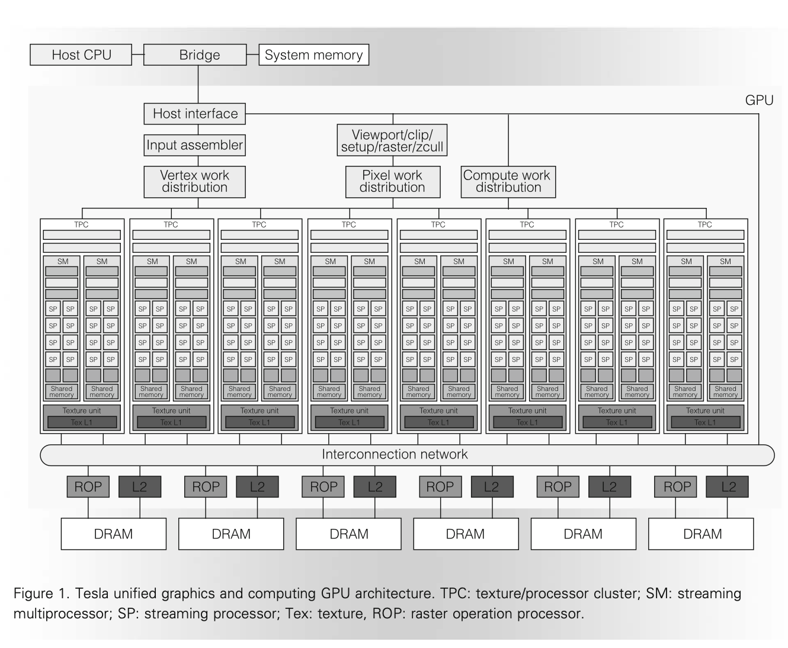{ width="600" }
  <figcaption>Tesla 架构总览（来源：NVIDIA Tesla: A Unified Graphics and Computing Architecture Figure 1）</figcation>
</figure>

图的上方是 Host CPU，CPU 通过 PCIe 等方式访问 GPU。根据要进行的任务类型，经过不同类型的预处理，但最终 Vertex/Pixel/Compute 任务都会通过 Streaming Processor Array (SPA)，也就是 TPC-SM-SP 三层次组成的大量计算核心来进行。这其实就是前面说的，把原来分别完成的任务，统一到相同的 processor 来完成。除了计算以外，针对 texture 和 raster 等图形相关的需求，设计了单独的硬件来加速，例如每个 TPC 都有自己的 Texture unit 和 Texture L1，在 L2 Slice 旁边还有 Raster operation processor (ROP)。虽然有 L2 缓存，但是这个缓存仅用于纹理处理，而没有用于 SPA。

在这个框架下，就可以去实现 Graphics Pipeline 了。图中的 Input assembler 收集 vertex shader 计算需要的各种图形信息，然后 Vertex work distribution 通过 round-robin 的方式 把 vertex shader 计算任务分发到 SPA 上。于是 SPA 就会执行 vertex shader 的代码。vertex shader 的输出会继续留在 GPGPU 上，到 pixel-fragment processing 的时候，又是由 SPA 来执行 fragment shader 的代码。

那么接下来来看 TPC 的内部架构。

<figure markdown>
  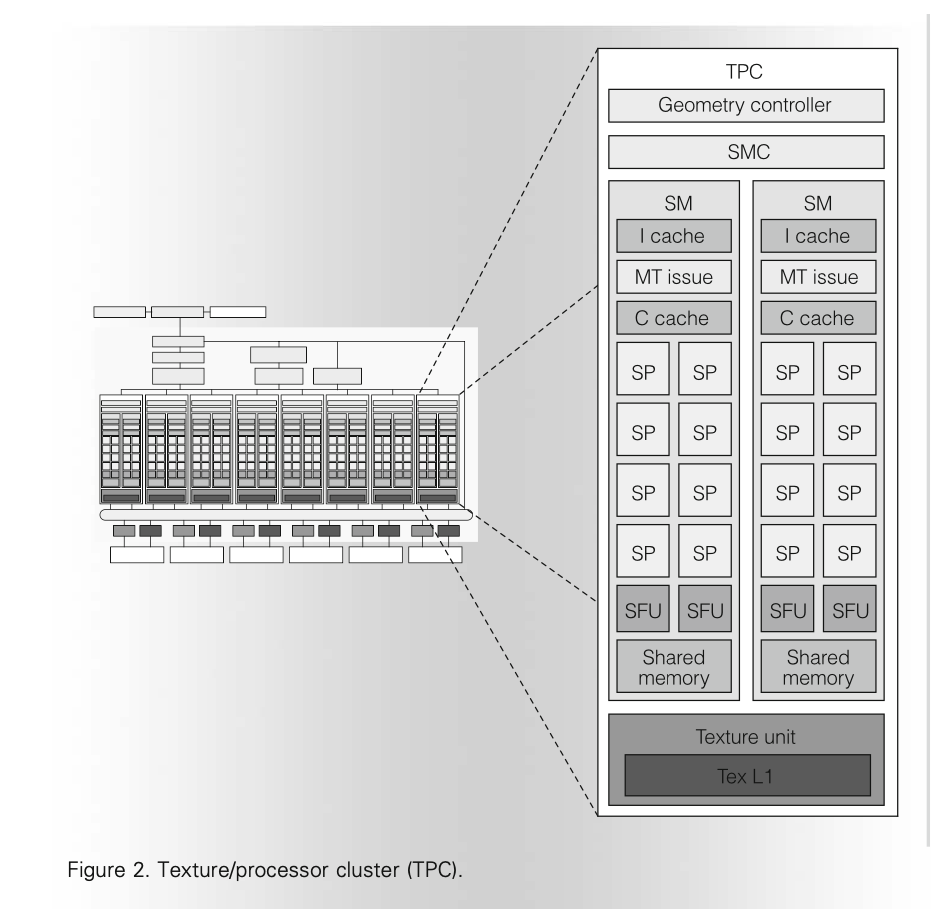{ width="600" }
  <figcaption>Tesla TPC 架构（来源：NVIDIA Tesla: A Unified Graphics and Computing Architecture Figure 2）</figcation>
</figure>

每个 TPC 包括一个 Geometry controller 和一个 SM Controller (SMC)，下面是两个 SM，最后是 Texture unit 和它内部的 Texture L1。每个 SM 有 8 个 SP。Geometry controller 是用于配合 vertex shader 和 geometry shader 的，这里就不深入分析了。下面主要分析 SM。

SM 是执行计算的主要部件，内部有 8 个 SP，两个 Special Function Unit（SFU，用于计算三角函数等特殊数学函数以及插值），一个多线程的取指令和 Issue 单元（MT Issue），一个指令缓存（I Cache），一个常量缓存（C Cache）和 16 KB 的共享内存（Shared memory）。注意 SM 内部没有数据缓存。每个 SP 包括一个浮点乘加单元（MAD，Multiply Add，没有乘加融合），每个 SFU 包括四个浮点乘法器。SP 工作在 1.5 GHz 的频率下，每个 SM 的单精度浮点峰值性能是 36 GFLOPS。这个 36 GFLOPS 包括了 SP 内的 MAD 单元的 $8 * 2 * 1.5 = 24$ GFLOPS 以及 SFU 内的浮点加法单元的 $2 * 4 * 1.5 = 12$ GFLOPS。

SM 以 warp 为单位来并行执行多个线程，一个 warp 有 32 个线程，每个 SM 可以同时执行 768 个线程，也就是 24 个 warp。SM 在执行的时候，会选择一个准备好执行下一条指令的 warp 去发射指令。当 warp 分叉的时候，先完成分支一个方向的执行，再完成分支另一个方向，直到两边重新汇聚到同一条指令，此时整个 warp 又可以继续同时执行。

负责 warp 调度的就是 SM warp scheduler。它运行在 1.5GHz 的一半频率，也就是 750MHz。它每个周期会从 24 个 warp 中选择一个去调度，被调度的 warp 的 32 个线程会被拆成两组，每组 16 个线程，然后用四个 1.5GHz 频率的周期去执行：因为 SP 只有 8 个，所以每个周期最多进行 8 个线程的执行，32 个线程的话就需要 4 个周期。在实现 warp 调度的时候，warp scheduler 采用了 scoreboard 机制，跟踪哪些 warp 可以被 issue。调度的时候，在可以被 issue 的 warp 里面，根据优先级、指令类型和公平性等原则去调度 warp。

每个 SP 上执行的指令支持：浮点，整数，位运算，类型转换，特殊函数，控制流，内存读写和 Texture。现在找不到 Tesla 架构的指令集列表，但是在 [Fermi Instruction Set](https://docs.nvidia.com/cuda/archive/8.0/cuda-binary-utilities/index.html#fermi) 可以看到 Tesla 的下一代架构 Fermi 的指令集列表。

为了提升内存访问带宽，SM 会对同一个 warp 对 local 或者 global memory 的访问进行合并，把连续的访问合并成一个大的访问，从而提升性能。Tesla 架构还引入了原子指令，包括整数加法、整数最小最大值、逻辑运算、swap 和 Compare-And-Swap（CAS）。关于原子指令的部分，可以阅读 [原子指令](../software/atomic_instructions.md) 的介绍。

内存部分，Tesla 架构的 DRAM 宽度是 384 位，分为 6 组，每组 64 位，也对应了六分之一的显存容量，以及物理地址空间。Tesla 架构已经引入了虚拟内存，所有指令涉及到的地址都是虚拟地址。页表保存在 local memory 里，并且也有相应的 TLB 层次来减少 page table walk 的次数。Tesla 架构没有数据缓存，因为按照传统的图形流程，一般是从内存中读取纹理，进行一系列计算，然后写入结果到内存中。因此 Tesla 架构只针对纹理读取设置了 L1 和 L2 缓存。

CUDA 中，有 thread block 的概念，也就是 cooperative thread array（CTA），cooperative 指的是这些 thread 可以通过 shared memory 和 __syncthreads 来协同完成一些计算。因为它们需要使用 shared memory，自然 CTA 会被归到某个 SM 下面，而不会跨越多个 SM 去执行。每个 SM 可以支持最多同时执行 8 个 CTA。

CUDA 中线程一共有三个层次：第一个是 Grid，第二个是 Block（Thread Block，Cooperative Thread Array），第三个是 Thread。Thread 独享自己的 local memory，Block 内的所有 Thread 共享 Shared memory，Grid 内的所有 Thread 共享 Global memory。这样三个线程层次就和三种类型的内存对应上了。Local memory 虽然是线程局部的，但实际上也是保存在显存中，只不过不会被其他线程访问，用来保存栈和临时变量。只有 Shared memory 是放在 SM 内部的，供同一个 CTA 内的线程共享。

最后，论文总结了采用 Tesla 架构的 GeForce 8800 Ultra GPU 的参数：

- 681 million transistors, 470 mm^2;
- TSMC 90-nm CMOS;
- 128 SP cores in 16 SMs; 每个 SM 内有 8 个 SP，所以 $8 * 16 = 128$
- 12,288 processor threads; 每个 SM 可以调度 24 个 warp，所以 $16 * 24 * 32 = 12288$
- 1.5-GHz processor clock rate;
- peak 576 Gflops in processors; 每个 SM 是 36 Gflops，所以 $36 * 16 = 576$
- 768-Mbyte GDDR3 DRAM; 每个 GDDR3 channel 内存有 128MB，一共 6 个 channel，所以 $128 * 6 = 768$
- 384-pin DRAM interface; 每个 GDDR3 channel 是 64 位，所以 $64 * 6 = 384$
- 1.08-GHz DRAM clock;
- 104-Gbyte/s peak bandwidth; 每个 GDDR3 channel 是 64 位，所以 $1.08 * 64 / 8 * 2 * 6 = 103.68$
- typical power of 150W at 1.3V.

在 G80 之后，还有一个 Tesla 架构的芯片：GT200，采用了 Tesla 2.0 架构，65nm 制程工艺。Tesla 2.0 相比 Tesla 1.0，引入了双精度浮点计算。

## NVIDIA Fermi

论文：C. M. Wittenbrink, E. Kilgariff and A. Prabhu, "Fermi GF100 GPU Architecture," in IEEE Micro, vol. 31, no. 2, pp. 50-59, March-April 2011, doi: 10.1109/MM.2011.24.

PPT: C.M. Wittenbrink, E. Kilgariff, and A. Prabhu, ‘‘Fermi GF100: A Graphics Processing Unit (GPU) Architecture for Compute Tessellation, Physics, and Computational Graphics,’’ IEEE Hot Chips, presentation, 2010; <https://old.hotchips.org/wp-content/uploads/hc_archives/hc22/HC22.23.110-1-Wittenbrink-Fermi-GF100.pdf>.

White paper: [Fermi: NVIDIA’s Next Generation CUDA Compute Architecture](https://www.nvidia.com/content/pdf/fermi_white_papers/nvidia_fermi_compute_architecture_whitepaper.pdf)

Fermi 是 Tesla 的下一代 NVIDIA 显卡架构。Tesla 虽然支持了通用计算，但依然保留了很多图形计算的遗留设计。相比之下，Fermi 针对通用计算做出了更多的改变：数据缓存、更多的访存单元、双精度浮点计算、ECC 内存以及更快的原子指令。通过引入 Unified Address Space，Fermi 架构能够支持更多使用指针的 C++ 程序。

GF100 是 Fermi 架构的一款核心，它的配置如下：

- 16 SM, 32 CUDA cores/SM, 512 CUDA cores in total
- 3 billion transistors, 40nm TSMC process
- 6Gbytes GDDR5 memory
- 384-bit memory interface, 6 channels
- 16 PolyMorph engines
- 4 raster units
- 64 texture units
- 48 ROP(raster operation processor) units

从微架构方面，Fermi 架构把 Tesla 架构的 TPC 改名为 Graphics Processor Clusters（GPC），毕竟 Texture 现在显得不再那么重要。GT100 有 4 个 GPC，每个 GPC 有 4 个 SM，所以一共是 16 个 SM。SM 个数相比 Tesla 架构没有变化，但是从 8 TPC 乘以 2 SM/TPC 变成了 4 GPC 乘以 4 SM/GPC。内存依然是 6 通道。新增了一个 GigaThread engine，每个 GPC 内有一个 PolyMorph engine 和 rasterizer（Tesla 架构整个 GPU 只有一个 rasterizer）。架构图见下：

<figure markdown>
  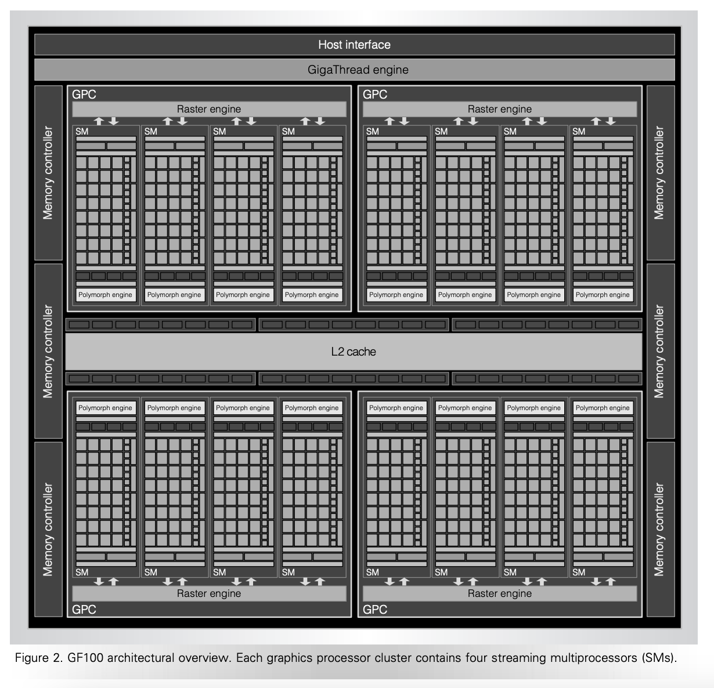{ width="600" }
  <figcaption>Fermi 架构总览（来源：Fermi GF100 GPU Architecture Figure 2）</figcation>
</figure>

Fermi 架构在 SM 内部相比 Tesla 变化比较大：Tesla 每个 SM 只有 8 个 SP，而 Fermi 每个 SM 里面有 32 个 CUDA core，CUDA core 约等于 Tesla 的 SP，也就是说是四倍的关系。虽然 Fermi 架构的 SM 数量和 Tesla 相同，都是 16，但是从 CUDA core 的数量上看，从 $16 * 8 = 128$ 提升到了 $16 * 32 = 512$ 个。SFU 单元也从 Tesla 的每个 SM 两个，提升到了每个 SM 四个。Fermi 的 CUDA core 实现了浮点乘加融合（FMA），每个 SM 每周期可以进行 16 个双精度浮点乘加操作。Tesla 的浮点并没有完全按照 IEEE754 标准实现，例如不支持 subnormal 浮点，而 Fermi 实现了完整的支持，并且实现了 IEEE754 标准的 rounding mode。

此外，Fermi 架构还把 Load/Store（LD/ST）单元独立出来，每个 SM 有 16 个 LD/ST 单元，地址空间也从 32 位扩大到了 64 位。寄存器堆保存了 32768 个 32 位寄存器。

Tesla 架构有图形处理的惯性，只考虑了图形处理的场景，所以没有设置数据缓存，认为程序只会从内存中读取纹理，因此只设置了纹理的 L1 和 L2 缓存。但是缺少数据缓存对于基于 CUDA 的通用计算程序是致命的。Fermi 架构引入了 L1 和 L2 数据缓存。Fermi 架构的 Shared Memory 和 L1 数据缓存大小是可配置的，二者共享 64 KB 的空间，可以选择 48KB Shared Memory 加 16KB 的 L1 数据缓存，也可以选择 16KB Shared Memory 和 48KB 的 L1 数据缓存。Fermi 架构的 L2 缓存采用的是写回（write-back）策略。

<figure markdown>
  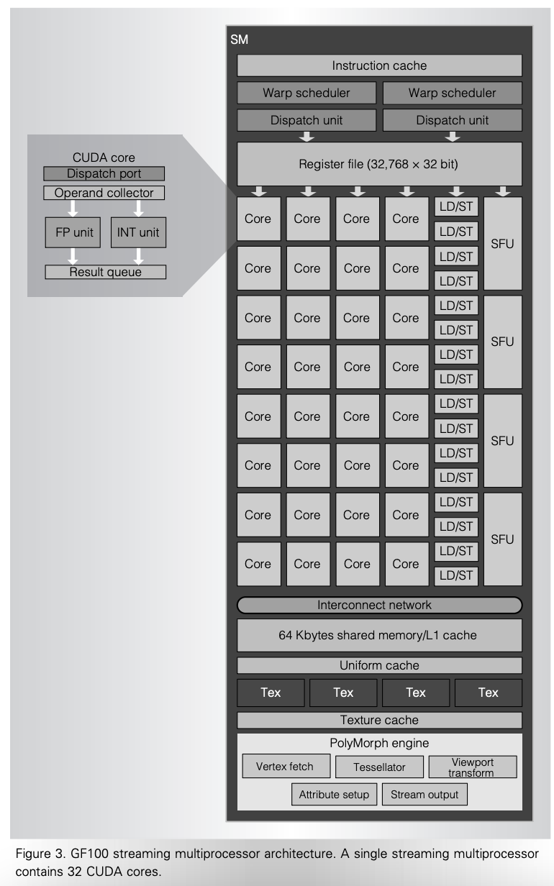{ width="600" }
  <figcaption>Fermi 架构 SM（来源：Fermi GF100 GPU Architecture Figure 3）</figcation>
</figure>

可以看到，SM 内部设置了两个 Warp Scheduler，可以同时从两个独立的 warp 去发射指令。每个 warp 只会去用 16 个 CUDA core 或者 16 个 LD/ST 单元或者 4 个 SFU 单元去执行。所以两个发射路径有独立的 CUDA core，但是 LD/ST 单元和 SFU 单元是共享的。

GigaThread engine 负责把 thread block 分发给 SM，同时可以提高上下文切换的速度，使得 GPGPU 可以高效地处理来自不同应用的 kernel，根据 Fermi whitepaper：

- 10x faster application context switching: below 25 microseconds
- Concurrent kernel execution: different kernels of the same application context can execute on the GPU at the same time
- Out of Order thread block execution
- Dual overlapped memory transfer engines

下面是 Tesla 1.0、Tesla 2.0 和 Fermi 架构的 GPU 的对比表格：

<figure markdown>
  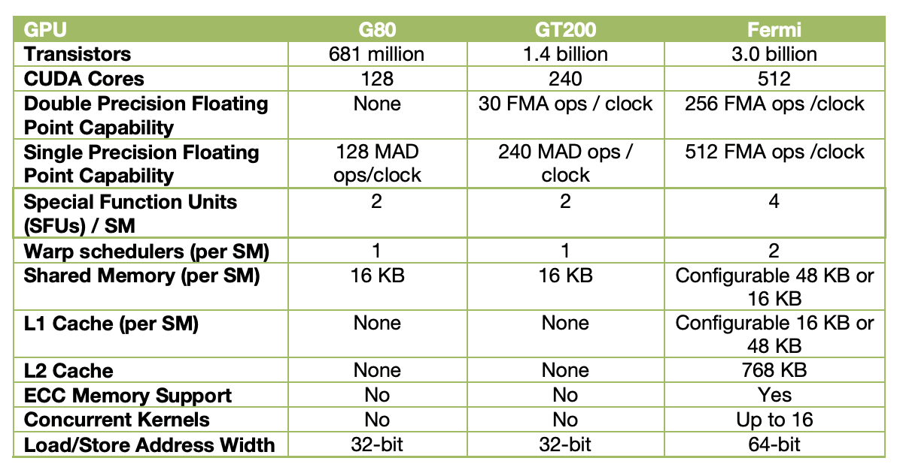{ width="600" }
  <figcaption>Tesla 和 Fermi 架构对比（来源：Fermi Whitepaper Summary Table）</figcation>
</figure>

## NVIDIA Kepler

Whitepaper: [NVIDIA’s Next Generation CUDA Compute Architecture: Kepler TM GK110/210](https://www.nvidia.com/content/dam/en-zz/Solutions/Data-Center/tesla-product-literature/NVIDIA-Kepler-GK110-GK210-Architecture-Whitepaper.pdf)

Datasheet: [NVIDIA® KEPLER GK110 NEXT-GENERATION CUDA® COMPUTE ARCHITECTURE](https://www.nvidia.com/content/dam/en-zz/Solutions/Data-Center/documents/NV-DS-Tesla-KCompute-Arch-May-2012-LR.pdf)

Kepler 相比 Fermi 架构的主要改进：

1. Dynamic Parallelism 和 Grid Management Unit：不仅 CPU 可以提交任务到 GPU 执行，GPU 自己也可以提交任务到自己上去执行
2. Hyper-Q：允许多个 CPU 核心同时向 GPU 提交任务，把硬件任务队列从 1 增加到了 32 个。每个 CUDA stream 会对应到一个硬件任务队列，因此增加硬件任务队列，可以减少 false dependency。
3. GPUDirect：支持 RDMA

和前两代不同的是，Kepler 去掉了 TPC/GPC 这一个层级，而是把 SM 做的很大，称为 SMX，一个 GK110/GK210 有 15 个 SMX，每个 SMX 里面有：

- 一个 SM 有 192 个单精度 CUDA Core，64 个双精度计算单元，32 个 SFU，32 个 LD/ST 单元
- 一个 SM 有四个 Warp Scheduler，每个 Warp Scheduler 选出同一个 Warp 的两条指令去发射
- 一个 SM 有 65536 或者 131072 个 32 位寄存器

<figure markdown>
  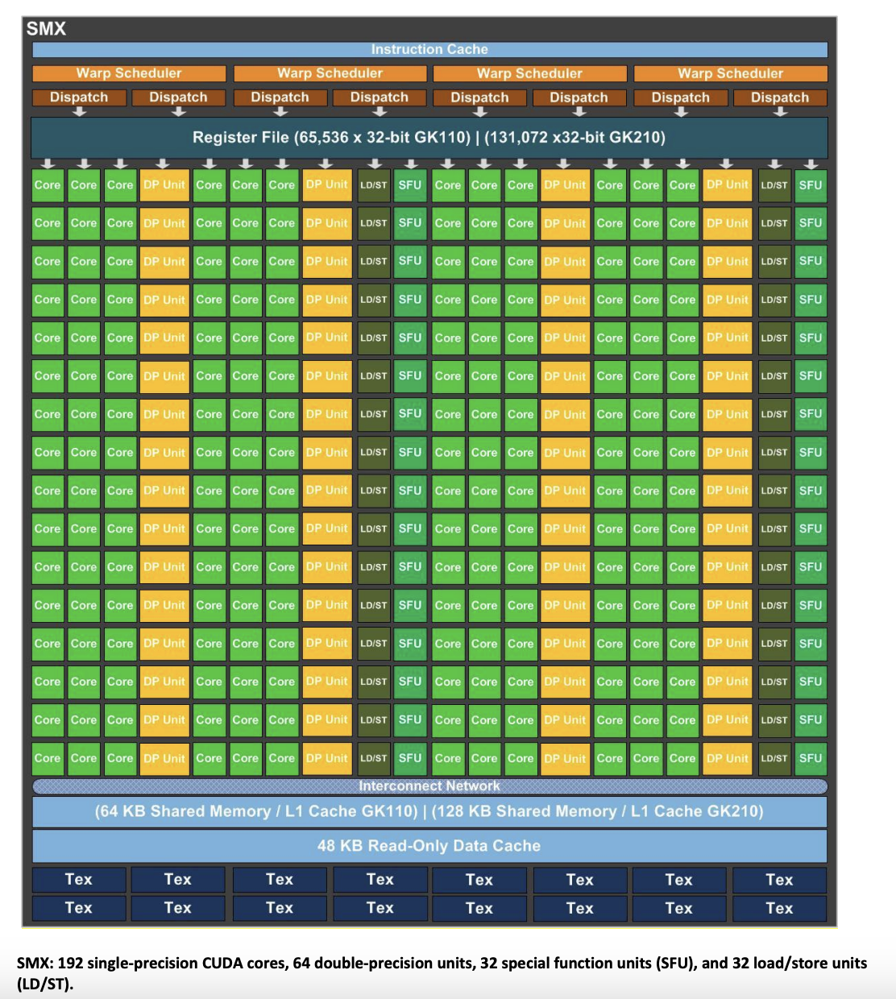{ width="600" }
  <figcaption>Kepler 架构 SM（来源：NVIDIA’s Next Generation CUDA Compute Architecture: Kepler TM GK110/210）</figcation>
</figure>

Kepler 为了要支持四个 Warp Scheduler，每个周期 Dispatch 8 条指令，简化了 Warp Scheduler 的工作方式：由于计算指令的延迟是固定的，因此可以由编译器来计算一些指令的调度，从而减轻了硬件调度的负担，硬件可以直接从指令中读取预先计算好的信息，然后在调度 Warp 的时候，根据这些信息防止一些 Warp 被调度。这个信息应该是保存在 Control Code/Instruction 中的，网上也有一些针对 Control Code/Instruction 编码的研究：

- <https://github.com/cloudcores/CuAssembler/blob/master/UserGuide.md>
- <https://github.com/NervanaSystems/maxas/wiki/Control-Codes>
- <https://zhuanlan.zhihu.com/p/166180054>

内存层级方面，Kepler 引入了一个额外的 48KB 只读 Data Cache，用于保存只读的数据，可以提供相比 Shared/L1 cache 更高的性能。

## NVIDIA Maxwell

Whitepaper: [NVIDIA GeForce GTX 980](https://www.microway.com/download/whitepaper/NVIDIA_Maxwell_GM204_Architecture_Whitepaper.pdf)

PPT: [New GPU Features of NVIDIA’s Maxwell Architecture](https://developer.download.nvidia.cn/assets/events/GDC15/GEFORCE/Maxwell_Archictecture_GDC15.pdf)

Blog: [5 Things You Should Know About the New Maxwell GPU Architecture](https://developer.nvidia.com/blog/5-things-you-should-know-about-new-maxwell-gpu-architecture/)

虽然 Kepler 把 GPC 层次去掉了，但是 Maxwell 架构又把 GPC 加回来了。Maxwell 分为两代，第一代的 GM107 以及第二代的 GM204。GM204 是一个 Maxwell 架构的 GPU 芯片：

- 4 GPC，每个 GPC 有一个 raster engine 和四个 SMM
- 16 SMM，每个 SMM 有 128 个 CUDA core，一个 PolyMorph engine 和 8 个 texture unit
- 4 Memory Controller，一共 256 位宽，7Gbps GDDR5 内存，每个 Memory Controller 带有 16 ROP 单元和 512KB 的 L2 缓存
- 28nm 制程

Maxwell 的 SM 叫做 SMM，它依然是四个 Warp Scheduler，但是和 Kepler 不同的是，它把计算单元也划分成了四份，每一份叫做一个 Processing Block（PB）。每个 Processing Block 里面有一个 Instruction Buffer，一个每周期 Dispatch 两条指令的 Warp Scheduler，32 个 CUDA core，1 个双精度计算单元，8 个 LD/ST unit 以及 8 个 SFU。也就是说，每个 SM 有 128 个 CUDA core，数量比 Kepler 的 192 CUDA core/SM 变少了，但是 Maxwell 也配置了更多的 SM。这些计算单元只会被 Processing Block 内的 Warp scheduler 使用。

<figure markdown>
  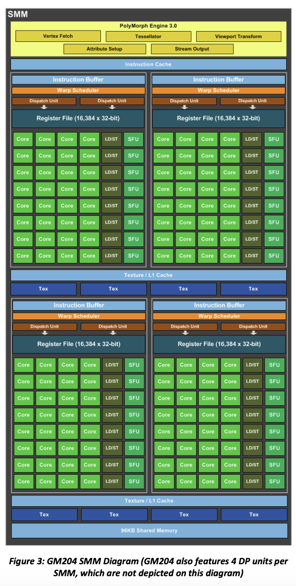{ width="600" }
  <figcaption>Maxwell 架构 SM（来源：NVIDIA GeForce GTX 980 Whitepaper）</figcation>
</figure>

Maxwell 架构的 L1 缓存和 Shared Memory 不再共享，Shared Memory 独占 96KB，然后 L1 缓存和 Texture 缓存共享空间。

## NVIDIA Pascal

Whitepaper: [NVIDIA Tesla P100](https://images.nvidia.cn/content/pdf/tesla/whitepaper/pascal-architecture-whitepaper.pdf)

GP100 是 Pascal 架构的芯片，改进如下：

- 支持 NVLink，双向带宽 160 GB/s
- 使用 HBM2 作为显存，替代了 GDDR 内存
- TSMC 16nm FinFET 工艺
- 支持 Unified Memory，使得 CPU 和 GPU 可以共享虚拟地址空间，让数据自动进行迁移
- 支持 Compute Preemption，使得 kernel 可以在指令级别做抢占，而不是 thread block 级别，这样就可以让调试器等交互式的任务不会阻碍其他计算任务的进行；在 Kepler 架构中，只有等一个 thread block 的所有 thread 完成，硬件才可以做上下文切换，但是如果中间遇到了调试器的断点，这时候 thread block 并没有完成，那么此时只有调试器可以使用 GPU，其他任务就无法在 GPGPU 上执行
- GP100 有 6 个 GPC，每个 GPC 内部有 5 个 TPC，每个 TPC 内部有 2 个 SM；GP100 总共有 $6*5*2=60$ 个 SM
- 每个 SM 有 64 个单精度 CUDA core，32 个双精度 CUDA core，4 个 texture unit
- 8 个 512 位的内存控制器，每个内存控制器附带 512 KB L2 缓存。每两个内存控制器为一组，连接到 4 个 1024 位的 HBM2 内存
- 支持 FP16 计算，两个 FP16 打包起来用一条指令进行计算

可以看到，GP100 每个 SM 只有 64 个单精度 CUDA core，而 Maxwell 有 128 个，Kepler 有 192 个，Fermi 有 32 个，Tesla 有 8 个。GP100 的一个 SM 里有两个 Processing Block，每个 Processing Block 有一个 Instruction Buffer、一个双发射 Warp Scheduler、32 个单精度 CUDA core、16 个双精度 CUDA core、8 个 LD/ST Unit 和 8 个 SFU，和 Maxwell 基本一样。只不过 Pascal 架构每个 SM 只有两个 Processing Block，而 Maxwell 每个 SM 有四个 Processing Block。但 Pascal 架构每个 SM 有 64 KB 的 Shared memory，并且 SM 的数量比 Maxwell 的两倍还要多，因此实际上是在变相地增加 Shared memory 的数量、容量以及带宽。

<figure markdown>
  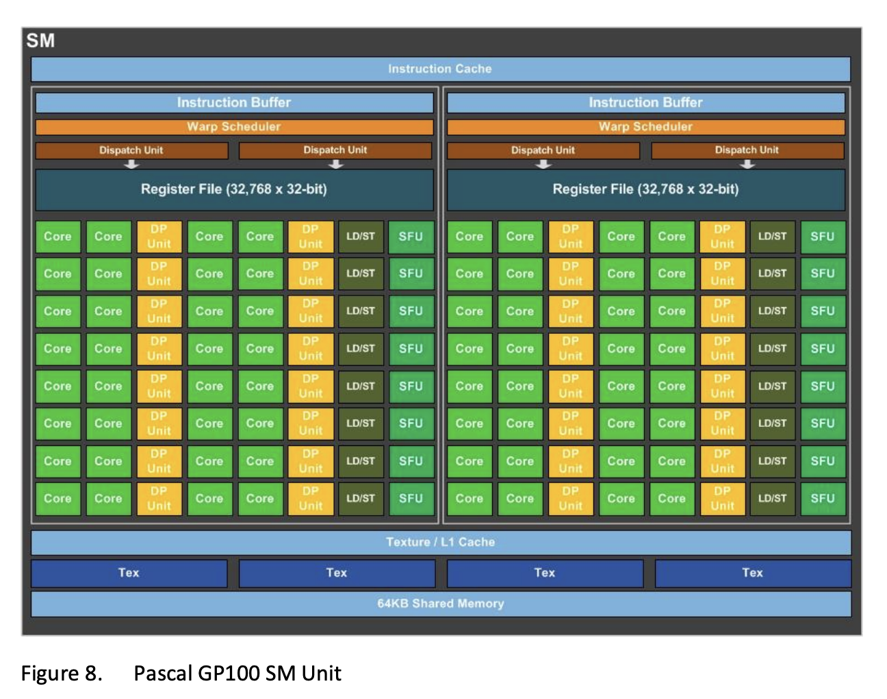{ width="600" }
  <figcaption>Pascal 架构 SM（来源：NVIDIA Tesla P100 Whitepaper）</figcation>
</figure>

## NVIDIA Volta

Whitepaper: [NVIDIA TESLA V100 GPU ARCHITECTURE](https://images.nvidia.cn/content/volta-architecture/pdf/volta-architecture-whitepaper.pdf)

Tuning Guide: [Tuning CUDA Applications for Volta](https://docs.nvidia.com/cuda/volta-tuning-guide/index.html)

GV100 是 Volta 架构的 GPU，它的改进包括：

- TSMC 12nm FFN 工艺，815 mm^2 面积，21.1 billion transistors
- 把 Tensor Core 引入到 SM 中
- 支持 Independent Thread Scheduling，改变了 Warp 的分叉方法，原来 Warp 分叉的时候，只能先走一个分支，再走另一个分支；从 Volta 开始，Warp 分叉以后会变成两个 Warp，因此分支的两个方向可以 Interleaved 方式执行
- 6 个 GPC，每个 GPC 有 7 个 TPC，每个 TPC 有 2 个 SM；一共有 84 个 SM
- 每个 SM 有 64 个 FP32 CUDA core，64 个 INT32 CUDA core，32 个 FP64 CUDA core，8 个 Tensor Core 和 4 个 Texture Unit
- 8 个 512-bit Memory Controller

GV100 又回到了每个 SM 拆分成 4 个 Processing Block，每个 Processing Block 包括：

- L0 Instruction Cache
- 一个单发射 Warp Scheduler
- Register File
- 16 个 FP32 core，16 个 INT32 core，8 个 FP64 core，8 个 LD/ST unit，2 个 Tensor Core，4 个 SFU

<figure markdown>
  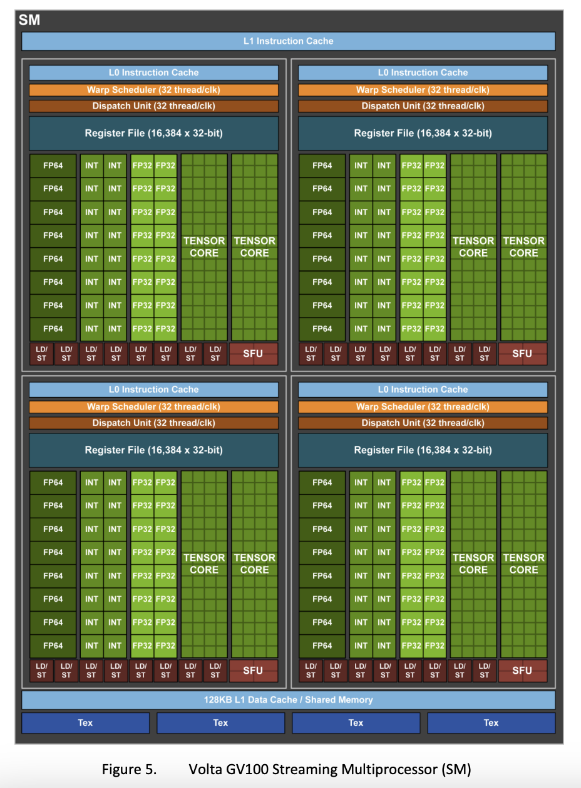{ width="600" }
  <figcaption>Volta 架构 SM（来源：NVIDIA TESLA V100 GPU ARCHITECTURE Figure 5）</figcation>
</figure>

注意 Volta 的 Warp Scheduler 又回到了单发射，这是因为每个 Processing Block 的 FP32 core 变少了（GP100 是 32 个，GV100 是 16 个），例如一条涉及 32 条线程的指令被发射，那么它需要两个周期来完成，第二个周期的时候，Warp Scheduler 也会同时发射其他指令，从而实现指令级并行。

根据 [Understanding instruction dispatching in Volta architecture](https://forums.developer.nvidia.com/t/understanding-instruction-dispatching-in-volta-architecture/108896/6)，实际上 LD/ST unit 并不是分布在四个 Processing Block 内，而是在 SM 级别共享，也就是说 SM 有公共的 32 个 LD/ST unit，这 32 个公共的 LD/ST unit 供四个 Processing Block 共享。

在 Volta 架构中，L1 Data Cache 和 Shared memory 再次共享。同时引入了 L0 Instruction Cache，每个 Processing Block 内部都有一个。此外，FP32 单元从 INT32 单元独立出来，使得它们可以同时进行计算。

## NVIDIA Turing

Whitepaper: [NVIDIA TURING GPU ARCHITECTURE](https://images.nvidia.cn/aem-dam/en-zz/Solutions/design-visualization/technologies/turing-architecture/NVIDIA-Turing-Architecture-Whitepaper.pdf)

TU102 是 Turing 架构的一款 GPGPU 芯片，它包括了：

- 6 GPC，每个 GPC 有 6 个 TPC，每个 TPC 有 2 个 SM；一共是 72 个 SM
- 每个 GPC 有一个 raster engine
- 每个 SM 有 64 个 CUDA core，8 个 tensor core，4 个 texture unit，256 KB 寄存器堆和 96KB 的 L1/Shared Memory
- 12 个 32-bit GDDR6 memory controller

Turing 架构的 SM 分成四个 Processing Block，每个 Processing Block 包括：

- 16 个 FP32 core，16 个 INT32 core，2 个 Tensor Core
- 一个单发射 Warp Scheduler
- L0 指令缓存
- 64KB 寄存器堆

<figure markdown>
  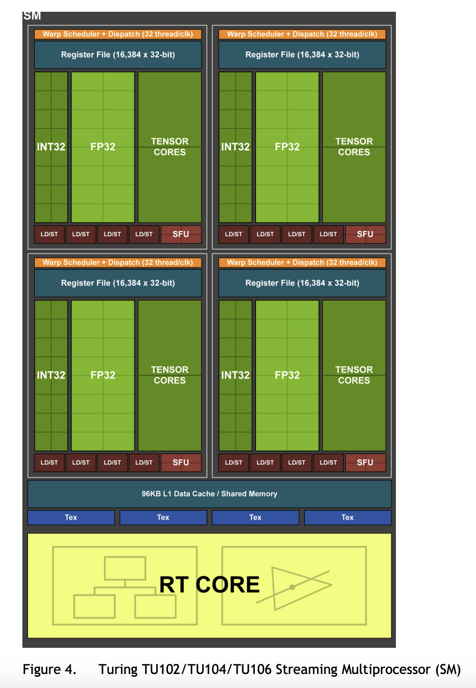{ width="600" }
  <figcaption>Turing 架构 SM（来源：NVIDIA TURING GPU ARCHITECTURE Figure 4）</figcation>
</figure>

## NVIDIA Ampere

Whitepaper: [NVIDIA AMPERE GA102 GPU ARCHITECTURE](https://www.nvidia.com/content/PDF/nvidia-ampere-ga-102-gpu-architecture-whitepaper-v2.pdf)

Whitepaper: [NVIDIA A100 Tensor Core GPU Architecture](https://images.nvidia.cn/aem-dam/en-zz/Solutions/data-center/nvidia-ampere-architecture-whitepaper.pdf)

<figure markdown>
  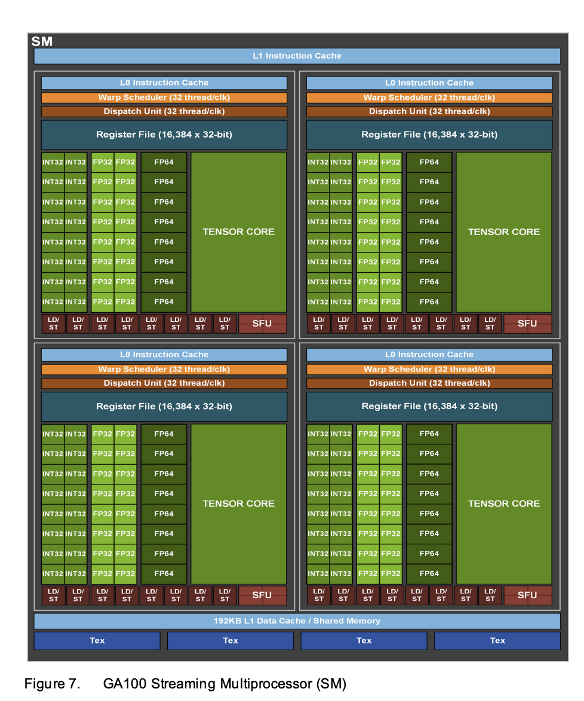{ width="600" }
  <figcaption>Ampere 架构 GA100 SM（来源：NVIDIA A100 Tensor Core GPU Architecture Figure 7）</figcation>
</figure>

<figure markdown>
  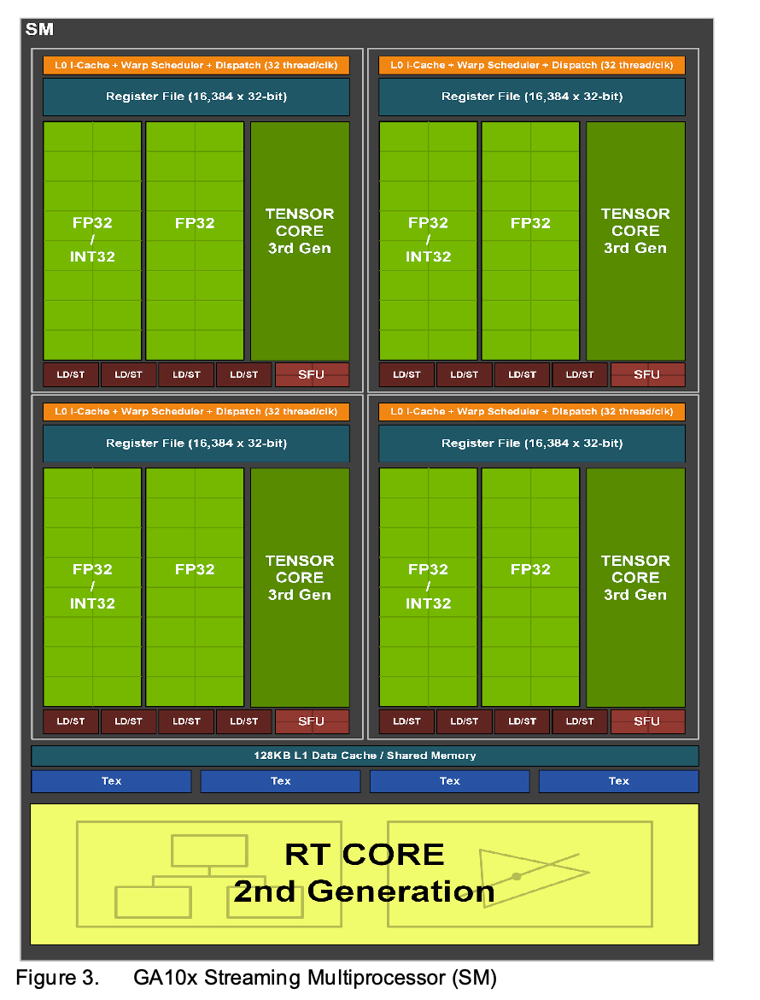{ width="600" }
  <figcaption>Ampere 架构 GA102 SM（来源：NVIDIA NVIDIA AMPERE GA102 GPU ARCHITECTURE Figure 3）</figcation>
</figure>

## NVIDIA Ada Lovelace

Whitepaper: [NVIDIA ADA GPU ARCHITECTURE](https://images.nvidia.cn/aem-dam/Solutions/Data-Center/l4/nvidia-ada-gpu-architecture-whitepaper-v2.1.pdf)

<figure markdown>
  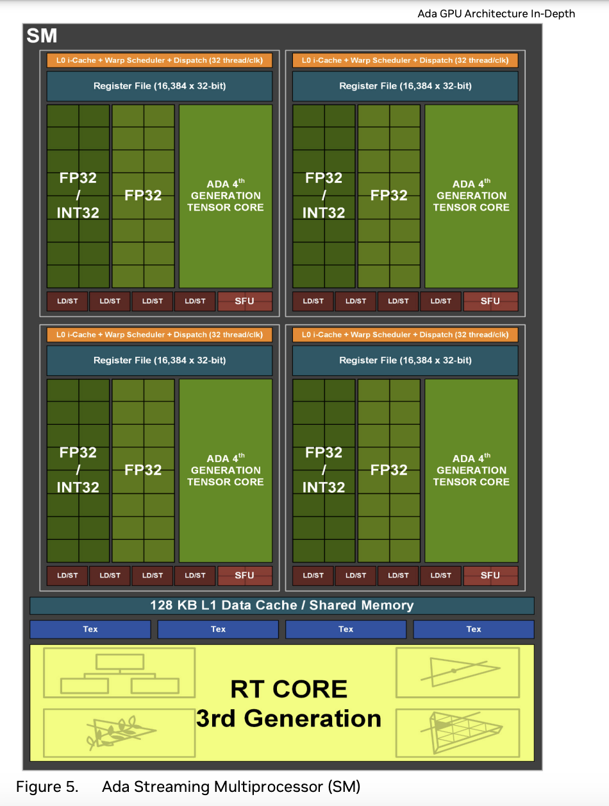{ width="600" }
  <figcaption>Ada Lovelace 架构 SM（来源：NVIDIA ADA GPU ARCHITECTURE Figure 5）</figcation>
</figure>

## NVIDIA Hopper

Whitepaper: [NVIDIA H100 Tensor Core GPU Architecture](https://resources.nvidia.com/en-us-tensor-core)

<figure markdown>
  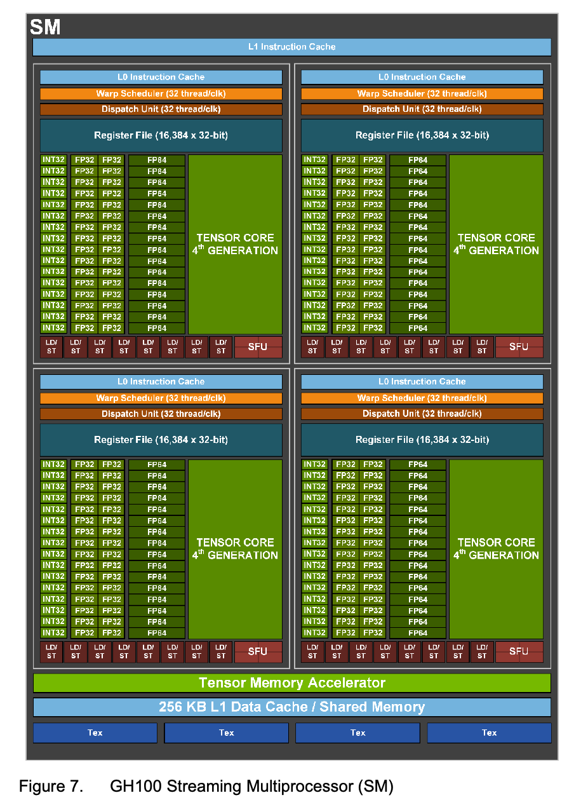{ width="600" }
  <figcaption>Hopper 架构 SM（来源：NVIDIA H100 Tensor Core GPU Architecture Figure 7）</figcation>
</figure>

## SM 发展历史

下面列出了各架构的 SM 发展历程

| 架构                        | 单精度 | 双精度 | LD/ST | SFU | 发射数          | 单精度/发射数 |
|-----------------------------|--------|--------|-------|-----|-----------------|---------------|
| Tesla 1.0 G80               | 8      | 0      | N/A   | 2   | 1 Warp * 1 Inst | 8             |
| Tesla 2.0 GT200             | 8      | 1      | N/A   | 2   | 1 Warp * 1 Inst | 8             |
| Fermi GF100                 | 32     | 16     | 16    | 4   | 2 Warp * 1 Inst | 16            |
| Kepler GK110/120            | 192    | 64     | 32    | 32  | 4 Warp * 2 Inst | 24            |
| Maxwell GM204 (per PB)      | 32     | 1      | 8     | 8   | 1 Warp * 2 Inst | 16            |
| Maxwell GM204 (per SM)      | 128    | 4      | 32    | 32  | 4 Warp * 2 Inst | 16            |
| Pascal GP100 (per PB)       | 32     | 16     | 8     | 8   | 1 Warp * 2 Inst | 16            |
| Pascal GP100 (per SM)       | 64     | 32     | 16    | 16  | 2 Warp * 2 Inst | 16            |
| Volta GV100 (per PB)        | 16     | 8      | 8     | 4   | 1 Warp * 1 Inst | 16            |
| Volta GV100 (per SM)        | 64     | 32     | 32    | 16  | 4 Warp * 1 Inst | 16            |
| Turing TU102 (per PB)       | 16     | ?      | 4     | 4   | 1 Warp * 1 Inst | 16            |
| Turing TU102 (per SM)       | 64     | ?      | 16    | 16  | 4 Warp * 1 Inst | 16            |
| Ampere GA100 (per PB)       | 16     | 8      | 8     | 4   | 1 Warp * 1 Inst | 16            |
| Ampere GA100 (per SM)       | 64     | 32     | 32    | 16  | 4 Warp * 1 Inst | 16            |
| Ada Lovelace AD102 (per PB) | 32     | ?      | 4     | 4   | 1 Warp * 1 Inst | 32            |
| Ada Lovelace AD102 (per SM) | 128    | ?      | 16    | 16  | 4 Warp * 1 Inst | 32            |
| Hopper GH100 (per PB)       | 32     | 16     | 8     | 1   | 1 Warp * 1 Inst | 32            |
| Hopper GH100 (per SM)       | 128    | 64     | 32    | 4   | 4 Warp * 1 Inst | 32            |

各芯片的 SM 数量和 CUDA Core 数量：

- G80: 16 SM(8 TPC * 2 SM/TPC) * 8 = 128 CUDA core
- GF100: 16 SM(4 GPC * 4 SM/GPC) * 32 = 512 CUDA core
- GK210: 15 SM(15 SM) * 192 = 2730 CUDA core
- GM204: 16 SM(4 GPC * 4 SM/GPC) * 128(4 PB * 32 Core/PB) = 2048 CUDA core
- GP100: 60 SM(6 GPC * 5 TPC/GPC * 2 SM/TPC) * 64(2 PB * 32 Core/PB) = 3840 CUDA core
- GV100: 84 SM(6 GPC * 7 TPC/GPC * 2 SM/TPC) * 64(4 PB * 16 Core/PB) = 5376 CUDA core
- TU102: 72 SM(6 GPC * 6 TPC/GPC * 2 SM/TPC) * 64(4 PB * 16 Core/PB) = 4608 CUDA core
- GA100: 128 SM(8 GPC * 8 TPC/GPC * 2 SM/TPC) * 64(4 PB * 16 Core/PB) = 8192 CUDA core
- GA102: 84 SM(7 GPC * 6 TPC/GPC * 2 SM/TPC) * 128(4 PB * 32 Core/PB) = 10752 CUDA core
- AD102: 144 SM(12 GPC * 6 TPC/GPC * 2 SM/TPC) * 128(4 PB * 32 Core/PB) = 18432 CUDA core
- GH100: 144 SM(8 GPC * 9 TPC/GPC * 2 SM/TPC) * 128(4 PB * 32 Core/PB) = 18432 CUDA core

很有意思的是，这里出现了不同的层次结构：

- SM
- TPC - SM
- GPC - SM
- GPC - TPC - SM

## SM/PB 发展历史

如果以 SM 或 PB 的最小粒度来看，它的发展历史是：

- Tesla：一个 SM 只有 Instruction cache 和 Constant cache，8 个 CUDA core，2 个 SFU，16KB 的 shared memory
- Fermi：Instruction Cache，两个单发射的 Warp Scheduler，有 32 个 CUDA core，16 个 LD/ST unit，4 个 SFU，64 KB 的 shared memory/L1 cache
- Kepler：Instruction Cache，四个双发射的 Warp Scheduler，有 192 个 CUDA core，64 个 DP unit，32 个 SFU，32 个 LD/ST，65536 或 131072 * 32 bit 的寄存器堆，64KB 或者 128KB 的 shared memory/L1 cache，48KB 的 readonly data cache
- Maxwell：开始拆分 Processing Block，每个 PB 内部有 Instruction Buffer，一个双发射的 Warp Scheduler，16384 * 32-bit 的寄存器堆，32 个 CUDA core，1 个 DP unit，8 个 LD/ST unit，8 个 SFU
- Pascal：每个 PB 内部有 Instruction Buffer，一个双发射的 Warp Scheduler，32768 * 32-bit 的寄存器堆，32 个 CUDA core，16 个 DP unit，8 个 LD/ST unit，8 个 SFU
- Volta：每个 PB 内部有 L0 Instruction Cache，一个单发射的 Warp Scheduler，16384 * 32-bit 的寄存器堆，16 个 FP32 core，16 个 INT32 core，8 个 FP64 core，8 个 LD/ST unit，2 个 Tensor Core，4 个 SFU
- Turing：每个 PB 内部有一个单发射的 Warp Scheduler，16384 * 32-bit 的寄存器堆，16 个 FP32 core，16 个 INT32 core，2 个 Tensor Core，4 个 LD/ST unit，4 个 SFU
- Ampere：每个 PB 内部有一个单发射的 Warp Scheduler，16384 * 32-bit 的寄存器堆，16 个 FP32 core，16 个 INT32 core，8 个 FP64 core，1 个 Tensor Core，8 个 LD/ST unit，4 个 SFU
- Ada Lovelace：每个 PB 内部有一个单发射的 Warp Scheduler，16384 * 32-bit 的寄存器堆，16 个 FP32 core，16 个 FP32/INT32 core，1 个 Tensor Core，4 个 LD/ST unit，4 个 SFU
- Hopper：每个 PB 内部有一个单发射的 Warp Scheduler，16384 * 32-bit 的寄存器堆，32 个 FP32 core，16 个 INT32 core，16 个 FP64 core，1 个 Tensor Core，8 个 LD/ST unit，4 个 SFU