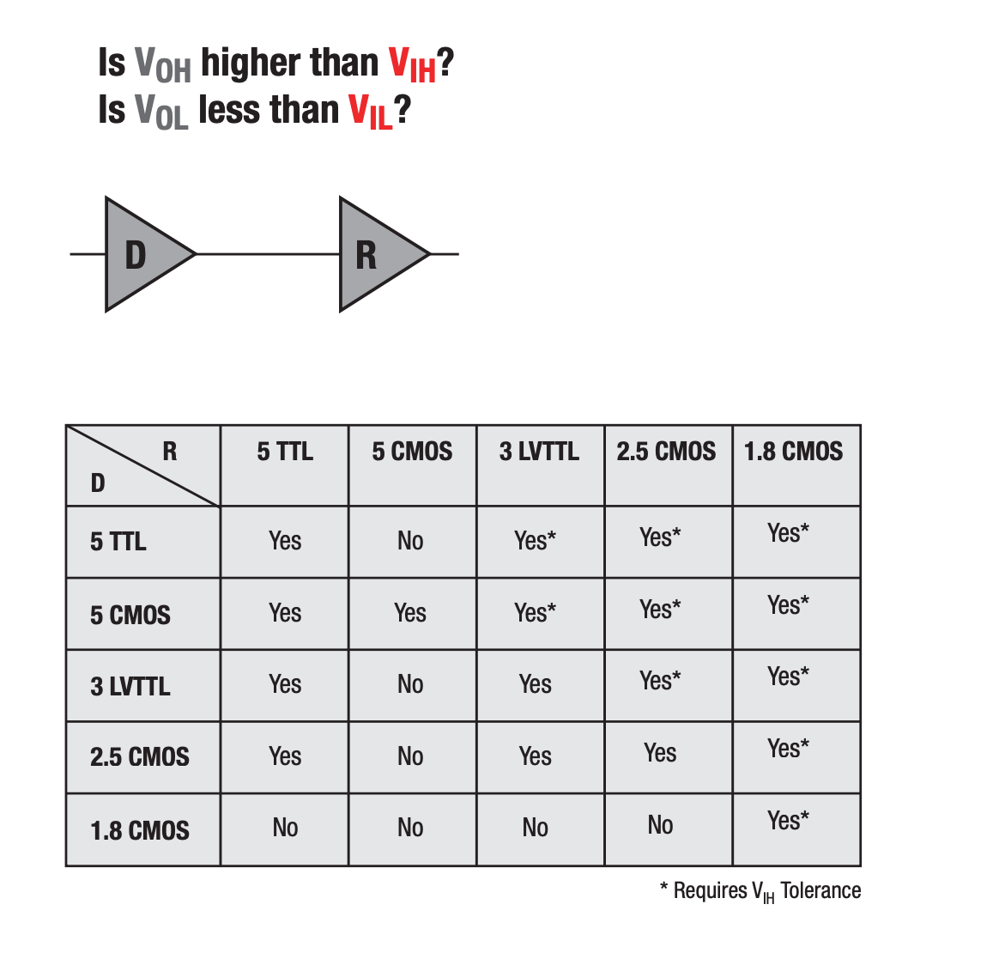

# Logic level standards

The logic level standard defines how to convert the digital signal 0 or 1 into high and low levels, and how to convert the high and low levels back to 0 or 1 between different chips.

The first part is for output, to convert 0 or 1 into high and low levels, so it is necessary to define the range:

- Output 0: The maximum voltage is $V_{OL}$, Output Low Voltage
- Output 1: The minimum voltage is $V_{OH}$, Output High Voltage

Conversely, when converting the level to 0 or 1, the range must also be defined:

- If the voltage is higher than $V_{IH}$, it is considered 1
- If the voltage is below $V_{IL}$, it is considered 0

Usually, the above four items satisfy $V_{OL} < V_{IL} < V_{IH} < V_{OH}$, that is to say, the range of input will be larger and more tolerant than that of output, providing certain fault tolerance.

## TTL logic level

5V TTL logic level is common. Take the data from [https://learn.sparkfun.com/tutorials/logic-levels/ttl-logic-levels](https://learn.sparkfun.com/tutorials/logic-levels/all) as an example, its level range is:

- Output 0: $V_{OL}=0.4$, $[0, 0.4]\mathrm{V}$
- Output 1: $V_{OH}=2.7$, $[2.7, 5]\mathrm{V}$
- Input 0: $V_{IL}=0.8$, $[0, 0.8]\mathrm{V}$
- Input 1: $V_{IH}=2.0$, $[2, 5]\mathrm{V}$

$V_{OH}=2.4$ in the data on [Wikipedia](https://en.wikipedia.org/wiki/Transistor%E2%80%93transistor_logic#Interfacing_considerations).

The [FT232H](https://www.ftdichip.com/old2020/Support/Documents/DataSheets/ICs/DS_FT232H.pdf) chip supports TTL, the parameters are as follows:

- $V_{OL}=0.4$, $V_{OH}=2.4$
- $V_{IL}=0.8$, $V_{OL}=2.0$

## CMOS logic level

CMOS logic level is more common nowadays. Take [Artix-7 FPGAs](https://docs.xilinx.com/v/u/en-US/ds181_Artix_7_Data_Sheet) as an example, it supports multiple CMOS level standards:

- LVCMOS12: $V_{OL}=0.4, V_{OH}=V_{CCO}-0.4, V_{IL}=0.35V_{CCO}, V_{IH}=0.65V_{CCO}$
- LVCMOS15: $V_{OL}=0.25V_{CCO}, V_{OH}=0.75V_{CCO}, V_{IL}=0.35V_{CCO}, V_{IH}=0.65V_{CCO}$
- LVCMOS18: $V_{OL}=0.45, V_{OH}=V_{CCO}-0.45, V_{IL}=0.35V_{CCO}, V_{IH}=0.65V_{CCO}$
- LVCMOS25: $V_{OL}=0.4, V_{OH}=V_{CCO}-0.4, V_{IL}=0.7, V_{IH}=1.7$
- LVCMOS33: $V_{OL}=0.4, V_{OH}=V_{CCO}-0.4, V_{IL}=0.8, V_{IH}=2.0$

Among them, $V_{CCO}$ is the external input voltage, which matches the two digits behind LVCMOS, and LVCMOS33 corresponds to 3.3 V. Each Bank has the same $V_{CCO}$ voltage, which is why IOSTANDARD is written in the constraint file, and often consecutive signals use the same logic level standard.

In some cases, TTL level standards and CMOS level standards are compatible as long as their voltage range meets the requirements and can accept higher input voltages. For details, see [Can I Use 3.3V TTL to Trigger a 3.3V CMOS Device](https://knowledge.ni.com/KnowledgeArticleDetails?id=kA03q000001Dn19CAC&l=en-US) and [Logic Guide - Texas Instruments](https:/ /www.ti.com/lit/sg/sdyu001ab/sdyu001ab.pdf):

<figure markdown>
  { width=400 }
  <figcaption>Compatibility between different TTL and CMOS levels (Source <a href="https://www.ti.com/lit/sg/sdyu001ab/sdyu001ab.pdf">Logic Guide - Texas Instruments</a>)</figcaption>
</figure>

## RS232

RS232 is special, its logic level can be positive or negative:

- Output 0: $[-15, -5] \mathrm{V}$
- Output 1: $[5, 15] \mathrm{V}$
- Input 0: $[-15, -3] \mathrm{V}$
- Input 1: $[3, 15] \mathrm{V}$

Therefore, if you want to connect RS232 peripherals to FPGA, you usually need to perform level conversion (for example [MAX3232 3-V to 5.5-V Multichannel RS-232 Line Driver and Receiver With ±15-kV ESD Protection](https://www.ti.com/lit/ds/symlink/max3232.pdf)), otherwise it will not work properly.

## RS485

RS485 is transmitted through differential signals, that is, a pair of data signals is used to represent 0 or 1 of the digital signal by the difference between the two. It requires that the number 1 corresponds to the differential voltage $V_{a} - V_{b} \le -200 \mathrm{mV}$, and the number 0 corresponds to the differential voltage $V_{a} - V_{b} \ge +200 \mathrm {mV}$. The waveform is as follows:

```wavedrom
{
  signal:
    [
      { name: "rs485_a", wave: "01010.1."},
      { name: "rs485_b", wave: "10101.0."},
      { name: "data", wave: "10101.0."},
    ]
}
```

## SSTL

SSTL (Stub Series Terminated Logic) is the logic level standard used by SDRAM, and there are different versions:

- SSTL_15
- [SSTL_18](https://www.jedec.org/sites/default/files/docs/JESD8-15A.pdf): $V_{DDQ} = 1.8 \mathrm{V}$, $V_{REF} = 0.9 \mathrm{V}$
- [SSTL_2](https://www.jedec.org/sites/default/files/docs/JESD8-9B.pdf): $V_{DDQ} = 2.5 \mathrm{V}$, $V_{REF} = 1.25 \mathrm{V}$
- [SSTL_3](https://www.jedec.org/system/files/docs/jesd8-8.pdf): $V_{DDQ} = 3.3 \mathrm{V}$, $V_{REF} = 1.5 \mathrm{V}$

SSTL also has a differential version for transmitting differential signals such as CK and DQS.

## LVDS

LVDS (Low Voltage Differential Signaling) is also a common differential logic level standard. Since it uses differential transmission, there is a common-mode voltage and a differential-mode voltage. For example, the common-mode voltage of LVDS_25 is $1.2 \mathrm{V}$, and the differential-mode voltage is $0.45 \mathrm{V}$, which means that the voltages on the two data signals will be around $1.2-0.45/2 = 0.975 \mathrm{V}$ and $1.2+0.45/2 = 1.425 \mathrm{V}$.

TMDS is similar to LVDS, but the voltage is different. TMDS is often used for DVI and HDMI signal transmission.

## Acknowledgement

The English version is kindly translated with the help of Google Translator.
