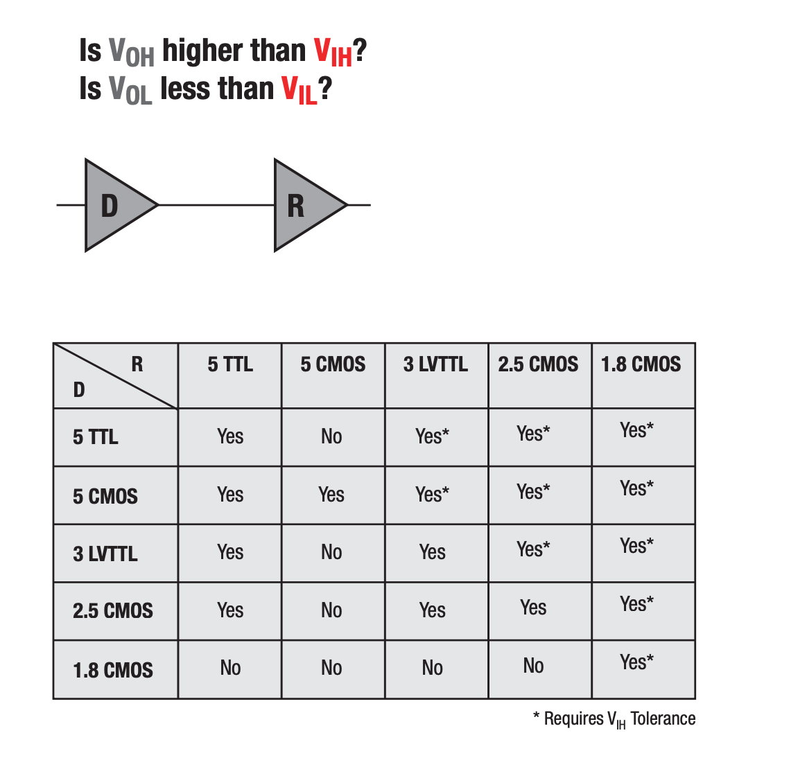

# 逻辑电平标准

逻辑电平标准定义了不同芯片之间，如何把数字信号 0 或者 1 转化为高低电平，以及如何把高低电平转换回 0 或者 1。

首先是输出，要把 0 或者 1 转化为高低电平，于是就要定义范围：

- 输出 0：电压最高是 $V_{OL}$，Output Low Voltage
- 输出 1：电压最低是 $V_{OH}$，Output High Voltage

反过来，要把电平转换到 0 或者 1 的时候，也要定义范围：

- 如果电压高于 $V_{IH}$，就认为是 1
- 如果电压低于 $V_{IL}$，就认为是 0

通常，上面四项满足 $V_{OL} < V_{IL} < V_{IH} < V_{OH}$，也就是说输入会比输出的范围更大，更加宽容，提供一定的容错。

## TTL 电平

常见的 5V TTL 电平，以 [https://learn.sparkfun.com/tutorials/logic-levels/ttl-logic-levels](https://learn.sparkfun.com/tutorials/logic-levels/all) 的数据为例子，它的电平范围是：

- 输出 0: $V_{OL}=0.4$, $[0, 0.4]\mathrm{V}$
- 输出 1: $V_{OH}=2.7$, $[2.7, 5]\mathrm{V}$
- 输入 0: $V_{IL}=0.8$, $[0, 0.8]\mathrm{V}$
- 输入 1: $V_{IH}=2.0$, $[2, 5]\mathrm{V}$

[Wikipedia](https://en.wikipedia.org/wiki/Transistor%E2%80%93transistor_logic#Interfacing_considerations) 上的数据中 $V_{OH}=2.4$。

[FT232H](https://www.ftdichip.com/old2020/Support/Documents/DataSheets/ICs/DS_FT232H.pdf) 芯片支持 TTL，参数如下：

- $V_{OL}=0.4$, $V_{OH}=2.4$
- $V_{IL}=0.8$, $V_{OL}=2.0$

## CMOS 电平

现在比较常见的是 CMOS 电平。以 [Artix-7 FPGAs](https://docs.xilinx.com/v/u/en-US/ds181_Artix_7_Data_Sheet) 为例，它支持多种 CMOS 电平标准：

- LVCMOS12: $V_{OL}=0.4, V_{OH}=V_{CCO}-0.4, V_{IL}=0.35V_{CCO}, V_{IH}=0.65V_{CCO}$
- LVCMOS15: $V_{OL}=0.25V_{CCO}, V_{OH}=0.75V_{CCO}, V_{IL}=0.35V_{CCO}, V_{IH}=0.65V_{CCO}$
- LVCMOS18: $V_{OL}=0.45, V_{OH}=V_{CCO}-0.45, V_{IL}=0.35V_{CCO}, V_{IH}=0.65V_{CCO}$
- LVCMOS25: $V_{OL}=0.4, V_{OH}=V_{CCO}-0.4, V_{IL}=0.7, V_{IH}=1.7$
- LVCMOS33: $V_{OL}=0.4, V_{OH}=V_{CCO}-0.4, V_{IL}=0.8, V_{IH}=2.0$

其中 $V_{CCO}$ 是外部输入的电压，与 LVCMOS 后面的两位数字匹配，LVCMOS33 就对应 3.3 V。每个 Bank 都有相同的 $V_{CCO}$ 电压，这就是为什么在约束文件里要写 IOSTANDARD，并且经常连续的信号都使用同样的电平标准。

一些情况下，TTL 电平标准和 CMOS 电平标准是可以兼容的，只要它们的电压范围满足要求，并且可以接受较高的输入电压。详见 [Can I Use 3.3V TTL to Trigger a 3.3V CMOS Device](https://knowledge.ni.com/KnowledgeArticleDetails?id=kA03q000001Dn19CAC&l=en-US) 和 [Logic Guide - Texas Instruments](https://www.ti.com/lit/sg/sdyu001ab/sdyu001ab.pdf)：

<figure markdown>
  { width=400 }
  <figcaption>不同 TTL 和 CMOS 电平的兼容性（图源 <a href="https://www.ti.com/lit/sg/sdyu001ab/sdyu001ab.pdf">Logic Guide - Texas Instruments</a>）</figcaption>
</figure>

## RS232

RS232 比较特别，它的电平有正有负：

- 输出 0: $[-15, -5] \mathrm{V}$
- 输出 1: $[5, 15] \mathrm{V}$
- 输入 0: $[-15, -3] \mathrm{V}$
- 输入 1: $[3, 15] \mathrm{V}$

因此如果想要接 RS232 外设到 FPGA 上，通常需要进行电平转换（例如 [MAX3232 3-V to 5.5-V Multichannel RS-232 Line Driver and Receiver With ±15-kV ESD Protection](https://www.ti.com/lit/ds/symlink/max3232.pdf)），否则无法正常工作。

## RS485

RS485 通过差分信号来传输，也就是用一对数据信号，以二者的差值来表示数字信号的 0 或者 1。它要求，数字 1 对应差分电压 $V_{a} - V_{b} \le -200 \mathrm{mV}$，数字 0 对应差分电压 $V_{a} - V_{b} \ge +200 \mathrm{mV}$，波形如下：

```wavedrom
{
  signal:
    [
      { name: "rs485_a", wave: "01010.1."},
      { name: "rs485_b", wave: "10101.0."},
      { name: "data", wave: "10101.0."},
    ]
}
```

## SSTL

SSTL(Stub Series Terminated Logic) 是 SDRAM 所采用的电平标准，有不同的版本：

- SSTL_15
- [SSTL_18](https://www.jedec.org/sites/default/files/docs/JESD8-15A.pdf): $V_{DDQ} = 1.8 \mathrm{V}$, $V_{REF} = 0.9 \mathrm{V}$
- [SSTL_2](https://www.jedec.org/sites/default/files/docs/JESD8-9B.pdf): $V_{DDQ} = 2.5 \mathrm{V}$, $V_{REF} = 1.25 \mathrm{V}$
- [SSTL_3](https://www.jedec.org/system/files/docs/jesd8-8.pdf): $V_{DDQ} = 3.3 \mathrm{V}, $V_{REF} = 1.5 \mathrm{V}$

SSTL 还有差分版本，用于传输 CK、DQS 等差分信号。

## LVDS

LVDS(Low Voltage Differential Signaling) 也是一个常见的差分信号电平标准。由于是差分传输，就有共模电压和差模电压。例如 LVDS_25 的共模电压是 $1.2 \mathrm{V}$，差模电压是 $0.45 \mathrm{V}$，意味着两个数据信号上的电压会分别在 $1.2-0.45/2 = 0.975 \mathrm{V}$ 和 $1.2+0.45/2 = 1.425 \mathrm{V}$ 上下。

TMDS 和 LVDS 类似，但是电压不一样。TMDS 经常用于 DVI 和 HDMI 的信号传输。
