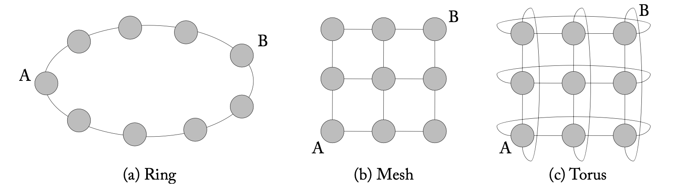
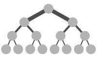
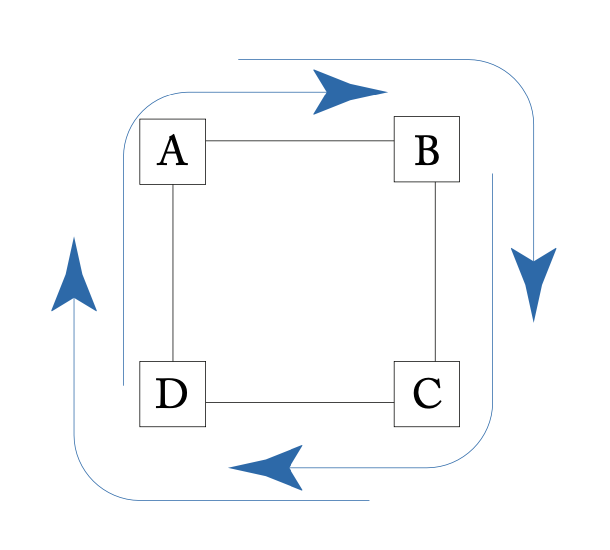
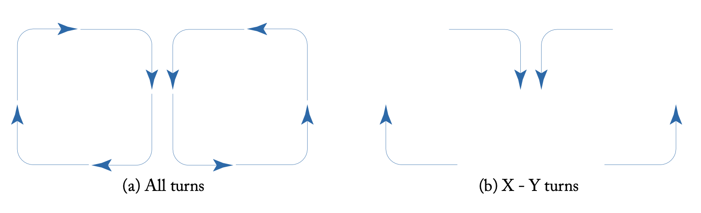
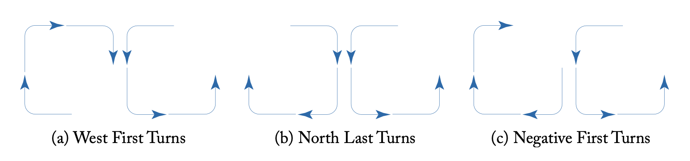
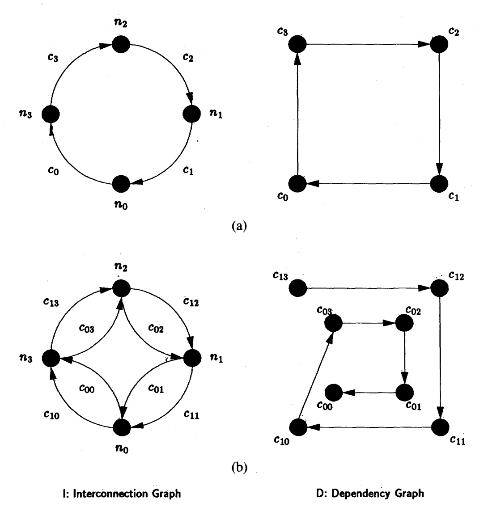

# 片上网络

## 背景

随着芯片内的核心数量增多，在实现互联的时候，传统的 Crossbar 遇到了扩展性的瓶颈，因此需要用片上网络来替代 Crossbar。

下面主要按照 [On-Chip Networks, Second Edition](https://link.springer.com/book/10.1007/978-3-031-01755-1) 以及《计算机系统结构》课程和《高等计算机系统结构》课件的顺序进行讲解。

## 拓扑

拓扑讲的就是结点间的连接方式。比较常见的拓扑有：

1. Ring：每个结点连接到环上相邻的两个结点
2. Mesh：以 2D Mesh 为例，把结点放在一个网格里，每个结点最多连接四个相邻结点：在内部的连接四个相邻结点，在边上的只连接三个相邻结点，在角上的只连接两个结点
3. Torus：在 Mesh 的基础上，让边和角上的结点也连接四个结点：边上的结点连到对侧最远的结点，角上的结点连到另外两个角

<figure markdown>
  { width="600" }
  <figcaption>Ring，Mesh 和 Torus（图源 <a href="https://link.springer.com/book/10.1007/978-3-031-01755-1">On Chip Networks, Second Edition</a>）</figcaption>
</figure>

其中 Mesh 和 Torus 还可以扩展到高阶情况，例如 3D 的立方体。

还有一些比较复杂的网络拓扑，例如 Fat Tree，在树形拓扑的基础上，由于树上两叶子结点间路径会比较多地经过层数比较小的结点，例如根结点，把靠近根结点的边变粗（增加带宽）：

<figure markdown>
  { width="400" }
  <figcaption>Fat Tree（图源 <a href="https://en.wikipedia.org/wiki/Fat_tree#/media/File:Fat_tree_network.svg">Wikipedia</a>）</figcaption>
</figure>

可以从以下几个方面评估一个拓扑的属性：

1. 结点的度：连接的结点数
2. 直径：结点间距离的最大值
3. 等分宽度：网络被切成两半（或者几乎两半）的时候，切割的最小边数

在这三种拓扑中，结点既是流量的起点和终点，又负责了流量的转发。

另一类拓扑中，有部分结点只负责转发流量，不作为流量的起点和终点，例如 Butterfly 网络，Clos 网络，Fat Tree。

但由于片上网络是要实现在芯片上的，而芯片是 2D 的，所以片上网络一般会用可以放在平面上的拓扑，比较常见的就是 Mesh 和 Ring。

## 路由

确定好网络拓扑后，在实际传输之前，由于两个结点间路径不唯一，所以需要考虑如何把请求从起点路由到终点。这里主要考虑的是 Mesh 拓扑的路由算法。

首先容易想到的是选择最短路径，但在 Mesh 拓扑中，最短路径也是不唯一的，因此还是需要更加具体的算法来做出选择。

路由在选取的时候还需要考虑死锁的问题：由于通常片上网络是不允许丢包的，因此如果发送数据时，接收方的缓冲区已经满了，就不能继续发送了。那么这个时候就会出现一个依赖关系：A 要发给 B，但同时 B 也要发给 C，现在 B 和 C 的缓冲区满了，那么只有等 C 的缓冲区释放空间，B 才能发给 C，然后 B 的缓冲区才得以释放，A 才能发给 B。换句话说，A 到 B 的传输只有等 B 到 C 的传输完成才可以继续。

那么，假如此时 A 到 B 要等待 B 到 C 传输完成，B 到 C 要等待 C 到 D 传输完成，C 到 D 要等待 D 到 A 传输完成，D 到 A 要等待 A 到 B 传输完成，此时就出现了死锁：互相依赖，出现了环，并且没有办法从环中退出，那就死锁了。

<figure markdown>
  { width="300" }
  <figcaption>路由协议死锁的情况（图源 <a href="https://link.springer.com/book/10.1007/978-3-031-01755-1">On Chip Networks, Second Edition</a>）</figcaption>
</figure>

一个经典的路由算法是维序路由（Dimension Ordering Routing，简称 DOR），意思就是按照维度的顺序去路由，只有前一个维度走到和终点相同，才会在下一个维度继续走。例如在二维场景下，X-Y 路由就是先走 X 轴，走完 X 轴以后再走 Y 轴。反过来 Y-X 路由则是先走 Y 轴，再走 X 轴。

维序路由十分简单，容易实现，并且不会出现死锁。维序路由不会出现死锁的原因是，它的依赖不会出现环：以 X-Y 路由为例，所有 X 方向上的传输可能依赖 Y 方向上的传输，但 Y 方向上的传输不会依赖 X 方向上的传输。还是以上图为例子：A 到 B 的传输依赖 B 到 C 的传输，但是 B 到 C 的传输不会依赖 C 到 D 的传输，因为这不符合 X-Y 路由的规则。

但是维序路由的缺点也很明显：浪费了很多可能的路径，例如 A 和 B 同时要向 C 传输，就会在 B 到 C 的边上拥挤，无法利用剩下的路径。

接下来介绍路由算法的两个分类：一类是 Oblivious 路由算法，另一类是 Adaptive 路由算法。顾名思义，Oblivious 不考虑网络当前的拥塞状态，直接按照自己的算法来发；Adaptive 会根据网络当前的拥塞状态，期望找到一个不那么拥挤的路径。

显然，维序路由没有考虑网络是否拥塞，属于 Oblivious 路由算法。另一个典型的 Oblivious 路由是 Valiant 随机路由算法：随机选择一个中间结点，先从起点路由到中间结点，再从中间结点路由到终点。还有一种典型的 Oblivious 路由，就是随机选择 X-Y 路由或 Y-X 路由的一种，但是可能会出现死锁。

Adaptive 路由算法的目的是，根据网络的拥塞情况，找到一个更优的路由，绕过拥塞的部分，实现更高的带宽利用率。例如如果最短路径上出现了拥塞，可以尝试绕路，在一条不拥塞的最短路径上传输。但是绕路的时候，需要防止活锁：一直在绕路，从来没到达目的地。

设计 Adaptive 路由的时候，也要考虑如何避免死锁。维序路由保证了不会出现死锁，但也唯一确定了路由，无法支持 Adaptive 路由。但实际上，为了避免死锁，不需要像维序路由那么严格。

回顾一下维序路由中的 X-Y 路由：它要求先走 X 轴，再走 Y 轴，那么从 X 轴拐到 Y 轴的时候，有四种情况，见下图 (b)：

<figure markdown>
  { width="500" }
  <figcaption>Mesh 的转向（(a) 是所有可能，(b) 是 X-Y 路由）（图源 <a href="https://link.springer.com/book/10.1007/978-3-031-01755-1">On Chip Networks, Second Edition</a>）</figcaption>
</figure>

这种拐法可以保证不出现死锁，但是有更加宽松的转向方式，也可以保证不出现死锁，例如下面的三种：

<figure markdown>
  { width="500" }
  <figcaption>Mesh 的三种转向模型（图源 <a href="https://link.springer.com/book/10.1007/978-3-031-01755-1">On Chip Networks, Second Edition</a>）</figcaption>
</figure>

每种转向模型都在八种转向中去掉了两种，这样就实现了无死锁。West First Turns 的意思是先往西走，转向后不再往西走；North Last Turns 的意思是往北走只能出现在最后阶段，往北走以后就不再转向；Negative First Turns 的意思是先往西（X 轴负方向）或者南（Y 轴负方向）走，之后再往东（X 轴正方向）或者北（Y 轴正方向）走。

还有一种 Odd-even 方法：在偶数列的时候，禁止东转北和北转西；在奇数列的时候，禁止东转南和南转西。

有了更多转向方向后，就允许出现多种可能的路径，意味着 Adaptive 路由算法可以在保证不死锁的前提下，找出一条比较优的路径。

在下一节会介绍如何用流控来保证不会出现死锁，此时路由就不需要保证不出现死锁了，这样可以获得更多的灵活性。

## 流控

确定好路由以后，还需要考虑流量控制的问题：当链路出现拥塞，如何保证高效的传输。

在实现流控之前，需要先了解在片上网络上传输的是什么数据，又是怎么传输数据的。

首先，结点要发送的是消息（Message），例如要读写内存，实现缓存一致性协议等等。对于上层来说，它收发的都是消息，把消息交给片上网络以后，由片上网络负责传输到目的地，而不需要考虑片上网络是具体怎么实现的。如果拿网络来类比，就像是在一个可靠的 UDP 协议上传输消息。

正如 IP 有最大长度，需要进行分片，片上网络也有类似的机制，就是把消息拆成很多个 Packet，Packet 有最大长度。从 Message 到 Packet 除了分片以外，可能还涉及到地址的转换：例如根据读取内存的地址，找到地址所对应的内存控制器，计算出内存控制器在片上网络的坐标，然后填到 Packet 的头部上。到 Packet 这一层之后，就是用片上网络的逻辑来处理了，上层的 Message 仅仅是载荷。当 Packet 到达目的地的时候，则要重新组装成 Message 交给上层逻辑。

第一个流控方法是电路交换（Circuit Switching）：先初始化一个从起点到终点的链路，初始化好以后才开始发送数据，此时数据不需要分片，直接发送。链路建立以后，链路上的结点只负责传输这一个链路上的消息，所以如果传输的数据占不满链路的带宽，就会浪费。但是传输数据的效率比较高：没有分片的开销，如果传输的数据量大，可以分摊建立阶段的开销。

第二个流控方法是存储转发（Store and Forward）：把收到的 Packet 保存下来，然后根据每个 Packet 的目的地，计算出下一个结点的方向，然后发送。这在以太网交换机里很常见，但是缺点是延迟比较大。在片上网络中，存储转发有两个问题：一是的存储转发延迟无法忽略，二是需要比较大的缓冲区来保存 Packet。

在存储转发的基础上进行优化，得到虚拟直通（Virtual Cut-through）方法：收到 Packet 头部的时候，其实就可以知道要转发的下一个结点了，因此可以把 Packet 拆成更小的单位，称为 Flit（Flow control unit/Flow control digit）。把一个 Packet 拆分成多个 Flit 以后，结点接收到第二个 Flit 时，可以同步发送第一个 Flit；接收到第三个 Flit 的时候，同步发送第二个 Flit，依此类推。继续发送的前提是下一个结点的缓存可以放得下一个 Packet。只有第一个 Flit 会保存路由信息，其余的只保存数据。

虚拟直通缓解了存储转发的延迟问题，接下来解决第二个问题，即在缓冲区大小上进行优化，得到虫孔流控（Wormhole）方法：缓冲区不需要保存完整的 Packet，只需要能放得下一个 Flit，就可以像虚拟直通那样继续传输。

但是虫孔流控出现了新的 Head of Line Blocking 问题：当缓冲区满了的时候，一个 Packet 的多个 Flit 可能散落在多个结点中，这些结点都因为同一个 Packet 堵塞，无法传输其他数据。比较极端的情况是，同一个 Packet 的第一个 Flit 已经到达终点，但是最后一个 Flit 还在起点，此时如果出现了阻塞，就可能把整个路径上的结点堵住。虚拟直通（Virtual cut-through）算法在出现阻塞的时候，因为发送时已经保证了缓冲区可以放下整个 Packet，因此即使出现了阻塞，部分结点还是可以继续发送 Flit。

为了解决 Head of Line Blocking 的问题，引入了虚拟通道（Virtual Channel）方法：既然 Block 在 Head of Line 上，那就支持多个 Line，也就是多个 Virtual Channel。虽然物理上还是原来的通道，但是逻辑上实现了多个 Virtual Channel。在 Packet 进入结点的时候，Packet 会被分到其中一个 Virtual Channel 上，那么如果一个 Packet 堵塞了，只会堵住它所在的 Virtual Channel，其他 Virtual Channel 还可以继续传输。多个 Virtual Channel 竞争同一个物理通道，采用轮询的方式仲裁。

Virtual Channel 加上 Wormhole Routing 是广泛使用的流控算法。下面是一个流控算法的总结：

|                 |     链路    |     缓存            |     评价                      |
|-----------------|-------------|---------------------|-------------------------------|
|     电路交换    |   Message   |     N/A (无缓存)    |   需要建立和确认              |
|     存储转发    |   Packet    |     Packet          |   收到完整 Packet 才可以发送  |
|     虚拟直通    |   Packet    |     Packet          |   头 Flit 可以发送            |
|     虫孔流控    |   Packet    |     Flit            |   Head of Line Blocking       |
|     虚拟通道    |   Flit      |     Flit            |   不同数据包的数据片交错      |

来源：《高等计算机系统结构》课件

### 无死锁流控

此外，Virtual Channel 还可以用来解决死锁的问题，此时路由算法就不用考虑死锁的问题，而是由 Virtual Channel 来解决。

回忆死锁的场景，死锁是因为出现了循环依赖，导致所有结点缓冲区都满了，所有结点都无法传输数据。为了刻画出依赖情况，可以绘制出 Channel Dependency Graph：如果 A 到 B 的传输 Channel 依赖于 B 到 C 的传输 Channel，就从 (A, B) 画一条边到 (B, C)。注意，原来片上网络拓扑里的边，在 Channel Dependency Graph 里变成了点。

引入 Virtual Channel 以后，由于每个 Virtual Channel 有自己的缓冲区，因此从 A 到 B 的链路上，相当于有了多个传输 Channel，每个 Virtual Channel 就是一个传输 Channel。虽然物理上还是只有一个 Channel，但是一个 Virtual Channel 在阻塞的时候，不会影响其他 Virtual Channel 的工作。

此时，由于两个结点间不止一个 Channel，即使人为地禁用一个 Channel，也可以正常传输，并且也打破了环。以下图为例：下图 (a) 左侧中 $n_1$ 到 $n_4$ 是组成环的四个结点，四个 Channel 互相依赖，因此 Channel Dependency Graph 出现了环（下图 (a) 右侧）；引入了 Virtual Channel 以后，相邻结点间就有了两个 Channel，此时禁用 $c_{00}$ 通道，并且约定 Channel 的优先级，那么 Channel Dependency Graph 就不再成环（下图 (b) 右侧），并且由于数据不会绕着环转两圈，不影响可达性。

<figure markdown>
  { width="500" }
  <figcaption>使用 Virtual Channel 解决死锁问题（图源 <a href="https://ieeexplore.ieee.org/stamp/stamp.jsp?tp=&arnumber=1676939">Deadlock-Free Message Routing in Multiprocessor Interconnection Networks</a>）</figcaption>
</figure>

另一种思路是把 Virtual Channel 分成两类，第一类都采用 X-Y 路由，第二类都采用 Y-X 路由，这样也不会出现死锁。这样就可以组合多种无死锁的路由算法。

一个重要的实现方法是 Escape Virtual Channel。具体地，在多个 Virtual Channel 的场景下，设置其中一个 Virtual Channel，例如 VC0 为 Escape Virtual Channel。只有 VC0 必须采用无死锁的路由算法，例如 X-Y 路由，其他 Virtual Channel 可以用可能死锁的路由算法。

## 参考资料

- [On-Chip Networks, Second Edition](https://link.springer.com/book/10.1007/978-3-031-01755-1)