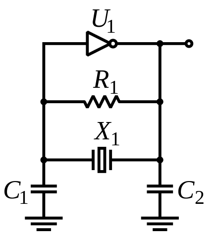
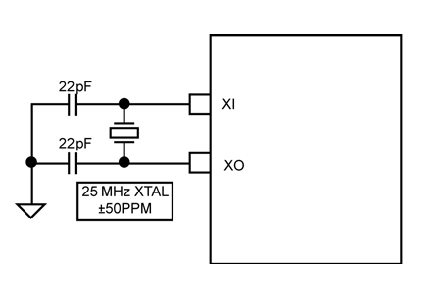

# 振荡器

振荡器（Oscillator）在电路中用于生成时钟信号。振荡器根据原理可以分为以下的类型：

1. Harmonic Oscillator：振荡器由放大器和滤波器组成，输出一个正弦时钟信号
2. Relaxation Oscillator：输出方波或者锯齿波或者三角波时钟信号

## 晶体振荡器

晶体振荡器（Crystal oscillator）简称晶振，常见于 PCB，用来给芯片提供外部的时钟信号。实际上，晶振是个被动元件，也就是它不会自动生成时钟信号，还需要芯片内部的电路进行配合。

比较常见的使用晶振产生时钟信号的电路是 [Pierce oscillator](https://en.wikipedia.org/wiki/Pierce_oscillator)：

<figure markdown>
  { width="400" }
  <figcaption>Pierce oscillator（图源<a href="https://en.wikipedia.org/wiki/File:Pierce_oscillator.svg">维基百科</a>）</figcaption>
</figure>

其中 $U_1$ 是反相器（Inverter），$X_1$ 是晶振。有时候电路还会添加上图中没有画出的额外的电阻或电容。

在嵌入式设计中，经常可以看到芯片有 XI 和 XO 引脚，连接到 PCB 上的晶振以及两个电容，实际上就对应了上图的 $X_1$、$C_1$ 和 $C_2$，而上图中的 $U_1$ 和 $R_1$ 放在芯片内部。因此在很多芯片的文档中，都可以看到类似下面的示意图：

<figure markdown>
  { width="400" }
  <figcaption>晶振与芯片的连接（图源<a href="http://ww1.microchip.com/downloads/en/devicedoc/00002117f.pdf">KSZ9031RNX Datasheet</a>）</figcaption>
</figure>

这里的晶振（$X_1$）是无源晶振，它可以认为是一个品质因数（Q factor）很高的滤波器，需要借助芯片内的振荡电路才可以产生时钟信号，无法独立工作，所以称作无源晶振。如果把 Pierce oscillator 电路和晶振组合在一个芯片里，就得到了有源晶振。很多芯片既支持无源晶振（接 XI 和 XO），又支持有源晶振（只接 XI，不接 XO）。

Pierce oscillator 输出的是正弦波，如果想要变成方波供数字电路使用，还需要再经过一个反相器。

常见的晶振材料有石英（Quartz）和陶瓷（Ceramics），一般石英精度更高。

XTAL 是 Crystal 的缩写，XO 是 Crystal Oscillator 的缩写。由于 XO 比 XTAL 多了一个振荡器，所以一般 XTAL 指的是无源晶振，也就是晶体本身，XO 指的是有源晶振。

## Voltage Controlled Oscillator

Voltage Controlled Oscillator 是压控振荡器，缩写 VCO，意思是可以由电压控制的振荡器，在锁相环中可以看到 VCO 的身影。

以 LC 振荡电路为例，其振荡频率与电感和电容大小有关，如果可以控制电容大小，就可以间接地控制振荡器的振荡频率。而 P-N 结工作在反向偏置状态的时候，其电容大小与两端的电压相关，因此可以用 P-N 结和 LC 振荡电路来实现 VCO。
