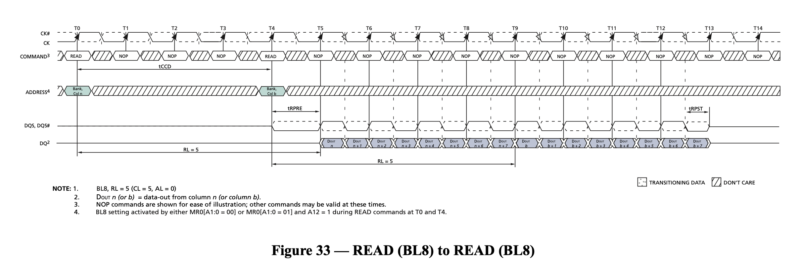

# SDRAM

## Features

SDRAM features:

1. low cost, each 1 bit cell requires only one CMOS transistor
2. complex interface, you need to activate a row before accessing data, and then read the data in the row
3. the controller is also complex and requires periodic memory refreshes
4. large capacity, because the row and column multiplexed address lines, a single memory module can achieve GB level capacity

## Standards

SDRAM-related standards are developed by JEDEC:

- [JESD79F: DDR SDRAM](https://www.jedec.org/standards-documents/docs/jesd-79f)
- [JESD79-2F: DDR2 SDRAM](https://www.jedec.org/sites/default/files/docs/JESD79-2F.pdf)
- [JESD79-3F: DDR3 SDRAM](https://www.jedec.org/sites/default/files/docs/JESD79-3F.pdf)
- [JESD79-4D: DDR4 SDRAM](https://www.jedec.org/document_search?search_api_views_fulltext=jesd79-4%20ddr4)
- [JESD79-5B: DDR5 SDRAM](https://www.jedec.org/document_search?search_api_views_fulltext=jesd79-5)

In addition to the DDR series, there is also a low-power LPDDR series:

- [JESD209B: LPDDR SDRAM](https://www.jedec.org/system/files/docs/JESD209B.pdf)
- [JESD209-2F: LPDDR2 SDRAM](https://www.jedec.org/system/files/docs/JESD209-2F.pdf)
- [JESD209-3C: LPDDR3 SDRAM](https://www.jedec.org/document_search?search_api_views_fulltext=JESD209-3)
- [JESD209-4D: LPDDR4 SDRAM](https://www.jedec.org/document_search?search_api_views_fulltext=JESD209-4)
- [JESD209-5B: LPDDR5 SDRAM](https://www.jedec.org/document_search?search_api_views_fulltext=JESD209-5)

High-performance HBM is also based on SDRAM technology:

- [JESD235D: HBM](https://www.jedec.org/standards-documents/docs/jesd235a)
- [JESD238A: HBM3](https://www.jedec.org/system/files/docs/JESD238A.pdf)

The following is an introduction to DDR series SDRAM.

## Concepts

DDR SDRAM is often given a number to represent its performance, such as 2133 in DDR4-2133, and sometimes you will see the term 2400 MT/s. Both of these say the maximum number of data transfers per second that SDRAM can perform in Million Transfer per Second. Since SDRAM uses DDR to transfer two copies of data per clock cycle, the actual clock frequency is divided by two, for example, 2133 MT/s corresponds to a clock frequency of 1066 MHz.

Sometimes you will also see PC4-21333 written to describe memory sticks, where $21333 = 8*2666$, which corresponds to 2666 MT/s, multiplied by 8 because the data bit width of DDR memory module is 64 bits, so the theoretical memory bandwidth of a 2666 MT/s memory stick is $2666 \mathrm{(MT/s)} * 64 \mathrm{(bits)} / 8 \mathrm{(bits/byte)} = 21333 \mathrm{(MB/s)}$. But there are times when PC4 is followed by MT/s.

Different generations of memory modules have different locations for the notches on the pins below, so it is impossible to insert them in the wrong place.

## Structure

Taking DDR4 SDRAM as an example, the following is the structure of the [MT40A1G8](https://www.micron.com/products/dram/ddr4-sdram/part-catalog/mt40a1g8sa-075) chip:

<figure markdown>
  { width="800" }
  <figcaption>Block diagram of MT40A1G8 (Source <a href="https://media-www.micron.com/-/media/client/global/documents/products/data-sheet/dram/ddr4/8gb_ddr4_sdram.pdf?rev=8634cc61670d40f69207f5f572a2bfdd">Micron Datasheet</a>)</figcaption>
</figure>

Each Memory array is 65536 x 128 x 64, called a Bank; four Banks form a Bank Group, and there are 4 Bank Groups, so the total capacity is $65536 * 128 * 64 * 4 * 4 = 8 \mathrm{Gb}$.

Specifically, in the 65536 x 128 x 64 specification of each Memory array, 65536 represents the number of rows, each row holds $128 * 64 = 8192$ bits of data, and is also the bit width of the transfer between `Sense amplifier` and `I/O gating, DM mask logic` in Figure 1. Each row has 1024 columns, and each column holds 8 bits of data (corresponding to the 8 in `1 Gig x 8`). Since the DDR4 prefetch width is 8n, one access will take out 8 columns of data, which is 64 bits. So each row has 128 of 64 bits, which is the source of the 128 x 64 in the 65536 x 128 x 64 above.

## Prefetch

SDRAM has the concept of Prefetch, which means how many times the bit width of the data will be fetched out in one read. For example, the `1 Gig x 8` SDRAM above has an I/O data bit width of 8 bits (see the `DQ` signal on the right). This is because the IO frequency of DDR4 SDRAM is very high, for example, 3200 MT/s corresponds to an I/O clock frequency of 1600 MHz, while the actual Memory array frequency is not as high. The actual memory array frequency is not so high, but works at 400 MHz, so in order to make up the difference in frequency, the data is read 8 times the bit width at a time. This is reflected in the I/O, which is a single read operation to get 8 copies of data, i.e. Burst Length of 8, which is transferred in four clock cycles by means of DDR.

Interestingly, DDR4 memory modules are 64 bits wide, so a single read operation yields $64 * 8 / 8 = 64B$ of data, which is exactly the size of CPU cache lines.

DDR5 increases the Prefetch to 16n, which is why you see much larger data rate numbers for DDR5: DDR4 Prefetch is 8n, DDR5 Prefetch is 16n at the same Memory array frequency, so the I/O frequency is doubled and the data rate is doubled. At the same time, in order to maintain the burst size of 64 bytes, the bit width of each channel in DDR5 module is 32 bits, each memory module provides two channels.

## Access Patterns

SDRAM has a special access pattern in that its Memory array can only be accessed in entire rows at a time. In the previous example, a row has 8192 bits of data, but a read or write operation involves only 64 bits of data, so a read operation requires:

1. the first step is to retrieve the entire row where the data is located
2. in the second step, read the desired data in the row

But each bank can only take out one row at a time, so if the two reads involve different rows, then you need to:

1. the first step is to take out the whole row where the data of the first read is located
2. in the second step, read the desired data in the row
3. step 3, put the first read row back
4. step 4, take out the whole row where the data of the second read is located
5. step 5, read the desired data in the row

In SDRAM terms, the first and fourth steps are called Activate, the second and fifth steps are called Read, and the third step is called Precharge.

SDRAM defines the following timing parameters that describe the timing requirements between these three operations:

1. CL (CAS Latency): the time between sending a read request and outputting the first data
2. RCD (ACT to internal read or write delay time): the time from Activate to the next read or write request
3. RP (RRE command period): the time between sending a Precharge command and the next command
4. RAS (ACT to PRE command period): the time between Activate and Precharge
5. RC (ACT to ACT or REF command period): the time between Activate and the next Activate or Refresh
6. RTP (Internal READ Command to PRECHARGE command delay): the time between Read and Precharge

So the above process requires the following time requirements:

1. the first step, Activate, take out the first row
2. the second step, Read, the time between the first and second steps should be separated by RCD, and the time to wait for CL from Read to send address to get data
3. step 3, Precharge, the time between step 1 and step 3 should be separated by RAS, and the time between step 2 and step 3 should be separated by RTP
4. step 4, Activate, take out the second row, the time between step 1 and step 4 should be separated by RC, and the time between step 3 and step 4 should be separated by RP
5. step 5, Read, the time between step 4 and step 5 should be separated by RCD, the time to wait for CL from Read to send address to get data

Based on this process, the following conclusions can be drawn:

1. accessing data with locality will have better performance, requiring only continuous Read, reducing the number of activates and precharges
2. constantly accessing data from different rows will lead to a back and forth Activate, Read, Precharge cycle
3. accessing the row and accessing the data in the row are divided into two phases, and both phases can use the same address signals, making the total memory capacity large
4. if the access always hits the same row, the transfer rate can be close to the theoretical one, as shown in Figure 2

<figure markdown>
  { width="800" }
  <figcaption>DDR3 Sequential Reads within the Same Row (Source <a href="https://www.jedec.org/sites/default/files/docs/JESD79-3F.pdf">JESD9-3F DDR3</a>)</figcaption>
</figure>

To alleviate the performance loss caused by the second point, the concept of Bank is introduced: each Bank can take out a row, so if you want to access the data in different Banks, while the first Bank is doing Activate/Precharge, the other Banks can do other operations, thus covering the performance loss caused by row misses.

## Bank Group

DDR4 introduces the concept of Bank Group compared to DDR3. Quoting [Is the time of page hit in the same bank group tccd_S or tccd_L?](https://www.zhihu.com/question/59944554/answer/989376138), memory array frequency is increased compared to DDR3, so a perfect sequential read cannot be achieved within the same row, i.e. two adjacent read operations need to be separated by 5 cycles, while each read transfers 4 cycles of data with a maximum utilization of 80%, see the following figure:

<figure markdown>
  { width="800" }
  <figcaption>DDR4 Nonconsecutive Reads (Source <a href="https://www.jedec.org/document_search?search_api_views_fulltext=jesd79-4%20ddr4">JESD9-4D DDR4</a>)</figcaption>
</figure>

In order to solve this bottleneck, the difference of DDR4 in the core part is that there is an additional `Global I/O gating`, and each Bank Group has its own `I/O gating, DM mask logic`, the following draws the storage part of DDR3 and DDR4 respectively, for comparison:

<figure markdown>
  { width="400",align="left" }
  <figcaption>DDR3 SDRAM Storage Part (Source <a href="https://media-www.micron.com/-/media/client/global/documents/products/data-sheet/dram/ddr3/1gb_ddr3_sdram.pdf?rev=22ebf6b7c48d45749034655015124500">Micron Datasheet</a>)</figcaption>
</figure>

<figure markdown>
  { width="400" }
  <figcaption>DDR4 SDRAM Storage Part(Source <a href="https://media-www.micron.com/-/media/client/global/documents/products/data-sheet/dram/ddr4/8gb_ddr4_sdram.pdf?rev=8634cc61670d40f69207f5f572a2bfdd">Micron Datasheet</a>)</figcaption>
</figure>

This means that DDR4 can have multiple Bank Groups reading at the same time and pipelining the output. For example, if the first Bank Group reads the data and finishes transferring it in four cycles on the I/O, immediately the second Bank Group read picks up and transfers another four cycles of data, with the following waveform:

<figure markdown>
  { width="800" }
  <figcaption>DDR4 Consecutive Reads from Different Banks (Source <a href="https://www.jedec.org/document_search?search_api_views_fulltext=jesd79-4%20ddr4">JESD9-4D DDR4</a>)</figcaption>
</figure>

In the above figure, the first read request is initiated at time T0, the second request is initiated at time T4, T11-T15 get the data of the first request, followed by T15-T19 get the data of the second request. This solves the problem caused by the increased frequency.

## Storage Hierarchy

As mentioned above, the hierarchy within DDR SDRAM, from largest to smallest, is as follows

1. Bank Group: introduced in DDR4
2. Bank: Each Bank has only one Row activated at the same time
3. Row: Activate/Precharge unit
4. Column: each Column holds n cells, n is the bit width of SDRAM
5. Cell: each cell holds 1 bit of data

In fact, there are several layers outside the SDRAM:

1. Channel: the number of channels of the processor's memory controller
2. Module: there can be multiple memory sticks connected to the same Channel
3. Rank: multiple DDR SDRAM chips are stitched together in width, one to four Ranks can be put down on a Module. these Ranks share the bus, each Rank has its own chip select signal CS_n, which is actually stitching SDRAM chips in depth
4. Chip: A DDR SDRAM chip; such as a 64-bit wide Rank, is made by using 8 x8 chips stitched together across the width

As you can see, adjacent memory levels differ by a power of two, so the mapping from the memory address to these levels is an interception of different intervals in the address, each corresponding to a subscript of the level. This is why the MB and GB units of memory size are 1024-based.

If you study SDRAM memory controllers, such as [MIG on Xilinx FPGA](https://www.xilinx.com/support/documentation/ip_documentation/ultrascale_memory_ip/v1_4/pg150-ultrascale-memory-ip.pdf), one can find that it can be configured with different address mapping methods, e.g:

- ROW_COLUMN_BANK
- ROW_BANK_COLUMN
- BANK_ROW_COLUMN
- ROW_COLUMN_LRANK_BANK
- ROW_LRANK_COLUMN_BANK
- ROW_COLUMN_BANK_INTLV

As you can imagine, different address mapping methods will have different performance for different access modes. For sequential memory accesses, the ROW_COLUMN_BANK method is more suitable, because sequential accesses are distributed to different banks, so the performance will be better.

## Interface

The following pins are drawn for DDR3 and DDR4:

<figure markdown>
  { width="600" }
  <figcaption>DDR3 and DDR4 Schematics</figcaption>
</figure>

The differences between DDR3 and DDR4:

1. address signal: DDR3 has A0-A14, DDR4 has A0-A17, where A14-A16 are multiplexed pins
2. DDR4 introduces Bank Group, so there are extra pins BA0-BA1.
3. RAS_n, CAS_n and WE_n in DDR3 are reused as A14-A16 in DDR4
4. DDR4 adds an additional ACT_n control signal

## Topology

In order to obtain a larger bit width, many SDRAM chips can be seen on the memory modules, which are stitched together by width to form a 64-bit data width. At this point, from the PCB alignment point of view, the data lines are directly connected to each SDRAM chip and can be connected relatively easily; however, other signals, such as address and control signals, need to be connected to all SDRAM chips, and it is difficult to ensure equal distances to each SDRAM chip while ensuring signal integrity in the confined space.

### Fly-by topology

Therefore, the address and control signals are actually connected in series (Fly-by-topology), which is the connection on the right in the following figure:

<figure markdown>
  { width="600" }
  <figcaption>Two types of signal connections for SDRAM (Source <a href="https://docs.xilinx.com/r/en-US/ug863-versal-pcb-design/Signals-and-Connections-for-DDR4-Interfaces">Versal ACAP PCB Design User Guide (UG863)</a>)</figcaption>
</figure>

But the data signals (DQ, DQS and DM) are still connected point-to-point to the SDRAM in parallel (left side of the figure above). This presents a problem: with different SDRAM chips, the data and clock deviations are different, and the data may arrive at about the same time, but the clock has an increasing delay:

<figure markdown>
```wavedrom
{
  signal:
    [
      { name: "clock", wave: "1010101010"},
      { name: "data", wave: "01.0..101."},
      { name: "clock_dram0", wave: "1010101010", phase: -0.2},
      { name: "data_dram0", wave: "01.0..101.", phase: -0.1},
      { name: "clock_dram1", wave: "1010101010", phase: -0.4},
      { name: "data_dram1", wave: "01.0..101.", phase: -0.1},
      { name: "clock_dram2", wave: "1010101010", phase: -0.6},
      { name: "data_dram2", wave: "01.0..101.", phase: -0.1},
      { name: "clock_dram3", wave: "1010101010", phase: -0.8},
      { name: "data_dram3", wave: "01.0..101.", phase: -0.1},
    ]
}
```
  <figcaption>SDRAM Clock Skewing Problem</figcaption>
</figure>

In order for SDRAMs at different locations to see the same waveform, a variable delay needs to be added to the data signal on the memory controller side, and this delay needs to be calibrated to know what it is.

### Clam-shell topology

In addition to Fly-by topology, Clam-shell topology may be used in some scenarios to save PCB area. Clam-shell is actually a visual representation of having SDRAM chips on both the front and back sides of the PCB:

<figure markdown>
  { width="400" }
  <figcaption>Clam-shell Topology (Source <a href="https://docs.xilinx.com/r/en-US/pg313-network-on-chip/Clamshell-Topology">Versal ACAP Programmable Network on Chip and Integrated Memory Controller LogiCORE IP Product Guide (PG313) </a>)</figcaption>
</figure>

This design makes use of the space on the back of the PCB, but it also brings new problems: intuitively, if both chips are placed on the front of the PCB, it is easier to connect them if the pin order is close to the same, and there will not be many crossings. However, if one is on the front and the other on the back, the pin order is reversed and it is more difficult to connect.

The solution is to modify the order of the pins and swap the functions of some pins to make the alignment simpler:

<figure markdown>
  { width="600" }
  <figcaption>SDRAM Pin Mirroring (Source<a href="https://docs.xilinx.com/r/en-US/ug863-versal-pcb-design/Utilizing-Address-Mirroring-to-Ease-Clamshell-Routing">Versal ACAP PCB Design User Guide (UG863)</a>)</figcaption>
</figure>

The table deliberately selects pins to swap that do not affect special functions, making most functions, even with swapped pins, work properly. For example, if the Row address is swapped by a few bits, it does not affect reading or writing data, although the physical storage place is changed. However, for Mode Register Set operations, the memory controller must swap the order of the bits itself and swap them back when connecting on the PCB to ensure the correct result on the SDRAM side.

In addition, Clam-shell Topology has one cs_n chip select signal on the front and one on the back, but this is different from Dual Rank: Dual Rank has the same number of DRAM chips on both front and back, sharing the address, data and control signals, and only one side of the DRAM chips on the bus is in use at the same time, which has the advantage of doubling the memory capacity. The advantage is that the memory capacity is doubled and the two ranks can mask each other's latency; while the two cs_n of Clam Shell Topology are designed to assign either front or back side to Mode Register Set operations, while most of the rest of the operations can work on both front and back sides at the same time because their data signals are not shared.