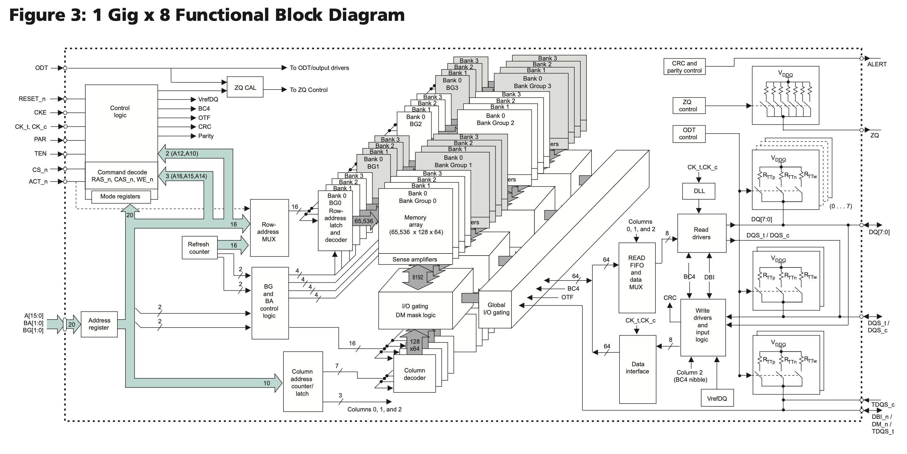

# SDRAM

## Features

SDRAM features:

1. low cost, each 1 bit cell requires only one CMOS transistor
2. complex interface, you need to activate a row before accessing data, and then read the data in the row
3. the controller is also complex and requires periodic memory refreshes
4. large capacity, because the row and column multiplexed address lines, a single memory module can achieve GB level capacity

## Standards

SDRAM-related standards are developed by JEDEC:

- [JESD79F: DDR SDRAM](https://www.jedec.org/standards-documents/docs/jesd-79f)
- [JESD79-2F: DDR2 SDRAM](https://www.jedec.org/sites/default/files/docs/JESD79-2F.pdf)
- [JESD79-3F: DDR3 SDRAM](https://www.jedec.org/sites/default/files/docs/JESD79-3F.pdf)
- [JESD79-4D: DDR4 SDRAM](https://www.jedec.org/document_search?search_api_views_fulltext=jesd79-4%20ddr4)
- [JESD79-5B: DDR5 SDRAM](https://www.jedec.org/document_search?search_api_views_fulltext=jesd79-5)

In addition to the DDR series, there is also a low-power LPDDR series:

- [JESD209B: LPDDR SDRAM](https://www.jedec.org/system/files/docs/JESD209B.pdf)
- [JESD209-2F: LPDDR2 SDRAM](https://www.jedec.org/system/files/docs/JESD209-2F.pdf)
- [JESD209-3C: LPDDR3 SDRAM](https://www.jedec.org/document_search?search_api_views_fulltext=JESD209-3)
- [JESD209-4D: LPDDR4 SDRAM](https://www.jedec.org/document_search?search_api_views_fulltext=JESD209-4)
- [JESD209-5B: LPDDR5 SDRAM](https://www.jedec.org/document_search?search_api_views_fulltext=JESD209-5)

High-performance HBM is also based on SDRAM technology:

- [JESD235D: HBM](https://www.jedec.org/standards-documents/docs/jesd235a)
- [JESD238A: HBM3](https://www.jedec.org/system/files/docs/JESD238A.pdf)

The following is an introduction to DDR series SDRAM.

## Concepts

DDR SDRAM is often given a number to represent its performance, such as 2133 in DDR4-2133, and sometimes you will see the term 2400 MT/s. Both of these say the maximum number of data transfers per second that SDRAM can perform in Million Transfer per Second. Since SDRAM uses DDR to transfer two copies of data per clock cycle, the actual clock frequency is divided by two, for example, 2133 MT/s corresponds to a clock frequency of 1066 MHz.

Sometimes you will also see PC4-21333 written to describe memory sticks, where $21333 = 8*2666$, which corresponds to 2666 MT/s, multiplied by 8 because the data bit width of DDR memory module is 64 bits, so the theoretical memory bandwidth of a 2666 MT/s memory stick is $2666 \mathrm{(MT/s)} * 64 \mathrm{(bits)} / 8 \mathrm{(bits/byte)} = 21333 \mathrm{(MB/s)}$. But there are times when PC4 is followed by MT/s.

Different generations of memory modules have different locations for the notches on the pins below, so it is impossible to insert them in the wrong place.

## Structure

Taking DDR4 SDRAM as an example, the following is the structure of the [MT40A1G8](https://www.micron.com/products/dram/ddr4-sdram/part-catalog/mt40a1g8sa-075) chip:

<figure markdown>
  { width="800" }
  <figcaption>Block diagram of MT40A1G8 (Source <a href="https://media-www.micron.com/-/media/client/global/documents/products/data-sheet/dram/ddr4/8gb_ddr4_sdram.pdf?rev=8634cc61670d40f69207f5f572a2bfdd">Micron Datasheet</a>)</figcaption>
</figure>

Each Memory array is 65536 x 128 x 64, called a Bank; four Banks form a Bank Group, and there are 4 Bank Groups, so the total capacity is $65536 * 128 * 64 * 4 * 4 = 8 \mathrm{Gb}$.

Specifically, in the 65536 x 128 x 64 specification of each Memory array, 65536 represents the number of rows, each row holds $128 * 64 = 8192$ bits of data, and is also the bit width of the transfer between `Sense amplifier` and `I/O gating, DM mask logic` in Figure 1. Each row has 1024 columns, and each column holds 8 bits of data (corresponding to the 8 in `1 Gig x 8`). Since the DDR4 prefetch width is 8n, one access will take out 8 columns of data, which is 64 bits. So each row has 128 of 64 bits, which is the source of the 128 x 64 in the 65536 x 128 x 64 above.