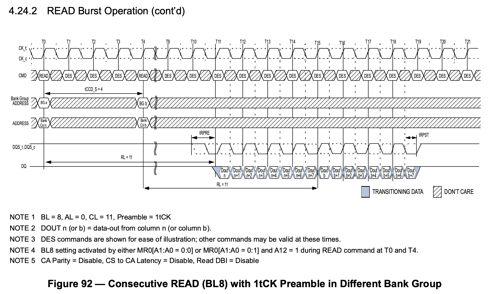

# SDRAM

## 特点

SDRAM 的特点：

1. 成本较低，每个 1 bit cell 只需要一个 CMOS 晶体管
2. 接口复杂，访问数据前需要首先激活一个 row，再读取 row 内的数据
3. 控制器也比较复杂，需要定期刷新
4. 容量较大，由于 row 和 column 复用了地址线，单内存条可以做到 GB 级别的容量

## 标准

SDRAM 相关标准由 JEDEC 制定：

- [JESD79F: DDR SDRAM](https://www.jedec.org/standards-documents/docs/jesd-79f)
- [JESD79-2F: DDR2 SDRAM](https://www.jedec.org/sites/default/files/docs/JESD79-2F.pdf)
- [JESD79-3F: DDR3 SDRAM](https://www.jedec.org/sites/default/files/docs/JESD79-3F.pdf)
- [JESD79-4D: DDR4 SDRAM](https://www.jedec.org/document_search?search_api_views_fulltext=jesd79-4%20ddr4)
- [JESD79-5B: DDR5 SDRAM](https://www.jedec.org/document_search?search_api_views_fulltext=jesd79-5)

除了 DDR 系列，还有低功耗的 LPDDR 系列：

- [JESD209B: LPDDR SDRAM](https://www.jedec.org/system/files/docs/JESD209B.pdf)
- [JESD209-2F: LPDDR2 SDRAM](https://www.jedec.org/system/files/docs/JESD209-2F.pdf)
- [JESD209-3C: LPDDR3 SDRAM](https://www.jedec.org/document_search?search_api_views_fulltext=JESD209-3)
- [JESD209-4D: LPDDR4 SDRAM](https://www.jedec.org/document_search?search_api_views_fulltext=JESD209-4)
- [JESD209-5B: LPDDR5 SDRAM](https://www.jedec.org/document_search?search_api_views_fulltext=JESD209-5)

高性能常用的 HBM 也基于 SDRAM 技术：

- [JESD235D: HBM](https://www.jedec.org/standards-documents/docs/jesd235a)
- [JESD238A: HBM3](https://www.jedec.org/system/files/docs/JESD238A.pdf)

下面主要介绍 DDR 系列的 SDRAM。

## 概念

DDR SDRAM 通常会有一个数字来代表它的性能，例如 DDR4-2133 中的 2133，有时候会见到 2400 MT/s 的说法。这两者说的都是 SDRAM 每秒最多进行的数据传输次数，单位是 Million Transfer per Second。由于 SDRAM 采用 DDR 进行传输，一个时钟周期传输两份数据，所以实际的时钟频率要除以二，例如 2133 MT/s 对应时钟频率就是 1066 MHz。

有时还会见到 PC4-21333 的写法用于描述内存条，这里的 $21333=8*2666$，对应了 2666 MT/s，乘以 8 是因为 DDR 内存条的数据位宽是 64 位，那么一个 2666 MT/s 的内存条其理论内存带宽就是 $2666 \mathrm{(MT/s)} * 64 \mathrm{(bits)} / 8 \mathrm{(bits/byte)} = 21333 \mathrm{(MB/s)}$。但也有些时候 PC4 后面跟着的就是 MT/s。

不同代次的内存条，下面引脚的缺口位置不同，所以是无法插错地方的。

## 结构

以 DDR4 SDRAM 为例，下面是 [MT40A1G8](https://www.micron.com/products/dram/ddr4-sdram/part-catalog/mt40a1g8sa-075) 芯片的结构图：

<figure markdown>
  { width="800" }
  <figcaption>MT40A1G8 的结构框图（图源 <a href="https://media-www.micron.com/-/media/client/global/documents/products/data-sheet/dram/ddr4/8gb_ddr4_sdram.pdf?rev=8634cc61670d40f69207f5f572a2bfdd">Micron Datasheet</a>）</figcaption>
</figure>

保存数据的是中间的 Memory array，每个 Memory array 的规格是 65536 x 128 x 64，称为一个 Bank；四个 Bank 组成一个 Bank Group，一共有 4 个 Bank Group，所以总容量是 $65536 * 128 * 64 * 4 * 4 = 8 \mathrm{Gb}$。

具体地，每个 Memory array 的 65536 x 128 x 64 的规格里，65536 表示 row 的数量，每个 row 保存了 $128 * 64 = 8192$ 位的数据，同时也是图 1 中 `Sense amplifier` 到 `I/O gating, DM mask logic` 之间传输的位宽。每个 row 有 1024 个 column，每个 column 保存了 8 位的数据（对应 `1 Gig x 8` 中的 8）。由于 DDR4 的 prefetch 宽度是 8n，所以一次访问会取出 8 个 column 的数据，也就是 64 位。那么每个 row 就是 128 个 64 位，这就是上面所说的 65536 x 128 x 64 的 128 x 64 的来源。

## Prefetch

SDRAM 有 Prefetch 的概念，含义就是一次读取会取出位宽的多少倍的数据出来。例如上面的 `1 Gig x 8` 的 SDRAM，其 I/O 数据位宽是 8 位（见右侧的 `DQ` 信号）。但实际上从 `Global I/O Gating` 出来的数据是 64 位，差了一个 8 的因子，这就是 DDR4 的 8n Prefetch。这是因为，DDR4 SDRAM 的 IO 频率是很高的，例如 3200 MT/s 对应的 I/O 时钟频率是 1600 MHz，而实际的 Memory array 频率做不到这么高，而是工作在 400 MHz，为了弥补频率的差距，一次读取 8 倍位宽的数据。体现在 I/O 上就是一次读操作得到 8 份数据，也就是 Burst Length 为 8，通过 DDR 方式在四个时钟周期内传输。

有趣的是，DDR4 内存条位宽是 64，那么一次读操作就得到 $64 * 8 / 8 = 64B$ 的数据，正好是很多 CPU 缓存行的大小。

DDR5 把 Prefetch 提高到了 16n，这也就是为什么看到的 DDR5 的数据速率数字大了很多：同样的 Memory array 频率下，DDR4 的 Prefetch 是 8n，DDR5 的 Prefetch 是 16n，于是 I/O 频率翻倍，数据速率也翻倍。同时为了继续保持一个 Burst 是 64 字节，DDR5 内存条每个 channel 位宽是 32 位，每个内存条提供两个 channel。

## 访问模式

SDRAM 的访问模式比较特别，它的 Memory array 每次只能以整个 row 为单位进行存取。在前面的例子中，一个 row 有 8192 位的数据，但是一次读或写操作只涉及 64 位的数据，因此一次读操作需要：

1. 第一步，先把数据所在的整个 row 取出来
2. 第二步，在 row 里读出想要的数据

但是每个 Bank 同时只能取出来一个 row，所以如果两次读涉及到了不同的 row，那么需要：

1. 第一步，先把第一次读的数据所在的整个 row 取出来
2. 第二步，在 row 里读出想要的数据
3. 第三步，把第一次读的 row 放回去
4. 第四步，把第二次读的数据所在的整个 row 取出来
5. 第五步，在 row 里读出想要的数据

用 SDRAM 的术语来讲，第一步和第四步叫做 Activate，第二部和第五步叫做 Read，第三步叫做 Precharge。

SDRAM 定义了下列的时序参数，描述了这三个操作之间的时序要求：

1. CL（CAS Latency）：发送读请求，到输出第一个数据的时间
2. RCD（ACT to internal read or write delay time）：从 Activate 到下一个读或写请求的时间
3. RP（RRE command period）：发送 Precharge 命令到下一个命令的时间
4. RAS（ACT to PRE command period）：从 Activate 到 Precharge 之间的时间
5. RC（ACT to ACT or REF command period）：从 Activate 到下一个 Activate 或者 Refresh 之间的时间
6. RTP（Internal READ Command to PRECHARGE command delay）：从 Read 到 Precharge 之间的时间

于是上面的流程需要的时间要求就是：

1. 第一步，Activate，取出第一个 row
2. 第二步，Read，第一步和第二步之间要隔 RCD 的时间，从 Read 发送地址到得到数据要等待 CL 的时间
3. 第三步，Precharge，第一步和第三步之间要隔 RAS 的时间，第二步和第三步之间要隔 RTP 的时间
4. 第四步，Activate，取出第二个 row，第一步和第四步之间要隔 RC 的时间，第三步和第四步之间要隔 RP 的时间
5. 第五步，Read，第四步和第五步之间要隔 RCD 的时间，从 Read 发送地址到得到数据要等待 CL 的时间

根据这个流程，可以得到以下的结论：

1. 访问带有局部性的数据性能会更好，只需要连续地进行 Read，减少 Activate 和 Precharge 次数
2. 不断访问不同的 row 的数据，会导致需要来回地 Activate，Read，Precharge 循环
3. 访问 row 和访问 row 中的数据分成两个阶段，两个阶段可以使用同样的地址信号，使得内存总容量很大
4. 而如果访问总是命中同一个 row，就可以获得接近理论的传输速率，如图 2

<figure markdown>
  { width="800" }
  <figcaption>DDR3 同一个 Row 内的的连续读（图源 <a href="https://www.jedec.org/sites/default/files/docs/JESD79-3F.pdf">JESD9-3F DDR3</a>）</figcaption>
</figure>

为了缓解第二点带来的性能损失，引入了 Bank 的概念：每个 Bank 都可以取出来一个 row，那么如果要访问不同 Bank 里的数据，在第一个 Bank 进行 Activate/Precharge 的时候，其他 Bank 可以进行其他操作，从而掩盖 row 未命中带来的性能损失。

## Bank Group

DDR4 相比 DDR3 引入了 Bank Group 的概念。引用 [同一 bank group page hit 的时间是 tccd_S 还是 tccd_L? - Ricky Li 的回答 - 知乎](https://www.zhihu.com/question/59944554/answer/989376138) 的观点：DDR4 的 Memory array 频率相比 DDR3 提高，因此同一个 Row 内无法实现完美的连续读取，即两个相邻的读操作需要隔 5 个周期，而每次读传输 4 个周期的数据，利用率最高 80%，见下图：

<figure markdown>
  { width="800" }
  <figcaption>DDR4 的非连续读（图源 <a href="https://www.jedec.org/document_search?search_api_views_fulltext=jesd79-4%20ddr4">JESD9-4D DDR4</a>）</figcaption>
</figure>

为了解决这个瓶颈，DDR4 在核心部分的区别就是多了一个 `Global I/O gating`，并且每个 Bank Group 都有自己的 `I/O gating, DM mask logic`，下面分别画出 DDR3 和 DDR4 的存储部分，进行对比：

<figure markdown>
  { width="400",align="left" }
  <figcaption>DDR3 SDRAM 存储部分（图源 <a href="https://media-www.micron.com/-/media/client/global/documents/products/data-sheet/dram/ddr3/1gb_ddr3_sdram.pdf?rev=22ebf6b7c48d45749034655015124500">Micron Datasheet</a>）</figcaption>
</figure>

<figure markdown>
  { width="400" }
  <figcaption>DDR4 SDRAM 存储部分（图源 <a href="https://media-www.micron.com/-/media/client/global/documents/products/data-sheet/dram/ddr4/8gb_ddr4_sdram.pdf?rev=8634cc61670d40f69207f5f572a2bfdd">Micron Datasheet</a>）</figcaption>
</figure>

这意味着 DDR4 可以多个 Bank Group 同时进行读操作，并且流水线式输出，例如第一个 Bank Group 读取了数据，在 I/O 上用四个周期传输完数据，立马第二个 Bank Group 读取的数据就接上了，又传输了四个周期的数据，波形如下图：

<figure markdown>
  { width="800" }
  <figcaption>DDR4 不同 Bank Group 的连续读（图源 <a href="https://www.jedec.org/document_search?search_api_views_fulltext=jesd79-4%20ddr4">JESD9-4D DDR4</a>）</figcaption>
</figure>

上图中 T0 时刻发起第一个读请求，T4 时刻发起第二个请求，T11-T15 得到第一个请求的数据，紧接着 T15-T19 得到第二个请求的数据。这样就解决了频率提高带来的问题。

## 存储层次

上面已经提到，在 DDR SDRAM 内部的层次从大到小有：

1. Bank Group：DDR4 引入
2. Bank：每个 Bank 同时只有一个 Row 被激活
3. Row：Activate/Precharge 的单位
4. Column：每个 Column 保存 n 个 Cell，n 是 SDRAM 的位宽
5. Cell：每个 Cell 保存 1 bit 的数据

实际上，SDRAM 外部还有一些层次：

1. Channel：处理器的内存控制器的通道数量
2. Module：内存条，可以有多个内存条连接到同一个 Channel 上
3. Rank：多个 DDR SDRAM 芯片在宽度上拼接起来，一个 Module 上可以放下一到四个 Rank，这些 Rank 共享总线，每个 Rank 都有自己的片选信号 CS_n，实际上就是在深度上拼接
4. Chip：也就是一个 DDR SDRAM 芯片，例如一个数据位宽是 64 位的 Rank，使用 8 个 x8 的 Chip 在宽度上拼接而成

可以看到，相邻存储层次之间都差一个二的幂次的倍数，因此从内存地址到这些存储层次的映射，就是截取地址中的不同区间，每个区间对应了一个层次的下标。这也就是为什么内存大小的 MB、GB 用的是 1024 进制。

## 接口

下面画出了 DDR3 和 DDR4 的引脚：

<figure markdown>
  { width="600" }
  <figcaption>DDR3 和 DDR4 原理图</figcaption>
</figure>

DDR3 和 DDR4 的不同点：

1. 地址信号：DDR3 是 A0-A14，DDR4 是 A0-A17，其中 A14-A16 复用了引脚
2. DDR4 引入了 Bank Group，所以多出了 BA0-BA1 引脚
3. DDR3 中的 RAS_n、CAS_n 和 WE_n 在 DDR4 中被复用为了 A14-A16
4. DDR4 额外添加了 ACT_n 控制信号

## 拓扑

为了获得更大的位宽，在内存条上可以看到很多个 SDRAM 芯片，通过宽度拼接的方式形成一个 64 位的数据宽度。此时从 PCB 走线的角度来讲，数据线直接连接到各个 SDRAM 芯片上，可以相对容易地连接；但是其他信号，比如地址信号和控制信号，需要连接到所有 SDRAM 芯片上，在局限的空间里，如果要保证到各个 SDRAM 芯片的距离相等，同时保证信号完整性是很困难的。

因此，实际上地址和控制信号是采用了串联的方式连接，也就是下图的右边的连接方式：

<figure markdown>
  { width="600" }
  <figcaption>SDRAM 的两种信号连接方式（图源 <a href="https://docs.xilinx.com/r/en-US/ug863-versal-pcb-design/Signals-and-Connections-for-DDR4-Interfaces">Versal ACAP PCB Design User Guide (UG863)</a>）</figcaption>
</figure>

但是数据信号（DQ、DQS 和 DM）依然是并行点对点连接到 SDRAM 上的（上图左侧）。这就出现了问题：不同的 SDRAM 芯片，数据和时钟的偏差不同，数据可能差不多时间到，但是时钟的延迟越来越大：

<figure markdown>

  <figcaption>SDRAM 的时钟偏移问题</figcaption>
</figure>

为了让处于不同位置的 SDRAM 看到同样的波形，需要在内存控制器一侧给数据信号加上可变的延迟，这个延迟需要采用下面的方法进行校准。

## 校准

SDRAM 校准，或者说 SDRAM 训练，主要有如下几个步骤：

1. Write Leveling

### Write Leveling

Write Leveling 要解决的是 Fly-by Topology 带来的延迟不一致，导致 SDRAM 看到错误的信号的问题。具体地讲，Write Leveling 的目的是让 SDRAM 芯片接受到的 DQS 信号与 CK 信号同步：

<figure markdown>

  <figcaption>Write Leveling 所要达到的 DQS 与 CK 同步的效果</figcaption>
</figure>

## 相关阅读

- [DDR4 Bank Groups in Embedded Applications](https://www.synopsys.com/designware-ip/technical-bulletin/ddr4-bank-groups.html)
- [DDR4 Tutorial - Understanding the Basics](https://www.systemverilog.io/design/ddr4-basics/)
- [DDR5/4/3/2: How Memory Density and Speed Increased with each Generation of DDR](https://blogs.synopsys.com/vip-central/2019/02/27/ddr5-4-3-2-how-memory-density-and-speed-increased-with-each-generation-of-ddr/)
- [DDR5 vs DDR4 DRAM – All the Advantages & Design Challenges](https://www.rambus.com/blogs/get-ready-for-ddr5-dimm-chipsets/)
