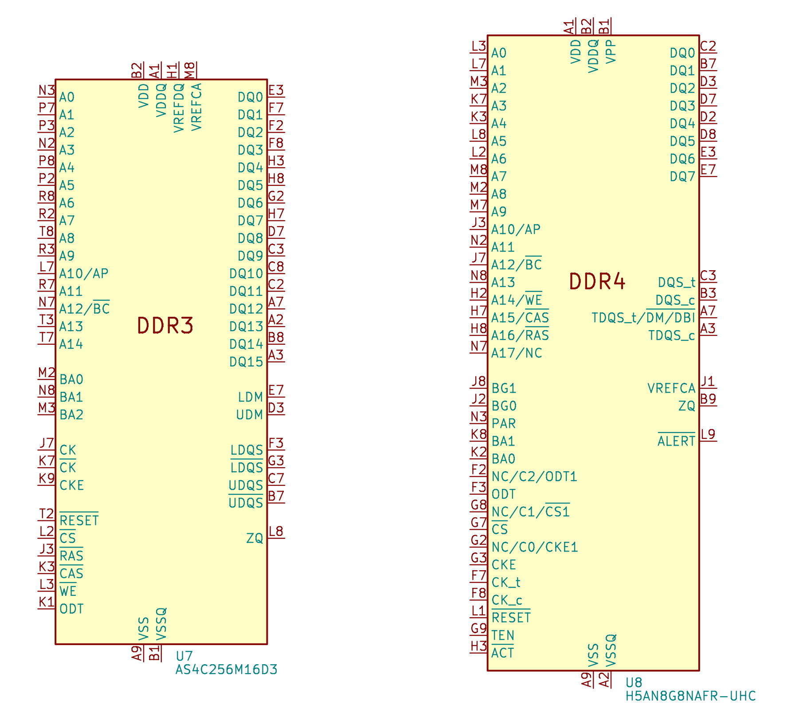
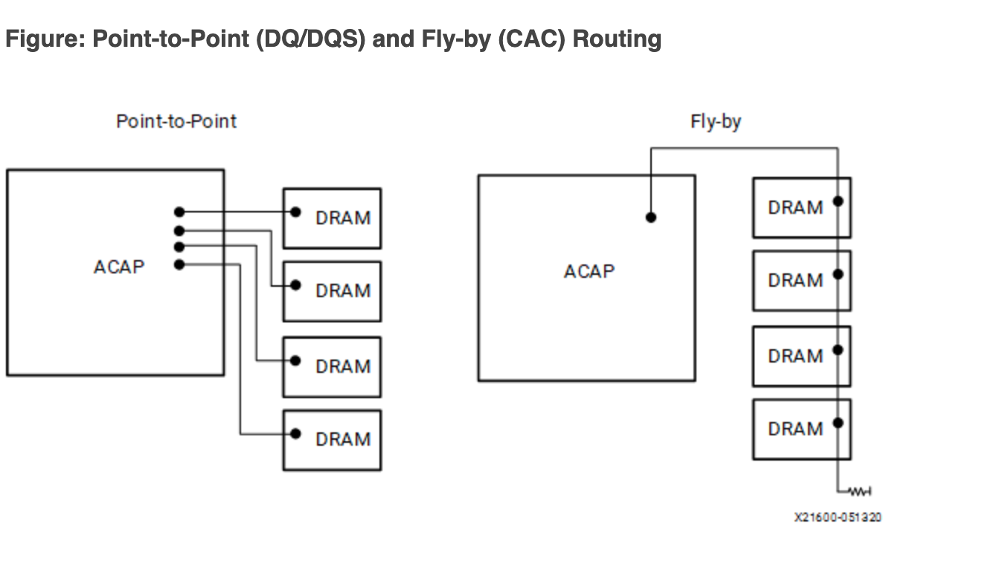
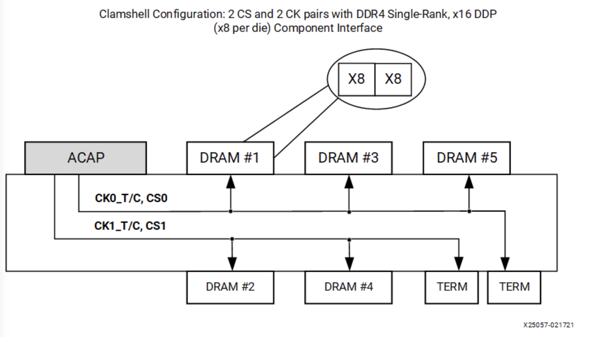
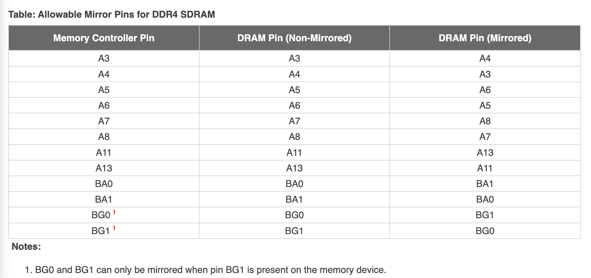

# SDRAM (Synchronous Dynamic Random Access Memory)

## 特点

SDRAM 的特点：

1. 成本较低，每个 1 bit cell 只需要一个 CMOS 晶体管
2. 接口复杂，访问数据前需要首先激活一个 row，再读取 row 内的数据
3. 控制器也比较复杂，需要定期刷新内存
4. 容量较大，由于 row 和 column 复用了地址线，单内存条可以做到 GB 级别的容量

## 标准

SDRAM 相关标准由 JEDEC 制定：

- [JESD79F: DDR SDRAM](https://www.jedec.org/standards-documents/docs/jesd-79f)
- [JESD79-2F: DDR2 SDRAM](https://www.jedec.org/sites/default/files/docs/JESD79-2F.pdf)
- [JESD79-3F: DDR3 SDRAM](https://www.jedec.org/sites/default/files/docs/JESD79-3F.pdf)
- [JESD79-4D: DDR4 SDRAM](https://www.jedec.org/document_search?search_api_views_fulltext=jesd79-4%20ddr4)
- [JESD79-5B: DDR5 SDRAM](https://www.jedec.org/document_search?search_api_views_fulltext=jesd79-5)

除了 DDR 系列，还有低功耗的 LPDDR 系列：

- [JESD209B: LPDDR SDRAM](https://www.jedec.org/system/files/docs/JESD209B.pdf)
- [JESD209-2F: LPDDR2 SDRAM](https://www.jedec.org/system/files/docs/JESD209-2F.pdf)
- [JESD209-3C: LPDDR3 SDRAM](https://www.jedec.org/document_search?search_api_views_fulltext=JESD209-3)
- [JESD209-4D: LPDDR4 SDRAM](https://www.jedec.org/document_search?search_api_views_fulltext=JESD209-4)
- [JESD209-5B: LPDDR5 SDRAM](https://www.jedec.org/document_search?search_api_views_fulltext=JESD209-5)

高性能常用的 HBM 也基于 SDRAM 技术：

- [JESD235D: HBM](https://www.jedec.org/standards-documents/docs/jesd235a)
- [JESD238A: HBM3](https://www.jedec.org/system/files/docs/JESD238A.pdf)

还有 GDDR SGRAM 系列：

- [SDRAM3.11.5.8 R16.01: GDDR4 SGRAM](https://www.jedec.org/system/files/docs/3_11_5_8_R16.01.pdf)
- [JESD212C.01: GDDR5 SGRAM](https://www.jedec.org/system/files/docs/JESD212C.01.pdf)
- [JESD232A.01: GDDR5X SGRAM](https://www.jedec.org/system/files/docs/JESD232A.01.pdf)
- [JESD250D: GDDR6 SGRAM](https://www.jedec.org/system/files/docs/JESD250D.pdf)

下面主要介绍 DDR 系列的 SDRAM。

## 概念

DDR SDRAM 通常会有一个数字来代表它的性能，例如 DDR4-2133 中的 2133，有时候会见到 2400 MT/s 的说法。这两者说的都是 SDRAM 每秒最多进行的数据传输次数，单位是 Million Transfers per Second。由于 SDRAM 采用 DDR 进行传输，一个时钟周期传输两份数据，所以实际的时钟频率要除以二，例如 2133 MT/s 对应时钟频率就是 1066 MHz。

有时还会见到 PC4-21333 的写法用于描述内存条，这里的 $21333=8*2666$，对应了 2666 MT/s，乘以 8 是因为 DDR 内存条的数据位宽是 64 位，那么一个 2666 MT/s 的内存条其理论内存带宽就是 $2666 \mathrm{(MT/s)} * 64 \mathrm{(bits)} / 8 \mathrm{(bits/byte)} = 21333 \mathrm{(MB/s)}$。但也有些时候 PC4 后面跟着的就是 MT/s。

不同代次的内存条，下面引脚的缺口位置不同，所以是无法插错地方的。

## 结构

以 DDR4 SDRAM 为例，下面是 [MT40A1G8](https://www.micron.com/products/dram/ddr4-sdram/part-catalog/mt40a1g8sa-075) 芯片的结构图：

<figure markdown>
  { width="800" }
  <figcaption>MT40A1G8 的结构框图（图源 <a href="https://media-www.micron.com/-/media/client/global/documents/products/data-sheet/dram/ddr4/8gb_ddr4_sdram.pdf?rev=8634cc61670d40f69207f5f572a2bfdd">Micron Datasheet</a>）</figcaption>
</figure>

保存数据的是中间的 Memory array，每个 Memory array 的规格是 65536 x 128 x 64，称为一个 Bank；四个 Bank 组成一个 Bank Group，一共有 4 个 Bank Group，所以总容量是 $65536 * 128 * 64 * 4 * 4 = 8 \mathrm{Gb}$。

具体地，每个 Memory array 的 65536 x 128 x 64 的规格里，65536 表示 row 的数量，每个 row 保存了 $128 * 64 = 8192$ 位的数据，同时也是图 1 中 `Sense amplifier` 到 `I/O gating, DM mask logic` 之间传输的位宽。每个 row 有 1024 个 column，每个 column 保存了 8 位的数据（对应 `1 Gig x 8` 中的 8）。由于 DDR4 的 prefetch 宽度是 8n，所以一次访问会取出 8 个 column 的数据，也就是 64 位。那么每个 row 就是 128 个 64 位数据，这就是上面所说的 65536 x 128 x 64 的 128 x 64 的来源。

每个 row 有 1024 个 column，所以 column 地址就有 10 位。但实际上，因为 Burst Length 是 8，所以实际上高 7 位（对应 `128 x 64` 的 128）会选择出 8 个 column，低 3 位决定了这些 column 的传输顺序，这是为了方便缓存 refill 的优化，把要读取的部分先取出来：

<figure markdown>
  { width="800" }
  <figcaption>DDR4 Bust 类型和 Column 次序（图源 <a href="https://www.jedec.org/document_search?search_api_views_fulltext=jesd79-4%20ddr4">JESD9-4D DDR4</a>）</figcaption>
</figure>

## Prefetch

SDRAM 有 Prefetch 的概念，含义就是一次读取会取出位宽的多少倍的数据出来。例如上面的 `1 Gig x 8` 的 SDRAM，其 I/O 数据位宽是 8 位（见右侧的 `DQ` 信号）。但实际上从 `Global I/O Gating` 出来的数据是 64 位，差了一个 8 的因子，这就是 DDR4 的 8n Prefetch。这是因为，DDR4 SDRAM 的 IO 频率是很高的，例如 3200 MT/s 对应的 I/O 时钟频率是 1600 MHz，而实际的 Memory array 频率做不到这么高，而是工作在 400 MHz，为了弥补频率的差距，一次读取 8 倍位宽的数据。体现在 I/O 上就是一次读操作得到 8 份数据，也就是 Burst Length 为 8，通过 DDR 方式在四个时钟周期内传输。

有趣的是，DDR4 内存条位宽是 64，那么一次读操作就得到 $64 * 8 / 8 = 64B$ 的数据，正好是很多 CPU 缓存行的大小。

DDR5 把 Prefetch 提高到了 16n，这也就是为什么看到的 DDR5 的数据速率数字大了很多：同样的 Memory array 频率下，DDR4 的 Prefetch 是 8n，DDR5 的 Prefetch 是 16n，于是 I/O 频率翻倍，数据速率也翻倍。同时为了继续保持一个 Burst 是 64 字节，DDR5 内存条每个 channel 位宽是 32 位，每个内存条提供两个 channel。

## 访问模式

SDRAM 的访问模式比较特别，它的 Memory array 每次只能以整个 row 为单位进行存取。在前面的例子（`1 Gig x 8`）中，一个 row 有 8192 位的数据，但是一次读或写操作只涉及 64 位的数据，因此一次读操作需要：

1. 第一步，先把数据所在的整个 row 取出来
2. 第二步，在 row 里读出想要的数据

但是每个 Bank 同时只能取出来一个 row，所以如果两次读涉及到了不同的 row，那么需要：

1. 第一步，先把第一次读的数据所在的整个 row 取出来
2. 第二步，在 row 里读出想要的数据
3. 第三步，把第一次读的 row 放回去
4. 第四步，把第二次读的数据所在的整个 row 取出来
5. 第五步，在 row 里读出想要的数据

用 SDRAM 的术语来讲，第一步和第四步叫做 Activate，第二部和第五步叫做 Read，第三步叫做 Precharge。

SDRAM 定义了下列的时序参数，描述了这三个操作之间的时序要求：

1. CL（CAS Latency）：发送读请求，到输出第一个数据的时间
2. RCD（ACT to internal read or write delay time）：从 Activate 到下一个读或写请求的时间
3. RP（RRE command period）：发送 Precharge 命令到下一个命令的时间
4. RAS（ACT to PRE command period）：从 Activate 到 Precharge 之间的时间
5. RC（ACT to ACT or REF command period）：从 Activate 到下一个 Activate 或者 Refresh 之间的时间
6. RTP（Internal READ Command to PRECHARGE command delay）：从 Read 到 Precharge 之间的时间

于是上面的流程需要的时间要求就是：

1. 第一步，Activate，取出第一个 row
2. 第二步，Read，第一步和第二步之间要隔 RCD 的时间，从 Read 发送地址到得到数据要等待 CL 的时间
3. 第三步，Precharge，第一步和第三步之间要隔 RAS 的时间，第二步和第三步之间要隔 RTP 的时间
4. 第四步，Activate，取出第二个 row，第一步和第四步之间要隔 RC 的时间，第三步和第四步之间要隔 RP 的时间
5. 第五步，Read，第四步和第五步之间要隔 RCD 的时间，从 Read 发送地址到得到数据要等待 CL 的时间

根据这个流程，可以得到以下的结论：

1. 访问带有局部性的数据性能会更好，只需要连续地进行 Read，减少 Activate 和 Precharge 次数
2. 不断访问不同的 row 的数据，会导致需要来回地 Activate，Read，Precharge 循环
3. 访问 row 和访问 row 中的数据分成两个阶段，两个阶段可以使用同样的地址信号，使得内存总容量很大
4. 而如果访问总是命中同一个 row，就不需要 Activate 和 Prechage，可以持续 Read，获得接近理论的传输速率，如图：

<figure markdown>
  { width="800" }
  <figcaption>DDR3 同一个 Row 内的的连续读（图源 <a href="https://www.jedec.org/sites/default/files/docs/JESD79-3F.pdf">JESD9-3F DDR3</a>）</figcaption>
</figure>

为了缓解第二点带来的性能损失，引入了 Bank 的概念：每个 Bank 都可以取出来一个 row，那么如果要访问不同 Bank 里的数据，在第一个 Bank 进行 Activate/Precharge 的时候，其他 Bank 可以进行其他操作，从而掩盖 row 未命中带来的性能损失。

## Bank Group

DDR4 相比 DDR3 引入了 Bank Group 的概念。引用 [同一 bank group page hit 的时间是 tccd_S 还是 tccd_L? - Ricky Li 的回答 - 知乎](https://www.zhihu.com/question/59944554/answer/989376138) 和 [DDR4 为何会引入 tCCD_L 和 tCCD_S](https://blog.csdn.net/hemlok/article/details/133275312) 的观点：DDR4 的 Memory array 频率相比 DDR3 提高，因此在 `I/O Gating` 上，即使命中了 Row，即使用了多个属于同一个 `I/O Gating` 的 Bank，也无法实现完美的连续读取，即两个相邻的读操作需要隔 5 个周期，而每次读传输 4 个周期的数据，利用率最高 80%，见下图：

<figure markdown>
  { width="800" }
  <figcaption>DDR4 的非连续读（图源 <a href="https://www.jedec.org/document_search?search_api_views_fulltext=jesd79-4%20ddr4">JESD9-4D DDR4</a>）</figcaption>
</figure>

为了解决这个瓶颈，DDR4 在核心部分的区别就是多了一个 `Global I/O gating`，并且每个 Bank Group 都有自己的 `I/O gating, DM mask logic`，下面分别画出 DDR3 和 DDR4 的存储部分，进行对比：

<figure markdown>
  { width="400",align="left" }
  <figcaption>DDR3 SDRAM 存储部分（图源 <a href="https://media-www.micron.com/-/media/client/global/documents/products/data-sheet/dram/ddr3/1gb_ddr3_sdram.pdf?rev=22ebf6b7c48d45749034655015124500">Micron Datasheet</a>）</figcaption>
</figure>

<figure markdown>
  { width="400" }
  <figcaption>DDR4 SDRAM 512 Meg x 16 存储部分（图源 <a href="https://media-www.micron.com/-/media/client/global/documents/products/data-sheet/dram/ddr4/8gb_ddr4_sdram.pdf?rev=8634cc61670d40f69207f5f572a2bfdd">Micron Datasheet</a>）</figcaption>
</figure>

每个 Bank Group 有自己的 `I/O Gating` 以后，DDR4 下可以多个 Bank Group 同时进行读操作，并且流水线式输出，例如第一个 Bank Group 读取了数据，在 I/O 上用四个周期传输完数据，立马第二个 Bank Group 读取的数据就接上了，又传输了四个周期的数据，波形如下图：

<figure markdown>
  { width="800" }
  <figcaption>DDR4 不同 Bank Group 的连续读（图源 <a href="https://www.jedec.org/document_search?search_api_views_fulltext=jesd79-4%20ddr4">JESD9-4D DDR4</a>）</figcaption>
</figure>

上图中 T0 时刻发起第一个读请求，T4 时刻发起第二个请求，T11-T15 得到第一个请求的数据，紧接着 T15-T19 得到第二个请求的数据。这样就解决了频率提高带来的问题。

## 存储层次

上面已经提到，在 DDR SDRAM 内部的层次从大到小有：

1. Bank Group：DDR4 引入，通过 Bank Group 掩盖 DDR4 同一个 Bank Group 内连续读的延迟 tCCD_L
2. Bank：每个 Bank 同时只有一个 Row 被激活，通过多个 Bank 掩盖 Activate/Precharge 的延迟
3. Row：Activate/Precharge 的单位
4. Column：每个 Column 保存 n 个 Cell，n 是 SDRAM 的位宽
5. Cell：每个 Cell 保存 1 bit 的数据

实际上，SDRAM 外部还有一些层次：

1. Channel：处理器的内存控制器的通道数量
2. Module：内存条，可以有多个内存条连接到同一个 Channel 上
3. Rank：多个 DDR SDRAM 芯片在宽度上拼接起来，一个 Module 上可以放下一到四个 Rank，这些 Rank 共享总线，每个 Rank 都有自己的片选信号 CS_n，实际上就是在深度上拼接 SDRAM 芯片
4. Chip：也就是一个 DDR SDRAM 芯片，例如一个数据位宽是 64 位的 Rank，是使用 8 个 x8 的 Chip 在宽度上拼接而成

可以看到，相邻存储层次之间都差一个二的幂次的倍数，因此从内存地址到这些存储层次的映射，就是截取地址中的不同区间，每个区间对应了一个层次的下标。这也就是为什么内存大小的 MB、GB 用的是 1024 进制。

如果研究 SDRAM 内存控制器，比如 [Xilinx FPGA 上的 MIG](https://www.xilinx.com/support/documentation/ip_documentation/ultrascale_memory_ip/v1_4/pg150-ultrascale-memory-ip.pdf)，可以发现它可以配置不同的地址映射方式，例如：

- ROW_COLUMN_BANK
- ROW_BANK_COLUMN
- BANK_ROW_COLUMN
- ROW_COLUMN_LRANK_BANK
- ROW_LRANK_COLUMN_BANK
- ROW_COLUMN_BANK_INTLV

就是将地址的不同部分映射到 DRAM 的几个地址：Row，Column，Bank。可以想象，不同的地址映射方式针对不同的访存模式会有不同的性能。对于连续的内存访问，ROW_COLUMN_BANK 方式是比较适合的，因为连续的访问会分布到不同的 Bank 上，这样可以比较好地掩盖 Activate/Precharge 延迟，性能就会更好。

## 时序参数

下面列出 DDR4 的主要时序参数：

- tCCD_S: 对不同 Bank Group 进行 CAS 时，CAS 到 CAS 的延迟（CAS to CAS delay short），如 4 周期
- tCCD_L: 对相同 Bank Group 进行 CAS 时，CAS 到 CAS 的延迟（CAS to CAS delay long），如 6 周期
- tRRD_S: 对不同 Bank Group 进行 ACTIVATE 时，ACT 到 ACT 的延迟（ACT to ACT delay short），如 4 周期
- tRRD_L: 对相同 Bank Group 进行 ACTIVATE 时，ACT 到 ACT 的延迟（ACT to ACT delay long），如 6 周期
- tWTR_S：对不同 Bank Group 先 WRITE 后 READ 时，WRITE 完成写入（最后一个数据写入完成）到 READ 的延迟（Write to Read short）
- tWTR_L：对相同 Bank Group 先 WRITE 后 READ 时，WRITE 完成写入（最后一个数据写入完成）到 READ 的延迟（Write to Read long）
- tREFI：内存控制器需要按照 tREFI 的间隔发送 REFRESH 命令（Refresh Interval）
- tRFC：两次 REFRESH 命令的最小间隔（Refresh Cycle）
- tFAW: 在连续的 FAW 时间内，最多发送四个 ACTIVATE 命令（Four Activate Window），换句话说，第 i 次 ACTIVATE 和第 i+4 次 ACTIVATE 至少间隔 tFAW 时间
- tRP：PRECHARGE 命令发送以后，到对同一个 Bank 的下一个命令的延迟（Precharge）
- tRTP：对同一个 Bank 的 READ 到 PRE 的最小间隔（Read to Precharge）
- tRAS：对同一个 Bank 的 ACT 到 PRE 的最小间隔（RAS active time，Activate to Precharge）
- tRCD：对同一个 Bank 的 ACT 到 READ/WRITE 的最小间隔（Activate to Read/Write delay）
- tRC：对同一个 Bank 的 ACT 到 ACT/PRE 的最小间隔（Activate to Activate/Precharge delay）
- CL：CAS Latency，用于计算 Read Latency
- CWL：CAS Write Latency，用于计算 Write Latency
- AL：Additive Latency，用于计算 Read Latency
- RL：Read Latency
- WL：Write Latency

Additive Latency 看似人为增加了命令的延迟，但实际上，内存控制器也会提前 AL 个周期去发送命令。例如，设置 AL 以后，可以连续发送 ACT 和 READ 命令，通过 AL 使得 READ 命令延迟生效，以满足 tRCD 时序要求，同时命令总线上空闲了出来。

## 接口

下面画出了 DDR3 和 DDR4 的引脚：

<figure markdown>
  { width="600" }
  <figcaption>DDR3 和 DDR4 原理图</figcaption>
</figure>

DDR3 和 DDR4 的不同点：

1. 地址信号：DDR3 是 A0-A14，DDR4 是 A0-A17，其中 A14-A16 复用了引脚
2. DDR4 引入了 Bank Group，所以多出了 BG0-BG1 引脚作为 Bank Group 地址
3. DDR4 引入了 Bank Group 后，总 Bank 数量是 $4*4=16$；DDR3 的 Bank 数量是 8
4. DDR3 中的 RAS_n、CAS_n 和 WE_n 在 DDR4 中被复用为了 A14-A16，目的是更大的容量
5. DDR4 额外添加了 ACT_n 控制信号

## 拓扑

为了获得更大的位宽，在内存条上可以看到很多个 SDRAM 芯片，通过宽度拼接的方式形成一个 64 位的数据宽度。此时从 PCB 走线的角度来讲，数据线直接连接到各个 SDRAM 芯片上，可以相对容易地连接；但是其他信号，比如地址信号和控制信号，需要连接到所有 SDRAM 芯片上，在局限的空间里，如果要保证到各个 SDRAM 芯片的距离相等，同时保证信号完整性是很困难的。

### Fly-by topology

因此，实际上地址和控制信号是采用了串联的方式连接（Fly-by topology），也就是下图的右边的连接方式：

<figure markdown>
  { width="600" }
  <figcaption>SDRAM 的两种信号连接方式（图源 <a href="https://docs.xilinx.com/r/en-US/ug863-versal-pcb-design/Signals-and-Connections-for-DDR4-Interfaces">Versal ACAP PCB Design User Guide (UG863)</a>）</figcaption>
</figure>

但是数据信号（DQ、DQS 和 DM）依然是并行点对点连接到 SDRAM 上的（上图左侧）。这就出现了问题：不同的 SDRAM 芯片，数据和时钟的偏差不同，数据可能差不多时间到，但是时钟的延迟越来越大：

<figure markdown>
```wavedrom
{
  signal:
    [
      { name: "clock", wave: "1010101010"},
      { name: "data", wave: "01.0..101."},
      { name: "clock_dram0", wave: "1010101010", phase: -0.2},
      { name: "data_dram0", wave: "01.0..101.", phase: -0.1},
      { name: "clock_dram1", wave: "1010101010", phase: -0.4},
      { name: "data_dram1", wave: "01.0..101.", phase: -0.1},
      { name: "clock_dram2", wave: "1010101010", phase: -0.6},
      { name: "data_dram2", wave: "01.0..101.", phase: -0.1},
      { name: "clock_dram3", wave: "1010101010", phase: -0.8},
      { name: "data_dram3", wave: "01.0..101.", phase: -0.1},
    ]
}
```
  <figcaption>SDRAM 的时钟偏移问题</figcaption>
</figure>

为了让处于不同位置的 SDRAM 看到同样的波形，需要在内存控制器一侧给数据信号加上可变的延迟，这个延迟需要经过校准，才能知道是多少。

### Clam-shell topology

除了 Fly-by topology，在一些场景下，为了节省 PCB 面积，还可能会使用 Clam-shell topology。Clam-shell 是贝壳的意思，贝壳有上下两个部分合在一起，所以其实 Clam-shell topology 就是形象地表示在 PCB 的正面和背面都有 SDRAM 芯片的情形：

<figure markdown>
  { width="400" }
  <figcaption>Clam-shell Topology（图源<a href="https://docs.xilinx.com/r/en-US/pg313-network-on-chip/Clamshell-Topology">Versal ACAP Programmable Network on Chip and Integrated Memory Controller LogiCORE IP Product Guide (PG313) </a>）</figcaption>
</figure>

这种设计利用了 PCB 背面的空间，但是同时也带来了新的问题：直观地讲，如果两个芯片都放在 PCB 的正面，要连线的话，保证引脚顺序接近一致，就可以比较容易地连接，不会有很多交叉的地方。但如果一个在正面，另一个在背面，引脚的顺序就倒转过来了，连线的时候就比较困难。

解决的办法是，修改引脚的顺序，把一些引脚的功能进行对调，使得走线更加简单：

<figure markdown>
  { width="600" }
  <figcaption>SDRAM 引脚镜像（图源<a href="https://docs.xilinx.com/r/en-US/ug863-versal-pcb-design/Utilizing-Address-Mirroring-to-Ease-Clamshell-Routing">Versal ACAP PCB Design User Guide (UG863)</a>）</figcaption>
</figure>

表格中特意挑选了一些不影响特殊功能的引脚来交换，使得大部分功能，即使交换了引脚，也可以正常工作。例如 Row 地址交换了几个位，虽然物理上保存的地方变了，但是不影响读写数据。但是，对于 Mode Register Set 操作，必须要内存控制器自行交换位的顺序，在 PCB 上连接时再交换回来，才能保证在 SDRAM 一侧得到正确的结果。

此外，Clam-shell Topology 的正面和背面各有一个 cs_n 片选信号，但是这和 Dual Rank 不同：Dual Rank 是正面和背面都有同样数量的 DRAM 芯片，共享地址信号、数据信号和控制信号，总线上同一时间只有一侧的 DRAM 芯片在使用，好处是内存容量翻倍，并且两个 rank 可以互相掩盖延迟；而 Clam Shell Topology 的两个 cs_n 是为了给 Mode Register Set 操作指定正面或背面，而其余的大部分操作，可以正面和背面同时工作，因为它们的数据信号并没有共享。

## 校准

SDRAM 校准，或者说 SDRAM 训练，主要有如下几个步骤：

1. Write Leveling
2. Read Leveling

### Write Leveling

Write Leveling 要解决的是 Fly-by Topology 带来的延迟不一致，导致 SDRAM 看到错误的信号的问题。具体地讲，Write Leveling 的目的是让 SDRAM 芯片接受到的 DQS 信号与 CK 信号同步：

<figure markdown>
```wavedrom
{
  signal:
    [
      { name: "ck", wave: "1010101010"},
      { name: "dqs", wave: "0.101010.."},
      { name: "ck_dram0", wave: "1010101010", phase: -0.2},
      { name: "dqs_dram0", wave: "0.101010..", phase: -0.2},
      { name: "ck_dram1", wave: "1010101010", phase: -0.4},
      { name: "dqs_dram1", wave: "0.101010..", phase: -0.4},
      { name: "ck_dram2", wave: "1010101010", phase: -0.6},
      { name: "dqs_dram2", wave: "0.101010..", phase: -0.6},
      { name: "ck_dram3", wave: "1010101010", phase: -0.8},
      { name: "dqs_dram3", wave: "0.101010..", phase: -0.8},
    ]
}
```
  <figcaption>Write Leveling 所要达到的 DQS 与 CK 同步的效果</figcaption>
</figure>

为了达到这个目的，思路就是不断调整 DQS 输出的延迟，观测不同延迟下的行为，找到一个 DQS 与 CK 同步的延迟值。为了配合内存控制器做 Write Leveling，SDRAM 可以进入一个 Write Leveling Mode，在这个状态下，SDRAM 会在 DQS 的上升沿对 CK 进行采样，然后把结果输出到 DQ 上。此时，不同的 DQS 延迟就会带来不同的结果：

<figure markdown>
```wavedrom
{
  signal:
    [
      { name: "ck", wave: "1010101010"},
      { name: "dqs", wave: "10........"},
      { name: "ck_dram", wave: "1010101010", phase: -0.2},
      { name: "dqs_delay0", wave: "010.......", phase: -0.4},
      { name: "dq_delay0", wave: "0.........", phase: -0.4},
      { name: "dqs_delay1", wave: "010.......", phase: -0.9},
      { name: "dq_delay1", wave: "0.........", phase: -0.9},
      { name: "dqs_delay2", wave: "010.......", phase: -1.4},
      { name: "dq_delay2", wave: "01........", phase: -1.4},
      { name: "dqs_delay3", wave: "010.......", phase: -2.0},
      { name: "dq_delay3", wave: "01........", phase: -2.0},
    ]
}
```
  <figcaption>不同的 DQS 延迟下，DQS 对 CK 采样的结果</figcaption>
</figure>

上图中 delay0 和 delay1 两种情况下，DQS 采样到了 CK 的负半周期，而 delay2 和 delay3 时 DQS 采样到了 CK 的正半周期，所以如果想要让 DQS 和 CK 同步，应该把 DQS 延迟设置在 delay1 和 delay2 之间。

总结一下 Write Leveling 的算法：

1. 设置 SDRAM 进入 Write Leveling 模式，此时 SDRAM 会使用 DQS 对 CK 采用，把结果输出到 DQ
2. 控制器枚举 DQS 的延迟，读取出每个 DQS 延迟下的 DQ 结果，得到一个 0-1 串，例如：`001111111111111111110000`，即随着延迟增大，先采样到 0，再采样到 1，最后又采样到 0
3. 找到一个 DQS 延迟，使得 DQ 出现一个从 0 到 1 的变化，那么按照这个延迟输出，DQS 就会与 CK 同步
4. 设置 SDRAM 结束 Write Leveling 模式

这个过程要对每个 DQS 信号分别进行。下面以 [litex 的 SDRAM 校准代码](https://github.com/enjoy-digital/litex/blob/b367c27191511f36b10ec4103198978f86f9502c/litex/soc/software/liblitedram/sdram.c#L589)为例，用 C 代码实现简化的流程：

```c title="int sdram_write_leveling_scan(int *delays, int loops, int show)" linenums="1"
/* 打开 SDRAM 的 Write Leveling 模式 */
sdram_write_leveling_on();

/* 循环每个 SDRAM 内存条 */
for(i=0;i<SDRAM_PHY_MODULES;i++) {
  /* 循环每个 DQS 信号 */
  for (dq_line = 0; dq_line < DQ_COUNT; dq_line++) {
    /* 设置 DQS 初始延迟为 0 */
    sdram_leveling_action(i, dq_line, write_rst_delay);

    /* 循环 DQS 延迟 */
    for(j=0;j<err_ddrphy_wdly;j++) {
      int zero_count = 0;
      int one_count = 0;

      /* 多次采样 */
      for (k=0; k<loops; k++) {
        /* 发送 DQS 序列：00000001 */
        /* SDRAM 对 CK 进行采样 */
        ddrphy_wlevel_strobe_write(1);

        cdelay(100);
        /* 从内存控制器中读出 DQ 上的数据 */
        csr_rd_buf_uint8(sdram_dfii_pix_rddata_addr(0), buf, DFII_PIX_DATA_BYTES);

        /* 统计 1 和 0 的个数 */
        if (buf[SDRAM_PHY_MODULES-1-i] != 0)
          one_count++;
        else
          zero_count++;
      }
      if (one_count > zero_count)
        /* 认为 DQS 采样到了 CK 的正半周期 */
        taps_scan[j] = 1;
      else
        /* 认为 DQS 采样到了 CK 的负半周期 */
        taps_scan[j] = 0;

      /* 每次循环增加一次 DQS 延迟 */
      sdram_leveling_action(i, dq_line, write_inc_delay);
    }

    /* 找到一个最长的连续 1 的序列 */
    one_window_active = 0;
    one_window_start = 0;
    one_window_count = 0;
    one_window_best_start = 0;
    one_window_best_count = -1;
    for(j=0;j<err_ddrphy_wdly+1;j++) {
      if (one_window_active) {
        if ((j == err_ddrphy_wdly) || (taps_scan[j] == 0)) {
          /* 结束了一段连续的 1 */
          one_window_active = 0;
          one_window_count = j - one_window_start;
          /* 记录最长的连续 1 的长度和位置 */
          if (one_window_count > one_window_best_count) {
            one_window_best_start = one_window_start;
            one_window_best_count = one_window_count;
          }
        }
      } else {
        /* 找到连续的 1 的开头 */
        if (j != err_ddrphy_wdly && taps_scan[j]) {
          one_window_active = 1;
          one_window_start = j;
        }
      }
    }

    /* 要找的延迟就是连续的 1 序列的开始位置 */
    delays[i] = one_window_best_start;
  }
}

/* 关闭 SDRAM 的 Write Leveling 模式 */
sdram_write_leveling_off();
```

### Read Leveling

在 Write Leveling 阶段，解决了 SDRAM 处信号的同步问题。但是对于读操作，数据是从 SDRAM 发送给控制器，不同的数据到达控制器的时间可能也不同，因此也需要对读操作进行校准。

为了判断读取的数据是否正确，做法是首先写入已知的数据，然后再读出来，如果读取的数据和写入的数据完全一致，就说明可以正确地进行读操作。

实现思路和 Write Leveling 类似，也是枚举延迟，进行一些操作，观察每个延迟下的输出：

1. 写入数据（或者用 SDRAM 的生成固定 Pattern 输出的功能）
2. 设置延迟从 0 开始循环，不断增大
3. 在每个延迟的设定下，读取出数据，把读取的结果与之前写入的数据进行比较
4. 统计出哪些延迟条件下，读取数据是准确的，准确的记为 1，不准确的记为 0
5. 找到表示准确的 1 的范围，取中点作为最终的校准结果

注意这里不再是找到 0-1 的变化的地方，Write Leveling 找 0-1 变化是为了同步，同步的地方正是 0-1 变化的地方；而 Read Leveling 的目的是要读取出正确的数据，已知有一段连续的延迟区间，区间内都可以读出正确的数据，那么取其中点，即使因为温度等条件变化，区间出现移动，因为保留了足够的余量，所以依然可以工作。取中点这一步也称为 Read Centering。

## HBM

HBM 全称是 High Bandwidth Memory，也就是高带宽内存，其技术也是基于 SDRAM，因此放在这里和 DDR SDRAM 进行对比。

HBM 相比前面的 DDR SDRAM，它堆叠了多个 SDRAM，提供多个 channel 并且提高了位宽。例如 [Micron HBM with ECC](https://media-www.micron.com/-/media/client/global/documents/products/data-sheet/dram/hbm2e/8gb_and_16gb_hbm2e_dram.pdf)，堆叠了 4/8 层 DRAM，提供了 8 个 channel，每个 channel 的数据宽度是 128 位，以 3200 MT/s 计算，一个 HBM 芯片的数据传输速率最大是：

$$
3200 \mathrm{(MT/s)} * 128 \mathrm{(bits/transfer)} * 8 \mathrm{(Channels)} = 3276.8 \mathrm{(Gb/s)} = 409.6 \mathrm{(GB/s)}
$$

所以一片 HBM 的传输速率就相当于 16 个传统的 DDR SDRAM，靠的是 8 个 Channel 以及双倍的位宽。每个 Channel 的位宽是 128 位，实际上可以认为是把两片 64-bit SDRAM 并起来了，可以当成一个 128 位的用，也可以在 Pseudo Channel 模式下，当成共享地址和命令信号的两个 SDRAM 用。

当然了，HBM 的高带宽的代价就是引脚数量很多。根据 [HBM3 JESD238A 标准](https://www.jedec.org/system/files/docs/JESD238A.pdf)，每个 Channel 要 120 个 pin，一共 16 个 channel（HBM2 是 8 channel，每个 channel 128 位；HBM3 是 16 channel，每个 channel 64 位），加上其余的 52 个 pin，这些加起来就 1972 个 pin 了。所以一般在 Silicon Interposer 上与处理器连接，而不是传统的在 PCB 上走线：

<figure markdown>
  { width="800" }
  <figcaption>HBM 的封装形式（图源 <a href="https://picture.iczhiku.com/resource/ieee/WYifSuFTZuHLFcMV.pdf">A 1.2V 20nm 307GB/s HBM DRAM with At-Speed Wafer-Level I/O Test Scheme and Adaptive Refresh Considering Temperature Distribution</a>）</figcaption>
</figure>

所以在 HBM3 标准里，用 Microbump 来描述 HBM 的 pin。可以形象地理解为，把原来插在主板上的内存条拆开，只保留芯片，把芯片竖直堆叠起来，变成一个 HBM Die，然后紧密地连接到 CPU 中。但是另一方面，密度上去了，价格也更贵了。同时扩展性也下降了，不能像 DDR SDRAM 那样在主板上插很多条。

下面来分析一些典型的带有 HBM 的系统的内存带宽：

Xilinx 的 Virtex Ultrascale Plus HBM FPGA 提供了 $1800 \mathrm{(MT/s)} * 128 \mathrm{(bits/transfer)} * 8 \mathrm{(Channels)} = 230.4 \mathrm{(GB/s)}$ 的带宽，如果用了两片 HBM 就是 460.8 GB/s。暴露给 FPGA 逻辑的是 16 个 256 位的 AXI3 端口，AXI 频率 450 MHz，内存频率 900 MHz。可以看到，每个 AXI3 就对应了一个 HBM 的 pseudo channel。每个 pseudo channel 是 64 位，但是 AXI 端口是 256 位，这是因为在速率不变的情况下，从 450MHz 到 900MHz，再加上 DDR，等价于频率翻了四倍，所以位宽也要相应地从 64 位翻四倍到 256 位。

A100 显卡 40GB PCIe 版本采用了 5 个 8 GB 的 HBM 内存，运行在 1215 MHz 的频率下，那么内存带宽就是 $1215 \mathrm{(MHz)} * 2 \mathrm{(DDR)} * 8 \mathrm{(channels)} * 128 \mathrm{(bits/transfer)} / 8 \mathrm{(bits/byte)} * 5 \mathrm{(HBM)} = 1555 \mathrm{(GB/s)}$，与 Datasheet 吻合。A100 Datasheet 中的 Memory bus width 的计算方式其实就是把所有的 Channel 位宽加起来：$128 \mathrm{(bits/transfer)} * 8 \mathrm{(channels)} * 5 \mathrm{(stacks)} = 5120 \mathrm{(bits)}$。

A100 显卡 80GB PCIe 版本把 HBM2 升级到了 HBM2e，同时内存时钟频率也升级到了 1512 MHz，此时内存带宽就是 $1512 \mathrm{(MHz)} * 2 \mathrm{(DDR)} * 8 \mathrm{(channels)} * 128 \mathrm{(bits/transfer)} / 8 \mathrm{(bits/byte)} * 5 \mathrm{(HBM)} = 1935 \mathrm{(GB/s)}$，与 Datasheet 吻合。

H100 显卡 80GB SXM5 版本把 HBM 升级到了 HBM3，内存容量依然是 80GB，但是时钟频率提高到了 2619 MHz，此时，内存带宽是 $2619 \mathrm{(MHz)} * 2 \mathrm{(DDR)} * 8 \mathrm{(channels)} * 128 \mathrm{(bits/transfer)} / 8 \mathrm{(bits/byte)} * 5 \mathrm{(HBM)} = 3352 \mathrm{(GB/s)}$。

## DRAM Cell

DRAM 的数据存储在电容中。典型的 1T DRAM Cell 内部构造如下：

<figure markdown>
  { width="400" }
  <figcaption>1T DRAM Cell 内部构造（图源 <a href="https://inst.eecs.berkeley.edu/~eecs151/sp19/files/lec16-ram.pdf">Berkeley EECS 151/251A Spring 2019</a>）</figcaption>
</figure>

## 几种 DDR 的对比

下面给出 DDR，LPDDR，GDDR 和 HBM 的对比：

|              | DDR4      | DDR5      | LPDDR4    | LPDDR5    | GDDR5   | GDDR6   | HBM2     |
| ------------ | --------- | --------- | --------- | --------- | ------- | ------- | -------- |
| Channel 数量   | 1         | 2         | 2         | 2         | 2       | 2       | 8        |
| 每 Channel 位宽 | 64        | 32        | 16        | 16/32     | 16      | 16      | 128      |
| 数据速率（MT/s）   | 3200      | 5600      | 4266      | 6400      | 9000    | 24000   | 2400     |
| 总带宽（GB/s）    | 25.6 GB/s | 44.8 GB/s | 17.1 GB/s | 25.6 GB/s | 36 GB/s | 96 GB/s | 307 GB/s |

数据速率按照能查到的型号的最高性能：

- DDR4: [Micron 3200 MT/s](https://www.micron.com/-/media/client/global/documents/products/data-sheet/dram/ddr4/8gb_ddr4_sdram.pdf)
- DDR5: [Micron 5600 MT/s](https://media-www.micron.com/-/media/client/global/documents/products/part-numbering-guide/micron_ddr5_part_catalog.pdf?la=en&rev=a4865faa98834095b94db57e7bd394e1)
- LPDDR4: [Samsung 4266 MT/s](https://semiconductor.samsung.com/dram/lpddr/lpddr4/)
- LPDDR5: [Samsung 6400 MT/s](https://semiconductor.samsung.com/dram/lpddr/lpddr5/)
- GDDR5: [Samsung 9000 MT/s](https://semiconductor.samsung.com/dram/gddr/gddr5/)
- GDDR6: [Samsung 24000 MT/s](https://semiconductor.samsung.com/dram/gddr/gddr6/)
- HBM2: [Samsung 2400 MT/s](https://semiconductor.samsung.com/dram/hbm/hbm2-aquabolt/)
- HBM2E: [Micron 3200 MT/s](https://media-www.micron.com/-/media/client/global/documents/products/data-sheet/dram/hbm2e/8gb_and_16gb_hbm2e_dram.pdf)

## UDIMM/RDIMM/LRDIMM

具体到 DIMM，又有不同的类型：

- UDIMM(Unbuffered DIMM): 没有额外的寄存器打拍
- RDIMM(Registered DIMM): 对地址、命令和时钟信号加寄存器打拍，数据信号不加寄存器
- LRDIMM(Load Reduced DIMM): 在 RDIMM 的基础上，给数据信号也加上寄存器

随着寄存器的增加，延迟增加，但是也能达到更高的频率，更大的容量。

## 相关阅读

- [DDR4 Bank Groups in Embedded Applications](https://www.synopsys.com/designware-ip/technical-bulletin/ddr4-bank-groups.html)
- [DDR4 Tutorial - Understanding the Basics](https://www.systemverilog.io/design/ddr4-basics/)
- [DDR5/4/3/2: How Memory Density and Speed Increased with each Generation of DDR](https://blogs.synopsys.com/vip-central/2019/02/27/ddr5-4-3-2-how-memory-density-and-speed-increased-with-each-generation-of-ddr/)
- [DDR5 vs DDR4 DRAM – All the Advantages & Design Challenges](https://www.rambus.com/blogs/get-ready-for-ddr5-dimm-chipsets/)
- [Understanding DDR3 Write Leveling and Read Leveling](https://daffy1108.wordpress.com/2010/09/02/understanding-ddr3-write-leveling-and-read-leveling/)
- [Will HBM replace DDR and become Computer Memory?](https://www.utmel.com/blog/categories/memory%20chip/will-hbm-replace-ddr-and-become-computer-memory)
