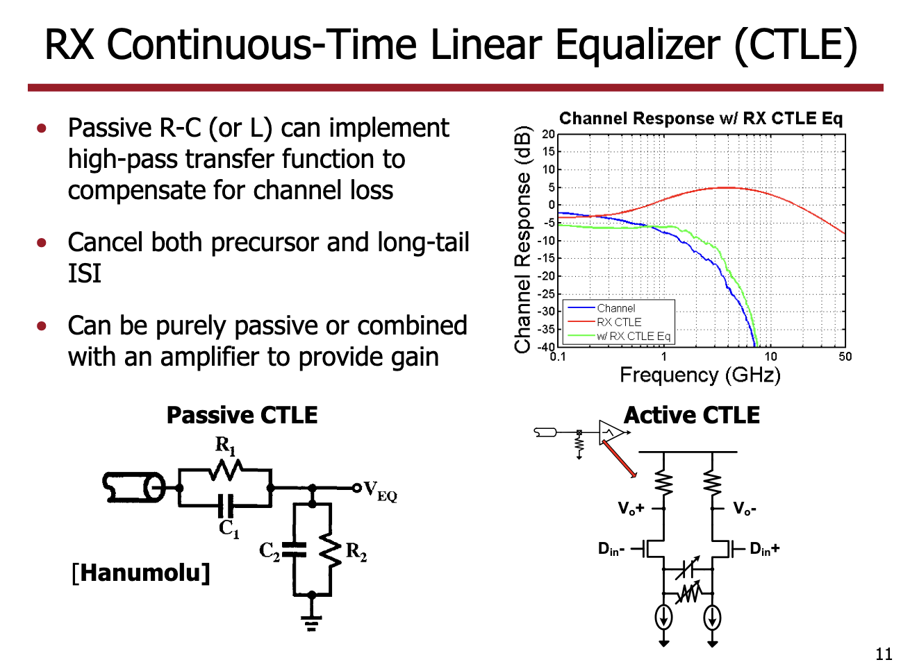
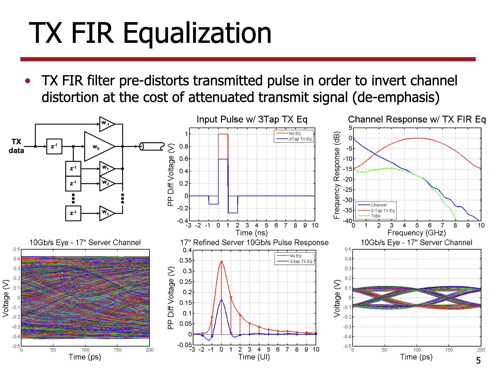
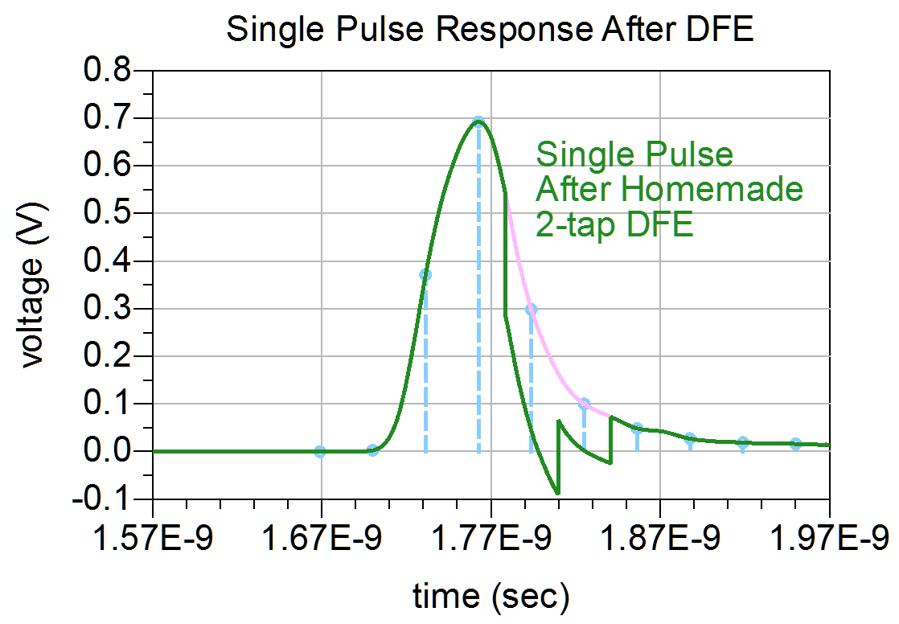
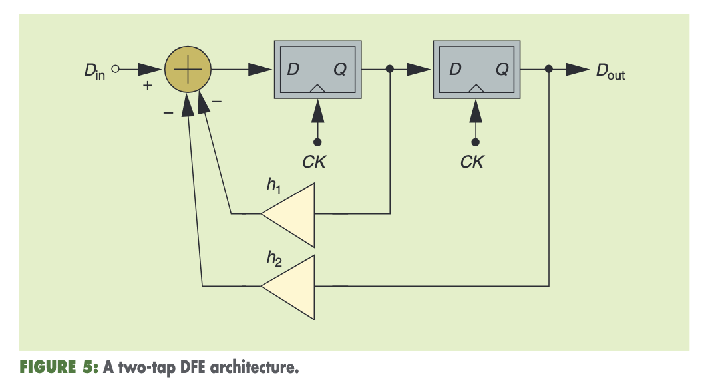

# 信号处理

## 预加重 Pre-Emphasis

信号在介质中传播时，不同频率的分量的衰减比例不同，例如高频分量衰减较多，低频分量衰减较少。为了信号的正常传输，接近高频分量衰减更多的问题，在发送端添加一些额外的高频分量。

## 均衡 Equalization

均衡的意思是，让介质对不同频率分量的衰减均衡。

### CTLE Continuous-Time Linear Equalization

在频域模拟信号上工作，高通滤波器，可以由 RLC 电路实现，线性。

<figure markdown>
  { width="400" }
  <figcaption>CTLE（图源 <a href="RX FIR & CTLE Equalization">https://people.engr.tamu.edu/spalermo/ecen689/lecture18_ee689_rx_fir_ctle_eq.pdf</a>）</figcaption>
</figure>

### FFE Feed-Forward Equalization

在时域数字信号上工作，等价于一个 Finite Impulse Response (FIR)，相当于把一个方波分解成几个小的方波，线性。

<figure markdown>
  { width="400" }
  <figcaption>FFE（图源 <a href="RX FIR & CTLE Equalization">https://people.engr.tamu.edu/spalermo/ecen689/lecture18_ee689_rx_fir_ctle_eq.pdf</a>）</figcaption>
</figure>

### DFE Decision-Feedback Equalization

在时域数字信号上工作，从信号解析出是当前传输的是什么符号后，根据该符号生成信号，来抵消该符号对后续符号的干扰，非线性（因为从信号判断符号是非线性的）。

假如先传输符号 A，再传输符号 B，那么 A 会给 B 带来干扰。在接收到 B 的时候，已经知道 A 是什么了。为了能够正确地接收 B，首先计算出 A 对 B 的干扰，去掉这个干扰，再判断 B 是什么。更进一步，每个符号可能对后续的多个符号带来干扰，那么可以用类似的方法来去掉前若干个符号对当前符号的干扰。

<figure markdown>
  { width="400" }
  <figcaption>DFE（图源 <a href="Post 8: Eye-opening Experience with DFE">https://docs.keysight.com/eesofapps/post-8-eye-opening-experience-with-dfe-678068404.html</a>）</figcaption>
</figure>

<figure markdown>
  { width="400" }
  <figcaption>DFE（图源 <a href="The Decision-Feedback Equalizer">http://www.seas.ucla.edu/brweb/papers/Journals/BRFall17DFE.pdf</a>）</figcaption>
</figure>

## 参考

- [预加重、去加重和均衡](https://zhuanlan.zhihu.com/p/491686683)
- [Emphasis (telecommunications)](https://en.wikipedia.org/wiki/Emphasis_(telecommunications))
- [Transmitter Pre-Emphasis and Receiver Equalization](https://www.intel.com/content/www/us/en/docs/programmable/683073/current/transmitter-pre-emphasis-and-receiver.html)
- [Post 6: Eye-opening Experience with CTLE](https://docs.keysight.com/eesofapps/post-6-eye-opening-experience-with-ctle-678068358.html)
- [Post 7: Eye-opening Experience with FFE](https://docs.keysight.com/eesofapps/post-7-eye-opening-experience-with-ffe-678068383.html)
- [Post 8: Eye-opening Experience with DFE](https://docs.keysight.com/eesofapps/post-8-eye-opening-experience-with-dfe-678068404.html)
- [RX FIR & CTLE Equalization](https://people.engr.tamu.edu/spalermo/ecen689/lecture18_ee689_rx_fir_ctle_eq.pdf)
- [ECEN 689 High-Speed Links Circuits and Systems Lab5 Equalization Circuits](https://people.engr.tamu.edu/spalermo/ecen689/ECEN689_lab5.pdf)
- [The Decision-Feedback Equalizer](http://www.seas.ucla.edu/brweb/papers/Journals/BRFall17DFE.pdf)
