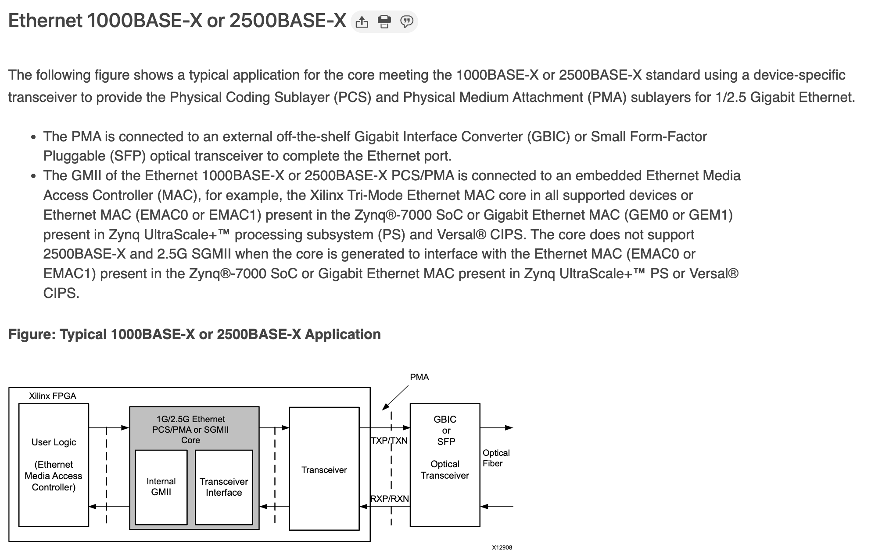

# 以太网

## 标准

以太网的标准是 IEEE 802.3，在标准中，为了表示不同的协议，经常可以看到类似 100BASE-TX 这种写法，它表示的意思是：

1. BASE 前面的数字表示速率，比如 10，100，1000，10G 等等
2. BASE 之后的第一个字母，常见的 T 表示双绞线，S 表示 850nm 光纤，L 表示 1310nm 光纤，C 表示同轴电缆
3. 之后可能还有别的字母，比如 X 表示 8b/10b 或者 4b/5b（FE）的编码，R 表示 64b/66b 的编码
4. 之后可能还有别的数字，如果是 LAN PHY 表示的是所使用的 lane 数量；如果是 WAN PHY 表示的是传输的公里数

详见 [Wikipedia - Ethernet Physical Layer # Naming Conventions](https://en.wikipedia.org/wiki/Ethernet_physical_layer#Naming_conventions) 和 IEEE 802.3 1.2.3 节 Physical Layer and media notation：

    The data rate, if only a number, is in Mb/s, and if suffixed by a “G”, is in
    Gb/s. The modulation type (e.g., BASE) indicates how encoded data is
    transmitted on the medium. The additional distinction may identify
    characteristics of transmission or medium and, in some cases, the type of
    PCS encoding used (examples of additional distinctions are “T” for twisted
    pair, “B” for bidirectional optics, and “X” for a block PCS coding used for
    that speed of operation). Expansions for defined Physical Layer types are
    included in 1.4.

和 IEEE 802.3 1.4 节 Definitions 中的几个例子：

- 100BASE-T: IEEE 802.3 Physical Layer specification for a 100 Mb/s CSMA/CD local area network. (See IEEE Std 802.3, Clause 22 and Clause 28.)
- 100BASE-TX: IEEE 802.3 Physical Layer specification for a 100 Mb/s CSMA/CD local area network over two pairs of Category 5 twisted-pair cabling. (See IEEE Std 802.3, Clause 24 and Clause 25.)
- 1000BASE-T: IEEE 802.3 Physical Layer specification for a 1000 Mb/s CSMA/CD LAN using four pairs of Category 5 balanced copper cabling. (See IEEE Std 802.3, Clause 40.)
- 1000BASE-X: IEEE 802.3 Physical Layer specification for a 1000 Mb/s CSMA/CD LAN that uses a Physical Layer derived from ANSI X3.230-1994 (FC-PH) [B21]23. (See IEEE Std 802.3, Clause 36.)
- 2.5GBASE-T: IEEE 802.3 Physical Layer specification for a 2.5 Gb/s LAN using four pairs of Category 5e/Class D balanced copper cabling. (See IEEE Std 802.3, Clause 126.)
- 5GBASE-T: IEEE 802.3 Physical Layer specification for a 5 Gb/s LAN using four pairs of Category 5e/Class D balanced copper cabling. (See IEEE Std 802.3, Clause 126.)
- 10GBASE-T: IEEE 802.3 Physical Layer specification for a 10 Gb/s LAN using four pairs of Class E or Class F balanced copper cabling. (See IEEE Std 802.3, Clause 55.)

## MII

[MII](https://en.wikipedia.org/wiki/Media-independent_interface) 接口是 MAC 和 PHY 之间的接口。有时候，还会伴随着 MDIO 接口，来进行控制信息的传输。它又分不同的类型：

- Standard MII：速率是 100Mbps（25MHz\*4）或者 10Mbps（2.5Mhz\*4），TX 7 根线（4 DATA+CLK+EN+ER），RX 7+2 根线（4 DATA+CLK+DV+ER+CRS+COL），加上 MDIO 2 根线共 18 根线
- RMII：速率是 100Mbps 或者 10Mbps，频率都是 50MHz，一共 10 根线（4 DATA+CLK+TX_EN+CRS_DV+RX_ER+MDIO+MDC），数据线是 TX 和 RX 各 2 根
- GMII：速率是 1000Mbps（125MHz\*8），数据线是 TX 和 RX 各 8 根；也支持速率 100Mbps（25MHz）和 10Mbps（2.5MHz）
- RGMII：速率是 1000Mbps（125MHz\*4\*2，DDR），数据线是 TX 和 RX 各 4 根；也支持速率 100Mbps（25MHz\*4）和 10Mbps（2.5MHz\*4），一共是 5+5+2 根线
- SGMII：速率是 1000Mbps（625MHz\*2\*8/10），采用 625MHz DDR 差分对 SerDes，采用 8b/10b 的编码
- XGMII：支持 2500Mbps/5000Mbps/10000Mbps（156.25 MHz\*32\*2，DDR）速率，数据线是 TX 和 RX 各 32 根

有的时候，MAC 和 PHY 是独立的，比如很多常见的 FPGA 开发板，在使用千兆网的时候，在板子上是 PHY 芯片，从 FPGA 到 PHY 通过 RGMII 连接，然后 PHY 再连接到 8P8C（RJ45）的连接器上。一般还会把 MDIO 也接到 FPGA 上面。如果有多个 PHY，就会吧 MDIO 通过总线的方式合并起来，给每个 PHY 配置不同的地址（一般是在指定的 PIN 上设置上拉/下拉电阻实现），就可以保证不冲突的访问。

扩展阅读：[KXZ9031RNX Datasheet](https://ww1.microchip.com/downloads/en/DeviceDoc/00002117F.pdf)

### SGMII

MII 接口中比较比较常见的是 GMII/RGMII/SGMII。其中比较特殊的是 [SGMII](https://archive.org/details/sgmii/mode/2up)，首先可以发现它信号很少，只有两对差分线 TX_P TX_N RX_P RX_N，其中时钟是可选的，因为可以从数据中恢复。你可能感到很奇怪，那么其他的信号，比如 DV/ER/CRS 等都去哪里了呢？其实是因为，SGMII 采用了 [8b/10b](https://zh.wikipedia.org/wiki/8b/10b) 的编码的同时，把这些控制信号通过一定的方式顺便编码进去了。具体来说，就是从 8 位的数据信号编码为 10 位的时候，有一些特殊的 10 位符号是没有对应 8 位的数据的，因此可以用这些特殊符号来表示一些信号，比如用 SPD（Start_of_Packet Delimiter，对应 /S/）和 EPD（End_of_Packet Delimiter，对应 /T/R/ 等）表示传输数据的开始和结尾，对应 TX_EN/RX_DV 信号；用 Error_Propagation（/V/）表示错误，对应 RX_ER 信号等等。所以，SGMII 其实还是一个 GMII 的变种，只不过采用 SerDes 的方式减少了引脚，MAC 内部或者 PHY 内部也是经过一个 GMII-SGMII 的转换，而其余部分是一样的。

关于 8b/10b 的编码方式，可以阅读 IEEE 802.3 标准中的 `Table 36–1a—Valid data code-groups`，里面提到了两类的 Code Group：D 打头的，表示数据，有 256 种，从 8b 映射到 10b 的表达方式，并且为了保持直流平衡，有一种到两种表示方法。此外还有 12 个特殊的 Code Group：K 打头，它们的 10b 表达方式不会和数据冲突。表 `Table 36–3—Defined ordered sets` 中定义了 K 打头的 Code Group 含义：

- /C/ Configuration:
  - /C1/ Configuration 1: /K28.5/D21.5/Config_Reg
  - /C2/ Configuration 2: /K28.5/D2.2/Config_Reg
- /I/ IDLE:
  - /I1/ IDLE 1: /K28.5/D5.6/
  - /I2/ IDLE 2: /K28.5/D16.2/
- Encapsulation:
  - /R/ Carrier_Extend: /K23.7/
  - /S/ Start_of_Packet: /K27.7/
  - /T/ End_of_Packet: /K29.7/
  - /V/ Error_Propagation: /K30.7/
- /LI/ LPI (Low Power Idle):
  - /LI1/ LPI 1: /K28.5/D6.5/
  - /LI2/ LPI 2: /K28.5/D26.4/

IEEE 802.3 Figure 36-4 中给了一个例子，就是在发送一段数据的时候，首先是 /I/，然后 /S/，接着一系列的 /D/，最后结束的时候 /T/R/I/。

此外，/C/ 可以用来传输控制信息，例如 SGMII 定义的 16 位的 Config Reg，定义如下：

1. Bit0: 恒为 1，与 1000BASE-X 进行区分
2. Bit11, 10: 协商速率，00 表示 10Mbps，01 表示 100Mbps，11 表示 1000Mbps
3. Bit15:1 表示 Link up，0 表示 Link down

这样就实现了速率的自动协商，同时 PHY 也可以通知 MAC 目前的链路状态。

扩展阅读：

- [Serial Gigabit Media Independent Interface](https://www.intel.com/content/www/us/en/programmable/solutions/technology/transceiver/protocols/pro-sgmii.html)
- [1G/2.5G Ethernet PCS/PMA or SGMII v16.0](https://www.xilinx.com/support/documentation/ip_documentation/gig_ethernet_pcs_pma/v16_0/pg047-gig-eth-pcs-pma.pdf)
- [https://en.wikipedia.org/wiki/Physical_coding_sublayer](https://en.wikipedia.org/wiki/Physical_coding_sublayer)

### 1000BASE-X 与 SFP 的关系

1000BASE-X 在 802.3 Clause 36 中定义，它的分层是这样的：

<figure markdown>
  { width="500" }
  <figcaption>1000 BASE-X 的分层（图源 802.3 Clause 36）</figcation>
</figure>

它支持三种不同的介质，对应了三个 PMD 层，也就是 LX、SX 和 CX。这些体现在设备上，其实就是不同的 SFP 模块。SFP 模块实际上就是图中的 PMD 层，SFP 接口上连接的是 1000BASE-X 的 PCS/PMA，这也就是为什么说在带有 SFP 的 FPGA 上，Xilinx 的 IP 叫做 1G/2.5G Ethernet PCS/PMA。在这里，PCS 和 PMA 层在 FPGA 内部通过 IP 实现，通过 PCB 连接到 SFP 上，光模块就是 PMD 层。见下图：

<figure markdown>
  { width="500" }
  <figcaption>Xilinx PCS/PMA IP（图源 Xilinx PCS/PMA IP Datasheet）</figcation>
</figure>

左边通过 GMII 连接到内部的 MAC，右边连接到 SFP 上，通过光模块，连接到光纤。这里光模块只需要负责光电转换。另一种比较常见的形式，就是 MAC 在 FPGA 内部，PHY（包括 PCS/PMA/PMD）都在 FPGA 外部，此时 FPGA IO 上就是各种 MII。

那么 SFP 电口模块是怎么工作的呢？电口采用的是 1000BASE-T 标准，但是光口采用的又是上面三种 1000BASE-X 标准。实际上，它里面有一个 PHY 芯片，发送的时候，首先解码 1000BASE-X 变回原始数据，再按照 1000BASE-T 的方式编码再发出去；接收的时候，按照 1000BASE-T 进行解码，再重新编码为 1000BASE-X 发送给 PMA 层。

还有一类电口模块，与上面不同的地方在于，SFP 上走的是 SGMII，而不是 1000BASE-X。这两种模式没有太大的区别，都是两对差分线，一收一发，所以很多时候二者是同时支持，可以切换的。例如 [Cisco Compatible 10/100/1000BASE-T SFP SGMII Copper RJ-45 100m Industrial Transceiver Module (LOS)](https://www.fs.com/products/177936.html?attribute=44906&id=1109184) 就是在 SFP 上走 SGMII 协议。

SGMII 与 1000BASE-X 虽然所处的位置不同，但是从实现来看，只有 tx_conf_reg 的定义不同，可以根据其最低位进行区分，所以可以动态地判断出是 SGMII 协议还是 1000BASE-X。

推荐阅读 [Designing a Copper SFP using the VSC8221 10/100/1000BASE-T PHY](https://ww1.microchip.com/downloads/en/Appnotes/VPPD-01080.pdf)，它里面讲了如何将 VSC8221 芯片用于电口模块：VSC8221 芯片一头是 1000BASEX（又称 802.3z SerDes，802.3z 就是 1000BASE-X）或者 SGMII，另一头是 1000BASE-T MDI。

## 物理接口

### 常见的连接器

连接器（connector）一般来说指的就是线缆和网络设备之间的物理接口了。常见的有：

- [8P8C](https://en.wikipedia.org/wiki/Modular_connector#8P8C)：一般我们会称之为 RJ45，关于它们俩的关系，可以看 Wikipedia 上面的说明，不过在日常生活中，这两个混用其实也没有什么大问题
- [LC](https://en.wikipedia.org/wiki/Optical_fiber_connector#LC)：一种光纤的接口，有两个突出来的插到 SFP 光模块中的突起，比较常见
- [SFP+ DAC](https://en.wikipedia.org/wiki/Twinaxial_cabling#SFP+_Direct-Attach_Copper_(10GSFP+Cu))：一般是 DAC（Direct Attatched Cable）线，线的两端直接就是 SFP+ 的接口，直接插到 SFP+ 笼子中，不需要光模块；更高速率的也有 DAC 线

对于光纤的接口，注意购买的时候要和光模块对应，不然可能插不进去。常见的有 LC-LC，SC-LC，SC-SC 等等，表示线的两端分别是什么接口。

MDI 在以太网的分层里，其实就是 PHY 与 PHY 之间的媒介，对于使用铜制双绞线的标准，MDI 其实就是 RJ45 里面 8 根线对应的信号。在十兆和百兆的时候，需要区分 MDI 和 MDI-X，在同种类型的端口之间用交叉线，在不同类型的端口之间用直通线。在后来，有了 Auto MDI-X，也就是会按照实际情况自动检测并且匹配。从千兆开始，设备都支持 Auto MDI-X 了，所以线本身是交叉还是直通就无所谓了。

### SFP 的种类

[SFP](https://en.wikipedia.org/wiki/Small_form-factor_pluggable_transceiver) 是很常见的，特别是在高速的网络之中。而它又分为几种，对应不同的速率：

- SFP: 1Gbps/100Mbps
- SFP+: 10Gbps
- SFP28: 25Gbps
- SFP56: 50Gbps
- QSFP: 4Gbps
- QSFP+: 40Gbps
- QSFP28: 100Gbps/50Gbps
- QSFP56: 200Gbps
- QSFP-DD: 400Gbps/200Gbps
- QSFP-DD112: 800Gbps
- OSFP: 800Gbps/400Gbps

可以看到，名字前面加了个 Q（Quad），速率就翻了 4 倍，因为有 4 个 lane，同时物理接口的尺寸也变大了。所以，不带 Q 的 SFP 的物理尺寸都一样，带 Q 的 SFP 物理尺寸都一样大，但后者比前者大一些（SFP 是 113.9 mm^2，QSFP 是 156 mm^2）。OSFP 又比 QSFP 更大一些，O 表示 Octal，就是 8 个 lane 的意思。

可以在 [400G QSFP Transceiver Types and Fiber Connections](https://community.fs.com/blog/400g-qsfp-dd-transceiver-types-overview.html) 和 [400G OSFP Transceiver Types Overview](https://community.fs.com/blog/400g-osfp-transceiver-types-overview.html) 看到 QSFP-DD 和 OSFP 的对比。

通常，网络设备也会支持把一个 QSFP 接口拆成多个 SFP 接口来使用，比如有的线，一边是 QSFP28，另一边是 4xSFP28，只要设备支持即可，目的是节省空间。

### SFP 的接口

[SFP 标准 SFF INF-8074](https://members.snia.org/document/dl/26184) 规定了 [20 根信号线](https://en.wikipedia.org/wiki/Small_form-factor_pluggable_transceiver#Signals)，正反面各 10 根，重要的是下面的这些（括号里写的是 Pin 的编号）：

1. Mod_ABS（6）：模块是否插入
2. RD+（13）、RD-（12）：接收数据的差分对
3. TD+（18）、TD-（19）：传输数据的差分对
4. SDA（4）、SCL（5）：模块的 I2C
5. Tx_Fault（2）、Tx_Disable（3）、Rx_LOS（8）：一些状态信号

可以看到，收和发各有一个差分对共 4 条数据线。相对应的，QSFP 收和发各有四对差分对共 16 条数据线，一共 38 根线。并且有一些信号是复用了同样的 pin，这样的设计可以节省一些 pin，是很常见的。

## 物理层

### 100BASE-TX

在 IEEE 802.3 的 Clause 24 和 25 中定义。

100BASE-TX 的物理层分为 PCS，PMA，PMD。与 MAC 的连接是 MII 接口，MII 频率是 25MHz，每周期传输 4 bit 的数据。然后 PCS 负责把 4 bit 的数据通过 4B/5B 转换为 5 bit 的 code group；PMA 使用 NRZI 进行编码；PMD 层借用了 FDDI 协议的 PMD 层，只使用 MDI 的 1-3 和 6 四根线传输，两对差分对，一收一发。

### 1000BASE-T

在 IEEE 802.3ab-1999 中定义，具体位置是 Clause 40。

<figure markdown>
  { width="500" }
  <figcaption>1000BASE-T（图源 802.3 Clause 40）</figcation>
</figure>

物理层往上通过 GMII 连接 MAC，往下通过 MDI 连接其他网络设备。物理层又包括 PCS 和 PMA。

1000BASE-T 使用四对差分线，每对差分线上都是全双工传输，波特率 125Mbaud，symbol 的范围是 `{2, 1, 0, -1, -2}`，通过 PAM5 传输。

具体来讲，PCS 从 MAC 的 GMII 接口接收要发送的数据，GMII 是 125MHz，每个周期 8 位数据。这些数据与 scrambler 一起，生成 9 位的 `Sd_n[8:0]`，然后再编码为 `(TA_n, TB_n, TC_n, TD_n)`，也就是在四对差分线上传输的 symbol，取值范围是 `[-2, 2]`。简单总结一下，就是每个周期 8 位数据，先变成 9 位数据，再变成 4 个 symbol，每个 symbol 取值范围是 -2 到 2，这就叫做 8B1Q4，`converting GMII data (8B-8 bits) to four quinary symbols (Q4) that are transmitted during one clock (1Q4)`，把 8 位的数据转换为四个 symbol，每个 symbol 有五种取值（Quinary 表示 5）。

