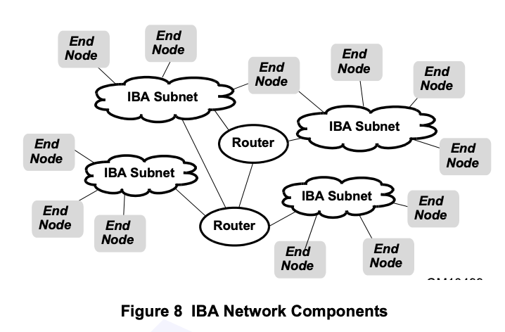
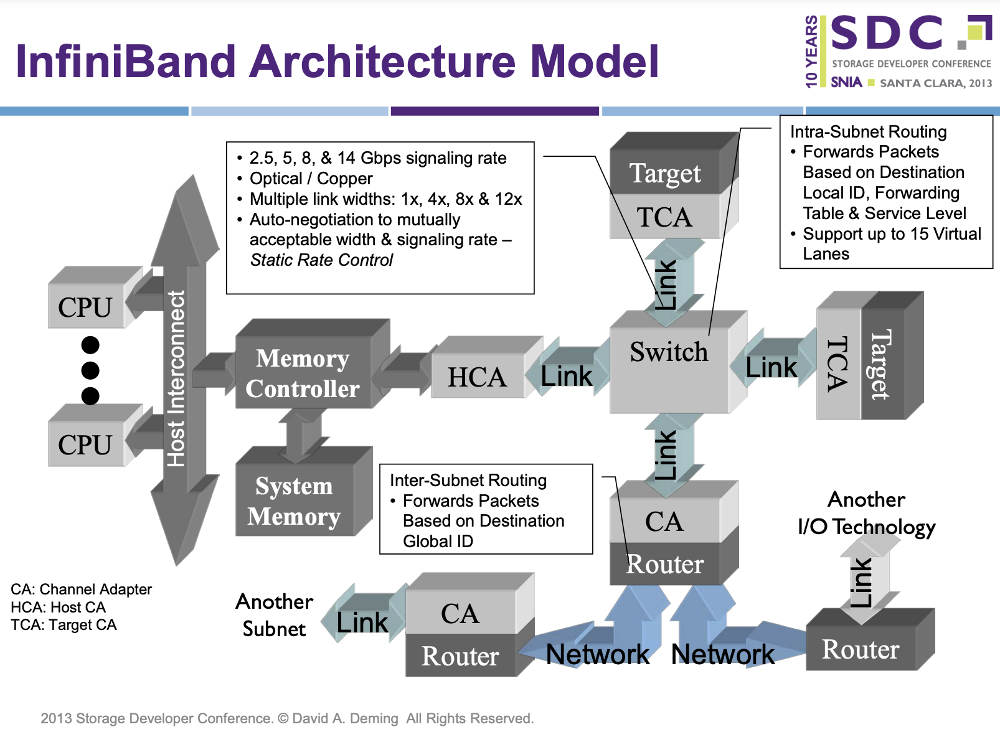
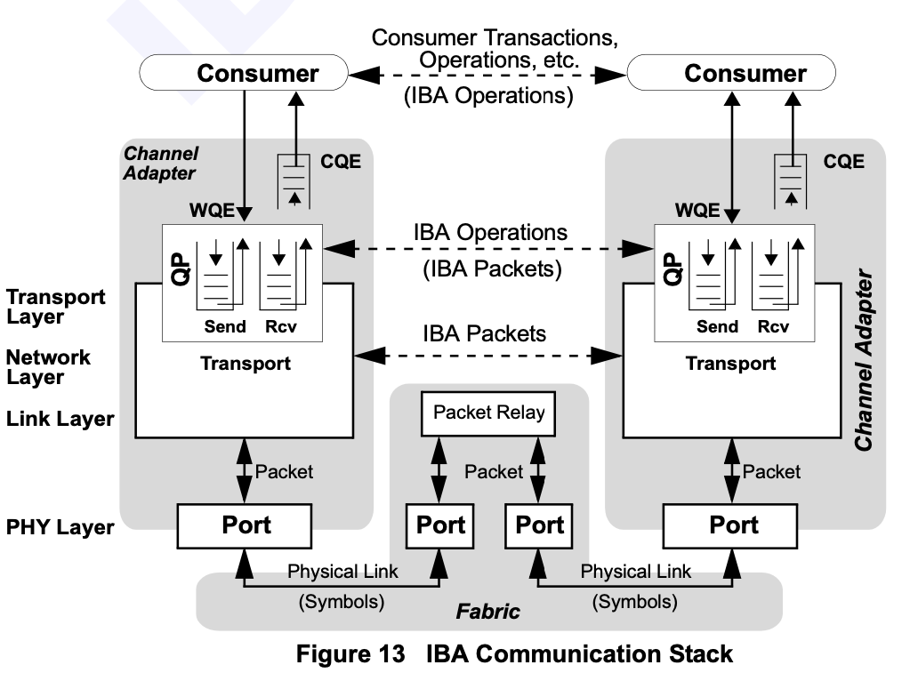
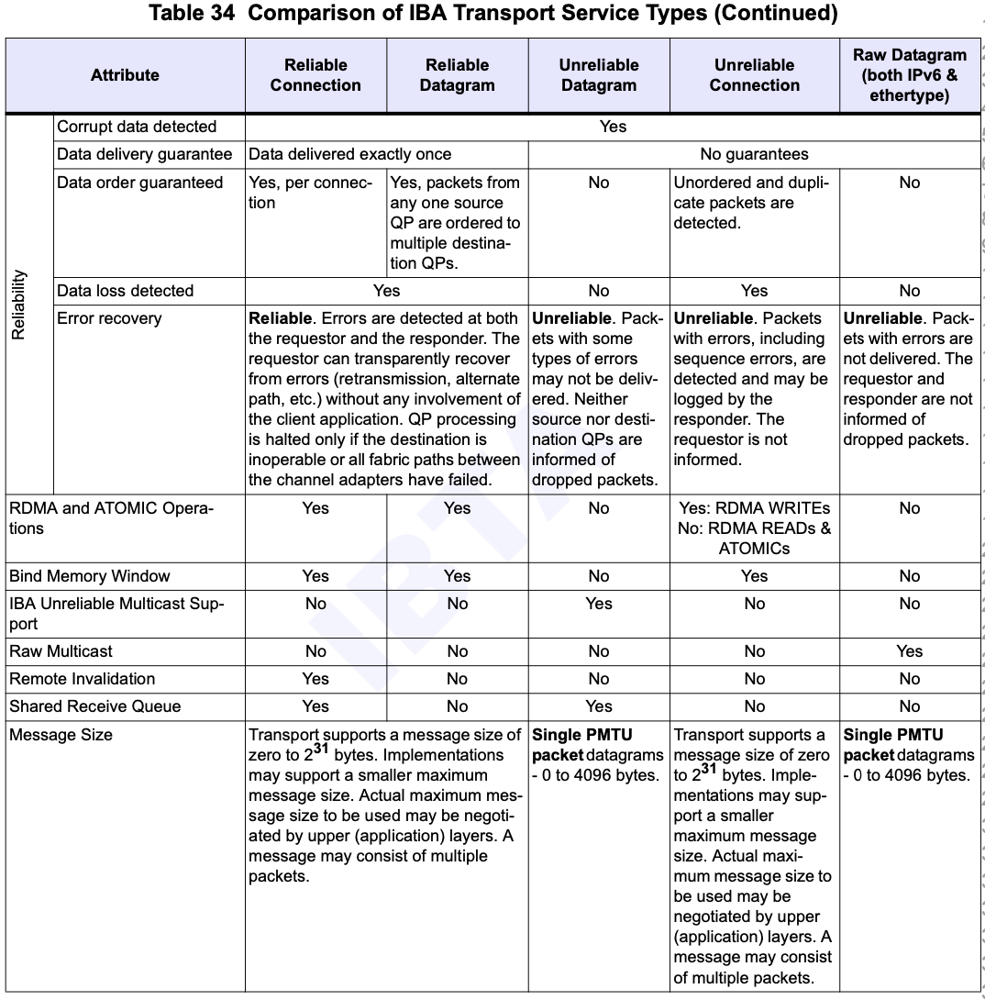

# InfiniBand

## 概览

InfiniBand 的网络分为两层，第一层是由 End Node 和 Switch 组成的 Subnet，第二层是由 Router 连接起来的若干个 Subnet。有点类似以太网以及 IP 的关系，同一个二层内通过 MAC 地址转发，三层间通过 IP 地址转发。

在 IB 网络中，End Node 一般是插在结点上的 IB 卡（Host Channel Adapter，HCA）或者是存储结点上的 Target Channel Adapter。End Node 之间通过 Switch 连接成一个 Subnet，由 Subnet Manager 给每个 Node 和 Switch 分配 Local ID，同一个 Subnet 中通过 LID（Local ID）来路由。但是 LID 位数有限，为了进一步扩展，可以用 Router 连接多个 Subnet，此时要通过 GID（Global ID）来路由。

<figure markdown>
  { width="500" }
  <figcaption>IBA 网络结构（图源 InfiniBand Spec）</figcaption>
</figure>

<figure markdown>
  { width="500" }
  <figcaption>IBA 架构图（图源 <a href="https://www.snia.org/sites/default/files/files2/files2/SDC2013/presentations/Hardware/DavidDeming_Infiniband_Architectural_Overview.pdf">Infiniband Architectural Overview</a>）</figcaption>
</figure>

## Queue Pair

回顾一下，以太网网卡在传输的时候，涉及到两类队列，分别用于发送和接收，由操作系统来负责维护。当要发送的时候，操作系统向发送队列上插入一项，并提供要发送的数据的指针，然后让网卡自己进行 DMA 并发送；同时，操作系统也会分配一些缓冲区，填入接收队列，当网卡接收到新的数据的时候，就会进行 DMA 把数据填入缓冲区，然后通过中断让操作系统去进行处理。

在 IB 中，也有类似的概念，就是 Queue Pair（QP），其实就是 Send Queue 和 Receive Queue 成对出现。另外还有 Completion Queue，当请求完成的时候，会在 CQ 上得到结果。

<figure markdown>
  { width="500" }
  <figcaption>IBA 网络结构（图源 InfiniBand Spec）</figcaption>
</figure>

## Transport Functions

有了 Queue Pair 以后，上层应用就可以进行一些操作了：

- SEND：发送数据
- RESYNC：同步 PSN
- RDMA WRITE：远程写入内存
- RDMA READ：远程读取内存
- ATOMIC：远程进行内存原子操作

有发就有收，接收方需要在 Receive Queue 中准备好接受数据的缓冲区。

此外，为了在保证安全性以及正确性的前提下，允许 RDMA 操作，应用需要首先进行 Memory Binding 操作，标记哪些内存区域可以通过 RDMA 访问，并且生成一个 `R_KEY` 来标记这片内存区域。之后的 RDMA WRITE 和 RDMA READ 需要使用同样的 `R_KEY` 来进行访问。

## Transport Services

IB 支持四种 Transport Service，当 QP 在创建的时候，就需要从以下的四种中选择：

1. Reliable Connection(RC)
2. Reliable Datagram(RD)
3. Unreliable Datagram(UD)
4. Unreliable Connection(UC)

对于 IPoIB 等传输其他协议的情况，也可以直接封装：

1. Raw IPv6 Datagram
2. Raw Ethertype Datagram

几种 Transport Service 的对比：

<figure markdown>
  { width="500" }
  <figcaption>IB Transport Service 对比（图源 InfiniBand Spec）</figcaption>
</figure>

在编程的时候，需要知道对端的 LID（Local ID）、QPN（Queue Pair Number）和 PSN（Packet Sequence Number），才能进行通信。如果要进行 RDMA，还需要知道 `R_Key` 和内存地址。这些信息一般是通过 TCP 来传输的。

## Switches

在 IB 网络中，交换机用来连接同一个 IB Subnet 中的 End Node。在 Subnet 中，通过 Local ID 来路由，而 Local ID 是由 Subnet Manager 负责分配的。Subnet Manager 扫描网络中的交换机和节点，动态分配 LID，并且根据网络拓扑，计算出交换机的转发表。

交换机的转发表就是一个 LID 到端口号的映射，可以实现为线性表（数组，下标是 LID）或随机访问表（CAM，用 LID 查端口号）。

由于 LID 唯一确定了转发路径，所以如果网络有冗余，从一个 End Node 到另一个 End Node 有多条路径，那么为了利用上不同路径的带宽，每条路径都要分配一个 LID。为了简化，在分配的时候，Subnet Manager 会分配一段连续的 LID，具体来说，是 `2^{LMC}` 个，LMC 是 LID Mask Control，表示低多少位 Mask 掉属于同一个 Endpoint。例如 Base LID=4，LMC=2，那么实际上分配的 LID 是 `{4,5,6,7}`。

opensm 的 LID 分配算法可以在[代码](https://github.com/linux-rdma/opensm/blob/844ab3b7edaad983449b5d3a4a773088b8daa299/opensm/osm_lid_mgr.c#L290)中找到。

LID 是一个 16 位的整数，所以同一个 Subnet 中可以连接的设备数量有限。更多的话就需要多个 Subnet。LID 定义：

- 0x0000：Reserved
- 0xFFFF：Permissive，目标 QP0
- 0x0001-0xBFFF：Unicast
- 0xC000-0xFFFE：Multicast

如果想要做隔离，可以创建一个 Partition，类似 VLAN 的概念，通过 `P_Key` 来判断是否属于同一个 Partition。

## 常用命令

常用的可以用来调试 IB 的命令：

- ibstat
- ibhosts
- ibswitches
- iblinkinfo
- ibping
- ibdiagnet
- qperf

使用 qperf/ib_send_lat 可以测量带宽和延迟。一个测试例子：

- 以太网（udp_lat）：24.5 us
- IPoIB (udp_lat): 8.7 us
- IB (rc, ib_send_lat): 1.02 us
- IB (rc_lat): 3.6 ~ 4.6 us
- IB (uc_lat): 4.2 ~ 5.5 us
- IB (ud_lat): 5.5 ~ 6.4 us

## 参考文献

- [InfiniBand Architecture Overview](https://www.snia.org/sites/default/files/files2/files2/SDC2013/presentations/Hardware/DavidDeming_Infiniband_Architectural_Overview.pdf)
- [InfiniBand Architecture Specification Volume 1 Release 1.2.1](https://www.afs.enea.it/asantoro/V1r1_2_1.Release_12062007.pdf)
- [InfiniBand Architecture Specification Volume 2 Release 1.4](https://cw.infinibandta.org/document/dl/8566)
- [An Introduction to the InfiniBand Architecture](https://cali-doc.unilim.fr/_media/mpi/intel-mpi/infinibandchap42.pdf)
- InfiniBand Network Architecture - MindShare
- [ArchWiki - InfiniBand](https://wiki.archlinux.org/title/InfiniBand)