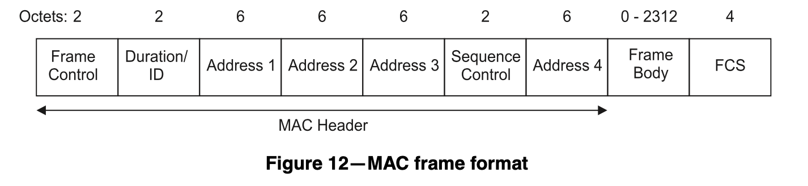
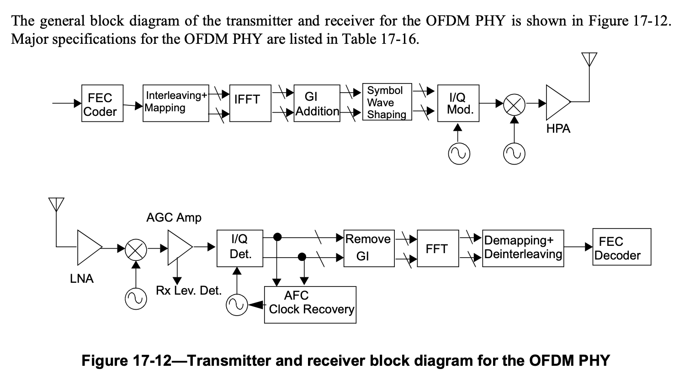

# WLAN

## MAC 层帧格式

802.11 MAC 层的帧格式，如 802.11-1997 Figure 12：

<figure markdown>
  { width="500" }
  <figcaption>802.11 MAC 帧格式（图源 802.11-1997）</figcaption>
</figure>

前两个字节 Frame Control 的定义如 802.11-1997 Figure 13：

<figure markdown>
  { width="500" }
  <figcaption>802.11 MAC Frame Control（图源 802.11-1997）</figcaption>
</figure>

根据 Type 和 Subtype 字段决定了帧的类型，如管理（Management）帧，控制（Control）帧和数据（Data）帧。

无线路由器定期发送 Beacon frame，告诉客户端自己广播了哪些 SSID。客户端也可以主动发送 Probe Request frame 来询问有没有路由器有对应的 SSID，如果有，路由器回复一个 Probe Response frame。

## PHY

802.11 支持很多种 PHY，常见的有 802.11 b/g/n/ac/ax。起名也很有意思：

- 802.11b: High Rate，最高 11 Mbps
- 802.11g: Extended Rate，最高 54 Mbps
- 802.11n: High Throughput，最高 600 Mbps
- 802.11ac: Very High Throughput，最高 6933 Mbps
- 802.11ax: High Efficiency，最高 9608 Mbps

### 802.11b

首先看 [802.11b](https://ieeexplore.ieee.org/document/972833)，802.11b 是对 802.11 的补充，主要定义了第 18 章 `High Rate, direct sequence spread spectrum PHY specification`，缩写 HR-DSSS。

HR-DSSS 工作在 2.4 GHz 频段上，常用的是 13 个 channel，中心频率从 2412 MHz 到 2472 MHz 不等，呈等差数列，公差是 5 MHz。HR-DSSS 会占用 22MHz 的频谱，从中心频率减 11 MHz 到中心频率加 11 MHz，所以相邻 channel 会有干扰，见下图（取自 [Wikipedia](https://en.wikipedia.org/wiki/IEEE_802.11)）

<figure markdown>
  { width="500" }
  <figcaption>802.11 2.4GHz Channels（图源 IEEE 802.11 Wikipedia）</figcaption>
</figure>

这就是为什么通常会把 2.4GHz 无线路由器的 channel 固定为 1、6 或 11。

那么，HR-DSSS 如何把数据调制为 2.4GHz 上的信号呢？HR-DSSS 支持不同的速率，例如 1、2、5.5 和 11 Mbps，这些二进制的数据需要按照一定的方法调制到 2.4 GHz 的载波上。

首先是最简单的情况，例如在 channel 1 上传输 1 Mbps 的数据，802.11 采用的是 DSSS 的方法。简单来说，对于输入的每个位，扩展成 11 个 bit，这样就得到了一个 11 MHz 的基带信号，然后再把基带信号通过 DBPSK 调制到 2412 MHz 的载波信号上。

这个扩展过程是这样的：如果数据位是 0，那就输出 10110111000（Barker 码）；如果数据位是 1，那就输出 01001000111。实际上就是把 1 位的信息重复了 11 次再发出去，看起来很浪费，但很好地解决了干扰的问题，即使传输中出现了错误，接受方也很容易从 11 位的数据中恢复出原来的数据。

2 Mbps 的传输方式类似，只不过每个 symbol 传输两位的数据，所以采用 DQPSK 的调制方法，频率保持不变，实现了两倍的数据传输速率。

5.5 Mbps 和 11 Mbps 则采用了其他方法。由于上面的 1 比 11 的转换比例太浪费了，所以为了提升速度，5.5 Mbps 和 11 Mbps 时采用的是 CCK 编码方式，具体来说，5.5 Mbps 的时候，输入的 4 个 bit 会映射为 8 个 chip，类似地 11 Mbps 的时候，输入的 8 个 bit 也映射到 8 个 chip。每个 chip 都是复数，采用 DQPSK 进行调制。

可以看到，整个过程都是在冗余：速率低的时候，就冗余很多份；速率高的时候，冗余就比较少。实际上，5.5 Mbps 和 11 Mbps 还可以采用可选的 PBCC 进行编码，下面摘抄了 [About Data Modulation Format (802.11b/g DSSS/CCK/PBCC)](https://rfmw.em.keysight.com/wireless/helpfiles/89600b/webhelp/subsystems/wlan-dsss/content/dsss_about_datamodfmt.htm) 中 802.11b 不同速率和编码方式的表格：

| Data Modulation Formats | Spread Sequence Code scheme | Data Rate(Mbps) | Symbol Rate(Msps) | Chip Rate (Mcps) | Bits per Symbol | Modulation |
|-------------------------|-----------------------------|-----------------|-------------------|------------------|-----------------|------------|
| Barker 1                | 11 Chip Barker              |  1              |  1                | 11               | 1               | DBPSK      |
| Barker 2                | 11 Chip Barker              |  2              |  1                | 11               | 2               | DQPSK      |
| CCK 5.5                 | 8 chip CCK                  |  5.5            |  1.375            | 11               | 4               | DQPSK      |
| CCK 11                  | 8 chip CCK                  |  11             |  1.375            | 11               | 8               | DQPSK      |
| PBCC 5.5                | PBCC                        |  5.5            |  11               | N/A              | 0.5             | QPSK       |
| PBCC 11                 | PBCC                        |  11             |  11               | N/A              | 1               | QPSK       |

### 802.11g

[802.11g](https://ieeexplore.ieee.org/document/1210624) 定义了第 19 章 `Extended Rate PHY specification`，也就是 ERP(Extended Rate PHY)，其主要采用的技术是 OFDM，连起来就是 ERP-OFDM，额外支持更多速率：6、9、12、18、24、36、48 和 54 Mbps。各种调制技术的速率对比：

- DSSS: 802.11 1/2 Mbps
- CCK: 802.11b 5.5/11 Mbps
- OFDM: 802.11g 6/9/12/18/24/36/48/54 Mbps
- PBCC: 802.11b 5.5/11 Mbps, 802.11g 22/33 Mbps

OFDM 的核心思想就是采用多个载波信号，这些载波信号的频率呈等差数列，同时保证各载波相互正交，这样就提高了数据传输速率。为了保证正交，相邻载波信号的频率的差要满足 $\Delta{f} = k / T_U$ ，其中 k 是正整数， $T_U$ 是每个 symbol 的时间（引用 [wikipedia](https://zh.wikipedia.org/zh-cn/%E6%AD%A3%E4%BA%A4%E9%A0%BB%E5%88%86%E5%A4%8D%E7%94%A8#%E6%AD%A3%E4%BA%A4)）。下面是 802.11 标准中的 OFDM PHY 的组成：

<figure markdown>
  { width="500" }
  <figcaption>802.11 OFDM PHY（图源 IEEE 802.11）</figcaption>
</figure>

图中的缩写：

- FEC: Forward Error Correction
- IFFT/FFT: Inverse Fast Fourier Transform/Fast Fourier Transform
- GI: Guard Interval
- I/Q: In-phase/Quadrature
- HPA: High Power Amplifier
- LNA: Low Noise Amplifier
- AGC: Automatic Gain Control
- AFC: Automatic Frequency Control

802.11g 的信号带宽是 20MHz，分成 52 个子载波，子载波的间距是 0.3125 MHz（20 MHz / 64，$T_{FFT}=3.2 \mu s, \Delta{f} = 1 / T_{FFT}$ ），所以实际上只占了 $0.3125 \mathrm{MHz} * 52 = 16.25 \mathrm{MHz}$ 的频谱。其中 48 个用于传输数据，每个载波上可以采用不同的调制方法。54 Mbps 是怎么算的呢？802.11g 的 Symbol rate 是 250000 每秒（因为 $T_{SYM} = 3.2 + 0.8 = 4 \mu s$ ），如果使用 64-QAM 调制，那么每个 symbol 对应 6 个 bit，然后使用纠错码，纠错的时候浪费了 1/4 的位，实际数据占 3/4，一共 48 个载波，那么数据速率就是 $48 * 250000 * 6 * 3/4 = 54 \mathrm{Mbps}$ 。

### 802.11n

802.11n 在 802.11g 的基础上添加了 MIMO，也就是可以用多个天线同时传输。

首先还是考虑单天线的情况，基本和 802.11g 相同，区别是采用了 52（ $N_{SD}$ ）个 OFDM 子载波用于传输数据，同时纠错码带来的浪费比例从 1/4 降到了 1/6，所以数据速率是 $52 * 250000 * 6 * 5/6 = 65 \mathrm{Mbps}$ 。802.11n 还提供了 Short GI（Guard Interval）选项，把 GI 从 800 ns 降低到 400ns，使得每个 symbol 的时间可以从 $3.2 + 0.8 = 4 \mu s$) 降低到 $3.2 + 0.4 = 3.6 \mu s$ ，此时的数据速率达到 $52 * 1000000 / 3.6 * 6 * 5/6 = 72.2 \mathrm{Mbps}$。

除此之外，802.11n 还引入了 40 MHz 频宽的选项，以占用更多频谱为代价，换来可以用 108 个子载波来传输数据，此时数据速率可以达到 $108 * 1000000 / 3.6 * 6 * 5 / 6 = 150 \mathrm{Mbps}$。

考虑多天线，如果同时两根天线传输数据，那么数据速率就是两倍，达到 $300 \mathrm{Mbps}$ ；最高可以同时四根天线传输数据，所以数据速率最高理论值是 $600 \mathrm{Mbps}$ 。

### 802.11ac

802.11ac 添加了 160 MHz 频宽的选项，可以提供 468 个子载波，调制方式从 64-QAM 提升到 256-QAM，同时最大可以有 8 根天线同时传输数据，最大数据速率是 $468 * 1000000 / 3.6 * 8 * 5 / 6 * 8 = 6933.3 \mathrm{Mbps}$ 。

由此可见，提高无线网络的速率的方法就是提高上式的各个系数：

- 子载波数量：增加频宽，或者在频宽一定的时候，留出更多的子载波用于数据，提升较大，但频率不能太宽
- Symbol 时间：减少 Guard Interval，提升不大
- QAM 位数：从 PSK 到 4-QAM 到 64-QAM 到 256-QAM，提升难度较大
- 纠错码开销：不会超过 1，难以提升
- 更多天线：从 1 到 4 到 8，未来到 16，逐步提升

所以要进一步提升性能，主要从子载波数量、QAM 位数和 MIMO 数量上做文章。

### 802.11ax

802.11ax 可以提供 1960 个子载波（间距从 312.5 kHz 缩小到 78.125 kHz，$\Delta{f} = 78.125 kHz, T_{FFT} = 1 / \Delta{f} = 12.8 \mu s$ ），调制方式从 256-QAM 提升到 1024-QAM，但是 $T_{SYM}$ 也提高到了 $12.8 + 0.8 = 13.6 \mu s$ ，最大数据速率是 $1960 * 1000000 / 13.6 * 10 * 5 / 6 * 8 = 9607.8 \mathrm{Mbps}$ 。

### OFDM 对比

下面总结了使用 OFDM 的 PHY 的各项参数，其中 Data rate 的计算公式：`Subcarrier * 1000000 / T_{SYM} * Coding Rate * MIMO streams`。

| Standard | Subcarrier | T_{SYM} | QAM bits | Coding Rate | MIMO streams | Data rate   |
|----------|------------|---------|----------|-------------|--------------|-------------|
| 802.11g  | 48         | 4 us    | 6        | 3/4         | 1            | 54 Mbps     |
| 802.11n  | 108        | 3.6 us  | 6        | 5/6         | 4            | 600 Mbps    |
| 802.11ac | 468        | 3.6 us  | 8        | 5/6         | 8            | 6933.3 Mbps |
| 802.11ax | 1960       | 13.6 us | 10       | 5/6         | 8            | 9607.8 Mbps |
