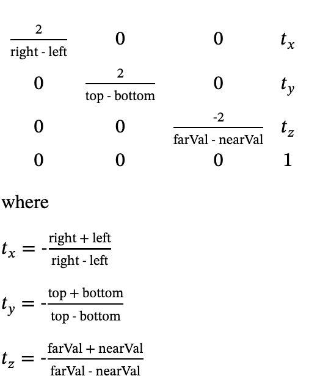
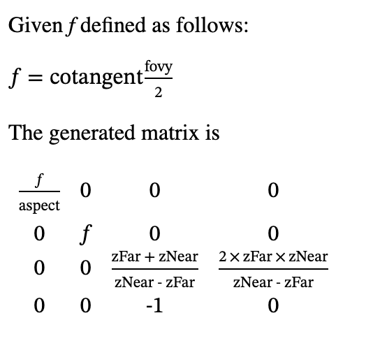

# 计算机图形学

本文参考了如下网站：

- [OpenGL Projection Matrix - Song Ho Ahn](http://www.songho.ca/opengl/gl_projectionmatrix.html)
- [glOrtho](https://registry.khronos.org/OpenGL-Refpages/gl2.1/xhtml/glOrtho.xml)
- [gluPerspective](http://www.songho.ca/opengl/gl_projectionmatrix.html)
- [Projection matrices](https://eliemichel.github.io/LearnWebGPU/basic-3d-rendering/3d-meshes/projection-matrices.html)

## 齐次坐标

齐次坐标是在 3 维的坐标 $(x, y, z)$ 的基础上，添加一维，变成 $(x, y, z, w)$，对应 3 维的 $(x/w, y/w, z/w)$，这样做可以方便一些计算。

因此从 3 维坐标转换为齐次坐标的时候，添加一维 $w = 1$，变成 $(x, y, z, 1)$。为了让 3 维的向量和点在齐次坐标下可以进行运算，可以向 3 维向量添加一维 $w=0$，此时 $w=0$ 表示向量，$w \ne 0$ 表示点。

## Normalized Device Coordinates

NDC（Normalized Device Coordinates）是经过一系列变换以后，得到的最终的坐标。以 OpenGL 为例，NDC 就是一个在三个坐标轴上都在 $[-1, 1]$ 之间的立方体，只有在这个立方体中的物体才会被显示出来。

NDC 的坐标范围在不同的图形 API 下可能不一样，例如 OpenGL 和 WebGL 是从 $(-1, -1, -1)$ 到 $(1, 1, 1)$，而 DirectX-12、Metal、Vulkan 和 WebGPU 是从 $(-1, -1, 0)$ 到 $(1, 1, 1)$，也就是 Z 轴上的范围只有 $[0, 1]$。

最后显示在屏幕上的时候，显示区域的左下角就对应 $x=-1, y=-1$，右上角对应 $x=1, y=1$（也可能是左上角 $x=-1, y=-1$，右下角 $x=1, y=1$，不同的图形 API 规定不同）。$z$ 轴对应深度，显示在前面的（$z$ 较小的）会遮挡显示在后面的（$z$ 较大的）。

## 正交投影

正交投影要做的是把一个长方体线性映射到 NDC 中，以 OpenGL 为例，也就是要映射到三个维度上都是 $[-1, 1]$ 之间的立方体。

这个长方体的边和坐标轴平行，因此可以用以下几个变量来定义长方体的坐标：

1. left, right, top, bottom：定义了长方体上平行于 X-Y 屏幕的面的位置，其中 left 和 right 就是 X 轴上的最小值和最大值，bottom 和 top 就是 Y 轴上的最小值和最大值
2. near，far：定义了长方体在 Z 轴上的区间，离原点最近的平面的 Z 值是 `-near`，最远的平面的 Z 值是 `-far`

下面用这些坐标的首字母来简称：$l$ 代表 left，依此类推。

目标是把这个长方体映射到 $[-1, 1]$ 的立方体上。

首先考虑 X 轴：要线性地把 $x=l$ 映射到 $x=-1$，把 $x=r$ 映射到 $x=1$，可以得到 $x' = \frac{2}{r-l}x-\frac{r+l}{r-l}$。

同理，Y 坐标的计算公式是 $y' = \frac{2}{t-b}y-\frac{t+b}{t-b}$。

Z 轴上多了一个负号：线性地把 $z=-n$ 映射到 $z=-1$，把 $z=-f$ 映射到 $z=1$，得到 $z' = \frac{-2}{f-n}z-\frac{f+n}{f-n}$。

注：如果 NDC 的 Z 轴范围是 $[0, 1]$，那么 Z 轴的计算公式就是 $z' = \frac{-1}{f-n}z-\frac{n}{f-n}$

总结一下就是：

\begin{align}
x' = \frac{2}{r-l}x-\frac{r+l}{r-l} \\
y' = \frac{2}{t-b}y-\frac{t+b}{t-b} \\
z' = \frac{-2}{f-n}z-\frac{f+n}{f-n}
\end{align}

考虑到实际采用的是齐次坐标系，$w$ 不变，所以 $w' = w$。把上面的等式写成矩阵的形式，就是：

$$
\begin{pmatrix}
\frac{2}{r-l} & 0 & 0 & -\frac{r+l}{r-l} \\
0 & \frac{2}{t-b} & 0 & -\frac{t+b}{t-b} \\
0 & 0 & \frac{-2}{f-n} & -\frac{f+n}{f-n} \\
0 & 0 & 0 & 1
\end{pmatrix}
$$

这正是 OpenGL 正交投影函数 glOrtho() 所计算的矩阵：

<figure markdown>
  { width="300" }
  <figcaption>正交投影矩阵（图源 <a href="https://registry.khronos.org/OpenGL-Refpages/gl2.1/xhtml/glOrtho.xml">glOrtho</a>）</figcation>
</figure>

## 透视投影

透视投影要做的是把一个四棱台（Square Frustum，四棱锥水平切开，底面和顶面是正方形，其余四个面都是梯形）映射到 NDC 上。其中四棱台的四条棱延长以后，交于原点。也就是说焦点就是坐标轴的原点。

相比正交投影，透视投影最大的不同在于它近大远小的特性，更加贴近实际：正交投影无论深度多少，看到的物体大小不变；而在透视投影中，从原点出发，到 near 平面上的一点连成射线，这条射线上的点都对应同一个屏幕上的点，因此远的物体在屏幕上看的小，近的物体在屏幕上看得大。

因此在实现透视投影的时候，就要利用这条从原点出发到 near 平面的一点的射线：由于这条射线上的点都对应屏幕上同一个点，因此在 NDC 中也对应同一个 $(x', y')$ 坐标。那么，在计算 $x'$ 和 $y'$ 的时候，先利用相似三角形关系，把点映射到 near 平面上（near 平面的 Z 坐标是 $z=-n$）：

\begin{align}
\frac{x'}{x} = \frac{-n}{z} \\
\frac{y'}{y} = \frac{-n}{z}
\end{align}

这样就得到了四棱台到长方体的映射，但是这里涉及到对 $z$ 的除法运算，为了在矩阵中实现针对 $z$ 的除法运算，需要利用齐次坐标自带的除法：$(x, y, z, w) \to (x/w, y/w, z/w)$，也就是说，把 $z$ 的值挪到 $w$ 上，就相当于实现了除法。按照这个思路，可以得到下面的矩阵：

$$
\begin{pmatrix}
n & 0 & 0 & 0 \\
0 & n & 0 & 0 \\
0 & 0 & A & B \\
0 & 0 & -1 & 0
\end{pmatrix}
$$

其中 $A$ 和 $B$ 是未知数。验证一下上面的矩阵是否实现了除法：

首先是生成齐次坐标：

$$
(x, y, z) \to (x, y, z, 1)
$$

矩阵变换以后：

\begin{align}
x' &= nx \\
y' &= ny \\
z' &= Az + B \\
w' &= -z
\end{align}

再从齐次坐标变回来，得到 $(-\frac{nx}{z}, -\frac{ny}{z}, -A-\frac{B}{z})$。可以看到，x 和 y 都得到了和前面用相似三角形计算出来一样的结果，但是 z 的值出现了变化。但是没有关系，虽然 z 的值变了，但是它依然是保序的，只需要继续保证它在 $[-f, -n]$ 范围即可：

\begin{align}
-n = -A-\frac{B}{-n} \\
-f = -A-\frac{B}{-f}
\end{align}

求解可得 $A=n+f, B=-nf$，因此前面的矩阵就是：

$$
\begin{pmatrix}
n & 0 & 0 & 0 \\
0 & n & 0 & 0 \\
0 & 0 & n+f & -nf \\
0 & 0 & -1 & 0
\end{pmatrix}
$$

到这一步，就完成了四棱台到长方体的映射，接下来就是正交投影了，把长方体映射到 NDC 上，因此最终整体的投影矩阵就是把两个矩阵乘起来（正交投影矩阵左乘上面的矩阵），得到的结果如下：

$$
\begin{pmatrix}
\frac{2}{r-l} & 0 & 0 & -\frac{r+l}{r-l} \\
0 & \frac{2}{t-b} & 0 & -\frac{t+b}{t-b} \\
0 & 0 & \frac{-2}{f-n} & -\frac{f+n}{f-n} \\
0 & 0 & 0 & 1
\end{pmatrix}
\cdot
\begin{pmatrix}
n & 0 & 0 & 0 \\
0 & n & 0 & 0 \\
0 & 0 & n+f & -nf \\
0 & 0 & -1 & 0
\end{pmatrix}
=
\begin{pmatrix}
\frac{2n}{r-l} & 0 & \frac{r+l}{r-l} & 0 \\
0 & \frac{2n}{t-b} & \frac{t+b}{t-b} & 0 \\
0 & 0 & -\frac{n+f}{f-n} & \frac{-2nf}{f-n} \\
0 & 0 & -1 & 0
\end{pmatrix}
$$

这就是最终的透视投影的矩阵。需要注意的是，它假设了输入的坐标的 $w=1$，如果输入的齐次坐标的 $w \ne 1$，计算结果就会有问题。在 OpenGL 中，可以用 gluPerspective() 函数得到它：

<figure markdown>
  { width="300" }
  <figcaption>透视投影矩阵（图源 <a href="https://registry.khronos.org/OpenGL-Refpages/gl2.1/xhtml/gluPerspective.xml">gluPerspective</a>）</figcation>
</figure>

和上面的结果看似不同，但只要设定 $r=-l, t=-b, f=\frac{n}{t}, aspect=\frac{r}{t}$，两个矩阵就是一样的。也就是说 gluPerspective 采用了透视投影的特殊情况：左右和上下对称。

其中 aspect 是长宽比（x 轴除以 y 轴）；$f=cot(\frac{fovy}{2})$ 是这么推导的：y 方向上的视野角度上下对称，角度大小是 $fovy$，那么在水平线上方的角度就是 $\frac{fovy}{2}$，而这个角度在三角形中，它的对边是 $t$，邻边是 $n$，所以 $tan(\frac{fovy}{2})=\frac{t}{n}$，反过来就得到 $f=\frac{n}{t}=cot(\frac{fovy}{2})$。

更加通用的 OpenGL 函数是 [glFrustum](https://registry.khronos.org/OpenGL-Refpages/gl2.1/xhtml/glFrustum.xml)，它得到的矩阵和上面推导出来的矩阵是一样的，没考虑特殊情况。

## 光线追踪

Whitted-style ray-tracing 是一种典型的光线追踪算法，它的实现思路是：

1. 对于要绘制在屏幕上的点，计算它在 3 维空间中的对应的位置，与相机的原点构成一个射线
2. 计算射线与场景中表面的第一个交点，根据表面的类型进行不同的处理：
    1. 漫反射（Diffuse）：找到所有的光源，找出那些可以照亮交点的光源（光源到交点之间没有遮挡），计算出光源对这一点的贡献
    2. 镜面反射（Specular）：计算出反射光，把反射光当成视线，继续递归
    3. 镜面反射+折射（Refraction）：分别计算出反射光和折射光，分别递归然后按照 Fresnel 方程加权求和

可以看到，所有的光线在递归终止的时候，要么是在漫反射表面上，要么就是没有找到相交的表面。

## 辐射度量学

参考 [路径追踪（Path Tracing）与渲染方程(Render Equation)](https://zhuanlan.zhihu.com/p/370162390) 和 [GAMES101 Lecture 15](https://sites.cs.ucsb.edu/~lingqi/teaching/resources/GAMES101_Lecture_15.pdf)：

- Radiant energy Q：光源向空间中辐射的能量，单位是 J
- Radiant flux(power) $\Phi$：光源在单位时间内向空间中辐射的能量，单位是 W
- Solid angle $\omega$：立体角，单位是 steradian/square radian 球面度，简写 sr；是在球面上一个小平面的面积除以半径的平方，即 $\omega=A/r^2$
- Radiant intensity I：光源在单位立体角内的 Radiant flux，单位是 W/sr
- Irradiance E：单位面积接受到的 Radiant flux，即 $E=\Phi/A$，单位是 $W/m^2$
- Radiance L：单位面积下，接收到来自单位立体角的 Radiant flux，单位是 $W/sr \cdot m^2$

## Rendering equation

参考 [GAMES101 Lecture 15](https://sites.cs.ucsb.edu/~lingqi/teaching/resources/GAMES101_Lecture_15.pdf)：

$$
L_o(p, \omega_o) = L_e(p, \omega_o) + \int_{\Omega} L_i(p, \omega_i) f_r(p, \omega_i, \omega_o) (n \cdot \omega_i) \mathrm{d} \omega_i
$$

含义：从平面上的 $p$ 点出发，向 $\omega_r$ 发射的 Radiance 包括两部分：

1. $L_e(p, \omega_o)$：这个点本身发的光，例如光源
2. $\int_{\Omega} L_i(p, \omega_i) f_r(p, \omega_i, \omega_o) (n \cdot \omega_i) \mathrm{d} \omega_i$：考虑半球面上的任意一个入射方向 $\omega_i$，这个方向上入射到 $p$ 点的 Radiance 是 $L_i(p, \omega_i)$，其中有一定比例会反射到 $\omega_o$ 方向上，这个比例就是 BRDF $f_r(p, \omega_i, \omega_o)$，最后由于入射方向和平面的法方向有一个夹角 $\theta$，根据 Lambert's Cosine Law，需要乘上 $\cos \theta = n \cdot \omega_i$ 项。

## Bidirectional reflectance distribution function

BRDF（Bidirectional reflectance distribution function）指的是在一个表面上，特定角度（$\omega_i$）的入射光有多大比例会被反射到特定角度（$\omega_o$）的出射光。

常见的 BRDF 有：

- [Lambertian](https://en.wikipedia.org/wiki/Lambertian_reflectance)：一般用于漫反射表面，光均匀反射到各个角度，因此和出射角度无关：$f=c/\pi$，其中 $c$ 是表面的颜色，除以 $\pi$ 是为了满足能量守恒，计算过程见 [Deriving Lambertian BRDF from first principles](https://sakibsaikia.github.io/graphics/2019/09/10/Deriving-Lambertian-BRDF-From-First-Principles.html)
- [Phong](https://en.wikipedia.org/wiki/Phong_reflection_model) 和 [Blinn-Phong](https://en.wikipedia.org/wiki/Blinn%E2%80%93Phong_reflection_model)：用于 OpenGL Fixed-function pipeline
- [Cook-Torrance](https://en.wikipedia.org/wiki/Specular_highlight#Cook%E2%80%93Torrance_model)：$f=k_d\frac{c}{\pi} + k_s\frac{DFG}{4(n \cdot \omega_i)(n \cdot \omega_o)}$，前面的 $k_d\frac{c}{\pi}$ 和 Lambertian 一样，后面的 $DFG$ 表示三个函数的乘积，分别是 Normal Distribution Function，Fresnel Function 和 Geometric Attenuation Function，详见 [Physically-Based Rendering Cook-Torrance Reflectance Model](https://graphicscompendium.com/gamedev/15-pbr) 和 [LearnOpenGL CN - Theory](https://learnopengl-cn.github.io/07%20PBR/01%20Theory/)

## 图形 API 对比

下面给出不同图形 API 或者库在约定上的不同：

|                     | OpenGL  | Direct3D | Metal  | Vulkan |
| ------------------- | ------- | -------- | ------ | ------ |
| NDC 采用              | 左手系     | 左手系      | 左手系    | 右手系    |
| NDC 中 z 的范围         | [-1, 1] | [0, 1]   | [0, 1] | [0, 1] |
| NDC (-1, -1) 在      | 左下角     | 左下角      | 左下角    | 左上角    |
| Framebuffer (0,0) 在 | 左下角     | 左上角      | 左上角    | 左上角    |

参考：

- [Unity - Manual: Writing shaders for different graphics APIs](https://docs.unity3d.com/2022.3/Documentation/Manual/SL-PlatformDifferences.html)
- https://github.com/gpuweb/gpuweb/issues/416
- https://zhuanlan.zhihu.com/p/339295068
- http://anki3d.org/vulkan-coordinate-system/
