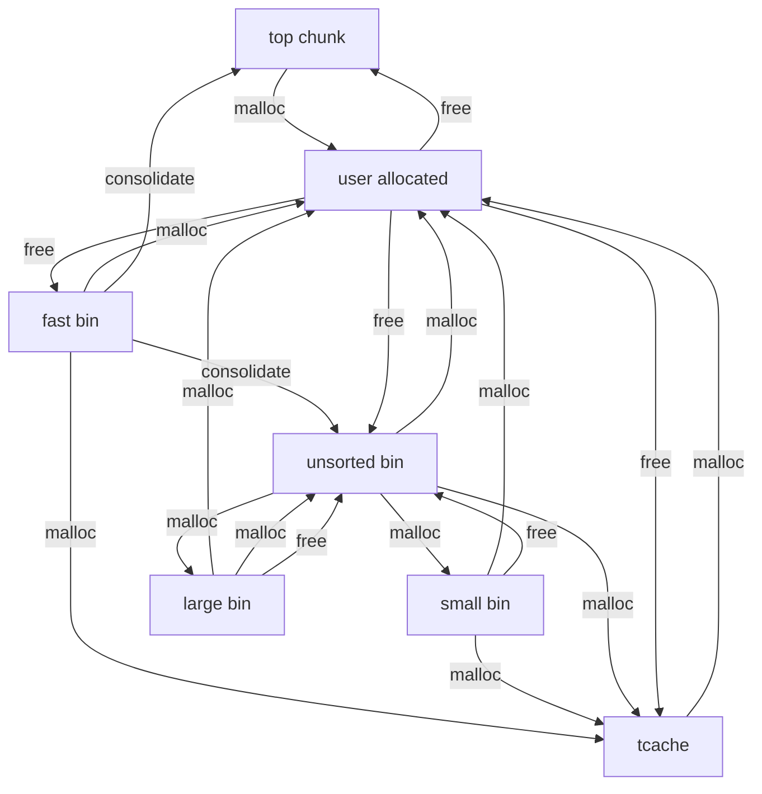
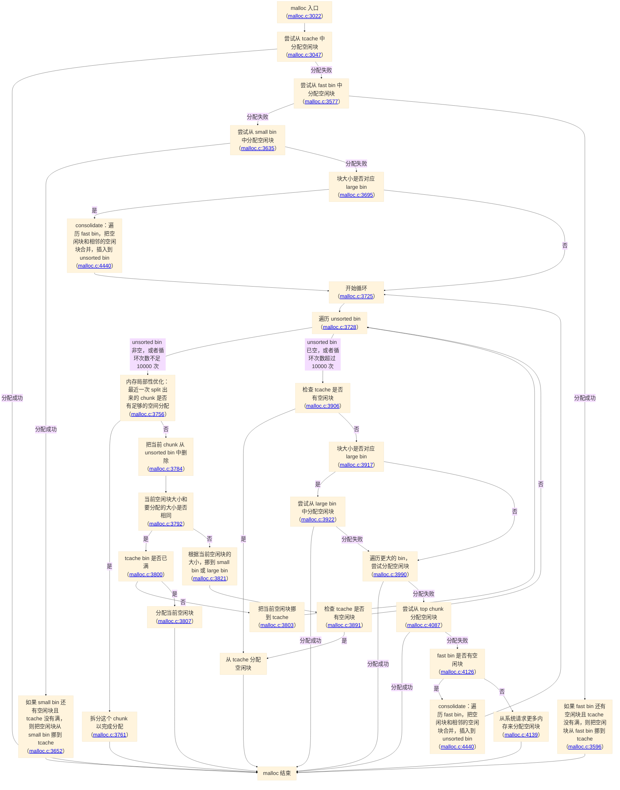

# glibc 内存分配器

## glibc 2.31

glibc 2.31 是 ubuntu 20.04 所使用的 libc 版本，首先来分析它的实现，源码可以从 [glibc-2.31 tag](https://github.com/bminor/glibc/tree/glibc-2.31) 中找到。

首先来看 malloc 函数，它实现在 `malloc/malloc.c` 的 [`__libc_malloc`](https://github.com/bminor/glibc/blob/glibc-2.31/malloc/malloc.c#L3022) 函数当中，忽略 `__malloc_hook` 和一些检查，首先可以看到它有一段代码，使用了一个叫做 tcache 的数据结构：

```c
/* int_free also calls request2size, be careful to not pad twice.  */
size_t tbytes;
if (!checked_request2size (bytes, &tbytes))
  {
    __set_errno (ENOMEM);
    return NULL;
  }
size_t tc_idx = csize2tidx (tbytes);

MAYBE_INIT_TCACHE ();

DIAG_PUSH_NEEDS_COMMENT;
if (tc_idx < mp_.tcache_bins
    && tcache
    && tcache->counts[tc_idx] > 0)
  {
    return tcache_get (tc_idx);
  }
DIAG_POP_NEEDS_COMMENT;
```

### tcache (Thread Local Cache)

接下来仔细地研究 tcache 的结构。首先，它是一个 per-thread 的数据结构，意味着每个线程都有自己的一份 tcache，不需要上锁就可以访问：

```c
static __thread tcache_perthread_struct *tcache = NULL;
```

接下来看它具体保存了什么：

```c
/* We overlay this structure on the user-data portion of a chunk when
   the chunk is stored in the per-thread cache.  */
typedef struct tcache_entry
{
  struct tcache_entry *next;
  /* This field exists to detect double frees.  */
  struct tcache_perthread_struct *key;
} tcache_entry;

/* There is one of these for each thread, which contains the
   per-thread cache (hence "tcache_perthread_struct").  Keeping
   overall size low is mildly important.  Note that COUNTS and ENTRIES
   are redundant (we could have just counted the linked list each
   time), this is for performance reasons.  */
typedef struct tcache_perthread_struct
{
  uint16_t counts[TCACHE_MAX_BINS];
  tcache_entry *entries[TCACHE_MAX_BINS];
} tcache_perthread_struct;

/* Caller must ensure that we know tc_idx is valid and there's room
   for more chunks.  */
static __always_inline void
tcache_put (mchunkptr chunk, size_t tc_idx)
{
  tcache_entry *e = (tcache_entry *) chunk2mem (chunk);

  /* Mark this chunk as "in the tcache" so the test in _int_free will
     detect a double free.  */
  e->key = tcache;

  e->next = tcache->entries[tc_idx];
  tcache->entries[tc_idx] = e;
  ++(tcache->counts[tc_idx]);
}

/* Caller must ensure that we know tc_idx is valid and there's
   available chunks to remove.  */
static __always_inline void *
tcache_get (size_t tc_idx)
{
  tcache_entry *e = tcache->entries[tc_idx];
  tcache->entries[tc_idx] = e->next;
  --(tcache->counts[tc_idx]);
  e->key = NULL;
  return (void *) e;
}
```

可以看到它有两个成员，把 tcache 分为 `TCACHE_MAX_BINS` 这么多个 bin，每个 bin 分别有一个：

1. `counts[bin]`：记录了这个 bin 中空闲块的数量，`tcache_put` 的时候加一，`tcache_get` 的时候减一
2. `entries[bin]`: 每个 bin 用一个链表保存了空闲块，链表的节点类型是 `tcache_entry`，那么 `entries[bin]` 保存了链表头的指针

bin 是内存分配器的一个常见做法，把要分配的块的大小分 bin，从而保证拿到的空闲块足够大。接下来看 `tcache_put` 是如何把空闲块放到 tcache 中的：

1. 把空闲块强制转换为 `tcache_entry` 结构体类型
2. 把它的 `key` 字段指向 tcache，用来表示这个空闲块当前在 `tcache` 当中，后续用它来检测 double free
3. 以新的 `tcache_entry` 作为链表头，插入到 tcache 的对应的 bin 当中：`entries[tc_idx]`
4. 更新这个 bin 的空闲块个数到 `count[tc_idx]` 当中

反过来，`tcache_get` 则是从 tcache 中拿出一个空闲块：

1. 从链表头 `entries[tc_idx]` 取出一个空闲块，把它从链表中删除：`entries[tc_idx] = e->next`
2. 更新这个 bin 的空闲块个数到 `count[tc_idx]` 当中
3. 把它的 `key` 字段指向 NULL，用来表示这个空闲块当前不在 `tcache` 当中
4. 返回这个空闲块的地址

#### malloc

接下来回到 `malloc` 的实现，它首先根据用户要分配的空间大小（`bytes`），计算出实际需要分配的大小（`tbytes`），和对应的 bin（`tc_idx`）：

```c
/* int_free also calls request2size, be careful to not pad twice.  */
size_t tbytes;
if (!checked_request2size (bytes, &tbytes))
  {
    __set_errno (ENOMEM);
    return NULL;
  }
size_t tc_idx = csize2tidx (tbytes);
```

其中 `checked_request2size` 实现如下：

```c
#define request2size(req)                                         \
  (((req) + SIZE_SZ + MALLOC_ALIGN_MASK < MINSIZE)  ?             \
   MINSIZE :                                                      \
   ((req) + SIZE_SZ + MALLOC_ALIGN_MASK) & ~MALLOC_ALIGN_MASK)

/* Check if REQ overflows when padded and aligned and if the resulting value
   is less than PTRDIFF_T.  Returns TRUE and the requested size or MINSIZE in
   case the value is less than MINSIZE on SZ or false if any of the previous
   check fail.  */
static inline bool
checked_request2size (size_t req, size_t *sz) __nonnull (1)
{
  if (__glibc_unlikely (req > PTRDIFF_MAX))
    return false;
  *sz = request2size (req);
  return true;
}
```

它实现的实际上是把用户请求的内存大小，加上 `SIZE_SZ`（即 `sizeof(size_t)`），向上取整到 `MALLOC_ALIGN_MASK` 对应的 alignment（`MALLOC_ALIGNMENT`，通常是 `2 * SIZE_SZ`）的整数倍数，再和 `MINSIZE` 取 max。这里要加 `SIZE_SZ`，是因为 malloc 会维护被分配的块的一些信息，包括块的大小和一些 flag，后续会详细讨论，简单来说就是分配的实际空间会比用户请求的空间要更大。

接着，看它是如何计算出 tcache index 的：

```c
/* When "x" is from chunksize().  */
# define csize2tidx(x) (((x) - MINSIZE + MALLOC_ALIGNMENT - 1) / MALLOC_ALIGNMENT)
```

可以看到，从 MINSIZE 开始，以 MALLOC_ALIGNMENT 为单位，每个 bin 对应一个经过 align 以后的可能的内存块大小。得到 tcache index 后，检查对应的 bin 是否有空闲块，如果有，则直接分配：

```c
if (tc_idx < mp_.tcache_bins
    && tcache
    && tcache->counts[tc_idx] > 0)
  {
    return tcache_get (tc_idx);
  }
```

可以看到，tcache 相当于是一个 per thread 的小缓存，记录了最近释放的内存块，可供 malloc 使用。由于 bin 的数量有限，所以比较大的内存分配不会经过 tcache。

P.S. `calloc` 不会使用 tcache，而是用后面提到的 `_int_malloc` 进行各种分配。

#### free

既然 malloc 用到了 tcache，自然 free 就要往里面放空闲块了，相关的代码在 `_int_free` 函数当中：

```c
size_t tc_idx = csize2tidx (size);
if (tcache != NULL && tc_idx < mp_.tcache_bins)
  {
    /* Check to see if it's already in the tcache.  */
    tcache_entry *e = (tcache_entry *) chunk2mem (p);

    /* This test succeeds on double free.  However, we don't 100%
       trust it (it also matches random payload data at a 1 in
       2^<size_t> chance), so verify it's not an unlikely
       coincidence before aborting.  */
    if (__glibc_unlikely (e->key == tcache))
      {
        tcache_entry *tmp;
        LIBC_PROBE (memory_tcache_double_free, 2, e, tc_idx);
        for (tmp = tcache->entries[tc_idx];
             tmp;
             tmp = tmp->next)
          if (tmp == e)
            malloc_printerr ("free(): double free detected in tcache 2");
            /* If we get here, it was a coincidence.  We've wasted a
               few cycles, but don't abort.  */
      }

    if (tcache->counts[tc_idx] < mp_.tcache_count)
      {
        tcache_put (p, tc_idx);
        return;
      }
  }
```

它的逻辑也不复杂：

1. 计算 tcache index，找到对应的 bin
2. 检查它是不是已经被 free 过了，即 double free：free 过的指针，它的 key 字段应当指向 tcache，如果实际检测到是这样，那就去 tcache 里遍历链表，检查是不是真的在里面，如果是，说明 double free 了，报错
3. 如果对应的 bin 的链表长度不是很长（阈值是 `mp_.tcache_count`，取值见后），则添加到链表头部，完成 free 的过程

那么 tcache 默认情况下有多大呢：

```c
/* We want 64 entries.  This is an arbitrary limit, which tunables can reduce.  */
# define TCACHE_MAX_BINS  64
/* This is another arbitrary limit, which tunables can change.  Each
   tcache bin will hold at most this number of chunks.  */
# define TCACHE_FILL_COUNT 7
```

也就是说，它有 64 个 bin，每个 bin 的链表最多 7 个空闲块。

在 64 位下，这 64 个 bin 对应的块大小是从 32 字节到 1040 字节，每 16 字节一个 bin（`(1040 - 32) / 16 + 1 = 64`）。那么，`malloc(1032)` 或更小的分配会经过 tcache，而 `malloc(1033)` 或更大的分配则不会。

#### 实验

下面来写一段程序来观察 tcache 的行为，考虑到从链表头部插入和删除是后进先出（LIFO），相当于是一个栈，所以分配两个大小相同的块，释放后再分配相同大小的块，得到的指针的顺序应该是反过来的：

```c
#include <stdio.h>
#include <stdlib.h>

int main() {
  void *p1 = malloc(32);
  void *p2 = malloc(32);
  free(p1);
  free(p2);
  void *p3 = malloc(32);
  void *p4 = malloc(32);
  printf("p1=%p p2=%p p3=%p p4=%p\n", p1, p2, p3, p4);
}
```

输出如下：

```c
p1=0x55fb2f9732a0 p2=0x55fb2f9732d0 p3=0x55fb2f9732d0 p4=0x55fb2f9732a0
```

结果符合预期，tcache 的内部状态变化过程如下：

1. `free(p1)`：p1 变成链表的头部
2. `free(p2)`：p2 变成链表的头部，next 指针指向 p1
3. `p3 = malloc(32)`: p2 是链表的头部，所以被分配给 p3，之后 p1 成为链表的头部
3. `p4 = malloc(32)`: p1 是链表的头部，所以被分配给 p4

如果修改分配的大小，让它们被放到不同的 bin，就不会出现顺序颠倒的情况：

```c
#include <stdio.h>
#include <stdlib.h>

int main() {
  void *p1 = malloc(32);
  void *p2 = malloc(48);
  free(p1);
  free(p2);
  void *p3 = malloc(32);
  void *p4 = malloc(48);
  printf("p1=%p p2=%p p3=%p p4=%p\n", p1, p2, p3, p4);
}
```

输出如下：

```c
p1=0x5638e68db2a0 p2=0x5638e68db2d0 p3=0x5638e68db2a0 p4=0x5638e68db2d0
```

可以看到 p3 等于 p1，p4 等于 p2。此时 p1 和 p3 属于同一个 bin，而 p2 和 p4 属于另一个 bin。

既然我们知道了 tcache 的内部构造，我们可以写一个程序，首先得到 tcache 的地址，再打印出每次 malloc/free 之后的状态：

```c
#include <stdint.h>
#include <stdio.h>
#include <stdlib.h>

#define TCACHE_MAX_BINS 64

typedef struct tcache_entry {
  struct tcache_entry *next;
  struct tcache_perthread_struct *key;
} tcache_entry;

typedef struct tcache_perthread_struct {
  uint16_t counts[TCACHE_MAX_BINS];
  tcache_entry *entries[TCACHE_MAX_BINS];
} tcache_perthread_struct;

void dump_tcache(tcache_perthread_struct *tcache) {
  for (int i = 0; i < TCACHE_MAX_BINS; i++) {
    if (tcache->counts[i]) {
      tcache_entry *p = tcache->entries[i];
      printf("tcache bin #%d: %p", i, p);
      p = p->next;
      while (p) {
        printf(" -> %p", p);
        p = p->next;
      }
      printf("\n");
    }
  }
}

int main() {
  // leak tcache address
  void *p0 = malloc(128);
  free(p0);
  tcache_entry *entry = p0;
  tcache_perthread_struct *tcache = entry->key;
  printf("tcache is at %p\n", tcache);
  // clear tcache
  p0 = malloc(128);

  void *p1 = malloc(32);
  void *p2 = malloc(32);
  free(p1);
  printf("after free(p1):\n");
  dump_tcache(tcache);
  free(p2);
  printf("after free(p2):\n");
  dump_tcache(tcache);
  void *p3 = malloc(32);
  printf("after malloc(p3):\n");
  dump_tcache(tcache);
  void *p4 = malloc(32);
  printf("after malloc(p4):\n");
  dump_tcache(tcache);
  printf("p1=%p p2=%p p3=%p p4=%p\n", p1, p2, p3, p4);
}
```

运行结果如下：

```c
tcache is at 0x558f39310010
after free(p1):
tcache bin #1: 0x558f39310740
after free(p2):
tcache bin #1: 0x558f39310770 -> 0x558f39310740
after malloc(p3):
tcache bin #1: 0x558f39310740
after malloc(p4):
p1=0x558f39310740 p2=0x558f39310770 p3=0x558f39310770 p4=0x558f39310740
```

打印出来的结果和预期一致。

接下来继续分析 malloc 的后续代码。

### 回到 `__libc_malloc`

如果 malloc 没有命中 tcache，或者 free 没有把空闲块放到 tcache 当中，会发生什么事情呢？接下来往后看，首先是 `__libc_malloc` 的后续实现：

```c
if (SINGLE_THREAD_P)
  {
    victim = _int_malloc (&main_arena, bytes);
    // omitted
    return victim;
  }

arena_get (ar_ptr, bytes);

victim = _int_malloc (ar_ptr, bytes);
```

这里出现了 arena 的概念：多线程情况下，为了提升性能，同时用多个 arena，每个 arena 用一把锁来保证多线程安全，从而使得多个线程可以同时从不同的 arena 中分配内存。这里先不讨论多线程的情况，先假设在单线程程序下，全局只用一个 arena：`main_arena`，然后从里面分配内存。接下来看 `_int_malloc` 的内部实现，可以看到它根据要分配的块的大小进入了不同的处理：

```c
// in _int_malloc
if ((unsigned long) (nb) <= (unsigned long) (get_max_fast ()))
  {
    // fast bin handling
  }

if (in_smallbin_range (nb))
  {
    // small bin handling
  }
else
  {
    // consolidate fast bins to unsorted bins
  }

for (;; )
  {
    // process unsorted bins
  }
```

malloc 把空闲的块分成四种类型来保存：

1. fast bin: 类似前面的 tcache bin，把大小相同的空闲块放到链表中，再维护多个对应不同大小的空闲块的链表头指针，采用单向链表维护
2. small bin：small bin 也会把相同的空闲块放在链表中，但相邻的空闲块会被合并为更大的空闲块，采用双向链表维护
3. large bin：large bin 可能保存不同大小的空闲块，采用双向链表维护
4. unsorted bin：近期被 free 的空闲块，如果没有保存到 tcache，会被放到 unsorted bin 当中，留待后续的处理

在讨论这些 bin 的维护方式之前，首先要知道 glibc 是怎么维护块的：空闲的时候是什么布局，被分配的时候又是什么布局？

### 块布局

glibc 每个空闲块（chunk）对应了下面的结构体 `malloc_chunk`：

```c
struct malloc_chunk {
  INTERNAL_SIZE_T      mchunk_prev_size;  /* Size of previous chunk (if free).  */
  INTERNAL_SIZE_T      mchunk_size;       /* Size in bytes, including overhead. */

  struct malloc_chunk* fd;         /* double links -- used only if free. */
  struct malloc_chunk* bk;

  /* Only used for large blocks: pointer to next larger size.  */
  struct malloc_chunk* fd_nextsize; /* double links -- used only if free. */
  struct malloc_chunk* bk_nextsize;
};
```

它的字段如下：

1. 相邻的前一个空闲块的大小 `mchunk_prev_size`，记录它是为了方便找到前一个空闲块的开头，这样合并相邻的空闲块就很简单
2. 当前空闲块的大小 `mchunk_size`，由于块的大小是对齐的，所以它的低位被用来记录 flag
3. `fd` 和 `bk`：small bin 和 large bin 需要用双向链表维护空闲块，指针就保存在这里
4. `fd_nextsize` 和 `bk_next_size`：large bin 需要用双向链表维护不同大小的空闲块，方便找到合适大小的空闲块

这是空闲块的内存布局，那么被分配的内存呢？被分配的内存，相当于是如下的结构：

```c
struct {
  INTERNAL_SIZE_T      mchunk_size;       /* Size in bytes, including overhead. */
  char payload[];                         /* malloc() returns pointer to payload */
};
```

也就是说，`malloc()` 返回的地址，等于空闲块里 `fd` 所在的位置。被分配的块，除了用户请求的空间以外，只有前面的 `sizeof(size_t)` 大小的空间是内存分配器带来的空间开销。块被释放以后，它被重新解释成 `malloc_chunk` 结构体（注意它们的起始地址不同，`malloc_chunk` 的地址是 malloc 返回的 `payload` 地址减去 `2 * sizeof(size_t)`，对应 `mchunk_prev_size` 和 `mchunk_size` 两个字段）。事实上，`mchunk_prev_size` 保存在用户请求的空间的最后几个字节。内存布局如下：

```
 in-use chunk         free chunk
+-------------+      +------------------+
| mchunk_size |      | mchunk_size      |
+-------------+      +------------------+
| payload     |      | fd               |
|             |      +------------------+
|             |      | bk               |
|             |      +------------------+
|             |      | fd_nextsize      |
|             | ---> +------------------+
|             |      | bk_nextsize      |
|             |      +------------------+
|             |      | unused           |
|             |      |                  |
|             |      |                  |
|             |      |                  |
|             |      +------------------+
|             |      | mchunk_prev_size |
+-------------+      +------------------+
```

因此为了在 payload 和 `malloc_chunk` 指针之间转换，代码中设计了两个宏来简化指针运算：

```c
/* conversion from malloc headers to user pointers, and back */

#define chunk2mem(p)   ((void*)((char*)(p) + 2*SIZE_SZ))
#define mem2chunk(mem) ((mchunkptr)((char*)(mem) - 2*SIZE_SZ))
```

知道了空闲块的维护方式，由于各个 bin 维护的就是这些空闲块，所以接下来分别看这几种 bin 的维护方式。

### fast bin

fast bin 的维护方式和 tcache 类似，它把不同大小的空闲块按照大小分成多个 bin，每个 bin 记录在一个单向链表当中，然后用一个数组记录各种 bin 大小的链表头，这里直接用的就是 `malloc_chunk` 指针数组：

```c
typedef struct malloc_chunk *mfastbinptr;
struct malloc_state
{
  /* other fields are omitted */
  /* Fastbins */
  mfastbinptr fastbinsY[NFASTBINS];
}
```

在 64 位下，默认 `NFASTBINS` 等于 10，计算方式如下：

1. 最大的由 fast bin 管理的块大小等于 `80 * sizeof(size_t) / 4 + sizeof(size_t)` 向上取整到 16 的倍数，在 64 位机器上等于 176 字节
2. 分配粒度从最小的 32 字节到最大的 176 字节，每 16 字节一个 bin，一共有 10 个 bin（`(176 - 32) / 16 + 1 = 10`）

不过默认情况下，fast bin 管理的块大小通过 `set_max_fast(DEFAULT_MXFAST)` 被限制在 `DEFAULT_MXFAST` 附近，这个值等于 `64 * sizeof(size_t) / 4`，加上 `sizeof(size_t)` 再向下取整到 16 的倍数，就是 128 字节。此时，只有前 7 个 bin 可以被用到（32 字节到 128 字节，每 16 字节一个 bin，`(128 - 32) / 16 + 1 = 7`），即 `malloc(120)` 或更小的分配会保存到 fast bin 中，`malloc(121)` 或更大的分配则不会。

#### malloc

分配的时候，和 tcache 类似，也是计算出 fastbin 的 index，然后去找对应的链表，如果链表非空，则从链表头取出空闲块用于分配：

```c
#define fastbin(ar_ptr, idx) ((ar_ptr)->fastbinsY[idx])

/* offset 2 to use otherwise unindexable first 2 bins */
#define fastbin_index(sz) \
  ((((unsigned int) (sz)) >> (SIZE_SZ == 8 ? 4 : 3)) - 2)

// in _int_malloc, allocate using fastbin
idx = fastbin_index (nb);
mfastbinptr *fb = &fastbin (av, idx);
mchunkptr pp;
victim = *fb;

if (victim != NULL)
  {
    if (SINGLE_THREAD_P)
      *fb = victim->fd;
    else
      REMOVE_FB (fb, pp, victim);
    if (__glibc_likely (victim != NULL))
      {
        size_t victim_idx = fastbin_index (chunksize (victim));
        if (__builtin_expect (victim_idx != idx, 0))
          malloc_printerr ("malloc(): memory corruption (fast)");
        check_remalloced_chunk (av, victim, nb);
#if USE_TCACHE
        /* While we're here, if we see other chunks of the same size,
          stash them in the tcache.  */
        size_t tc_idx = csize2tidx (nb);
        if (tcache && tc_idx < mp_.tcache_bins)
          {
            mchunkptr tc_victim;

            /* While bin not empty and tcache not full, copy chunks.  */
            while (tcache->counts[tc_idx] < mp_.tcache_count
                  && (tc_victim = *fb) != NULL)
              {
                if (SINGLE_THREAD_P)
                  *fb = tc_victim->fd;
                else
                  {
                    REMOVE_FB (fb, pp, tc_victim);
                    if (__glibc_unlikely (tc_victim == NULL))
                      break;
                  }
                tcache_put (tc_victim, tc_idx);
              }
          }
#endif
        void *p = chunk2mem (victim);
        alloc_perturb (p, bytes);
        return p;
      }
  }
```

它的过程如下：

1. 使用 `fastbin_index (nb)` 根据块的大小计算出 fast bin 的 index，然后 `fastbin (av, idx)` 对应 fast bin 的链表头指针
2. 如果链表非空，说明可以从 fast bin 分配空闲块，此时就把链表头的结点弹出：`*fb = victim->fd`（单线程）或 `REMOVE_FB (fb, pp, victim)`（多线程）；只用到了单向链表的 `fd` 指针，其余的字段没有用到
3. 进行一系列的安全检查：`__builtin_expect` 和 `check_remalloced_chunk`
4. 检查 tcache 对应的 bin，如果它还没有满，就把 fast bin 链表中的元素挪到 tcache 当中
5. 把 payload 地址通过 `chunk2mem` 计算出来，返回给 malloc 调用者
6. 调用 `alloc_perturb` 往新分配的空间内写入垃圾数据（可选），避免泄露之前的数据

可以看到，这个过程比较简单，和 tcache 类似，只不过它从 thread local 的 tcache 改成了支持多线程的版本，同时为了支持多线程访问，使用 CAS 原子指令来更新链表头部：

```c
#define REMOVE_FB(fb, victim, pp) \
  do                              \
    {                             \
      victim = pp;                \
      if (victim == NULL)         \
        break;                    \
    }                             \
  while ((pp = catomic_compare_and_exchange_val_acq (fb, victim->fd, victim)) != victim);
```

正因如此，这个分配过程才能做到比较快，所以这样的分配方法叫做 fast bin。

#### free

接下来分析一下 free 的时候，空闲块是如何进入 fast bin 的：

```c
// in _int_free, after tcache handling
if ((unsigned long)(size) <= (unsigned long)(get_max_fast ()))
  {
    /* check omitted */
    free_perturb (chunk2mem(p), size - 2 * SIZE_SZ);

    atomic_store_relaxed (&av->have_fastchunks, true);
    unsigned int idx = fastbin_index(size);
    fb = &fastbin (av, idx);

    /* Atomically link P to its fastbin: P->FD = *FB; *FB = P;  */
    mchunkptr old = *fb, old2;

    if (SINGLE_THREAD_P)
      {
        /* Check that the top of the bin is not the record we are going to
          add (i.e., double free).  */
        if (__builtin_expect (old == p, 0))
          malloc_printerr ("double free or corruption (fasttop)");
        p->fd = old;
        *fb = p;
      }
    else
      do
        {
          /* Check that the top of the bin is not the record we are going to
            add (i.e., double free).  */
          if (__builtin_expect (old == p, 0))
            malloc_printerr ("double free or corruption (fasttop)");
          p->fd = old2 = old;
        }
      while ((old = catomic_compare_and_exchange_val_rel (fb, p, old2))
              != old2);

    /* check omitted */
  }
```

可以看到，它的逻辑很简单：如果大小合适，就直接添加到 fast bin 的链表头里，没有 tcache 那样的长度限制，多线程场景下依然是用 CAS 来实现原子的链表插入。

相比 tcache，fast bin 的 double free 检查更加简陋：它只能防护连续两次 free 同一个块，只判断了要插入链表的块是否在链表头，而不会检查是否在链表中间。

#### 实验

接下来写一段代码来观察 fast bin 的更新过程：

1. 由于 fastbin 保存在 `main_arena` 中，所以我们需要找到 `main_arena` 的运行时地址
2. `main_arena` 不在符号表中，不能直接找到它的地址，此时可以请出 Ghidra 逆向 `__libc_malloc` 或者 `malloc_trim` 函数，结合代码找到它的地址是 `DAT_002ecb80`，它相对 image base 的 offset 是 `0x1ecb80`
3. 再找一个在符号表中的符号 `_IO_2_1_stdout_`，在 Ghidra 中找到它的地址是 `0x2ed6a0`，相对 image base 的 offset 是 `0x1ed6a0`
4. 根据以上信息，就可以在运行时找到 libc 的 image base 地址，从而推断 `main_arena` 的地址，进而找到所有的 fast bin
5. 下面写一段代码，观察空闲块进入 fast bin 的过程

```c
#include <stddef.h>
#include <stdint.h>
#include <stdio.h>
#include <stdlib.h>

struct malloc_chunk {
  size_t mchunk_prev_size; /* Size of previous chunk (if free).  */
  size_t mchunk_size;      /* Size in bytes, including overhead. */

  struct malloc_chunk *fd; /* double links -- used only if free. */
  struct malloc_chunk *bk;

  /* Only used for large blocks: pointer to next larger size.  */
  struct malloc_chunk *fd_nextsize; /* double links -- used only if free. */
  struct malloc_chunk *bk_nextsize;
};

/* offset 2 to use otherwise unindexable first 2 bins */
#define fastbin_index(sz) ((((unsigned int)(sz)) >> (SIZE_SZ == 8 ? 4 : 3)) - 2)

#define INTERNAL_SIZE_T size_t

/* MALLOC_ALIGNMENT equals to 16 on 64-bit */
#define MALLOC_ALIGNMENT                                                       \
  (2 * SIZE_SZ < __alignof__(long double) ? __alignof__(long double)           \
                                          : 2 * SIZE_SZ)

/* The corresponding word size.  */
/* SIZE_SZ equals to 8 on 64-bit */
#define SIZE_SZ (sizeof(INTERNAL_SIZE_T))

/* The corresponding bit mask value.  */
/* MALLOC_ALIGN_MASK equals to 15 on 64-bit */
#define MALLOC_ALIGN_MASK (MALLOC_ALIGNMENT - 1)

/* The smallest possible chunk */
/* MIN_CHUNK_SIZE equals to 32 on 64-bit */
#define MIN_CHUNK_SIZE (offsetof(struct malloc_chunk, fd_nextsize))

/* The smallest size we can malloc is an aligned minimal chunk */
/* MINSIZE equals to 32 on 64-bit */
#define MINSIZE                                                                \
  (unsigned long)(((MIN_CHUNK_SIZE + MALLOC_ALIGN_MASK) & ~MALLOC_ALIGN_MASK))

/* equivalent to max(alignUp(req + SIZE_SZ, MALLOC_ALIGNMENT), MINSIZE) */
#define request2size(req)                                                      \
  (((req) + SIZE_SZ + MALLOC_ALIGN_MASK < MINSIZE)                             \
       ? MINSIZE                                                               \
       : ((req) + SIZE_SZ + MALLOC_ALIGN_MASK) & ~MALLOC_ALIGN_MASK)

/* MAX_FAST_SIZE equals to 160 on 64-bit */
#define MAX_FAST_SIZE (80 * SIZE_SZ / 4)

/* NFASTBINS equals to 10 on 64-bit */
#define NFASTBINS (fastbin_index(request2size(MAX_FAST_SIZE)) + 1)

struct malloc_state {
  /* Serialize access.  */
  int mutex;
  /* Flags (formerly in max_fast).  */
  int flags;
  /* Set if the fastbin chunks contain recently inserted free blocks.  */
  /* Note this is a bool but not all targets support atomics on booleans.  */
  int have_fastchunks;
  /* Fastbins */
  struct malloc_chunk *fastbinsY[NFASTBINS];
};

void dump_fastbin() {
  void *libc_base = (char *)stdout - 0x1ed6a0; // offset of _IO_2_1_stdout_
  struct malloc_state *main_arena =
      libc_base +
      0x1ecb80; // offset of main_arena, found by decompiling malloc_trim
  for (int i = 0; i < NFASTBINS; i++) {
    if (main_arena->fastbinsY[i]) {
      struct malloc_chunk *p = main_arena->fastbinsY[i];
      printf("fastbin #%d: %p", i, p);
      p = p->fd;
      while (p) {
        printf(" -> %p", p);
        p = p->fd;
      }
      printf("\n");
    }
  }
}

int main() {
  // use 10 malloc + free, the first 7 blocks will be saved in tcache, the rest
  // ones will go to fastbin
  void *ptrs[10];
  printf("allocate 10 pointers:");
  for (int i = 0; i < 10; i++) {
    ptrs[i] = malloc(32);
    printf(" %p", ptrs[i]);
  }
  printf("\n");

  // now one ptr goes to fastbin
  for (int i = 0; i < 8; i++) {
    free(ptrs[i]);
  }

  printf("fastbins after 8 pointers freed:\n");
  dump_fastbin();

  // free the 9th one
  free(ptrs[8]);

  // two pointers in the fastbin
  printf("fastbins after 9 pointers freed:\n");
  dump_fastbin();

  // free the 10th one
  free(ptrs[9]);

  // three pointers in the fastbin
  printf("fastbins after 10 pointers freed:\n");
  dump_fastbin();
  return 0;
}
```

输出如下：

```c
allocate 10 pointers: 0x563bd918d6b0 0x563bd918d6e0 0x563bd918d710 0x563bd918d740 0x563bd918d770 0x563bd918d7a0 0x563bd918d7d0 0x563bd918d800 0x563bd918d830 0x563bd918d860
fastbins after 8 pointers freed:
fastbin #1: 0x563bd918d7f0
fastbins after 9 pointers freed:
fastbin #1: 0x563bd918d820 -> 0x563bd918d7f0
fastbins after 10 pointers freed:
fastbin #1: 0x563bd918d850 -> 0x563bd918d820 -> 0x563bd918d7f0
```

可以看到，代码先分配了十个块，再按顺序释放，那么前七个块会进入 tcache，剩下的三个块则进入了同一个 fast bin，并且后释放的会在链表的开头。注意 fast bin 链表里的地址打印的是 chunk 地址，而用 `malloc` 分配的地址指向的是 payload 部分，二者差了 16 字节，最终 fast bin 就是把十个块里最后三个块用链表串起来。由于总是往链表的头部插入空闲块，所以后释放的块出现在靠前的位置。

### small bin

分析完 fast bin，接下来来看 small bin。small bin 每个 bin 内空闲块的大小是相同的，并且也是以链表的方式组织，只不过用的是双向链表。

#### malloc

接下来观察 `_int_malloc` 是怎么使用 small bin 的。前面提到，`_int_malloc` 首先会尝试在 fast bin 中分配，如果分配失败，或者大小超出了 fast bin 的范围，接下来会尝试在 small bin 中分配：

```c
// in _int_malloc
if (in_smallbin_range (nb))
  {
    idx = smallbin_index (nb);
    bin = bin_at (av, idx);

    if ((victim = last (bin)) != bin)
      {
        bck = victim->bk;
        if (__glibc_unlikely (bck->fd != victim))
          malloc_printerr ("malloc(): smallbin double linked list corrupted");
        set_inuse_bit_at_offset (victim, nb);
        bin->bk = bck;
        bck->fd = bin;

        if (av != &main_arena)
          set_non_main_arena (victim);
        check_malloced_chunk (av, victim, nb);
#if USE_TCACHE
        /* While we're here, if we see other chunks of the same size,
           stash them in the tcache.  */
        size_t tc_idx = csize2tidx (nb);
        if (tcache && tc_idx < mp_.tcache_bins)
          {
            mchunkptr tc_victim;

            /* While bin not empty and tcache not full, copy chunks over.  */
            while (tcache->counts[tc_idx] < mp_.tcache_count
                   && (tc_victim = last (bin)) != bin)
              {
                if (tc_victim != 0)
                  {
                    bck = tc_victim->bk;
                    set_inuse_bit_at_offset (tc_victim, nb);
                    if (av != &main_arena)
                      set_non_main_arena (tc_victim);
                    bin->bk = bck;
                    bck->fd = bin;

                    tcache_put (tc_victim, tc_idx);
                  }
              }
          }
#endif
        void *p = chunk2mem (victim);
        alloc_perturb (p, bytes);
        return p;
      }
  }
```

它的过程如下：

1. 使用 `in_smallbin_range (nb)` 检查块的大小是否应该放到 small bin 当中
2. 使用 `smallbin_index (nb)` 根据块的大小计算出 small bin 的 index，然后 `bin_at (av, idx)` 对应 small bin 的链表尾部的哨兵，这个双向链表有且只有一个哨兵，这个哨兵就放在 small bin 数组当中
3. 找到哨兵结点的前驱结点 `last (bin)`，如果链表为空，那么哨兵的前驱结点就是它自己；如果链表非空，那么哨兵的前驱结点就是链表里的最后一个结点，把它赋值给 `victim`
4. 把这个空闲块标记为正在使用：`set_inuse_bit_at_offset (victim, nb)`
5. 把 `victim` 从链表里删除：`bck = victim->bk; bin->bk = bck; bck->fd = bin;`，典型的双向链表的结点删除过程，维护 `victim` 前驱结点的后继指针，维护哨兵 `bin` 的前驱指针
6. 进行一系列的安全检查：`check_malloced_chunk`
7. 检查 tcache 对应的 bin，如果它还没有满，就把 small bin 链表中的元素挪到 tcache 当中
8. 把 payload 地址通过 `chunk2mem` 计算出来，返回给 malloc 调用者
9. 调用 `alloc_perturb` 往新分配的空间内写入垃圾数据（可选），避免泄露之前的数据

其实现过程和 fast bin 很类似，只不过把单向链表改成了双向，并且引入了哨兵结点，这个哨兵结点保存在 `malloc_state` 结构的 bins 数组当中：

```c
#define NSMALLBINS         64
/* SMALLBIN_WIDTH equals to 16 on 64-bit */
#define SMALLBIN_WIDTH    MALLOC_ALIGNMENT
/* SMALLBIN_CORRECTION equals to 0 on 64-bit */
#define SMALLBIN_CORRECTION (MALLOC_ALIGNMENT > 2 * SIZE_SZ)

/* MIN_LARGE_SIZE equals to 1024 on 64-bit */
#define MIN_LARGE_SIZE    ((NSMALLBINS - SMALLBIN_CORRECTION) * SMALLBIN_WIDTH)

/* equivalent to (sz < 1024) on 64-bit */
#define in_smallbin_range(sz)  \
  ((unsigned long) (sz) < (unsigned long) MIN_LARGE_SIZE)

/* equivalent to (sz >> 4) on 64-bit */
#define smallbin_index(sz) \
  ((SMALLBIN_WIDTH == 16 ? (((unsigned) (sz)) >> 4) : (((unsigned) (sz)) >> 3))\
   + SMALLBIN_CORRECTION)

typedef struct malloc_chunk* mchunkptr;

/* addressing -- note that bin_at(0) does not exist */
#define bin_at(m, i) \
  (mbinptr) (((char *) &((m)->bins[((i) - 1) * 2]))                              \
             - offsetof (struct malloc_chunk, fd))
      
#define NBINS             128
struct malloc_state
{
  /* omitted */
  /* Normal bins packed as described above */
  mchunkptr bins[NBINS * 2 - 2];
}
```

乍一看会觉得很奇怪，这里 `NBINS * 2 - 2` 是什么意思？`mchunkptr` 是个指针类型，那它指向的数据存在哪？其实这里用了一个小的 trick：

1. 不去看 bins 元素的类型，只考虑它的元素的大小，每个元素大小是 `sizeof(size_t)`，一共有 `NBINS * 2 - 2` 个元素
2. 而每个 bin 对应一个链表的哨兵结点，由于是双向链表，哨兵结点也没有数据，只需要保存前驱和后继两个指针，即每个 bin 只需要存两个指针的空间，也就是 `2 * sizeof(size_t)`
3. 正好 `bins` 数组给每个 bin 留出了 `2 * sizeof(size_t)` 的空间（bin 0 除外，这个 bin 不存在），所以实际上这些哨兵结点的前驱和后继指针就保存在 `bins` 数组里，按顺序保存，首先是 bin 1 的前驱，然后是 bin 1 的后继，接着是 bin 2 的前驱，依此类推
4. 虽然空间对上了，但是为了方便使用，代码里用 `bin_at` 宏来计算出一个 `malloc_chunk` 结构体的指针，而已知 bins 数组只保存了 `fd` 和 `bk` 两个指针，并且 bin 的下标从 1 开始，所以 bin i 的 `fd` 指针地址就是 `(char *) &((m)->bins[((i) - 1) * 2])`，再减去 `malloc_chunk` 结构体中 `fd` 成员的偏移，就得到了一个 `malloc_chunk` 结构体的指针，当然了，这个结构体只有 `fd` 和 `bk` 两个字段是合法的，其他字段如果访问了，就会访问到其他 bin 那里去

抛开这些 trick，其实就等价于用一个数组保存了每个 bin 的 `fd` 和 `bk` 指针，至于为什么要强行转换成 `malloc_chunk` 类型的指针，可能是为了方便代码的编写，不需要区分空闲块的结点和哨兵结点。

此外，small bin 的处理里还多了一次 `set_inuse_bit_at_offset (victim, nb)`，它的定义如下：

```c
#define set_inuse_bit_at_offset(p, s)                                              \
  (((mchunkptr) (((char *) (p)) + (s)))->mchunk_size |= PREV_INUSE)
```

乍一看会觉得很奇怪，这个访问不是越界了吗？其实这个就是跨过当前的 chunk，访问相邻的下一个 chunk，在它的 `mchunk_size` 字段上打标记，表示它的前一个 chunk 已经被占用。前面提到过，`mchunk_size` 同时保存了 chunk 的大小和一些 flag，由于 chunk 的大小至少是 8 字节对齐的（32 位系统上），所以最低的 3 位就被拿来保存如下的 flag：

1. `PREV_INUSE(0x1)`: 前一个 chunk 已经被分配
2. `IS_MAPPED(0x2)`：当前 chunk 的内存来自于 mmap
3. `NON_MAIN_ARENA(0x4)`：当前 chunk 来自于 main arena 以外的其他 arena

在这里，就是设置了 `PREV_INUSE` flag，方便后续的相邻块的合并。

可以注意到，small bin 的分配范围是 `nb < MIN_LARGE_SIZE`，因此在 64 位上，`malloc(1000)` 或更小的分配会被 small bin 分配，而 `malloc(1001)` 或更大的分配则不可以。

#### free

在讲述 small bin 在 free 中的实现之前，先讨论 `_int_malloc` 的后续逻辑，最后再回过头来看 free 的部分。

### consolidate

当要分配的块经过 fast bin 和 small bin 两段逻辑都没能分配成功，并且要分配的块比较大的时候（`!in_small_range (nb)`），会进行一次 `malloc_consolidate` 调用，这个函数会尝试对 fast bin 中的空闲块进行合并，然后把新的块插入到 unsorted bin 当中。它的实现如下：

```c
unsorted_bin = unsorted_chunks(av);
maxfb = &fastbin (av, NFASTBINS - 1);
fb = &fastbin (av, 0);
do {
  p = atomic_exchange_acq (fb, NULL);
  if (p != 0) {
    do {
      /* malloc check omitted */

      check_inuse_chunk(av, p);
      nextp = p->fd;

      /* Slightly streamlined version of consolidation code in free() */
      size = chunksize (p);
      nextchunk = chunk_at_offset(p, size);
      nextsize = chunksize(nextchunk);

      if (!prev_inuse(p)) {
        prevsize = prev_size (p);
        size += prevsize;
        p = chunk_at_offset(p, -((long) prevsize));
        /* malloc check omitted */
        unlink_chunk (av, p);
      }

      if (nextchunk != av->top) {
        nextinuse = inuse_bit_at_offset(nextchunk, nextsize);

        if (!nextinuse) {
          size += nextsize;
          unlink_chunk (av, nextchunk);
        } else
          clear_inuse_bit_at_offset(nextchunk, 0);

        first_unsorted = unsorted_bin->fd;
        unsorted_bin->fd = p;
        first_unsorted->bk = p;

        if (!in_smallbin_range (size)) {
          p->fd_nextsize = NULL;
          p->bk_nextsize = NULL;
        }

        set_head(p, size | PREV_INUSE);
        p->bk = unsorted_bin;
        p->fd = first_unsorted;
        set_foot(p, size);
      }

      else {
        size += nextsize;
        set_head(p, size | PREV_INUSE);
        av->top = p;
      }

    } while ( (p = nextp) != 0);

  }
} while (fb++ != maxfb);
```

1. 第一层循环，遍历每个非空的 fast bin，进行下列操作
2. 第二层循环，每个非空的 fast bin 有一个单向链表，沿着链表进行迭代，遍历链表上的每个空闲块，进行下列操作
3. 循环内部，检查当前空闲块能否和前后的空闲块合并
4. 首先检查在它前面（地址更低的）相邻的块是否空闲：如果 `PREV_INUSE` 没有被设置，可以通过 `mchunk_prev_size` 找到前面相邻的块的开头，然后把两个块合并起来；如果前面相邻的块已经在某个双向链表当中（例如 small bin），把它从双向链表中删除：`unlink_chunk (av, p);`；为什么前面要用双向链表，也是为了在这里可以直接从链表中间删除一个结点
5. 接着检查在它后面（地址更高的）相邻的块是否空闲：根据自己的 size，计算出下一个块的地址，得到下一个块的大小，再读取下一个块的下一个块，根据它的 `PREV_INUSE`，判断下一个块是否空闲；如果空闲，那就把下一个块也合并进来，同理也要把它从双向链表中删除：`unlink_chunk (av, nextchunk);`；代码中还有对 top chunk 的特殊处理，这里先略过
6. 合并完成以后，把当前的空闲块放到 unsorted bin 当中，也是一个简单的双向链表向链表头的插入算法：`first_unsorted = unsorted_bin->fd; unsorted_bin->fd = p; first_unsorted->bk = p; p->bk = unsorted_bin; p->fd = first_unsorted;`

`unlink_chunk` 的实现就是经典的双向链表删除结点的算法：

```c
/* Take a chunk off a bin list.  */
static void
unlink_chunk (mstate av, mchunkptr p)
{
  /* malloc check omitted */

  mchunkptr fd = p->fd;
  mchunkptr bk = p->bk;

  /* malloc check omitted */

  fd->bk = bk;
  bk->fd = fd;
  if (!in_smallbin_range (chunksize_nomask (p)) && p->fd_nextsize != NULL)
    {
      /* malloc check omitted */

      if (fd->fd_nextsize == NULL)
        {
          if (p->fd_nextsize == p)
            fd->fd_nextsize = fd->bk_nextsize = fd;
          else
            {
              fd->fd_nextsize = p->fd_nextsize;
              fd->bk_nextsize = p->bk_nextsize;
              p->fd_nextsize->bk_nextsize = fd;
              p->bk_nextsize->fd_nextsize = fd;
            }
        }
      else
        {
          p->fd_nextsize->bk_nextsize = p->bk_nextsize;
          p->bk_nextsize->fd_nextsize = p->fd_nextsize;
        }
    }
}
```

这里的 `fd_nextsize` 和 `bk_nextsize` 字段适用于 large bin，后面会讨论这个双向链表的细节。

因此 unsorted bin 保存了一些从 fast bin 合并而来的一些块，由于 unsorted bin 只有一个，所以它里面会保存各种大小的空闲块。实际上，unsorted bin 占用的就是 `malloc_state` 结构中的 bin 1，因为我们已经知道，块的大小至少是 32，而大小为 32 的块，对应的 small bin index 是 2，说明 1 没有被用到，其实就是留给 unsorted bin 用的。在 64 位系统下，`malloc_state` 的 127 个 bin 分配如下：

1. bin 1 是 unsorted bin
2. bin 2 到 bin 63 是 small bin
3. bin 64 到 bin 126 是 large bin

bin 127 没有用到。

经过这次合并之后，接下来 `_int_malloc` 尝试从 unsorted bin 和 large bin 中分配空闲块。

### 再次回到 `__libc_malloc`

接下来，`_int_malloc` 有一大段代码来进行后续的内存分配，大概步骤包括：

1. 把 unsorted bin 中的空闲块的处理，放到 small bin 或者 large bin 中，同时如果有合适的块，就分配给 malloc 的调用者
2. 如果还是没有找到合适大小的块，就在 large bin 里寻找空闲块来分配；如果找不到合适大小的块，进行 consolidate，尝试更多的合并，得到更大的块；重复这个过程多次
3. 如果还是找不到合适的块，就从堆顶分配新的块，如果堆已经满了，还需要去扩大堆，或者直接用 mmap 分配一片内存

现在分步骤观察这个过程，首先观察 unsorted bin 的处理。

### unsorted bin

首先是 unsorted bin 的空闲块的处理：

```c
int iters = 0;
while ((victim = unsorted_chunks (av)->bk) != unsorted_chunks (av))
  {
    bck = victim->bk;
    size = chunksize (victim);
    mchunkptr next = chunk_at_offset (victim, size);

    /* malloc checks omitted */

    /*
       If a small request, try to use last remainder if it is the
       only chunk in unsorted bin.  This helps promote locality for
       runs of consecutive small requests. This is the only
       exception to best-fit, and applies only when there is
       no exact fit for a small chunk.
     */

    if (in_smallbin_range (nb) &&
        bck == unsorted_chunks (av) &&
        victim == av->last_remainder &&
        (unsigned long) (size) > (unsigned long) (nb + MINSIZE))
      {
        /* split and reattach remainder */
        remainder_size = size - nb;
        remainder = chunk_at_offset (victim, nb);
        unsorted_chunks (av)->bk = unsorted_chunks (av)->fd = remainder;
        av->last_remainder = remainder;
        remainder->bk = remainder->fd = unsorted_chunks (av);
        if (!in_smallbin_range (remainder_size))
          {
            remainder->fd_nextsize = NULL;
            remainder->bk_nextsize = NULL;
          }

        set_head (victim, nb | PREV_INUSE |
                  (av != &main_arena ? NON_MAIN_ARENA : 0));
        set_head (remainder, remainder_size | PREV_INUSE);
        set_foot (remainder, remainder_size);

        check_malloced_chunk (av, victim, nb);
        void *p = chunk2mem (victim);
        alloc_perturb (p, bytes);
        return p;
      }

    /* remove from unsorted list */
    /* malloc checks omitted */
    unsorted_chunks (av)->bk = bck;
    bck->fd = unsorted_chunks (av);

    /* Take now instead of binning if exact fit */

    if (size == nb)
      {
        set_inuse_bit_at_offset (victim, size);
        if (av != &main_arena)
          set_non_main_arena (victim);
#if USE_TCACHE
        /* Fill cache first, return to user only if cache fills.
           We may return one of these chunks later.  */
        if (tcache_nb
            && tcache->counts[tc_idx] < mp_.tcache_count)
          {
            tcache_put (victim, tc_idx);
            return_cached = 1;
            continue;
          }
        else
          {
#endif
        check_malloced_chunk (av, victim, nb);
        void *p = chunk2mem (victim);
        alloc_perturb (p, bytes);
        return p;
#if USE_TCACHE
          }
#endif
      }

    /* place chunk in bin */

    if (in_smallbin_range (size))
      {
        victim_index = smallbin_index (size);
        bck = bin_at (av, victim_index);
        fwd = bck->fd;
      }
    else
      {
        victim_index = largebin_index (size);
        bck = bin_at (av, victim_index);
        fwd = bck->fd;

        /* maintain large bins in sorted order */
        if (fwd != bck)
          {
            /* Or with inuse bit to speed comparisons */
            size |= PREV_INUSE;
            /* if smaller than smallest, bypass loop below */
            assert (chunk_main_arena (bck->bk));
            if ((unsigned long) (size)
                < (unsigned long) chunksize_nomask (bck->bk))
              {
                fwd = bck;
                bck = bck->bk;

                victim->fd_nextsize = fwd->fd;
                victim->bk_nextsize = fwd->fd->bk_nextsize;
                fwd->fd->bk_nextsize = victim->bk_nextsize->fd_nextsize = victim;
              }
            else
              {
                assert (chunk_main_arena (fwd));
                while ((unsigned long) size < chunksize_nomask (fwd))
                  {
                    fwd = fwd->fd_nextsize;
                    assert (chunk_main_arena (fwd));
                  }

                if ((unsigned long) size
                    == (unsigned long) chunksize_nomask (fwd))
                  /* Always insert in the second position.  */
                  fwd = fwd->fd;
                else
                  {
                    victim->fd_nextsize = fwd;
                    victim->bk_nextsize = fwd->bk_nextsize;
                    /* malloc checks omitted */
                    fwd->bk_nextsize = victim;
                    victim->bk_nextsize->fd_nextsize = victim;
                  }
                bck = fwd->bk;
                /* malloc checks omitted */
              }
          }
        else
          victim->fd_nextsize = victim->bk_nextsize = victim;
      }

    mark_bin (av, victim_index);
    victim->bk = bck;
    victim->fd = fwd;
    fwd->bk = victim;
    bck->fd = victim;

#if USE_TCACHE
    /* If we've processed as many chunks as we're allowed while
       filling the cache, return one of the cached ones.  */
    ++tcache_unsorted_count;
    if (return_cached
        && mp_.tcache_unsorted_limit > 0
        && tcache_unsorted_count > mp_.tcache_unsorted_limit)
      {
        return tcache_get (tc_idx);
      }
#endif

#define MAX_ITERS       10000
    if (++iters >= MAX_ITERS)
      break;
  }
```

它的流程如下：

1. 遍历 unsorted bin 双向链表，从哨兵结点开始，从后往前遍历空闲块
2. fast path 逻辑：如果要申请的块比当前空闲块小，并且当前空闲块可以拆分，那就拆分当前的空闲块，然后直接分配拆分后的空闲块
3. 如果要申请的块的大小和当前空闲块的大小相同，把空闲块放到 tcache，或者直接分配这个空闲块
4. 把当前空闲块根据大小，分发到 small bin 或者 large bin
5. 如果 tcache 中有合适的空闲块，就分配它

由此可见，unsorted bin 中的空闲块在 malloc 的时候会被分派到对应的 small bin 或者 large bin 当中。small bin 的处理比较简单，因为每个 bin 的块大小都相同，直接加入到双向链表即可。large bin 的处理则比较复杂，下面主要来分析 large bin 的结构。

### large bin

large bin 和其他 bin 的不同的地方在于，它每个 bin 的大小不是一个固定的值，而是一个范围。在 64 位下，bin 64 到 bin 127 对应的块大小范围：

1. bin 64 到 bin 96: 从 1024 字节开始，每个 bin 覆盖 64 字节的长度范围，例如 bin 64 对应 1024-1087 字节范围，bin 96 对应 3072-3135 字节范围
2. bin 97 到 bin 111: 从 3136 字节开始，每个 bin 覆盖 512 字节的长度范围，例如 bin 97 对应 3136-3583 字节范围（没有涵盖 512 字节是因为对齐问题，其他的都是涵盖 512 字节），bin 111 对应 10240-10751 字节范围
3. bin 112 到 bin 119: 从 10752 字节开始，每个 bin 覆盖 4096 字节的长度范围，例如 bin 112 对应 10752-12287 字节范围（没有涵盖 4096 字节是因为对齐问题，其他的都是涵盖 4096 字节），bin 119 对应 36864-40959 字节范围
4. bin 120 到 bin 123: 从 40960 字节开始，每个 bin 覆盖 32768 字节的长度范围，例如 bin 120 对应 40960-65535 字节范围（没有涵盖 32768 字节是因为对齐问题，其他的都是涵盖 32768 字节），bin 123 对应 131072-163839 字节范围
5. bin 124: 163840-262143 共 98304 个字节的范围
6. bin 125: 262144-524287 共 262144 个字节的范围
7. bin 126: 524288 或更长

可以看到，比较短的长度范围给的 bin 也比较多，后面则更加稀疏。上述各个 bin 的大小范围可以通过以下代码打印：

```c
#include <stdio.h>
#define largebin_index_64(sz)                                                  \
  (((((unsigned long)(sz)) >> 6) <= 48)                                        \
       ? 48 + (((unsigned long)(sz)) >> 6)                                     \
       : ((((unsigned long)(sz)) >> 9) <= 20)                                  \
             ? 91 + (((unsigned long)(sz)) >> 9)                               \
             : ((((unsigned long)(sz)) >> 12) <= 10)                           \
                   ? 110 + (((unsigned long)(sz)) >> 12)                       \
                   : ((((unsigned long)(sz)) >> 15) <= 4)                      \
                         ? 119 + (((unsigned long)(sz)) >> 15)                 \
                         : ((((unsigned long)(sz)) >> 18) <= 2)                \
                               ? 124 + (((unsigned long)(sz)) >> 18)           \
                               : 126)

int main() {
  int last_bin = largebin_index_64(1024);
  int last_i = 1024;
  for (int i = 1024; i < 1000000; i++) {
    if (largebin_index_64(i) != last_bin) {
      printf("%d-%d: %d, length %d\n", last_i, i - 1, last_bin, i - last_i);
      last_i = i;
      last_bin = largebin_index_64(i);
    }
  }
  printf("%d-inf: %d\n", last_i, last_bin);
  return 0;
}
```

因此 large bin 里面会有不同 chunk 大小的空闲块。为了快速地寻找想要的大小的空闲块，large bin 中空闲块按照从大到小的顺序组成链表，同时通过 `fd_nextsize` 和 `bk_nextsize` 把每种大小出现的第一个块组成双向链表。大致的连接方式如下，参考了 [Malloc Internals](https://sourceware.org/glibc/wiki/MallocInternals) 给的示例：

```
  bins[id]      chunk A              chunk B              chunk C
+----------+  +-----------------+  +-----------------+  +-----------------+
| fd = A   |  | size = 1072     |  | size = 1072     |  | size = 1040     |
+----------+  +-----------------+  +-----------------+  +-----------------+
| bk = C   |  | fd = B          |  | fd = C          |  | fd = bins[id]   |
+----------+  +-----------------+  +-----------------+  +-----------------+
              | bk = bins[id]   |  | bk = A          |  | bk = B          |
              +-----------------+  +-----------------+  +-----------------+
              | fd_nextsize = C |                       | fd_nextsize = A |
              +-----------------+                       +-----------------+
              | bk_nextsize = C |                       | bk_nextsize = A |
              +-----------------+                       +-----------------+
```

即所有的空闲块加哨兵组成一个双向链表，从大到小按照 `A -> B -> C` 的顺序连接；然后每种大小的第一个块 `A` 和 `C` 单独在一个 nextsize 链表当中。

因此在插入 large bin 的时候，分如下几种情况：

第一种情况，如果新插入的空闲块的大小比目前已有空闲块都小，则直接插入到空闲块和 nextsize 链表的尾部。例如要插入一个 `size = 1024` 的空闲块 D，插入后状态为：

```
  bins[id]      chunk A              chunk B              chunk C              chunk D          
+----------+  +-----------------+  +-----------------+  +-----------------+  +-----------------+
| fd = A   |  | size = 1072     |  | size = 1072     |  | size = 1040     |  | size = 1024     |
+----------+  +-----------------+  +-----------------+  +-----------------+  +-----------------+
| bk = D   |  | fd = B          |  | fd = C          |  | fd = D          |  | fd = bins[id]   |
+----------+  +-----------------+  +-----------------+  +-----------------+  +-----------------+
              | bk = bins[id]   |  | bk = A          |  | bk = B          |  | bk = C          |
              +-----------------+  +-----------------+  +-----------------+  +-----------------+
              | fd_nextsize = C |                       | fd_nextsize = D |  | fd_nextsize = A |
              +-----------------+                       +-----------------+  +-----------------+
              | bk_nextsize = D |                       | bk_nextsize = A |  | bk_nextsize = C |
              +-----------------+                       +-----------------+  +-----------------+
```

第二种情况，在遍历 nextsize 链表过程中，发现已经有大小相同的块，那就把新的块插入到它的后面。例如要插入一个 `size = 1072` 的空闲块 D，通过遍历 nextsize 链表找到了 A，插入之后的状态为：

```
  bins[id]      chunk A              chunk D              chunk B              chunk C          
+----------+  +-----------------+  +-----------------+  +-----------------+  +-----------------+
| fd = A   |  | size = 1072     |  | size = 1072     |  | size = 1072     |  | size = 1040     |
+----------+  +-----------------+  +-----------------+  +-----------------+  +-----------------+
| bk = C   |  | fd = D          |  | fd = B          |  | fd = C          |  | fd = bins[id]   |
+----------+  +-----------------+  +-----------------+  +-----------------+  +-----------------+
              | bk = bins[id]   |  | bk = A          |  | bk = D          |  | bk = C          |
              +-----------------+  +-----------------+  +-----------------+  +-----------------+
              | fd_nextsize = C |                                            | fd_nextsize = A |
              +-----------------+                                            +-----------------+
              | bk_nextsize = C |                                            | bk_nextsize = A |
              +-----------------+                                            +-----------------+
```

第三种情况，在遍历 nextsize 链表过程中，没有大小相同的块，那就按照从大到小的顺序插入到合适的位置。例如要插入一个 `size = 1056` 的空闲块 D，通过遍历 nextsize 链表找到了 A 和 C，插入之后的状态为：

```
  bins[id]      chunk A              chunk B              chunk D              chunk C          
+----------+  +-----------------+  +-----------------+  +-----------------+  +-----------------+
| fd = A   |  | size = 1072     |  | size = 1072     |  | size = 1056     |  | size = 1040     |
+----------+  +-----------------+  +-----------------+  +-----------------+  +-----------------+
| bk = D   |  | fd = B          |  | fd = D          |  | fd = C          |  | fd = bins[id]   |
+----------+  +-----------------+  +-----------------+  +-----------------+  +-----------------+
              | bk = bins[id]   |  | bk = A          |  | bk = B          |  | bk = D          |
              +-----------------+  +-----------------+  +-----------------+  +-----------------+
              | fd_nextsize = D |                       | fd_nextsize = C |  | fd_nextsize = A |
              +-----------------+                       +-----------------+  +-----------------+
              | bk_nextsize = C |                       | bk_nextsize = A |  | bk_nextsize = D |
              +-----------------+                       +-----------------+  +-----------------+
```

这样就保证了插入以后的 large bin，依然满足从大到小排序，并且每种大小的第一个块组成 nextsize 链表的性质。

#### malloc

接着回到 `_libc_malloc`。前面提到，unsorted bin 中空闲块已经被挪到了 small bin 或者 large bin，并在这个过程中把合适大小的空闲块直接分配。如果还是没有分配成功，接下来就要在 large bin 里寻找一个块来分配：

```c
if (!in_smallbin_range (nb))
  {
    bin = bin_at (av, idx);

    /* skip scan if empty or largest chunk is too small */
    if ((victim = first (bin)) != bin
        && (unsigned long) chunksize_nomask (victim)
          >= (unsigned long) (nb))
      {
        victim = victim->bk_nextsize;
        while (((unsigned long) (size = chunksize (victim)) <
                (unsigned long) (nb)))
          victim = victim->bk_nextsize;

        /* Avoid removing the first entry for a size so that the skip
           list does not have to be rerouted.  */
        if (victim != last (bin)
            && chunksize_nomask (victim)
              == chunksize_nomask (victim->fd))
          victim = victim->fd;

        remainder_size = size - nb;
        unlink_chunk (av, victim);

        /* Exhaust */
        if (remainder_size < MINSIZE)
          {
            set_inuse_bit_at_offset (victim, size);
            if (av != &main_arena)
              set_non_main_arena (victim);
          }
        /* Split */
        else
          {
            remainder = chunk_at_offset (victim, nb);
            /* We cannot assume the unsorted list is empty and therefore
               have to perform a complete insert here.  */
            bck = unsorted_chunks (av);
            fwd = bck->fd;
            if (__glibc_unlikely (fwd->bk != bck))
              malloc_printerr ("malloc(): corrupted unsorted chunks");
            remainder->bk = bck;
            remainder->fd = fwd;
            bck->fd = remainder;
            fwd->bk = remainder;
            if (!in_smallbin_range (remainder_size))
              {
                remainder->fd_nextsize = NULL;
                remainder->bk_nextsize = NULL;
              }
            set_head (victim, nb | PREV_INUSE |
                      (av != &main_arena ? NON_MAIN_ARENA : 0));
            set_head (remainder, remainder_size | PREV_INUSE);
            set_foot (remainder, remainder_size);
          }
        check_malloced_chunk (av, victim, nb);
        void *p = chunk2mem (victim);
        alloc_perturb (p, bytes);
        return p;
      }
  }
```

从 large bin 分配空闲块的过程如下：

1. 根据大小找到对应的 large bin
2. 如果 large bin 中最大的空闲块足够大，遍历 nextsize 链表，找到一个比要分配的大小更大的最小的空闲块
3. 为了避免更新 nextsize 链表，如果当前块大小对应了不止一个空闲块，那就取第二个空闲块，这样就不用更新 nextsize 链表
4. 计算空闲块大小和要分配的大小的差值，如果差值太小，多余的部分就直接浪费；如果差的空间还能放下一个 chunk，就进行拆分，把拆出来的剩下的部分放到 unsorted bin 中
5. 计算 payload 地址，进行可选的 perturb，完成分配

### 寻找更大的 bin

如果在当前 bin 内还是找不到空闲块，那就只能从更大的 bin 里寻找空闲块了：

```c
++idx;
bin = bin_at (av, idx);
block = idx2block (idx);
map = av->binmap[block];
bit = idx2bit (idx);

for (;; )
  {
    /* Skip rest of block if there are no more set bits in this block.  */
    if (bit > map || bit == 0)
      {
        do
          {
            if (++block >= BINMAPSIZE) /* out of bins */
              goto use_top;
          }
        while ((map = av->binmap[block]) == 0);

        bin = bin_at (av, (block << BINMAPSHIFT));
        bit = 1;
      }

    /* Advance to bin with set bit. There must be one. */
    while ((bit & map) == 0)
      {
        bin = next_bin (bin);
        bit <<= 1;
        assert (bit != 0);
      }

    /* Inspect the bin. It is likely to be non-empty */
    victim = last (bin);

    /*  If a false alarm (empty bin), clear the bit. */
    if (victim == bin)
      {
        av->binmap[block] = map &= ~bit; /* Write through */
        bin = next_bin (bin);
        bit <<= 1;
      }

    else
      {
        size = chunksize (victim);

        /*  We know the first chunk in this bin is big enough to use. */
        assert ((unsigned long) (size) >= (unsigned long) (nb));

        remainder_size = size - nb;

        /* unlink */
        unlink_chunk (av, victim);

        /* Exhaust */
        if (remainder_size < MINSIZE)
          {
            set_inuse_bit_at_offset (victim, size);
            if (av != &main_arena)
              set_non_main_arena (victim);
          }

        /* Split */
        else
          {
            remainder = chunk_at_offset (victim, nb);

            /* We cannot assume the unsorted list is empty and therefore
               have to perform a complete insert here.  */
            bck = unsorted_chunks (av);
            fwd = bck->fd;
            if (__glibc_unlikely (fwd->bk != bck))
              malloc_printerr ("malloc(): corrupted unsorted chunks 2");
            remainder->bk = bck;
            remainder->fd = fwd;
            bck->fd = remainder;
            fwd->bk = remainder;

            /* advertise as last remainder */
            if (in_smallbin_range (nb))
              av->last_remainder = remainder;
            if (!in_smallbin_range (remainder_size))
              {
                remainder->fd_nextsize = NULL;
                remainder->bk_nextsize = NULL;
              }
            set_head (victim, nb | PREV_INUSE |
                      (av != &main_arena ? NON_MAIN_ARENA : 0));
            set_head (remainder, remainder_size | PREV_INUSE);
            set_foot (remainder, remainder_size);
          }
        check_malloced_chunk (av, victim, nb);
        void *p = chunk2mem (victim);
        alloc_perturb (p, bytes);
        return p;
      }
  }
```

为了跳过空的 bin，维护了一个 bitmap，记录哪些 bin 会有内容。找到一个非空的 bin 以后，它的大小肯定是足够分配的，接下来就和之前一样，要么舍弃多余的空间，要么把多余的空间做成一个 chunk，插入到 unsorted bin 当中。

如果所有 bin 都空了，说明没有可以分配的可能了，就跳转到 `use_top` 逻辑。

### top chunk 分配

如果已有的 bin 都无法分配了，就尝试拆分 top chunk 来进行分配。top chunk 指的是当前堆里地址最高的那个 chunk，也可以理解为未分配的部分。分配的逻辑如下：

```c
use_top:
victim = av->top;
size = chunksize (victim);

if (__glibc_unlikely (size > av->system_mem))
  malloc_printerr ("malloc(): corrupted top size");

if ((unsigned long) (size) >= (unsigned long) (nb + MINSIZE))
  {
    remainder_size = size - nb;
    remainder = chunk_at_offset (victim, nb);
    av->top = remainder;
    set_head (victim, nb | PREV_INUSE |
              (av != &main_arena ? NON_MAIN_ARENA : 0));
    set_head (remainder, remainder_size | PREV_INUSE);

    check_malloced_chunk (av, victim, nb);
    void *p = chunk2mem (victim);
    alloc_perturb (p, bytes);
    return p;
  }

/* When we are using atomic ops to free fast chunks we can get
   here for all block sizes.  */
else if (atomic_load_relaxed (&av->have_fastchunks))
  {
    malloc_consolidate (av);
    /* restore original bin index */
    if (in_smallbin_range (nb))
      idx = smallbin_index (nb);
    else
      idx = largebin_index (nb);
  }

/*
   Otherwise, relay to handle system-dependent cases
 */
else
  {
    void *p = sysmalloc (nb, av);
    if (p != NULL)
      alloc_perturb (p, bytes);
    return p;
  }
```

如果 top chunk 的空间够大，那就对 top chunk 进行拆分，低地址的部分分配出去，剩下的部分成为新的 top chunk。如果 top chunk 不够大，并且 fast bin 还有空间，那就再挣扎一下，consolidate 一下，重新分配一次。如果这些方法都失败了，那就调用 sysmalloc，通过 mmap 或者 sbrk 等方式来分配新的空间。

前面在讨论 consolidate 的时候，跳过了对 top chunk 的特殊处理。其实，top chunk 的特殊处理也很简单，如果当前空闲块的下一个块就是 top chunk，那就把当前空闲块合并到 top chunk 即可。

### free

前面把 malloc 的流程基本分析完了，接下来分析一下 free 的逻辑，它做的事情包括：

1. 前面已经分析过，如果 tcache 对应的 bin 存在且非满，则把空闲块插入到 tcache 的链表头
2. 如果存在对应的 fast bin，则插入空闲块到 fast bin 对应链表的头部
3. 尝试和它前后的空闲块进行合并，实现和前面 consolidate 类似，合并后进入 unsorted bin
4. 如果释放的内存比较多，检查 top chunk 大小，如果剩余的空间比较多，则归还一部分内存给操作系统
5. 对于 mmap 分配的内存，用 munmap 释放掉

由于 free 的实现相对简单，在这里就不详细解析了，比较详细的实现分析见后。

### realloc

realloc 的实现在 `__libc_realloc` 当中，它的实现比较简单：

1. 如果重新分配的大小是 0，realloc 等价为 free，就调用 free
2. 如果旧指针是 NULL，realloc 等价为 malloc，就调用 malloc
3. 如果直接是 mmap 出来的块，利用 mremap 来扩展空间
4. 如果是要申请更少的内存，把多出来的部分拆成一个单独的块，然后 free 掉它
5. 如果是要申请更多的内存，尝试从内存更高地址的相邻块获取空间，如果有的话，合并两个块，然后把多余的空间拆成一个单独的块，然后 free 掉它；如果内存更高地址的相邻块已经被占用，就重新 malloc 一个块，用 memcpy 把数据拷贝过去，再 free 掉旧的内存

### calloc

calloc 的实现在 `__libc_calloc` 当中，它的语义相比 malloc 多了一个清零，所以它的实现也不复杂：

1. 如果 top chunk 还有空间，并且 top chunk 的数据已经被清零，则优先从 top chunk 分配空间，避免了 memset 的开销
2. fallback 到 `_int_malloc` 进行内存分配，分配成功后，再 memset 清零

### arena 和 heap

前面讨论了各种 chunk 在内存分配器内部流转的情况，但并没有讨论这些空间是怎么从操作系统分配而来的，又是怎么维护的。glibc 内存分配器实际上设计了两个层次：

1. arena 层次：对应锁的粒度，一个 arena 可以对应多个 heap，有一个特殊的 arena 是 main_arena；arena 的数量有限制，在 64 位系统下默认的数量限制是处理器核心数的 8 倍，避免出现太多的内存碎片
2. heap 层次：每个 heap 大小有上限：`1024 * 1024` 字节，也就是 1MB；当 arena 需要更多空间的时候，可以分配新的 heap；arena 自身就保存在 arena 的第一个 heap 内部的空间，同一个 arena 的多个 heap 之间通单向链表连接起来；arena 的 top chunk 指向最后一个创建的 heap 的顶部的空闲块

arena 的结构就是前面看到的 `malloc_state`，包括如下字段：

```c
struct malloc_state
{
  /* Serialize access.  */
  __libc_lock_define (, mutex);

  /* Flags (formerly in max_fast).  */
  int flags;

  /* Set if the fastbin chunks contain recently inserted free blocks.  */
  /* Note this is a bool but not all targets support atomics on booleans.  */
  int have_fastchunks;

  /* Fastbins */
  mfastbinptr fastbinsY[NFASTBINS];

  /* Base of the topmost chunk -- not otherwise kept in a bin */
  mchunkptr top;

  /* The remainder from the most recent split of a small request */
  mchunkptr last_remainder;

  /* Normal bins packed as described above */
  mchunkptr bins[NBINS * 2 - 2];

  /* Bitmap of bins */
  unsigned int binmap[BINMAPSIZE];

  /* Linked list */
  struct malloc_state *next;

  /* Linked list for free arenas.  Access to this field is serialized
     by free_list_lock in arena.c.  */
  struct malloc_state *next_free;

  /* Number of threads attached to this arena.  0 if the arena is on
     the free list.  Access to this field is serialized by
     free_list_lock in arena.c.  */
  INTERNAL_SIZE_T attached_threads;

  /* Memory allocated from the system in this arena.  */
  INTERNAL_SIZE_T system_mem;
  INTERNAL_SIZE_T max_system_mem;
};
```

这里很多字段在之前已经见过了，比如：

1. `mutex`：arena 的互斥锁
2. `have_fastchunks`：记录 fast bin 中是否还有空闲块，用于判断是否需要 consolidate
3. `fastbinsY`：保存 fast bin 每个 bin 的头指针的数组
4. `top`：指向 top chunk
5. `last_remainder`：指向最近一次 split 出来的空闲块，用于访存局部性优化
6. `bins`：保存 unsorted bin，small bin 和 large bin 各个双向链表的哨兵结点的 `fd` 和 `bk` 指针
7. `binmap`：记录哪些 small 或 large bin 里面有空闲块，用于加速寻找下一个有空闲块的 bin

之前没有涉及到的字段包括：

1. `flags`: 维护 `NONCONTIGUOUS_BIT` 标记，即 arena 所使用的内存是否是连续的，例如用 sbrk 分配出来的内存是连续的，用 mmap 则不是
2. `next`: 维护所有 arena 的单向链表，链表头就是 `main_arena`
3. `next_free`: 维护所有空闲的 arena 的单向链表 free list，链表头保存在 `static mstate free_list`
4. `attached_threads`: 记录有多少个线程会使用这个 arena，类似于一种引用计数，当它减到零的时候，意味着 arena 可以被释放到 free list 了
5. `system_mem`: 记录它从操作系统分配了多少的内存的大小
6. `max_system_mem`：记录它历史上从操作系统分配最多的内存的大小

可见 arena 的结构还是比较简单的，接下来分析 heap 的结构：

```c
typedef struct _heap_info
{
  mstate ar_ptr; /* Arena for this heap. */
  struct _heap_info *prev; /* Previous heap. */
  size_t size;   /* Current size in bytes. */
  size_t mprotect_size; /* Size in bytes that has been mprotected
                           PROT_READ|PROT_WRITE.  */
  /* Make sure the following data is properly aligned, particularly
     that sizeof (heap_info) + 2 * SIZE_SZ is a multiple of
     MALLOC_ALIGNMENT. */
  char pad[-6 * SIZE_SZ & MALLOC_ALIGN_MASK];
} heap_info;
```

字段如下：

1. `ar_ptr`：指向 heap 所属的 arena
2. `prev`：指向前一个 heap，组成一个 heap 的单向链表，新添加的 heap 放到链表的尾部
3. `size`: heap 的大小
4. `mprotect_size`: heap 被设置为可读写的部分的内存大小，也就是 heap 的活跃部分大小，对齐到页的边界；默认情况下，heap 的未分配空间被映射为不可读不可写不可执行的属性
5. `pad`: 添加 padding，保证它的大小是 `MALLOC_ALIGNMENT` 的倍数

前面提到过，arena 的空间会复用它的第一个 heap 的空间，紧接着放在 `heap_info` 结构体的后面。这个 `heap_info` 结构体就放在 heap 所用空间的开头。

heap 有一个特性，就是它的起始地址，一定是对齐到 `HEAP_MAX_SIZE`（默认是 64MB）的整数倍数，并且它的大小也不会超过 `HEAP_MAX_SIZE`，所以如果要知道某个 chunk 属于哪个 heap，只需要向下取整到 `HEAP_MAX_SIZE` 的倍数即可。如果要知道某个 chunk 属于哪个 arena，就先找到 heap，再从 heap_info 获取 ar_ptr 就可以了。

比较有意思的一个点是，heap 保存了 arena 的指针，但是反过来，arena 并没有保存 heap 的指针，那么怎么从 arena 找到属于这个 arena 的所有 heap 呢？这会用到一个性质：arena 的 top 永远指向最新的一个 heap 的地址最高的空闲块，而这个最新的 heap 正好处于 heap 链表的尾部，所以如果要遍历 arena 里的 heap，只需要：

1. 获取 arena 的 top 指针
2. 把 top 指针向下取整到 `HEAP_MAX_SIZE` 的整倍数，得到 top 所在 heap 的 heap_info 指针
3. 沿着 heap_info 的 prev 指针向前走，一直遍历，直到 prev 指针为 NULL 为止

所以 top 指针也充当了 heap 链表的尾指针的作用。

接下来观察 arena 和 heap 是怎么初始化的。

main arena 是特殊的，因为它直接保存在 glibc 的 data 段当中，所以不需要动态分配，并且 main arena 的数据是通过 sbrk 从系统分配的，它的维护逻辑在 `sysmalloc` 函数中实现：当 malloc 尝试各种办法都找不到空间分配时，就会调用 `sysmalloc` 来扩展 top chunk 并从 top chunk 中分配新的块。当 `sysmalloc` 遇到 main arena 的时候，就会尝试用 sbrk 扩展堆的大小，从而扩大 top chunk。当然了，sbrk 可能会失败，这个时候 main arena 也会通过 mmap 来分配更多的内存。

其他的 arena 则是通过 `_int_new_arena` 分配的，它的流程是：

1. 调用 `new_heap` 创建一个堆，至少能够放 `heap_info` 和 `malloc_state` 的空间
2. 这段空间的开头就是 `heap_info`，紧随其后就是 arena 自己的 `malloc_state`，然后把 top chunk 指向 `malloc_state` 后面的空闲空间

`new_heap` 则是会通过 `mmap` 向操作系统申请内存。因此除了 main_arena 以外，所有的 arena 的 heap 都会放在 mmap 出来的空间里。

于是 `sysmalloc` 要做的事情也比较清晰了，它要做的就是，在 top chunk 不够大的时候，分配更多空间给 top chunk：

1. 如果要分配的块特别大，超出了阈值 `mmap_threshold`，就直接用 mmap 申请内存
2. 如果不是 main arena，就尝试扩大 top 所在的 heap：heap 在初始化的时候，虽然会 mmap 一个 `HEAP_MAX_SIZE` 大小的内存，但大部分空间都被映射为不可读不可写不可执行；所以扩大 heap，实际上就是把要用的部分通过 mprotect 添加可读和可写的权限；如果 heap 达到了大小的上限，那就新建一个 heap，把 top chunk 放到新的 heap 上去
3. 如果是 main arena，就用 sbrk 扩大 top chunk；如果扩大失败，那就用 mmap 来分配内存

### 小结

#### 结构

到这里就基本把 glibc 的内存分配器分析得差不多了。glibc 把空闲块放在如下四种 bin 内：

1. fast bin: 每个 bin 对应固定大小的空闲块，用单向链表维护，链表头指针保存在 `malloc_state` 的 `fastbinsY` 成员
2. unsorted bin: 一个双向链表，维护一些刚被 free 的空闲块，无大小要求，链表的哨兵结点保存在 `malloc_state` 的 `bins` 成员刚开头
3. small bin: 每个 bin 对应固定大小的空闲块，用双向链表维护，链表的哨兵结点保存在 `malloc_state` 的 `bins` 成员，紧接在 unsorted bin 后面
4. large bin: 每个 bin 对应一段大小范围的空闲块，用双向链表维护，按照块大小从大到小排序，每个大小的第一个空闲块在 nextsize 双向链表当中，链表的哨兵结点保存在 `malloc_state` 的 `bins` 成员中，紧接在 small bin 后面

除了这四种 bin 以外，还有一个 per thread 的 tcache 机制，结构和 fast bin 类似，每个 bin 对应固定大小的空闲块，用单向链表维护，链表头指针保存在 `tcache` 的 `entries` 成员。

内存在分配器中流转的过程大致如下：

1. 一开始从 top chunk 当中被分配出来
2. 被 free 了以后，进入 tcache，或者 fast bin，或者合并后放到 unsorted bin，或者合并到 top chunk
3. 在 malloc 的时候，从 tcache 或者 fast bin 分配，又或者从 unsorted bin 中取出，放到 small bin 或 large bin，中途可能被分配、拆分或者合并



#### malloc

malloc 的完整流程图如下：



前面分段整理了 malloc 的实现，在这里列出完整的 malloc 流程：

1. malloc 的入口是 `__libc_malloc (size_t bytes)` 函数
2. 如果配置了 malloc hook，则调用 malloc hook，直接返回结果
3. 根据用户传入的 malloc 的字节数（`bytes`），用 `checked_request2size` 计算出实际的 chunk 大小，算法是先加上 `sizeof(size_t)`（给 `mchunk_size` 预留空间），然后向上对齐到 `MALLOC_ALIGNMENT`（通常是 `2 * sizeof(size_t)`）的倍数，再和 `MINSIZE` 取 max，其中 `MINSIZE` 通常是 `4 * sizeof(size_t)`，因为空闲块至少要保存两个 size 加上双向链表的 `fd` 和 `bk` 指针
4. 如果 tcache 还没初始化，就初始化 tcache
5. 根据 chunk 大小，计算 tcache index，检查对应的 bin 是否有空闲块；如果有，直接分配空闲块并返回
6. 接着获取一个 arena，如有必要，获取 arena 的锁；在单线程情况下，只有一个 main_arena；多线程情况下，每个线程有一个默认的 arena 指针（`static __thread mstate thread_arena`），在遇到 lock contention 的时候可以动态切换
7. 进入 `_int_malloc` 从 arena 中分配一个 chunk，分配完成后释放 arena 的锁
8. 接着分析 `_int_malloc` 的实现，除 tcache 以外的大部分逻辑都在 `_int_malloc` 函数中
9. 判断 chunk size 大小，如果对应 fast bin 的块大小，在对应的 fast bin 的单向链表中寻找空闲块；如果链表非空，则取出链表头的空闲块，作为分配给 malloc 调用者的块，接着把 fast bin 链表上剩余的空闲块挪到 tcache 当中，直到 fast bin 链表空或者 tcache 满为止，然后函数结束
10. 判断 chunk size 大小，如果对应 small bin 的块大小，在对应的 small bin 的双向链表中寻找空闲块；如果链表非空，则取出链表尾的空闲块，作为分配给 malloc 调用者的块，接着把 small bin 链表上剩余的空闲块挪到 tcache 当中，直到 small bin 链表空或者 tcache 满为止，然后函数结束
11. 判断 chunk size 大小，如果对应 large bin 的块大小，则进行一次 malloc_consolidate：遍历 fast bin 每一个 bin 的每一个空闲块，尝试把它和内存上相邻的前后空闲块合并，合并后的空闲块放入 unsorted bin；特别地，如果空闲块和 top chunk 相邻，就会直接合并到 top chunk，这样就不需要把空闲块放入 unsorted bin
12. 开始一个大的无限循环 `for (;;)`，如果后续尝试各种方式都分配不成功，但是 fast bin 还有空闲块，在 malloc_consolidate 后会从这里开始再尝试一次分配
13. 遍历 unsorted bin，最多处理 10000 个空闲块：
    1. 如果空闲块的大小对应 small bin，并且它是最近刚 split 出来的空闲块，并且可以放得下要分配的块，就原地把这个空闲块进行拆分，前面的部分是分配给 malloc 调用者的块，后面的部分则放回到 unsorted bin，然后函数结束
    2. 把空闲块从 unsorted bin 链表中删除
    3. 如果空闲块的大小正好是要分配的块的大小，判断 tcache 是否还有空间；如果 tcache 已经满了，直接把这个空闲块作为分配给 malloc 调用者的块，然后函数结束；如果 tcache 还没满，则先把空闲块挪到 tcache 当中，继续处理 unsorted bin 的其他空闲块，这样做的目的是尽量把 tcache 填满
    4. 根据空闲块的大小，插入到对应的 small bin 或者 large bin 当中
    5. 记录插入到 small bin 或者 large bin 的空闲块个数，如果超过了阈值，并且之前已经找到一个空闲块的大小正好是要分配的块的大小，同时挪到了 tcache 当中，则立即把这个空闲块从 tcache 中取出并分配给 malloc 调用者，然后函数结束；这样做的目的是避免处理太多无关的 unsorted bin 中的空闲块，导致 malloc 调用时间过长
14. 如果在遍历 unsorted bin 过程中找到了和要分配的块一样大的空闲块，那么这个空闲块已经在 tcache 当中了，则立即把这个空闲块从 tcache 中取出并分配给 malloc 调用者，然后函数结束
15. 判断 chunk size 大小，如果属于 large bin 的块大小，则找到对应的 large bin，从小到大通过 nextsize 链表遍历 large bin 中的空闲块，找到一个足够大的空闲块，对它进行拆分，前面的部分是分配给 malloc 调用者的块，后面的部分则放回到 unsorted bin，然后函数结束
16. 根据 chunk size 大小，找到对应的 small bin 或者 large bin，然后从小到大遍历各个 bin（可能从 small bin 一路遍历到 large bin），通过 bitmap 跳过那些空的 bin，找到第一个非空的 bin 的空闲块，对它进行拆分，前面的部分是分配给 malloc 调用者的块，后面的部分则放回到 unsorted bin，然后函数结束
17. 如果 top chunk 足够大，则对它进行拆分，前面的部分是分配给 malloc 调用者的块，后面的部分成为新的 top chunk，然后函数结束
18. 如果此时 fast bin 有空闲块，调用 malloc_consolidate，然后回到无限循环的开头再尝试一次分配
19. 最后的兜底分配方法：调用 `sysmalloc`，通过 mmap 或 sbrk 向操作系统申请更多的内存

#### free

在这里列出完整的 free 流程：

1. free 的入口是 `__libc_free (void *mem)` 函数
2. 如果配置了 free hook，则调用 free hook，直接返回
3. 如果是调用 `free(NULL)`，直接返回
4. 检查 `mchunk_size` 的 `IS_MAPPED` 字段，如果它之前是通过 mmap 分配的，那么对它进行 munmap，然后返回
5. 如果 tcache 还没初始化，就初始化 tcache
6. 找到这个 chunk 从哪个 arena 分配的：检查 `mchunk_size` 的 `NON_MAIN_ARENA` 字段，如果它不是从 main arena 分配的，则根据 chunk 的地址，找到 heap 的地址（heap 的大小是有上限的，并且 heap 的起始地址是对齐到 `HEAP_MAX_SIZE` 的整倍数边界的），再根据 heap 开头的 heap_info 找到 arena 的地址
7. 进入 `_int_free`，接着分析 `_int_free` 的实现
8. 根据 chunk size 找到对应的 tcache bin，如果它还没有满，则把空闲块放到 tcache 当中，然后返回
9. 判断 chunk size 大小，如果对应 fast bin 的块大小，把空闲块放到对应的 fast bin 的单向链表中，然后返回；注意此时没有获取 arena 的锁，所以 fast bin 的操作会用到原子指令，同理 malloc 中对 fast bin 的操作也要用到原子指令，即使 malloc 持有了 arena 的锁
10. 获取 arena 的锁，尝试把空闲块和在内存中相邻的前后空闲块进行合并，合并后的空闲块放入 unsorted bin；合并时，如果被合并的空闲块已经在 small bin 或者 large bin 当中，利用双向链表的特性，把它从双向链表中删除；如果和 top chunk 相邻，则可以直接合并到 top chunk 上，然后返回
11. 如果释放的块比较大，超过了阈值，则触发一次 malloc_consolidate

### 各种常量的默认值

下面给出 glibc 内存分配器各常量在 64 位下的默认值：

1. `MALLOC_ALIGNMENT = max(2 * SIZE_SZ, __alignof__ (long double))` 等于 16
2. `MIN_CHUNK_SIZE = offsetof(struct malloc_chunk, fd_nextsize)` 等于 32
3. `MINSIZE = alignUp(MIN_CHUNK_SIZE, MALLOC_ALIGNMENT)` 等于 32
4. `MAX_FAST_SIZE = 80 * SIZE_SZ / 4` 等于 160
5. `NSMALLBINS = 64`
6. `MIN_LARGE_SIZE = (NSMALLBINS - SMALLBIN_CORRECTION) * SMALLBIN_WIDTH` 等于 1024
7. `DEFAULT_MMAP_THRESHOLD_MIN = 128 * 1024` 即 128KB
8. `DEFAULT_MMAP_THRESHOLD_MAX = 4 * 1024 * 1024 * sizeof(long)` 即 32MB
9. `HEAP_MIN_SIZE = 32 * 1024` 即 32KB
10. `HEAP_MAX_SIZE = 2 * DEFAULT_MMAP_THRESHOLD_MAX` 即 64MB
11. `TCACHE_MAX_BINS = 64`
12. `TCACHE_FILL_COUNT = 7`
13. `NFASTBINS = fastbin_index(request2size(MAX_FAST_SIZE)) + 1` 即 10
14. `NBINS = 128`
15. `DEFAULT_MXFAST = 64 * sizeof(size_t) / 4` 即 128

默认情况下各个 bin 负责的块大小范围：

1. tcache: 块大小不超过 1040 字节，对应 `malloc(1032)` 或更小
2. fast bin: 块大小不超过 128 字节，对应 `malloc(120)` 或更小
3. small bin: 块大小不超过 1008 字节，对应 `malloc(1000)` 或更小
4. large bin: 块大小不小于 1024 字节，不超过 131056 字节，对应 `malloc(1001)` 到 `malloc(131048)` 的范围，更大的内存分配会直接走 mmap

### 性能优化

简单总结一下 glibc 内存分配器的各种性能优化特性：

1. tcache 作为一个 thread local 的结构，不需要锁，性能是最好的，所以尽量把空闲块都丢到 tcache 里面，无论是刚 free 的空闲块，还是在 malloc 过程中，顺带把一些空闲块从 fast bin 或者 small bin 丢到 tcache 里，这样页减少了 lock arena 的次数
2. fast bin 虽然不再是 thread local，但它在 free 路径上使用原子指令来代替锁，使得 free 在很多时候不需要获取 arena 的锁；而把 fast bin 的空闲块的合并操作挪到 malloc 中进行，此时 arena 的锁是 lock 状态，尽量在一次 lock 的临界区里做更多的事情，减少 lock 的次数
3. small bin 和 large bin 的区分，主要是考虑到了分配的块的大小分布，越大倾向于越稀疏；代价是 large bin 需要额外维护 nextsize 链表来快速地寻找不同大小的空闲块
4. 在回收 unsorted bin 的时候，会进行一个内存局部性优化，即倾向于连续地从同一个块中切出小块用于分配，适合在循环中分配内存的场景
5. 回收 unsorted bin 时，如果遇到了正好和要分配的块大小相同的空闲块时，先不急着分配，而是丢到 tcache 中，然后继续往前回收若干个空闲块，直到 tcache 满了或者遇到了足够多的大小不同的空闲块为止：这是利用了 unsorted bin 中空闲块大小的局部性，有机会把一系列连续的相同大小的空闲块拿到 tcache 当中，并且限制了搜索的长度，避免带来过多额外的延迟
6. 如果尝试了 unsorted bin、small bin、large bin 和 top chunk 都无法分配，最后再检查一次 fast bin 是否为空，如果是空的，则进行一次 consolidate，把 fast bin 里的空闲块丢到 unsorted bin 中，再重新尝试分配一次：注意这整个过程 malloc 都是持有 arena 锁的，而 fast bin 在 free 中的写入是不需要持有 arena 锁的，而是直接用原子指令更新，所以这是考虑到其他线程在同时往同一个 arena free 的情况
7. 在合并相邻空闲块的时候，被合并的空闲块可能已经在 unsorted bin、small bin 或者 large bin 当中，为了能够把空闲块从这些 bin 里删除，用双向链表来实现 O(1) 时间的删除

## 后续版本更新

接下来记录 glibc 2.31 后续版本对分配器的更新。

### glibc 2.32

glibc 2.32 在 2.31 的基础上有如下的修改：

```shell
$ git diff glibc-2.31 glibc-2.32 -- malloc/malloc.c
```

```diff
diff --git a/malloc/malloc.c b/malloc/malloc.c
index f7cd29bc2f..ee87ddbbf9 100644
--- a/malloc/malloc.c
+++ b/malloc/malloc.c
@@ -327,6 +327,18 @@ __malloc_assert (const char *assertion, const char *file, unsigned int line,
 # define MAX_TCACHE_COUNT UINT16_MAX
 #endif
 
+/* Safe-Linking:
+   Use randomness from ASLR (mmap_base) to protect single-linked lists
+   of Fast-Bins and TCache.  That is, mask the "next" pointers of the
+   lists' chunks, and also perform allocation alignment checks on them.
+   This mechanism reduces the risk of pointer hijacking, as was done with
+   Safe-Unlinking in the double-linked lists of Small-Bins.
+   It assumes a minimum page size of 4096 bytes (12 bits).  Systems with
+   larger pages provide less entropy, although the pointer mangling
+   still works.  */
+#define PROTECT_PTR(pos, ptr) \
+  ((__typeof (ptr)) ((((size_t) pos) >> 12) ^ ((size_t) ptr)))
+#define REVEAL_PTR(ptr)  PROTECT_PTR (&ptr, ptr)
 
 /*
   REALLOC_ZERO_BYTES_FREES should be set if a call to
@@ -1620,7 +1632,7 @@ static INTERNAL_SIZE_T global_max_fast;
  */
 
 #define set_max_fast(s) \
-  global_max_fast = (((s) == 0)                                                      \
+  global_max_fast = (((size_t) (s) <= MALLOC_ALIGN_MASK - SIZE_SZ)        \
                      ? MIN_CHUNK_SIZE / 2 : ((s + SIZE_SZ) & ~MALLOC_ALIGN_MASK))
 
 static inline INTERNAL_SIZE_T
@@ -2157,12 +2169,15 @@ do_check_malloc_state (mstate av)
 
       while (p != 0)
         {
+          if (__glibc_unlikely (misaligned_chunk (p)))
+            malloc_printerr ("do_check_malloc_state(): "
+                             "unaligned fastbin chunk detected");
           /* each chunk claims to be inuse */
           do_check_inuse_chunk (av, p);
           total += chunksize (p);
           /* chunk belongs in this bin */
           assert (fastbin_index (chunksize (p)) == i);
-          p = p->fd;
+          p = REVEAL_PTR (p->fd);
         }
     }
 
@@ -2923,7 +2938,7 @@ tcache_put (mchunkptr chunk, size_t tc_idx)
      detect a double free.  */
   e->key = tcache;
 
-  e->next = tcache->entries[tc_idx];
+  e->next = PROTECT_PTR (&e->next, tcache->entries[tc_idx]);
   tcache->entries[tc_idx] = e;
   ++(tcache->counts[tc_idx]);
 }
@@ -2934,7 +2949,9 @@ static __always_inline void *
 tcache_get (size_t tc_idx)
 {
   tcache_entry *e = tcache->entries[tc_idx];
-  tcache->entries[tc_idx] = e->next;
+  if (__glibc_unlikely (!aligned_OK (e)))
+    malloc_printerr ("malloc(): unaligned tcache chunk detected");
+  tcache->entries[tc_idx] = REVEAL_PTR (e->next);
   --(tcache->counts[tc_idx]);
   e->key = NULL;
   return (void *) e;
@@ -2960,7 +2977,10 @@ tcache_thread_shutdown (void)
       while (tcache_tmp->entries[i])
         {
           tcache_entry *e = tcache_tmp->entries[i];
-          tcache_tmp->entries[i] = e->next;
+          if (__glibc_unlikely (!aligned_OK (e)))
+            malloc_printerr ("tcache_thread_shutdown(): "
+                             "unaligned tcache chunk detected");
+          tcache_tmp->entries[i] = REVEAL_PTR (e->next);
           __libc_free (e);
         }
     }
@@ -3570,8 +3590,11 @@ _int_malloc (mstate av, size_t bytes)
       victim = pp;                                        \
       if (victim == NULL)                                \
         break;                                                \
+      pp = REVEAL_PTR (victim->fd);                                     \
+      if (__glibc_unlikely (pp != NULL && misaligned_chunk (pp)))       \
+        malloc_printerr ("malloc(): unaligned fastbin chunk detected"); \
     }                                                        \
-  while ((pp = catomic_compare_and_exchange_val_acq (fb, victim->fd, victim)) \
+  while ((pp = catomic_compare_and_exchange_val_acq (fb, pp, victim)) \
          != victim);                                        \
 
   if ((unsigned long) (nb) <= (unsigned long) (get_max_fast ()))
@@ -3583,8 +3606,11 @@ _int_malloc (mstate av, size_t bytes)
 
       if (victim != NULL)
         {
+          if (__glibc_unlikely (misaligned_chunk (victim)))
+            malloc_printerr ("malloc(): unaligned fastbin chunk detected 2");
+
           if (SINGLE_THREAD_P)
-            *fb = victim->fd;
+            *fb = REVEAL_PTR (victim->fd);
           else
             REMOVE_FB (fb, pp, victim);
           if (__glibc_likely (victim != NULL))
@@ -3605,8 +3631,10 @@ _int_malloc (mstate av, size_t bytes)
                   while (tcache->counts[tc_idx] < mp_.tcache_count
                          && (tc_victim = *fb) != NULL)
                     {
+                      if (__glibc_unlikely (misaligned_chunk (tc_victim)))
+                        malloc_printerr ("malloc(): unaligned fastbin chunk detected 3");
                       if (SINGLE_THREAD_P)
-                        *fb = tc_victim->fd;
+                        *fb = REVEAL_PTR (tc_victim->fd);
                       else
                         {
                           REMOVE_FB (fb, pp, tc_victim);
@@ -4196,11 +4224,15 @@ _int_free (mstate av, mchunkptr p, int have_lock)
             LIBC_PROBE (memory_tcache_double_free, 2, e, tc_idx);
             for (tmp = tcache->entries[tc_idx];
                  tmp;
-                 tmp = tmp->next)
-              if (tmp == e)
-                malloc_printerr ("free(): double free detected in tcache 2");
-            /* If we get here, it was a coincidence.  We've wasted a
-               few cycles, but don't abort.  */
+                 tmp = REVEAL_PTR (tmp->next))
+              {
+                if (__glibc_unlikely (!aligned_OK (tmp)))
+                  malloc_printerr ("free(): unaligned chunk detected in tcache 2");
+                if (tmp == e)
+                  malloc_printerr ("free(): double free detected in tcache 2");
+                /* If we get here, it was a coincidence.  We've wasted a
+                   few cycles, but don't abort.  */
+              }
           }
 
         if (tcache->counts[tc_idx] < mp_.tcache_count)
@@ -4264,7 +4296,7 @@ _int_free (mstate av, mchunkptr p, int have_lock)
            add (i.e., double free).  */
         if (__builtin_expect (old == p, 0))
           malloc_printerr ("double free or corruption (fasttop)");
-        p->fd = old;
+        p->fd = PROTECT_PTR (&p->fd, old);
         *fb = p;
       }
     else
@@ -4274,7 +4306,8 @@ _int_free (mstate av, mchunkptr p, int have_lock)
              add (i.e., double free).  */
           if (__builtin_expect (old == p, 0))
             malloc_printerr ("double free or corruption (fasttop)");
-          p->fd = old2 = old;
+          old2 = old;
+          p->fd = PROTECT_PTR (&p->fd, old);
         }
       while ((old = catomic_compare_and_exchange_val_rel (fb, p, old2))
              != old2);
@@ -4472,13 +4505,17 @@ static void malloc_consolidate(mstate av)
     if (p != 0) {
       do {
         {
+          if (__glibc_unlikely (misaligned_chunk (p)))
+            malloc_printerr ("malloc_consolidate(): "
+                             "unaligned fastbin chunk detected");
+
           unsigned int idx = fastbin_index (chunksize (p));
           if ((&fastbin (av, idx)) != fb)
             malloc_printerr ("malloc_consolidate(): invalid chunk size");
         }
 
         check_inuse_chunk(av, p);
-        nextp = p->fd;
+        nextp = REVEAL_PTR (p->fd);
 
         /* Slightly streamlined version of consolidation code in free() */
         size = chunksize (p);
@@ -4896,8 +4933,13 @@ int_mallinfo (mstate av, struct mallinfo *m)
 
   for (i = 0; i < NFASTBINS; ++i)
     {
-      for (p = fastbin (av, i); p != 0; p = p->fd)
+      for (p = fastbin (av, i);
+           p != 0;
+           p = REVEAL_PTR (p->fd))
         {
+          if (__glibc_unlikely (misaligned_chunk (p)))
+            malloc_printerr ("int_mallinfo(): "
+                             "unaligned fastbin chunk detected");
           ++nfastblocks;
           fastavail += chunksize (p);
         }
@@ -5437,8 +5479,11 @@ __malloc_info (int options, FILE *fp)
 
               while (p != NULL)
                 {
+                  if (__glibc_unlikely (misaligned_chunk (p)))
+                    malloc_printerr ("__malloc_info(): "
+                                     "unaligned fastbin chunk detected");
                   ++nthissize;
-                  p = p->fd;
+                  p = REVEAL_PTR (p->fd);
                 }
 
               fastavail += nthissize * thissize;
```

glibc 2.32 的主要修改：

1. 给 tcache 和 fast bin 这两个基于单向链表的结构实现了 Safe Linking 机制：原来 `fd` 直接保存的是后继结点的地址，现在 `fd` 保存的是后继结点的地址经过 `(&fd >> 12) ^ fd` 运算后的结果，也就是把当前结点的地址右移 12 位再异或到后继结点的地址；由于遍历的时候，总是从链表头开始遍历，所以总是可以知道 `&fd` 的地址，再异或回去，就可以得到正确的地址
2. 给 tcache 和 fast bin 添加了更多对齐检查，例如在 64 位下，块总是会对齐到 16 字节

之前编写的 `dump_tcache` 需要改写成如下的代码：

```c
void dump_tcache(tcache_perthread_struct *tcache) {
  for (int i = 0; i < TCACHE_MAX_BINS; i++) {
    if (tcache->counts[i]) {
      tcache_entry *p = tcache->entries[i];
      printf("tcache bin #%d: %p", i, p);
      // handle safe linking
      p = (tcache_entry *)(((uintptr_t)&p->next >> 12) ^ (uintptr_t)p->next);
      while (p) {
        printf(" -> %p", p);
        p = (tcache_entry *)(((uintptr_t)&p->next >> 12) ^ (uintptr_t)p->next);
      }
      printf("\n");
    }
  }
}
```

### glibc 2.33

glibc 2.33 的主要修改是添加了 memory tagging 的支持，通过 memory tagging 把用户指针和分配器内部的指针区分开，从而避免指针的误用。在不支持 memory tagging 的平台上，则没有变化。

### glibc 2.34

glibc 2.34 除了改进 memory tagging 支持以外，针对分配器的变化主要是 tcache 的 key 的使用。在 glibc 2.31 版本，tcache 的 key 指向的是 tcache 本身，用于检测是否出现了 double free。但是这也可能导致 tcache 地址的泄露，所以在 glibc 2.34 版本中，改成了用一个随机数来判断 tcache entry 是否已经被 free 了：

```diff
diff --git a/malloc/malloc.c b/malloc/malloc.c
index 1f4bbd8edf..e065785af7 100644
--- a/malloc/malloc.c
+++ b/malloc/malloc.c
@@ -252,6 +252,10 @@
 
 #include <libc-internal.h>
 
+/* For tcache double-free check.  */
+#include <random-bits.h>
+#include <sys/random.h>
+
 /*
   Debugging:
 
@@ -3060,7 +3014,7 @@ typedef struct tcache_entry
 {
   struct tcache_entry *next;
   /* This field exists to detect double frees.  */
-  struct tcache_perthread_struct *key;
+  uintptr_t key;
 } tcache_entry;
 
 /* There is one of these for each thread, which contains the
@@ -3077,6 +3031,31 @@ typedef struct tcache_perthread_struct
 static __thread bool tcache_shutting_down = false;
 static __thread tcache_perthread_struct *tcache = NULL;
 
+/* Process-wide key to try and catch a double-free in the same thread.  */
+static uintptr_t tcache_key;
+
+/* The value of tcache_key does not really have to be a cryptographically
+   secure random number.  It only needs to be arbitrary enough so that it does
+   not collide with values present in applications.  If a collision does happen
+   consistently enough, it could cause a degradation in performance since the
+   entire list is checked to check if the block indeed has been freed the
+   second time.  The odds of this happening are exceedingly low though, about 1
+   in 2^wordsize.  There is probably a higher chance of the performance
+   degradation being due to a double free where the first free happened in a
+   different thread; that's a case this check does not cover.  */
+static void
+tcache_key_initialize (void)
+{
+  if (__getrandom (&tcache_key, sizeof(tcache_key), GRND_NONBLOCK)
+      != sizeof (tcache_key))
+    {
+      tcache_key = random_bits ();
+#if __WORDSIZE == 64
+      tcache_key = (tcache_key << 32) | random_bits ();
+#endif
+    }
+}
+
 /* Caller must ensure that we know tc_idx is valid and there's room
    for more chunks.  */
 static __always_inline void
@@ -3086,7 +3065,7 @@ tcache_put (mchunkptr chunk, size_t tc_idx)
 
   /* Mark this chunk as "in the tcache" so the test in _int_free will
      detect a double free.  */
-  e->key = tcache;
+  e->key = tcache_key;
 
   e->next = PROTECT_PTR (&e->next, tcache->entries[tc_idx]);
   tcache->entries[tc_idx] = e;
@@ -3103,7 +3082,7 @@ tcache_get (size_t tc_idx)
     malloc_printerr ("malloc(): unaligned tcache chunk detected");
   tcache->entries[tc_idx] = REVEAL_PTR (e->next);
   --(tcache->counts[tc_idx]);
-  e->key = NULL;
+  e->key = 0;
   return (void *) e;
 }
 
@@ -4413,7 +4343,7 @@ _int_free (mstate av, mchunkptr p, int have_lock)
 	   trust it (it also matches random payload data at a 1 in
 	   2^<size_t> chance), so verify it's not an unlikely
 	   coincidence before aborting.  */
-	if (__glibc_unlikely (e->key == tcache))
+	if (__glibc_unlikely (e->key == tcache_key))
 	  {
 	    tcache_entry *tmp;
 	    size_t cnt = 0;
```

有了这个更新以后，就不能像之前那样，先 free 一个块进入到 tcache 中，再从它的 key 字段找到 tcache 的地址了。但我们知道，tcache 保存在 thread local storage (TLS) 当中，x86 的 TLS 是基于 fs 段寄存器访问的，所以只需要从 libc 读取 tcache 的 TLS offset，再手动读取即可：

```c
// get tcache address from tls, offset is read from libc
void *libc_base = (char *)stdout - 0x1d3760; // offset of _IO_2_1_stdout_
uint64_t *tcache_tls_offset_ptr =
    libc_base + 0x1d1d78; // offset of tcache tls offset, found by decompiling
                          // __libc_malloc
uint64_t offset = *tcache_tls_offset_ptr;

// locate tcache from fs
tcache_perthread_struct *tcache;
asm volatile("movq %%fs:(%1), %0" : "=r"(tcache) : "r"(offset));
printf("tcache is at %p\n", tcache);
```

这个方法在旧版本中也是工作的，注意 tcache 在没有初始化的时候是 NULL。

关于 TLS 的工作原理，特别是 glibc 所使用的 initial-exec TLS model，详见 [ELF Handling For Thread-Local Storage](https://www.akkadia.org/drepper/tls.pdf)。

此外，glibc 2.34 还把 malloc/realloc/free/memalign/after_morecore hook 删掉了：虽然符号还在，但是不会被调用。

### glibc 2.35

glibc 2.35 主要是改进了分配器对 Transparent Huge Page 的支持，其余没有什么变化。

### glibc 2.36

glibc 2.36 的分配器有少量的代码重构，没有什么实质的变化。

### glibc 2.37

glibc 2.37 的分配器对 realloc 的实现有少量的修改，但目前本文还没有分析 realloc，其余的部分没有什么变化。

### glibc 2.38

glibc 2.38 的分配器添加了 C17 aligned_alloc 的支持，允许分配特定对齐的内存。给 tcache 添加了从中间删除结点的功能，但仅用于 memalign，对已有的其他部分没有影响。

### glibc 2.39

glibc 2.39 的分配器针对 free 和 memalign 进行了一些代码重构，没有什么实质的变化。

### glibc 2.40

glibc 2.40 的分配器没有修改。

### glibc 2.41

glibc 2.41 针对 tcache 进行了一些重构，并且此时 calloc 也会使用 tcache 了，之前的版本是不会的。此外对 free 的逻辑有一定的修改：之前版本 chunk 被 free 以后无论 small 还是 large 都可能会被放到 unsorted bin 里，而 glibc 2.41 改成，如果被释放的块的大小对应 small bin，则直接放到对应的 small bin 当中，而对应 large bin 的块才放到 unsorted bin 里。

### 小结

总结一下从 glibc 2.31 之后内存分配器行为的几个大的变化：

1. glibc 2.32 开始，tcache 和 fast bin 的单向链表的地址进行了保护：`(&fd >> 12) ^ fd`
2. glibc 2.34 开始，tcache 的 key 不再指向 tcache 自己，而是设置为一个随机数
3. glibc 2.41 开始，calloc 也会使用 tcache
4. glibc 2.41 开始，free 面对比较小的 chunk，会直接放到 small bin 而不是 unsorted bin

## CTF

### tcache poisoning

根据前面的分析，tcache 采用单向链表组织，并且 `next` 指针就放在 `payload` 的开头，所以如果有 use after free，即 free 了一个 chunk 以后把 payload 开头 8 个字节改掉，就可以篡改 tcache 的内容，影响后续的分配：

```c
// see also:
// https://github.com/shellphish/how2heap/blob/master/glibc_2.31/tcache_poisoning.c
#include <stdint.h>
#include <stdio.h>
#include <stdlib.h>

#define TCACHE_MAX_BINS 64

typedef struct tcache_entry {
  struct tcache_entry *next;
  struct tcache_perthread_struct *key;
} tcache_entry;

typedef struct tcache_perthread_struct {
  uint16_t counts[TCACHE_MAX_BINS];
  tcache_entry *entries[TCACHE_MAX_BINS];
} tcache_perthread_struct;

void dump_tcache(tcache_perthread_struct *tcache) {
  for (int i = 0; i < TCACHE_MAX_BINS; i++) {
    if (tcache->counts[i]) {
      tcache_entry *p = tcache->entries[i];
      printf("tcache bin #%d: %p", i, p);
      p = p->next;
      while (p) {
        printf(" -> %p", p);
        p = p->next;
      }
      printf("\n");
    }
  }
}

int main() {
  // trigger tcache creation
  void *p0 = malloc(32);
  free(p0);
  p0 = malloc(32);

  // get tcache address from tls, offset is read from libc
  void *libc_base = (char *)stdout - 0x1ed6a0; // offset of _IO_2_1_stdout_
  uint64_t *tcache_tls_offset_ptr =
      libc_base + 0x1ebd78; // offset of tcache tls offset, found by decompiling
                            // __libc_malloc
  uint64_t offset = *tcache_tls_offset_ptr;

  // locate tcache from fs
  tcache_perthread_struct *tcache;
  asm volatile("movq %%fs:(%1), %0" : "=r"(tcache) : "r"(offset));
  printf("tcache is at %p\n", tcache);

  void *p1 = malloc(32);
  void *p2 = malloc(32);
  free(p1);
  printf("after free(p1):\n");
  dump_tcache(tcache);
  free(p2);
  printf("after free(p2):\n");
  dump_tcache(tcache);

  // use after free
  *(uint64_t *)p2 = (uint64_t)p0;
  printf("after use after free:\n");
  dump_tcache(tcache);

  void *p3 = malloc(32);
  printf("after malloc(p3):\n");
  dump_tcache(tcache);
  void *p4 = malloc(32);
  printf("after malloc(p4):\n");
  dump_tcache(tcache);
  printf("p0=%p p1=%p p2=%p p3=%p p4=%p\n", p0, p1, p2, p3, p4);
}
```

输出：

```c
tcache is at 0x56359aa16010
after free(p1):
tcache bin #1: 0x56359aa166e0
after free(p2):
tcache bin #1: 0x56359aa16710 -> 0x56359aa166e0
after use after free:
tcache bin #1: 0x56359aa16710 -> 0x56359aa162a0
after malloc(p3):
tcache bin #1: 0x56359aa162a0
after malloc(p4):
p0=0x56359aa162a0 p1=0x56359aa166e0 p2=0x56359aa16710 p3=0x56359aa16710 p4=0x56359aa162a0
```

可以看到 malloc 出来的两个指针 `p0` 和 `p4` 是相同的。

### duplicate chunks in fast bin

根据前面的分析，fast bin 对 double free 的检测比较弱，如果构造一种情况，让它无法被检测到，就会导致一个空闲块被插入 fast bin 两次，此后就会被分配两次：

```c
// see also: https://github.com/shellphish/how2heap/blob/master/glibc_2.31/fastbin_dup.c
#include <stddef.h>
#include <stdint.h>
#include <stdio.h>
#include <stdlib.h>

struct malloc_chunk {
  size_t mchunk_prev_size; /* Size of previous chunk (if free).  */
  size_t mchunk_size;      /* Size in bytes, including overhead. */

  struct malloc_chunk *fd; /* double links -- used only if free. */
  struct malloc_chunk *bk;

  /* Only used for large blocks: pointer to next larger size.  */
  struct malloc_chunk *fd_nextsize; /* double links -- used only if free. */
  struct malloc_chunk *bk_nextsize;
};

/* offset 2 to use otherwise unindexable first 2 bins */
#define fastbin_index(sz) ((((unsigned int)(sz)) >> (SIZE_SZ == 8 ? 4 : 3)) - 2)

#define INTERNAL_SIZE_T size_t

#define MALLOC_ALIGNMENT                                                       \
  (2 * SIZE_SZ < __alignof__(long double) ? __alignof__(long double)           \
                                          : 2 * SIZE_SZ)

/* The corresponding word size.  */
#define SIZE_SZ (sizeof(INTERNAL_SIZE_T))

/* The corresponding bit mask value.  */
#define MALLOC_ALIGN_MASK (MALLOC_ALIGNMENT - 1)

/* The smallest possible chunk */
#define MIN_CHUNK_SIZE (offsetof(struct malloc_chunk, fd_nextsize))

/* The smallest size we can malloc is an aligned minimal chunk */
#define MINSIZE                                                                \
  (unsigned long)(((MIN_CHUNK_SIZE + MALLOC_ALIGN_MASK) & ~MALLOC_ALIGN_MASK))

#define request2size(req)                                                      \
  (((req) + SIZE_SZ + MALLOC_ALIGN_MASK < MINSIZE)                             \
       ? MINSIZE                                                               \
       : ((req) + SIZE_SZ + MALLOC_ALIGN_MASK) & ~MALLOC_ALIGN_MASK)

#define MAX_FAST_SIZE (80 * SIZE_SZ / 4)

#define NFASTBINS (fastbin_index(request2size(MAX_FAST_SIZE)) + 1)

struct malloc_state {
  /* Serialize access.  */
  int mutex;
  /* Flags (formerly in max_fast).  */
  int flags;
  /* Set if the fastbin chunks contain recently inserted free blocks.  */
  /* Note this is a bool but not all targets support atomics on booleans.  */
  int have_fastchunks;
  /* Fastbins */
  struct malloc_chunk *fastbinsY[NFASTBINS];
};

void dump_fastbin() {
  void *libc_base = (char *)stdout - 0x1ed6a0; // offset of _IO_2_1_stdout_
  struct malloc_state *main_arena =
      libc_base +
      0x1ecb80; // offset of main_arena, found by decompiling malloc_trim
  for (int i = 0; i < NFASTBINS; i++) {
    if (main_arena->fastbinsY[i]) {
      struct malloc_chunk *p = main_arena->fastbinsY[i];
      struct malloc_chunk *init_p = p;
      printf("fastbin #%d: %p", i, p);
      p = p->fd;
      while (p) {
        printf(" -> %p", p);
        if (p == init_p) {
          printf(" (cycle detected)");
          break;
        }
        p = p->fd;
      }
      printf("\n");
    }
  }
}

int main() {
  // use 7 malloc + free to fill the tcache
  void *ptrs[7];
  printf("allocate 7 pointers:");
  for (int i = 0; i < 7; i++) {
    ptrs[i] = malloc(32);
    printf(" %p", ptrs[i]);
  }
  printf("\n");

  void *p1 = malloc(32);
  void *p2 = malloc(32);
  printf("allocate p1=%p p2=%p\n", p1, p2);

  for (int i = 0; i < 7; i++) {
    free(ptrs[i]);
  }

  // now p1 goes to fastbin
  free(p1);

  printf("fastbins after p1 freed:\n");
  dump_fastbin();

  // now p2 goes to fastbin
  free(p2);

  // two pointers in the fastbin
  printf("fastbins after p1 & p2 freed:\n");

  dump_fastbin();

  // free p1 again
  free(p1);

  // three pointers in the fastbin
  printf("fastbins after p1, p2 & p1 freed:\n");
  dump_fastbin();

  // allocate 7 pointers to clear tcache
  printf("allocate 7 pointers\n");
  for (int i = 0; i < 7; i++) {
    ptrs[i] = malloc(32);
  }

  p1 = malloc(32);
  p2 = malloc(32);
  void *p3 = malloc(32);
  printf("allocate p1=%p p2=%p p3=%p\n", p1, p2, p3);
  return 0;
}
```

由于 fast bin 的 double free 检查只检查链表头，所以按照 `p1, p2, p1` 的顺序释放，就不会被检查到，并且此时链表中出现了两次 `p1`，那么后续再分配内存时，就会把同一个地址分配了两次。上述代码的输出如下，符合预期：

```c
allocate 7 pointers: 0x5633121676b0 0x5633121676e0 0x563312167710 0x563312167740 0x563312167770 0x5633121677a0 0x5633121677d0
allocate p1=0x563312167800 p2=0x563312167830
fastbins after p1 freed:
fastbin #1: 0x5633121677f0
fastbins after p1 & p2 freed:
fastbin #1: 0x563312167820 -> 0x5633121677f0
fastbins after p1, p2 & p1 freed:
fastbin #1: 0x5633121677f0 -> 0x563312167820 -> 0x5633121677f0 (cycle detected)
allocate 7 pointers
allocate p1=0x563312167800 p2=0x563312167830 p3=0x563312167800
```

可见 double free 不一定能被检测到，并且可能带来危险的后果。


## 参考

- [Malloc Internals](https://sourceware.org/glibc/wiki/MallocInternals)
