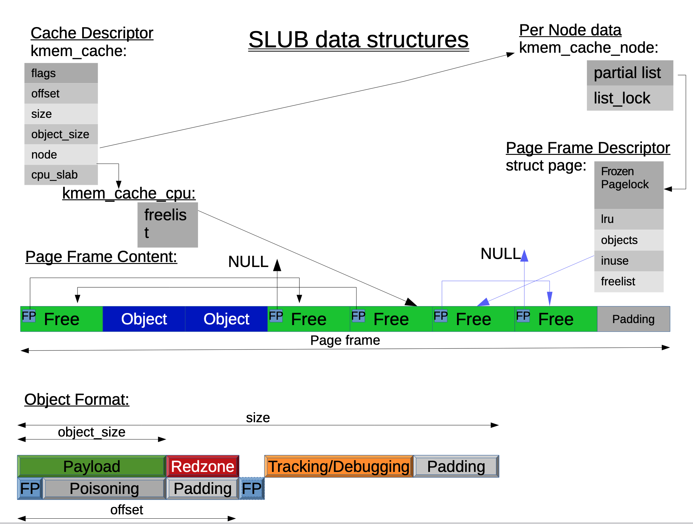

# Linux 内存分配器

## Linux 5.15

Linux 5.15 是 Ubuntu 22.04 Jammy 使用的默认内核版本。下面针对 Linux 5.15 的源码，分析它的内存分配器实现。

首先来看 Linux 内核提供了哪些内存分配的 API，参考 [Memory Allocation Guide](https://www.kernel.org/doc/html/v5.15/core-api/memory-allocation.html)：

- 对于小块数据的分配，用 kmalloc/kmalloc_array/krealloc_array/kcalloc/kzalloc/kmem_cache_alloc
- 对于较大块数据的分配，用 vmalloc/vzalloc
- 以页为单位进行分配：alloc_pages
- 其他专用的分配器：cma_alloc/zs_malloc

分配时会需要传入一个 GFP（Get Free Pages）参数，常见是 GFP_KERNEL 和 GFP_KERNEL_ACCOUNT，其中后者有额外的安全保护措施，通常用于由用户态触发的内存分配。如果要分配用户态的内存，用 GFP_USER。

### slab cache allocator

其中小块数据的分配，用的是 slab cache allocator，一共有三代实现：SLOB，SLAB 和 SLUB，目前的版本是 SLUB。它会把大小相同的对象放在一起，在 `/proc/slabinfo` 可以看到它的信息：

```shell
$ cat /proc/slabinfo
slabinfo - version: 2.1
# name            <active_objs> <num_objs> <objsize> <objperslab> <pagesperslab> : tunables <limit> <batchcount> <sharedfactor> : slabdata <active_slabs> <num_>
task_struct         1922   2100   6528    5    8 : tunables    0    0    0 : slabdata    420    420      0
```

意思是它可以保存 2100 个 `struct task_struct`，已经分配了 1922 个，每个 `struct task_struct` 是 6528 字节，每个 slab 可以保存 5 个 `struct task_struct`，也就是 `6528 * 5 = 32640` 字节，保存在 `ceil(32640 / 4096) = 8` 个 4KB 大小的页。这个叫做 `task_struct` 的 slab cache allocator 是在代码中这样创建出来的：

```c
// in kernel/fork.c:fork_init
/* create a slab on which task_structs can be allocated */
task_struct_whitelist(&useroffset, &usersize);
task_struct_cachep = kmem_cache_create_usercopy("task_struct",
		arch_task_struct_size, align,
		SLAB_PANIC|SLAB_ACCOUNT,
		useroffset, usersize, NULL);
```

后续要分配 `struct task_struct` 的时候，都用这个 `struct kmem_cache *`：

```c
// in kernel/fork.c
static struct kmem_cache *task_struct_cachep;

static inline struct task_struct *alloc_task_struct_node(int node)
{
	return kmem_cache_alloc_node(task_struct_cachep, GFP_KERNEL, node);
}

static inline void free_task_struct(struct task_struct *tsk)
{
	kmem_cache_free(task_struct_cachep, tsk);
}
```

#### 基本概念

slab cache allocator 每次只能分配固定大小的内存，所以需要不同的 slab cache allocator，用于分配不同大小的结构体。

slab cache allocator 使用 alloc_pages 调用去获取 2 的幂次个页，这些页在虚拟地址和物理地址上都是连续的，这些页构成一个 slab，所以上面会看到 pages per slab 都是 2 的幂次。slab cache allocator 会维护多个 slab，每个 slab 对应若干个页。这些页里面会保存实际的对象。

#### struct kmem_cache

首先来看这个 `struct kmem_cache` 是怎么维护内存的。它的定义在 `include/linux/slub_def.h` 中：

```c
struct kmem_cache {
	struct kmem_cache_cpu __percpu *cpu_slab;
	/* Used for retrieving partial slabs, etc. */
	slab_flags_t flags;
	unsigned long min_partial;
	unsigned int size;	/* The size of an object including metadata */
	unsigned int object_size;/* The size of an object without metadata */
	struct reciprocal_value reciprocal_size;
	unsigned int offset;	/* Free pointer offset */
	/* Number of per cpu partial objects to keep around */
	unsigned int cpu_partial;
	struct kmem_cache_order_objects oo;

	/* Allocation and freeing of slabs */
	struct kmem_cache_order_objects max;
	struct kmem_cache_order_objects min;
	gfp_t allocflags;	/* gfp flags to use on each alloc */
	int refcount;		/* Refcount for slab cache destroy */
	void (*ctor)(void *);
	unsigned int inuse;		/* Offset to metadata */
	unsigned int align;		/* Alignment */
	unsigned int red_left_pad;	/* Left redzone padding size */
	const char *name;	/* Name (only for display!) */
	struct list_head list;	/* List of slab caches */
	struct kobject kobj;	/* For sysfs */
	unsigned long random;

	/*
	 * Defragmentation by allocating from a remote node.
	 */
	unsigned int remote_node_defrag_ratio;

	unsigned int *random_seq;

	unsigned int useroffset;	/* Usercopy region offset */
	unsigned int usersize;		/* Usercopy region size */

	struct kmem_cache_node *node[MAX_NUMNODES];
};
```

在这里面，比较重要的是 `struct kmem_cache_node *node[MAX_NUMNODES]` 字段，它维护了每个 NUMA Node 对应的内存里保存的数据，在 `mm/slab.h` 中的定义如下：

```c
struct kmem_cache_node {
	spinlock_t list_lock;
	unsigned long nr_partial;
	struct list_head partial;
};
```

它的 `partial` 字段是一个双向链表的链表头，除了 `kmem_cache_node` 本身，其他的结点的类型都是 `struct page`，维护了哪些 slab 还有没有被分配的空间。`struct page` 是在通过 `alloc_pages` 分配若干个连续的页（即一个 slab）的时候，被构造的结构体，它内部预留了 5 个 size_t 大小的字段，给内核里这些连续的页的使用者预留，在这里 slab cache allocator 就是这个使用者，它的用法是：

```c
struct {
    union {
        struct list_head slab_list;
        struct {	/* Partial pages */
            struct page *next;
            int pages;	/* Nr of pages left */
            int pobjects;	/* Approximate count */
        };
    };
    struct kmem_cache *slab_cache; /* not slob */
    /* Double-word boundary */
    void *freelist;		/* first free object */
    union {
        unsigned long counters;		/* SLUB */
        struct {			/* SLUB */
            unsigned inuse:16;
            unsigned objects:15;
            unsigned frozen:1;
        };
    };
};
```

也就是说，slab cache allocator 维护了若干个 slab，每个 slab 对应若干个连续的页，它的元数据保存在 `struct page` 当中，元数据记录了 slab 链表，统计数据，以及 freelist 指针的信息。

#### kmem_cache_alloc (fast path)

根据以上信息，可以推测出 slab cache allocator 的工作方式：它会用 alloc_pages 分配并维护连续的若干个页（即一个 slab），然后在页里面放若干个相同大小的 object：这个 object 除了保存实际 malloc 出来的数据以外，还有一些元数据和 padding。当一个 object 被释放的时候，它内部会记录一个指针，指向下一个空闲 object 的地址，然后这些地址组成一个 freelist 的单向链表。这个 freelist 的单向链表的链表头，保存在 `struct page` 的 freelist 字段里面，或者在后面会看到的 per-cpu 结构体 `struct kmem_cache_cpu` 的 freelist 字段里面。要分配内存的时候，只需要：

1. 根据传入的 kmem_cache，找到一个 freelist，为了性能，首先用 per-cpu 的 `struct kmem_cache_cpu` 的 freelist
2. 如果 freelist 有空闲块，就把一个空闲块从 freelist 中取出，然后更新 freelist，指向它的下一个空闲块
3. 如果 freelist 已经满了，就走 slow path，寻找其他 freelist，或者申请更多的页

接下来看这个 `struct kmem_cache` 是怎么实现分配的。先不考虑 NUMA-aware，分配的入口是 `kmem_cache_alloc` 函数：

```c
// in mm/slub.c
void *kmem_cache_alloc(struct kmem_cache *s, gfp_t gfpflags)
{
	void *ret = slab_alloc(s, gfpflags, _RET_IP_, s->object_size);

	trace_kmem_cache_alloc(_RET_IP_, ret, s->object_size,
				s->size, gfpflags);

	return ret;
}

static __always_inline void *slab_alloc(struct kmem_cache *s,
		gfp_t gfpflags, unsigned long addr, size_t orig_size)
{
	return slab_alloc_node(s, gfpflags, NUMA_NO_NODE, addr, orig_size);
}
```

可以看到最终会调用到 `slab_alloc_node`，并且通过 `NUMA_NO_NODE` 表示不指定 NUMA Node。接下来看 `slab_alloc_node` 的实现：

```c
// in mm/slub.c
static __always_inline void *slab_alloc_node(struct kmem_cache *s,
		gfp_t gfpflags, int node, unsigned long addr, size_t orig_size)
{
	void *object;
	struct kmem_cache_cpu *c;
	struct page *page;
	unsigned long tid;
	struct obj_cgroup *objcg = NULL;
	bool init = false;
    // some code omitted

    // allocation loop
redo:
    // access per-cpu cpu_slab field
	c = raw_cpu_ptr(s->cpu_slab);
	tid = READ_ONCE(c->tid);

	barrier();

    // access freelist and page
	object = c->freelist;
	page = c->page;

	if (IS_ENABLED(CONFIG_PREEMPT_RT) ||
	    unlikely(!object || !page || !node_match(page, node))) {
        // slow-path: call __slab_alloc to do the actual alloc
		object = __slab_alloc(s, gfpflags, node, addr, c);
	} else {
        // fast-path: allocate object from the freelist
		void *next_object = get_freepointer_safe(s, object);

		if (unlikely(!this_cpu_cmpxchg_double(
				s->cpu_slab->freelist, s->cpu_slab->tid,
				object, tid,
				next_object, next_tid(tid)))) {
            // some code omitted
			goto redo;
		}
        // some code omitted
	}

    // some code omitted
	return object;
}
```

它做的事情是：

1. 读取 kmem_cache 里的 Per-CPU cpu_slab 字段，它是 kmem_cache_cpu 类型，定义如下：

    ```c
    // in include/linux/slub_def.h
    struct kmem_cache_cpu {
        void **freelist;	/* Pointer to next available object */
        unsigned long tid;	/* Globally unique transaction id */
        struct page *page;	/* The slab from which we are allocating */
        struct page *partial;	/* Partially allocated frozen slabs */
        local_lock_t lock;	/* Protects the fields above */
    };
    ```

2. 接下来访问它的 tid 字段，这代表它的 freelist 的版本。先读取版本，再使用 freelist，使用 get_freepointer_safe 函数，找到 freelist 里的下一个空闲块的地址，这个地址就保存在这个空闲块内 offset 的位置：

    ```c
    // in mm/slub.c
    static inline void *get_freepointer_safe(struct kmem_cache *s, void *object)
    {
        unsigned long freepointer_addr;
        void *p;

        // some code is omitted
        // compute the address of free pointer
        freepointer_addr = (unsigned long)object + s->offset;
        copy_from_kernel_nofault(&p, (void **)freepointer_addr, sizeof(p));
        return freelist_ptr(s, p, freepointer_addr);
    }
    ```

3. 然后使用 cmpxchg，原子更新 freelist 链表头，指向下一个空闲块的地址，失败就会重试分配：

    ```c
    // in mm/slub.c
    if (unlikely(!this_cpu_cmpxchg_double(
            s->cpu_slab->freelist, s->cpu_slab->tid,
            object, tid,
            next_object, next_tid(tid)))) {
        // some code omitted
        goto redo;
    }
    ```

4. 如果分配失败，就调用 `object = __slab_alloc(s, gfpflags, node, addr, c);` 进入 slow path 逻辑

简单来说，在 `slab_alloc_node` 函数里，实现了一个 fast path 逻辑，它直接访问一个 per-cpu 的结构体，它内部记录了一个 freelist 指针，它是一个把空闲块串起来的单向链表。为了避免不同 CPU 抢占一个共享变量，使用了 per-cpu 结构体。这个思路很像 [glibc 内存分配器](./glibc_allocator.md) 里的 tcache，它是个 per-thread 的结构体，避免了锁。但内核里有抢占的存在，虽然不用锁，但还是需要用原子指令，为了性能，使用 compare exchange 进行原子更新，这有点类似 [glibc 内存分配器](./glibc_allocator.md) 里的 fast bin。

那么，为什么要用版本号 `tid` 呢？其实这是因为 compare exchange 有 ABA 问题，即从读取旧值到 compare exchange 中途，如果出现了两次改变 `A->B->A`，并且值被变回来了，那么 compare exchange 依然会成功，就好像这两次改变没有发生一样。但是添加版本号以后，即使值变了回来，版本号也变了 `(A,0)->(B,1)->(A,2)`，所以如果 compare exchange 成功，那么中途一定没有其他修改。这个 trick 需要处理器支持双倍 size_t 大小的 compare exchange，并且这个 trick 也被用在 qemu 中：用 compare exchange 模拟 LL/SC 的语义，并且避免 ABA 问题。

#### __slab_alloc (slow path)

接下来看 slow path，也就是 __slab_alloc 的实现，此时我们知道 per-cpu 的无锁 freelist 已经是空的，需要去寻找一个没有满的 slab（叫做 partial slab，和 full slab 相对），从它的 freelist 里取出空闲块：

```c
static void *__slab_alloc(struct kmem_cache *s, gfp_t gfpflags, int node,
			  unsigned long addr, struct kmem_cache_cpu *c)
{
	void *p;

#ifdef CONFIG_PREEMPT_COUNT
	/*
	 * We may have been preempted and rescheduled on a different
	 * cpu before disabling preemption. Need to reload cpu area
	 * pointer.
	 */
	c = slub_get_cpu_ptr(s->cpu_slab);
#endif

	p = ___slab_alloc(s, gfpflags, node, addr, c);
#ifdef CONFIG_PREEMPT_COUNT
	slub_put_cpu_ptr(s->cpu_slab);
#endif
	return p;
}

static void *___slab_alloc(struct kmem_cache *s, gfp_t gfpflags, int node,
			  unsigned long addr, struct kmem_cache_cpu *c)
{
	void *freelist;
	struct page *page;
	unsigned long flags;

	stat(s, ALLOC_SLOWPATH);

reread_page:

	page = READ_ONCE(c->page);
	if (!page) {
		/*
		 * if the node is not online or has no normal memory, just
		 * ignore the node constraint
		 */
		if (unlikely(node != NUMA_NO_NODE &&
			     !node_isset(node, slab_nodes)))
			node = NUMA_NO_NODE;
		goto new_slab;
	}
redo:

	if (unlikely(!node_match(page, node))) {
		/*
		 * same as above but node_match() being false already
		 * implies node != NUMA_NO_NODE
		 */
		if (!node_isset(node, slab_nodes)) {
			node = NUMA_NO_NODE;
			goto redo;
		} else {
			stat(s, ALLOC_NODE_MISMATCH);
			goto deactivate_slab;
		}
	}

	/*
	 * By rights, we should be searching for a slab page that was
	 * PFMEMALLOC but right now, we are losing the pfmemalloc
	 * information when the page leaves the per-cpu allocator
	 */
	if (unlikely(!pfmemalloc_match_unsafe(page, gfpflags)))
		goto deactivate_slab;

	/* must check again c->page in case we got preempted and it changed */
	local_lock_irqsave(&s->cpu_slab->lock, flags);
	if (unlikely(page != c->page)) {
		local_unlock_irqrestore(&s->cpu_slab->lock, flags);
		goto reread_page;
	}
	freelist = c->freelist;
	if (freelist)
		goto load_freelist;

	freelist = get_freelist(s, page);

	if (!freelist) {
		c->page = NULL;
		local_unlock_irqrestore(&s->cpu_slab->lock, flags);
		stat(s, DEACTIVATE_BYPASS);
		goto new_slab;
	}

	stat(s, ALLOC_REFILL);

load_freelist:

	lockdep_assert_held(this_cpu_ptr(&s->cpu_slab->lock));

	/*
	 * freelist is pointing to the list of objects to be used.
	 * page is pointing to the page from which the objects are obtained.
	 * That page must be frozen for per cpu allocations to work.
	 */
	VM_BUG_ON(!c->page->frozen);
	c->freelist = get_freepointer(s, freelist);
	c->tid = next_tid(c->tid);
	local_unlock_irqrestore(&s->cpu_slab->lock, flags);
	return freelist;

deactivate_slab:

	local_lock_irqsave(&s->cpu_slab->lock, flags);
	if (page != c->page) {
		local_unlock_irqrestore(&s->cpu_slab->lock, flags);
		goto reread_page;
	}
	freelist = c->freelist;
	c->page = NULL;
	c->freelist = NULL;
	local_unlock_irqrestore(&s->cpu_slab->lock, flags);
	deactivate_slab(s, page, freelist);

new_slab:

	if (slub_percpu_partial(c)) {
		local_lock_irqsave(&s->cpu_slab->lock, flags);
		if (unlikely(c->page)) {
			local_unlock_irqrestore(&s->cpu_slab->lock, flags);
			goto reread_page;
		}
		if (unlikely(!slub_percpu_partial(c))) {
			local_unlock_irqrestore(&s->cpu_slab->lock, flags);
			/* we were preempted and partial list got empty */
			goto new_objects;
		}

		page = c->page = slub_percpu_partial(c);
		slub_set_percpu_partial(c, page);
		local_unlock_irqrestore(&s->cpu_slab->lock, flags);
		stat(s, CPU_PARTIAL_ALLOC);
		goto redo;
	}

new_objects:

	freelist = get_partial(s, gfpflags, node, &page);
	if (freelist)
		goto check_new_page;

	slub_put_cpu_ptr(s->cpu_slab);
	page = new_slab(s, gfpflags, node);
	c = slub_get_cpu_ptr(s->cpu_slab);

	if (unlikely(!page)) {
		slab_out_of_memory(s, gfpflags, node);
		return NULL;
	}

	/*
	 * No other reference to the page yet so we can
	 * muck around with it freely without cmpxchg
	 */
	freelist = page->freelist;
	page->freelist = NULL;

	stat(s, ALLOC_SLAB);

check_new_page:

	if (kmem_cache_debug(s)) {
		if (!alloc_debug_processing(s, page, freelist, addr)) {
			/* Slab failed checks. Next slab needed */
			goto new_slab;
		} else {
			/*
			 * For debug case, we don't load freelist so that all
			 * allocations go through alloc_debug_processing()
			 */
			goto return_single;
		}
	}

	if (unlikely(!pfmemalloc_match(page, gfpflags)))
		/*
		 * For !pfmemalloc_match() case we don't load freelist so that
		 * we don't make further mismatched allocations easier.
		 */
		goto return_single;

retry_load_page:

	local_lock_irqsave(&s->cpu_slab->lock, flags);
	if (unlikely(c->page)) {
		void *flush_freelist = c->freelist;
		struct page *flush_page = c->page;

		c->page = NULL;
		c->freelist = NULL;
		c->tid = next_tid(c->tid);

		local_unlock_irqrestore(&s->cpu_slab->lock, flags);

		deactivate_slab(s, flush_page, flush_freelist);

		stat(s, CPUSLAB_FLUSH);

		goto retry_load_page;
	}
	c->page = page;

	goto load_freelist;

return_single:

	deactivate_slab(s, page, get_freepointer(s, freelist));
	return freelist;
}
```

这段代码有点长，下面整理一下它的工作流程：

1. 首先尝试读取当前 per-cpu 结构体的 slab（即 `c->page`），如果它是空指针的，那就去分配一个新的 slab
2. 如果新分配了一个 slab，或者有了 slab，那就把它的 freelist 接管过来：把 `struct page` 里面的 freelist 复制到 per-cpu 结构体里面的 freelist 指针，然后把 `struct page` 里面的 freelist 指针改成 NULL，当然这个过程需要用 compare exchange 来进行，并标记这个 slab 为 frozen 状态，即被一个 cpu core 占用了，只能由这个 cpu core 来分配新的空闲块
3. 如果获取到一个非空的 freelist，就从链表头分配空闲块，更新 freelist，指向下一个空闲块
4. 如果没有非空的 freelist，再去分配一个新的 slab

#### kmem_cache_free

接下来看看 free 的实现：

```c
void kmem_cache_free(struct kmem_cache *s, void *x)
{
	s = cache_from_obj(s, x);
	if (!s)
		return;
	slab_free(s, virt_to_head_page(x), x, NULL, 1, _RET_IP_);
	trace_kmem_cache_free(_RET_IP_, x, s->name);
}
```

它首先利用内核的 `virt_to_head_page` 功能来查询这个虚拟地址属于哪个 slab，因为每个 slab 是使用 `alloc_pages` 分配出来的连续的页，所以可以用这个函数快速地找到 slab 的 `struct page`，然后根据它内部的 slab_cache 字段找到它对应的 `struct kmem_cache`。找到 slab 以后，接下来也分 fast path 和 slow path，其中 fast path 逻辑在 `do_slab_free` 中实现：

```c
static __always_inline void do_slab_free(struct kmem_cache *s,
				struct page *page, void *head, void *tail,
				int cnt, unsigned long addr)
{
	void *tail_obj = tail ? : head;
	struct kmem_cache_cpu *c;
	unsigned long tid;

	/* memcg_slab_free_hook() is already called for bulk free. */
	if (!tail)
		memcg_slab_free_hook(s, &head, 1);
redo:
	/*
	 * Determine the currently cpus per cpu slab.
	 * The cpu may change afterward. However that does not matter since
	 * data is retrieved via this pointer. If we are on the same cpu
	 * during the cmpxchg then the free will succeed.
	 */
	c = raw_cpu_ptr(s->cpu_slab);
	tid = READ_ONCE(c->tid);

	/* Same with comment on barrier() in slab_alloc_node() */
	barrier();

	if (likely(page == c->page)) {
#ifndef CONFIG_PREEMPT_RT
		void **freelist = READ_ONCE(c->freelist);

		set_freepointer(s, tail_obj, freelist);

		if (unlikely(!this_cpu_cmpxchg_double(
				s->cpu_slab->freelist, s->cpu_slab->tid,
				freelist, tid,
				head, next_tid(tid)))) {

			note_cmpxchg_failure("slab_free", s, tid);
			goto redo;
		}
#else /* CONFIG_PREEMPT_RT */
		/*
		 * We cannot use the lockless fastpath on PREEMPT_RT because if
		 * a slowpath has taken the local_lock_irqsave(), it is not
		 * protected against a fast path operation in an irq handler. So
		 * we need to take the local_lock. We shouldn't simply defer to
		 * __slab_free() as that wouldn't use the cpu freelist at all.
		 */
		void **freelist;

		local_lock(&s->cpu_slab->lock);
		c = this_cpu_ptr(s->cpu_slab);
		if (unlikely(page != c->page)) {
			local_unlock(&s->cpu_slab->lock);
			goto redo;
		}
		tid = c->tid;
		freelist = c->freelist;

		set_freepointer(s, tail_obj, freelist);
		c->freelist = head;
		c->tid = next_tid(tid);

		local_unlock(&s->cpu_slab->lock);
#endif
		stat(s, FREE_FASTPATH);
	} else
		__slab_free(s, page, head, tail_obj, cnt, addr);
}
```

大概思路是，如果要释放的 object，刚好在当前 cpu core 占用的 slab 内，就直接把它放到 per-cpu 的 freelist 链表头即可，不用加锁，直接原子指令完成，所以是 fast path。如果释放的 object 不在当前 cpu core 接管的 slab 内，就进入 slow path，在 `__slab_free` 中实现：

```c
static void __slab_free(struct kmem_cache *s, struct page *page,
			void *head, void *tail, int cnt,
			unsigned long addr)

{
	void *prior;
	int was_frozen;
	struct page new;
	unsigned long counters;
	struct kmem_cache_node *n = NULL;
	unsigned long flags;

	stat(s, FREE_SLOWPATH);

	if (kfence_free(head))
		return;

	if (kmem_cache_debug(s) &&
	    !free_debug_processing(s, page, head, tail, cnt, addr))
		return;

	do {
		if (unlikely(n)) {
			spin_unlock_irqrestore(&n->list_lock, flags);
			n = NULL;
		}
		prior = page->freelist;
		counters = page->counters;
		set_freepointer(s, tail, prior);
		new.counters = counters;
		was_frozen = new.frozen;
		new.inuse -= cnt;
		if ((!new.inuse || !prior) && !was_frozen) {

			if (kmem_cache_has_cpu_partial(s) && !prior) {

				/*
				 * Slab was on no list before and will be
				 * partially empty
				 * We can defer the list move and instead
				 * freeze it.
				 */
				new.frozen = 1;

			} else { /* Needs to be taken off a list */

				n = get_node(s, page_to_nid(page));
				/*
				 * Speculatively acquire the list_lock.
				 * If the cmpxchg does not succeed then we may
				 * drop the list_lock without any processing.
				 *
				 * Otherwise the list_lock will synchronize with
				 * other processors updating the list of slabs.
				 */
				spin_lock_irqsave(&n->list_lock, flags);

			}
		}

	} while (!cmpxchg_double_slab(s, page,
		prior, counters,
		head, new.counters,
		"__slab_free"));

	if (likely(!n)) {

		if (likely(was_frozen)) {
			/*
			 * The list lock was not taken therefore no list
			 * activity can be necessary.
			 */
			stat(s, FREE_FROZEN);
		} else if (new.frozen) {
			/*
			 * If we just froze the page then put it onto the
			 * per cpu partial list.
			 */
			put_cpu_partial(s, page, 1);
			stat(s, CPU_PARTIAL_FREE);
		}

		return;
	}

	if (unlikely(!new.inuse && n->nr_partial >= s->min_partial))
		goto slab_empty;

	/*
	 * Objects left in the slab. If it was not on the partial list before
	 * then add it.
	 */
	if (!kmem_cache_has_cpu_partial(s) && unlikely(!prior)) {
		remove_full(s, n, page);
		add_partial(n, page, DEACTIVATE_TO_TAIL);
		stat(s, FREE_ADD_PARTIAL);
	}
	spin_unlock_irqrestore(&n->list_lock, flags);
	return;

slab_empty:
	if (prior) {
		/*
		 * Slab on the partial list.
		 */
		remove_partial(n, page);
		stat(s, FREE_REMOVE_PARTIAL);
	} else {
		/* Slab must be on the full list */
		remove_full(s, n, page);
	}

	spin_unlock_irqrestore(&n->list_lock, flags);
	stat(s, FREE_SLAB);
	discard_slab(s, page);
}
```

它的思路是，找到对应的 slab，把 object 放到对应的 freelist 内，如果它之前是满的，那么现在就有空闲块了，就可以被放到 partial slab list 中，用于后续的分配。

#### 小结

所以其实 slab cache allocator 的实现思路并不复杂：

1. 要保存的 object 都是相同大小的，所以把连续的几个页作为一个 slab，内部按照固定大小划分多个块，每个块放一个 object
2. 每个 slab 维护一个 freelist 单向链表，链表头保存在 slab 的元数据 `struct page` 中，链表的 next 指针保存在空闲块内部
3. 为了性能，避免锁的使用，维护一个 per-cpu 的 freelist 在 `struct kmem_cache_cpu` 当中，它可以接管某个 slab，把 slab 的 freelist 里的空闲块都转移到 per-cpu 的 freelist 中，使得这个 slab 只能被当前的 cpu core 来分配新的空闲块，此时这个 slab 是 frozen 状态
4. 为了实现 NUMA Aware，在分配内存的时候，可以指定在哪个 NUMA Node 上进行，此时会去 `struct kmem_cache.node` 字段寻找对应 NUMA Node 的 partial slab list，在里面寻找有空闲块的 slab 来进行分配

下面是 [Slab allocators in the Linux Kernel: SLAB, SLOB, SLUB](https://events.static.linuxfound.org/sites/events/files/slides/slaballocators.pdf) 文中的结构图，画的比较明了：



## 参考

- [Slab allocators in the Linux Kernel: SLAB, SLOB, SLUB](https://events.static.linuxfound.org/sites/events/files/slides/slaballocators.pdf)
- [Linux SLUB Allocator Internals and Debugging, Part 1 of 4](https://blogs.oracle.com/linux/post/linux-slub-allocator-internals-and-debugging-1)
- [Linux SLUB Allocator Internals and Debugging, Part 2 of 4](https://blogs.oracle.com/linux/post/linux-slub-allocator-internals-and-debugging-2)
- [Linux SLUB Allocator Internals and Debugging, Part 3 of 4](https://blogs.oracle.com/linux/post/linux-slub-allocator-internals-and-debugging-3)
- [Linux SLUB Allocator Internals and Debugging, Part 4 of 4](https://blogs.oracle.com/linux/post/linux-slub-allocator-internals-and-debugging-4)
