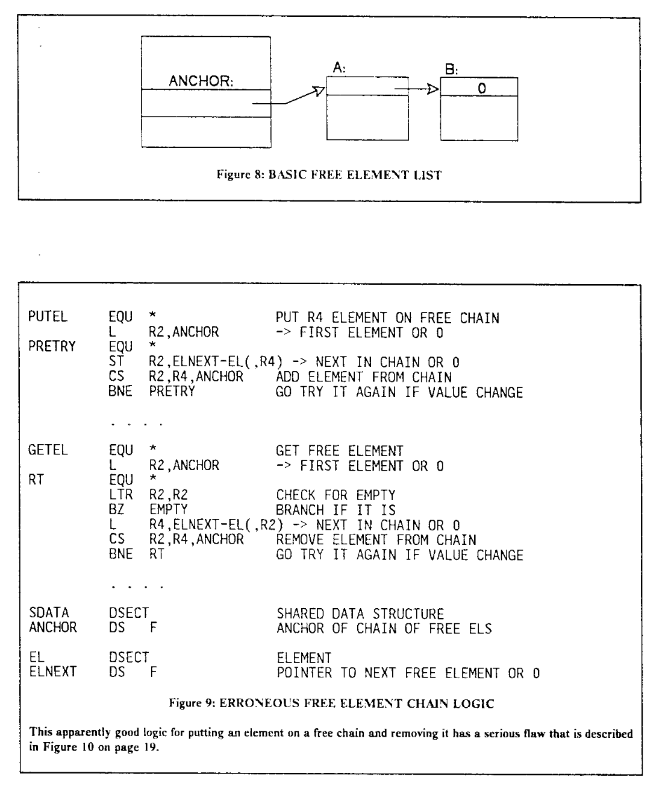
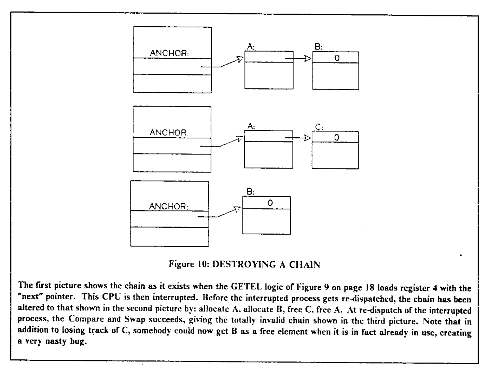
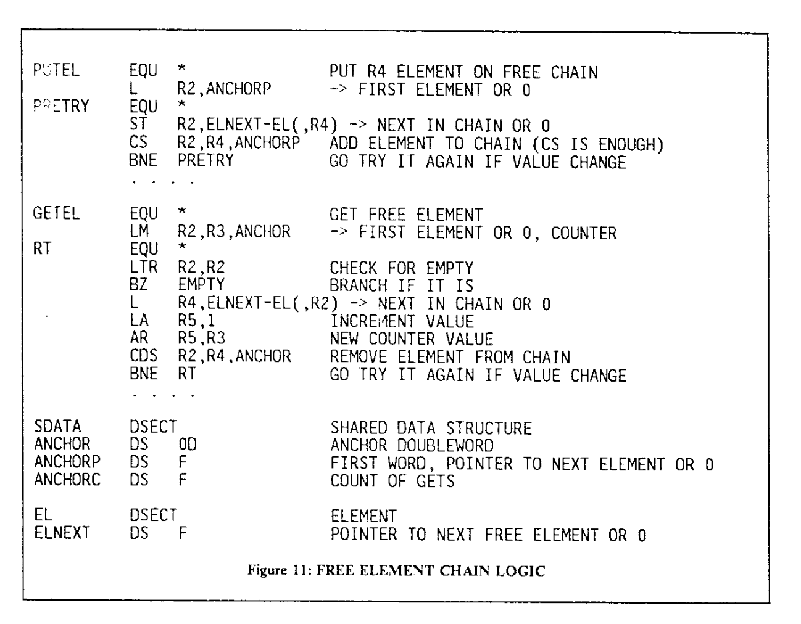

# Lock Free 数据结构

## Treiber Stack

Treiber Stack 是一个 Lock-Free 的 Stack，支持 Push 和 Pop 操作，由 R. Kent Treiber 在 1986 年提出，出现在 [Systems Programming: Coping With Parallelism](https://dominoweb.draco.res.ibm.com/reports/rj5118.pdf) 第 17 页。原文中，它是由汇编编写的：

<figure markdown>
  { width="400" }
  <figcaption>Treiber Stack（图源 <a href="https://dominoweb.draco.res.ibm.com/reports/rj5118.pdf">Systems Programming: Coping With Parallelism Page 18</a>）</figcaption>
</figure>

翻译成 C++ 代码，它做的事情大概是（参考了 [cppreference](https://en.cppreference.com/w/cpp/atomic/atomic/compare_exchange)）：

```c++
#include <atomic>
#include <optional>

template <class T> struct Node {
  T data;        // user data
  Node<T> *next; // pointer to next node

  Node(const T &data) : data(data), next(nullptr) {}
};

template <class T> struct Stack {
  // paper: ANCHOR
  // head of singly linked list
  std::atomic<Node<T> *> head;

  Stack() : head(nullptr) {}

  // paper: PUTEL
  void push(const T &data) {
    Node<T> *new_head = new Node<T>(data);

    // paper: L R2, ANCHOR
    // read current head
    Node<T> *cur_head = head.load(std::memory_order_relaxed);

    // paper: ST R2, ELNEXT-EL(,R4)
    // link the new list
    new_head->next = cur_head;

    // paper: CS R2, R4, ANCHOR; ST R2, ELNEXT-EL(,R4) on failure
    // atomic swap if head == new_head->next
    // on success: head becomes new_head
    // on failure: new_head->next becomes the current value of head, and loop
    // release order: ensure new_head->next = cur_head is observed before CAS
    while (!head.compare_exchange_weak(new_head->next, new_head,
                                       std::memory_order_release,
                                       std::memory_order_relaxed))
      ;
  }

  // paper: GETEL
  std::optional<T> pop() {
    Node<T> *cur_head;
    // paper: L R2, ANCHOR
    // read current head
    cur_head = head.load(std::memory_order_relaxed);

    // paper: LTR R2, R2; BZ EMPTY
    while (cur_head) {
      // paper: L R4, ELNEXT-EL(,R2)
      // cur_head->next becomes the new list head
      Node<T> *new_head = cur_head->next;

      // paper: CS R2, R4, ANCHOR
      // atomic swap if head == cur_head
      // on success: head becomes new_head
      // on failure: cur_head becomes the current value of head, and loop
      // release order: ensure cur_head->data is done after CAS
      if (head.compare_exchange_weak(cur_head, new_head,
                                     std::memory_order_acquire,
                                     std::memory_order_relaxed)) {
        // success
        T result = cur_head->data;
        delete cur_head;
        return result;
      }
    }

    // no elements
    return {};
  }
};
```

生成的 AMD64 汇编指令如下：

```asm
tack<int>::push(int const&):
        # function prologue
        pushq   %rbp
        movq    %rsi, %rbp
        pushq   %rbx
        # rbx = &head
        movq    %rdi, %rbx

        # call operator new to allocate 16 bytes of memory
        movl    $16, %edi
        subq    $8, %rsp
        call    operator new(unsigned long)
        # new_head = new (16)
        movq    %rax, %rdx
        # eax = data
        movl    0(%rbp), %eax
        # new_head->next = nullptr
        movq    $0, 8(%rdx)
        leaq    8(%rdx), %rcx
        # new_head->data = data
        movl    %eax, (%rdx)
        # cur_head = head.load()
        movq    (%rbx), %rax
        # new_head->next = cur_head
        movq    %rax, 8(%rdx)
.L8:
        # rax = new_head->next
        movq    (%rcx), %rax
        # compare rax(new_head->next) and head
        # if equal: head = new_head
        # else: rax = head
        lock cmpxchgq   %rdx, (%rbx)
        # jump to .L9 if swapped
        je      .L9
        # new_head->next = rax
        movq    %rax, (%rcx)
        # try again
        jmp     .L8
.L9:
        addq    $8, %rsp
        popq    %rbx
        popq    %rbp
        ret

Stack<int>::pop():
        subq    $40, %rsp
        # cur_head = head.load()
        movq    (%rdi), %rax
.L12:
        testq   %rax, %rax
        # jump to .L22 if cur_head is null
        je      .L22
        # new_head = cur_head->next
        movq    8(%rax), %rdx
        # compare rax(cur_head) and head
        # if equal: head = new_head
        # else: rax = head
        lock cmpxchgq   %rdx, (%rdi)
        # jump to .L12 if not swapped
        jne     .L12
        # result = cur_head->data
        movl    (%rax), %edx
        testq   %rax, %rax
        # jump to .L23 if cur_head != NULL
        jne     .L23
.L13:
        movl    %edx, 24(%rsp)
        movb    $1, 28(%rsp)
.L14:
        # return cur_head->data
        movq    24(%rsp), %rax
        addq    $40, %rsp
        ret
.L23:
        movl    $16, %esi
        movq    %rax, %rdi
        movl    %edx, 12(%rsp)
        # delete cur_head
        call    operator delete(void*, unsigned long)
        movl    12(%rsp), %edx
        jmp     .L13
.L22:
        movq    $0, 24(%rsp)
        jmp     .L14
```

可见核心就是 [`lock cmpxchgq reg, mem` 指令](https://www.felixcloutier.com/x86/cmpxchg)，它的语义是：

- 比较 mem 指向的内存中的值和 rax 寄存器的值
- 如果相等：ZF=1，把 reg 的值写入到 mem 指向的内容
- 如果不相等：ZF=0，把 mem 指向的内存中的值，写入到 rax 寄存器

并且整个过程是原子的。

在 ARMv8.1-a 上编译，则：

- push 会用 CASL 指令实现 release order 的 64-bit CAS
- pop 会用 CASA 指令实现 acquire order 的 64-bit CAS

`CAS{A,L} Xs, Xt, [Xn|SP, #0]` 的语义：

- 比较 [Xn|SP, #0] 指向的内存中的值和 Xs 寄存器的值
- 如果相等：把 Xt 的值写入到 [Xn|SP, #0] 指向的内容
- 如果不相等：把 [Xn|SP, #0] 指向的内存中的值，写入到 Xs 寄存器

为了判断是否交换成功，还需要额外的 CMP 指令，判断 Xs 在执行 CAS 指令前后的值是否相同。

### ABA 问题以及解决方法

但是这样的实现有一个 ABA 问题（ABA 指某个值从 A 改成 B 再改成 A）：CAS 是根据指针的值来判断是否要 swap，但是指针的值不变，不代表指针指向的还是同一个对象。例如 head 指针（下图的 ANCHOR）指向的 node（下图的 A）被 pop 掉了，未来又重新 push，push 的时候恰好 `new` 出来了同一个指针，就会导致 CAS 写入 next 指针的值用的是原来的 node（下图的 A）的 next（下图的 B），但这个值此时是非法的：

<figure markdown>
  { width="400" }
  <figcaption>Treiber Stack 的 ABA 问题（图源 <a href="https://dominoweb.draco.res.ibm.com/reports/rj5118.pdf">Systems Programming: Coping With Parallelism Figure 10 on Page 19</a>）</figcaption>
</figure>

为了解决这个问题，需要把链表头指针和一个整数绑在一起，二者同时 CAS：每次更新指针的时候，就把这个整数加一，这样就可以区分出前后两个 A 指针了，即使它们指针的值相同，但是整数不同，依然可以正常区分。这需要硬件的支持，通常叫做 Double-wide compare and swap，详见 [原子指令](./atomic_instructions.md)。更新后的汇编版本：

<figure markdown>
  { width="400" }
  <figcaption>Treiber Stack 修正 ABA 问题的版本（图源 <a href="https://dominoweb.draco.res.ibm.com/reports/rj5118.pdf">Systems Programming: Coping With Parallelism Figure 11 on Page 20</a>）</figcaption>
</figure>

对应的 C++ 版本：

```c++
#include <atomic>
#include <optional>

template <class T> struct Node {
  T data;        // user data
  Node<T> *next; // pointer to next node

  Node(const T &data) : data(data), next(nullptr) {}
};

template <class T> struct HeadWithCounter {
  // paper: ANCHORP
  // head of singly linked list
  Node<T> *head;
  // paper: ANCHORC
  // allocation counter
  size_t counter;

  HeadWithCounter() : head(nullptr), counter(0) {}
};

template <class T> struct Stack {
  // paper: ANCHOR
  // head of singly linked list with counter
  std::atomic<HeadWithCounter<T>> head;

  Stack() : head(HeadWithCounter<T>()) {}

  // paper: PUTEL
  void push(const T &data) {
    HeadWithCounter<T> new_head;
    new_head.head = new Node<T>(data);

    // paper: L R2, ANCHORP
    // read current head
    // in paper, only head pointer is used for CAS;
    // it is hard to do so with std::atomic
    HeadWithCounter<T> cur_head = head.load(std::memory_order_relaxed);

    do {
      // paper: ST R2, ELNEXT-EL(,R4)
      // link the new list
      new_head.head->next = cur_head.head;
      new_head.counter = cur_head.counter;

      // paper: CS R2, R4, ANCHOR; ST R2, ELNEXT-EL(,R4) on failure
      // atomic swap if head == cur_head
      // on success: head becomes new_head
      // on failure: cur_head becomes the current value of head, and loop
      // release order: ensure write to new_head.head is observed before CAS
    } while (!head.compare_exchange_weak(cur_head, new_head,
                                         std::memory_order_release,
                                         std::memory_order_relaxed));
  }

  // paper: GETEL
  std::optional<T> pop() {
    HeadWithCounter<T> cur_head;
    // paper: LM R2, R3, ANCHOR
    // read current head
    cur_head = head.load(std::memory_order_relaxed);

    // paper: LTR R2, R2; BZ EMPTY
    while (cur_head.head) {
      // paper: L R4, ELNEXT-EL(,R2)
      // cur_head->next becomes the new list head
      HeadWithCounter<T> new_head;
      new_head.head = cur_head.head->next;

      // paper: LA R5, 1; AR R5, R3
      // update counter to handle ABA problem
      new_head.counter = cur_head.counter + 1;

      // paper: CDS R2, R4, ANCHOR
      // atomic swap if head == cur_head
      // on success: head becomes new_head
      // on failure: cur_head becomes the current value of head, and loop
      // release order: ensure cur_head->data is done after CAS
      if (head.compare_exchange_weak(cur_head, new_head,
                                     std::memory_order_acquire,
                                     std::memory_order_relaxed)) {
        // success
        T result = cur_head.head->data;
        delete cur_head.head;
        return result;
      }
    }

    // no elements
    return {};
  }
};
```

在 Java 语言版本的 Treiber Stack 中，不会有 ABA 的问题，因为 Java 运行时保证了，CAS 的时候两个不同的对象不会被视为相等。

参考：

- [Systems Programming: Coping With Parallelism](https://dominoweb.draco.res.ibm.com/reports/rj5118.pdf)
- [Treiber stack](https://en.wikipedia.org/wiki/Treiber_stack)
