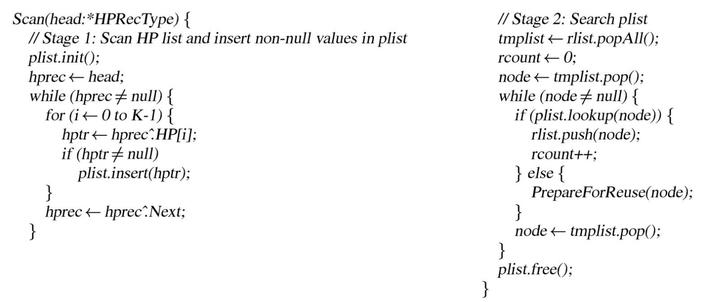
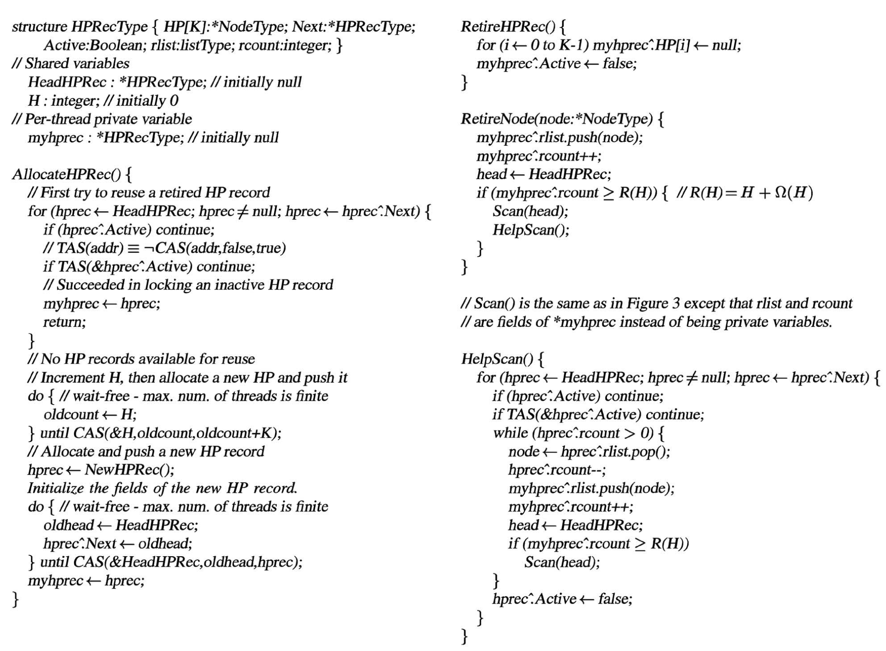

# Lock Free 数据结构

## Treiber Stack

Treiber Stack 是一个 Lock-Free 的 Stack，支持 Push 和 Pop 操作，由 R. Kent Treiber 在 1986 年提出，出现在 [Systems Programming: Coping With Parallelism](https://dominoweb.draco.res.ibm.com/reports/rj5118.pdf) 第 17 页。原文中，它是由汇编编写的：

<figure markdown>
  { width="400" }
  <figcaption>Treiber Stack（图源 <a href="https://dominoweb.draco.res.ibm.com/reports/rj5118.pdf">Systems Programming: Coping With Parallelism Page 18</a>）</figcaption>
</figure>

图中用的是 [IBM System/370 指令集](http://www.simotime.com/simoi370.htm)，用到的部分汇编指令包括：

- `LABEL EQU *`: 创建一个 LABEL 符号，它的值等于当前的地址，相当于 `LABEL:` 语法
- `L REG, MEM`：从 MEM 内存读取数据到 REG 寄存器
- `ST REG, MEM`：把 REG 寄存器的数据写入到 MEM 内存
- `CS REG1, REG2, MEM`：Compare and Swap，把 MEM 内存中的数据和 REG1 进行比较，如果相等，把 REG2 写到 MEM 内存中；如果不相等，把 MEM 内存中的值读取到 REG1 寄存器
- `LTR REG1, REG2`：Load Test Register，比较 REG1 和 REG2 的值

翻译成 C++ 代码，它做的事情大概是（参考了 [cppreference](https://en.cppreference.com/w/cpp/atomic/atomic/compare_exchange)）：

```c++
#include <atomic>
#include <optional>

template <class T> struct Node {
  T data;        // user data
  Node<T> *next; // pointer to next node

  Node(const T &data) : data(data), next(nullptr) {}
};

template <class T> struct Stack {
  // paper: ANCHOR
  // head of singly linked list
  std::atomic<Node<T> *> head;

  Stack() : head(nullptr) {}

  // paper: PUTEL
  void push(const T &data) {
    Node<T> *new_head = new Node<T>(data);

    // paper: L R2, ANCHOR
    // read current head
    Node<T> *cur_head = head.load(std::memory_order_relaxed);

    // paper: ST R2, ELNEXT-EL(,R4)
    // link the new list
    new_head->next = cur_head;

    // paper: CS R2, R4, ANCHOR; ST R2, ELNEXT-EL(,R4) on failure
    // atomic swap if head == new_head->next
    // on success: head becomes new_head
    // on failure: new_head->next becomes the current value of head, and loop
    // release order: ensure new_head->next = cur_head is observed before CAS
    while (!head.compare_exchange_weak(new_head->next, new_head,
                                       std::memory_order_release,
                                       std::memory_order_relaxed))
      ;
  }

  // paper: GETEL
  std::optional<T> pop() {
    Node<T> *cur_head;
    // paper: L R2, ANCHOR
    // read current head
    cur_head = head.load(std::memory_order_relaxed);

    // paper: LTR R2, R2; BZ EMPTY
    while (cur_head) {
      // paper: L R4, ELNEXT-EL(,R2)
      // cur_head->next becomes the new list head
      Node<T> *new_head = cur_head->next;

      // paper: CS R2, R4, ANCHOR
      // atomic swap if head == cur_head
      // on success: head becomes new_head
      // on failure: cur_head becomes the current value of head, and loop
      // acquire order: ensure cur_head->data is done after CAS
      if (head.compare_exchange_weak(cur_head, new_head,
                                     std::memory_order_acquire,
                                     std::memory_order_relaxed)) {
        // success
        T result = cur_head->data;
        // can we delete here?
        // delete cur_head;
        return result;
      }
    }

    // no elements
    return {};
  }
};
```

在其他的一些 Treiber Stack 实现里，`push` 内部会写成一个 do-while 循环，在 CAS 失败的时候重新把 `new_head->next` 设置为 head 的值。这里直接用的无循环体的 while，是利用了 C++ `std::atomic` 的特性：它的 `compare_exchange_weak` 在失败的时候，会自动把 head 的值写入到第一个参数内。

生成的 AMD64 汇编指令如下：

```asm
tack<int>::push(int const&):
        # function prologue
        pushq   %rbp
        movq    %rsi, %rbp
        pushq   %rbx
        # rbx = &head
        movq    %rdi, %rbx

        # call operator new to allocate 16 bytes of memory
        movl    $16, %edi
        subq    $8, %rsp
        call    operator new(unsigned long)
        # new_head = new (16)
        movq    %rax, %rdx
        # eax = data
        movl    0(%rbp), %eax
        # new_head->next = nullptr
        movq    $0, 8(%rdx)
        leaq    8(%rdx), %rcx
        # new_head->data = data
        movl    %eax, (%rdx)
        # cur_head = head.load()
        movq    (%rbx), %rax
        # new_head->next = cur_head
        movq    %rax, 8(%rdx)
.L8:
        # rax = new_head->next
        movq    (%rcx), %rax
        # compare rax(new_head->next) and head
        # if equal: head = new_head
        # else: rax = head
        lock cmpxchgq   %rdx, (%rbx)
        # jump to .L9 if swapped
        je      .L9
        # new_head->next = rax
        movq    %rax, (%rcx)
        # try again
        jmp     .L8
.L9:
        addq    $8, %rsp
        popq    %rbx
        popq    %rbp
        ret

Stack<int>::pop():
        # cur_head = head.load()
        movq    (%rdi), %rax
.L12:
        testq   %rax, %rax
        # jump to .L17 if cur_head is null
        je      .L17
        # new_head = cur_head->next
        movq    8(%rax), %rdx
        # compare rax(cur_head) and head
        # if equal: head = new_head
        # else: rax = head
        lock cmpxchgq   %rdx, (%rdi)
        # jump to .L12 if not swapped
        jne     .L12
        # result = cur_head->data
        movl    (%rax), %eax
        # return result
        movb    $1, -4(%rsp)
        movl    %eax, -8(%rsp)
.L13:
        movq    -8(%rsp), %rax
        ret
.L17:
        movq    $0, -8(%rsp)
        jmp     .L13
```

可见核心就是 [`lock cmpxchgq reg, mem` 指令](https://www.felixcloutier.com/x86/cmpxchg)，它的语义是：

- 比较 mem 指向的内存中的值和 rax 寄存器的值
- 如果相等：ZF=1，把 reg 的值写入到 mem 指向的内容
- 如果不相等：ZF=0，把 mem 指向的内存中的值，写入到 rax 寄存器

并且整个过程是原子的。

在 ARMv8.1-a 上编译，则：

- push 会用 CASL 指令实现 release order 的 64-bit CAS
- pop 会用 CASA 指令实现 acquire order 的 64-bit CAS

`CAS{A,L} Xs, Xt, [Xn|SP, #0]` 的语义：

- 比较 [Xn|SP, #0] 指向的内存中的值和 Xs 寄存器的值
- 如果相等：把 Xt 的值写入到 [Xn|SP, #0] 指向的内容
- 如果不相等：把 [Xn|SP, #0] 指向的内存中的值，写入到 Xs 寄存器

为了判断是否交换成功，还需要额外的 CMP 指令，判断 Xs 在执行 CAS 指令前后的值是否相同。

### ABA 问题以及解决方法

但是这样的实现有一个 ABA 问题（ABA 指某个值从 A 改成 B 再改成 A）：CAS 是根据指针的值来判断是否要 swap，但是指针的值不变，不代表指针指向的还是同一个对象。例如 head 指针（下图的 ANCHOR）指向的 node（下图的 A）被 pop 掉了，未来又重新 push，push 的时候恰好 `new` 出来了同一个指针，就会导致 CAS 写入 next 指针的值用的是原来的 node（下图的 A）的 next（下图的 B），但这个值此时是非法的：

<figure markdown>
  { width="400" }
  <figcaption>Treiber Stack 的 ABA 问题（图源 <a href="https://dominoweb.draco.res.ibm.com/reports/rj5118.pdf">Systems Programming: Coping With Parallelism Figure 10 on Page 19</a>）</figcaption>
</figure>

为了解决这个问题，需要把链表头指针和一个整数绑在一起，二者同时 CAS：每次更新指针的时候，就把这个整数加一，这样就可以区分出前后两个 A 指针了，即使它们指针的值相同，但是整数不同，依然可以正常区分。这需要硬件的支持，通常叫做 Double-wide compare and swap，详见 [原子指令](./atomic_instructions.md)；如果硬件不支持 Double-wide compare and swap，同时虚拟地址没有占用完整的指针长度（例如 64 位下虚拟地址通常只有 48 位），可以复用指针的高位来保存这个整数。使用 Double-wide compare and swap 的汇编版本：

<figure markdown>
  { width="400" }
  <figcaption>Treiber Stack 修正 ABA 问题的版本（图源 <a href="https://dominoweb.draco.res.ibm.com/reports/rj5118.pdf">Systems Programming: Coping With Parallelism Figure 11 on Page 20</a>）</figcaption>
</figure>

汇编出现了新的指令：

- `LM REG1, REG2, MEM`：从 MEM 内存读取两个寄存器的数据，到 REG1 和 REG2
- `LA REG, IMM`：Load Address，加载立即数 IMM 到 REG
- `AR REG1, REG2`：Add Register，两个寄存器相加
- `CDS REG1, REG2, MEM`：Compare Double and Swap，把 REG1 和 REG1+1 两个l连号的存器作为一个整体，把 REG2 和 REG2+1 两个连号的寄存器作为一个整体，实现一个两倍宽度的 Compare and Swap

对应的 C++ 版本：

```c++
#include <atomic>
#include <optional>

template <class T> struct Node {
  T data;        // user data
  Node<T> *next; // pointer to next node

  Node(const T &data) : data(data), next(nullptr) {}
};

template <class T> struct HeadWithCounter {
  // paper: ANCHORP
  // head of singly linked list
  Node<T> *head;
  // paper: ANCHORC
  // allocation counter
  size_t counter;

  HeadWithCounter() : head(nullptr), counter(0) {}
};

template <class T> struct Stack {
  // paper: ANCHOR
  // head of singly linked list with counter
  std::atomic<HeadWithCounter<T>> head;

  Stack() : head(HeadWithCounter<T>()) {}

  // paper: PUTEL
  void push(const T &data) {
    HeadWithCounter<T> new_head;
    new_head.head = new Node<T>(data);

    // paper: L R2, ANCHORP
    // read current head
    // in paper, only head pointer is used for CAS;
    // it is hard to do so with std::atomic
    HeadWithCounter<T> cur_head = head.load(std::memory_order_relaxed);

    do {
      // paper: ST R2, ELNEXT-EL(,R4)
      // link the new list
      new_head.head->next = cur_head.head;
      new_head.counter = cur_head.counter;

      // paper: CS R2, R4, ANCHOR; ST R2, ELNEXT-EL(,R4) on failure
      // atomic swap if head == cur_head
      // on success: head becomes new_head
      // on failure: cur_head becomes the current value of head, and loop
      // release order: ensure write to new_head.head is observed before CAS
    } while (!head.compare_exchange_weak(cur_head, new_head,
                                         std::memory_order_release,
                                         std::memory_order_relaxed));
  }

  // paper: GETEL
  std::optional<T> pop() {
    HeadWithCounter<T> cur_head;
    // paper: LM R2, R3, ANCHOR
    // read current head
    cur_head = head.load(std::memory_order_relaxed);

    // paper: LTR R2, R2; BZ EMPTY
    while (cur_head.head) {
      // paper: L R4, ELNEXT-EL(,R2)
      // cur_head->next becomes the new list head
      HeadWithCounter<T> new_head;
      new_head.head = cur_head.head->next;

      // paper: LA R5, 1; AR R5, R3
      // update counter to handle ABA problem
      new_head.counter = cur_head.counter + 1;

      // paper: CDS R2, R4, ANCHOR
      // atomic swap if head == cur_head
      // on success: head becomes new_head
      // on failure: cur_head becomes the current value of head, and loop
      // acquire order: ensure cur_head->data is read after CAS
      if (head.compare_exchange_weak(cur_head, new_head,
                                     std::memory_order_acquire,
                                     std::memory_order_relaxed)) {
        // success
        T result = cur_head.head->data;
        // can we delete here?
        // delete cur_head.head;
        return result;
      }
    }

    // no elements
    return {};
  }
};
```

如果想要在 `push` 里只 CAS head 指针而不是完整的两倍宽度的 `HeadWithCounter`，可以用 `__atomic builtin`：

```cpp
#define dsize_t unsigned __int128
template <class T> struct Node {
  T data;        // user data
  Node<T> *next; // pointer to next node

  Node(const T &data) : data(data), next(nullptr) {}
};

template <class T> struct HeadWithCounter {
  union {
    dsize_t inner;

    struct {
      // paper: ANCHORP
      // head of singly linked list
      Node<T> *head;
      // paper: ANCHORC
      // allocation counter
      size_t counter;
    };
  };

  HeadWithCounter() : head(nullptr), counter(0) {}
};

template <class T> struct Stack : BaseStack<T> {
  // paper: ANCHOR
  // head of singly linked list with counter
  HeadWithCounter<T> head;

  Stack() {}

  // paper: PUTEL
  void push(const T &data) override {
    Node<T> *new_head = new Node<T>(data);

    // paper: L R2, ANCHORP
    // read current head
    Node<T> *cur_head = __atomic_load_n(&head.head, __ATOMIC_RELAXED);

    // paper: ST R2, ELNEXT-EL(,R4)
    // link the new list
    new_head->next = cur_head;

    // paper: CS R2, R4, ANCHOR; ST R2, ELNEXT-EL(,R4) on failure
    // atomic swap if head == new_head->next
    // on success: head becomes new_head
    // on failure: new_head->next becomes the current value of head, and loop
    // release order: ensure new_head->next = cur_head is observed before CAS
    while (!__atomic_compare_exchange_n(&head.head, &new_head->next, new_head,
                                        true, __ATOMIC_RELEASE,
                                        __ATOMIC_RELAXED))
      ;
  }

  // paper: GETEL
  std::optional<T> pop() override {
    HeadWithCounter<T> cur_head;
    // paper: LM R2, R3, ANCHOR
    // read current head
    cur_head.inner = __atomic_load_n(&head.inner, __ATOMIC_RELAXED);

    // paper: LTR R2, R2; BZ EMPTY
    while (cur_head.head) {
      // paper: L R4, ELNEXT-EL(,R2)
      // cur_head->next becomes the new list head
      HeadWithCounter<T> new_head;
      new_head.head = cur_head.head->next;

      // paper: LA R5, 1; AR R5, R3
      // update counter to handle ABA problem
      new_head.counter = cur_head.counter + 1;

      // paper: CDS R2, R4, ANCHOR
      // atomic swap if head == cur_head
      // on success: head becomes new_head
      // on failure: cur_head becomes the current value of head, and loop
      // acquire order: ensure cur_head->data is read after CAS
      if (__atomic_compare_exchange_n(&head.inner, &cur_head.inner,
                                      new_head.inner, true, __ATOMIC_ACQUIRE,
                                      __ATOMIC_RELAXED)) {
        // success
        T result = cur_head.head->data;
        // cur_head is leaked, since we cannot reclaim memory immediately
        cur_head.head->next = nullptr;
        return result;
      }
    }

    // no elements
    return {};
  }

  virtual const char *name() override { return "treiber_stack_v2"; }
};
```

在 Java 语言版本的 Treiber Stack 中，不会有 ABA 的问题，因为 Java 运行时保证了，CAS 的时候两个不同的对象不会被视为相等。

### 内存回收问题

但其实，上面的两种实现都有一个问题，就是把 delete 注释掉了，这样其实会导致内存泄漏。假如不注释 delete，会导致什么情况呢：

- 假如两个线程同时进入 `pop()` 函数，并且此时链表的内容是 `head -> A -> B`
- 两个线程都获取到了当前的 `head` 的值，记录到了 `cur_head` 局部变量当中，这个值等于 A 的地址
- 然后第一个线程完成了 pop 的剩余过程，此时链表的内容是 `head -> B`，同时 `delete A`
- 第二个线程继续执行，尝试读取 `cur_head->next`，但此时 `cur_head` 就是 A，但它已经被释放了，出现了 use after free

可能的解决办法：

1. 延迟释放：把要释放的结点放到一个 lock free 的链表当中，然后统计当前正在执行 pop 的线程的个数，当只有当前一个线程在进行 pop，则把链表取下来（CAS 成 null），再释放链表中的结点
2. 引用计数：对结点进行引用计数，当引用计数降为零的时候再释放
3. Hazard Pointer：见下

### Hazard Pointers

Hazard Pointers 是由 M.M.Michael 在 2004 的论文 [Hazard Pointers: Safe Memory Reclamation for Lock-Free Objects](https://ieeexplore.ieee.org/document/1291819) 中提出的一种方法，可以给很多种 Lock Free 数据结构实现内存的安全回收。

它的思路是：维护一个全局的指针数组，每个线程对应数组里的一项（或若干项，在 Treiber Stack 里只需要一项就足够，因为 pop 只会访问一个结点，也就只需要保护这一个结点），这一项记录了该线程在 pop 函数中正在访问的结点；在释放结点之前，首先要在全局的指针数组里检查它是否被其他的线程访问：如果是，则放到一个链表中等待释放，直到未来某次检查的时候，发现没有被其他线程访问为止；如果否，则可以立即释放。

检查要释放的结点是否在全局的指针数组中，并回收那些可以释放的结点的过程如下：

<figure markdown>
  { width="400" }
  <figcaption>Hazard Pointers 的 Scan 函数（图源 <a href="https://dl.acm.org/doi/10.1145/248052.248106">Simple, fast, and practical non-blocking and blocking concurrent queue algorithms Figure 3</a>）</figcaption>
</figure>

图中 head 维护了各个线程的信息的链表，其中 HP 数组就是记录了各个线程正在访问的 Hazard Pointers；rlist 就是等待被释放的结点，如果它不在任何一个线程的 HP 当中，就可以释放掉了；否则就继续放在 rlist 里面，等下一次 Scan 再尝试释放。

接下来就是如何维护这些全局的状态：

<figure markdown>
  { width="400" }
  <figcaption>Hazard Pointers（图源 <a href="https://dl.acm.org/doi/10.1145/248052.248106">Simple, fast, and practical non-blocking and blocking concurrent queue algorithms Figure 4</a>）</figcaption>
</figure>

有了 Hazard Pointers 机制以后，再改写 Treiber Stack 的 pop 函数，就可以实现内存回收了：

<figure markdown>
  { width="400" }
  <figcaption>Hazard Pointers 应用到 Treiber Stack（图源 <a href="https://dl.acm.org/doi/10.1145/248052.248106">Simple, fast, and practical non-blocking and blocking concurrent queue algorithms Figure 8</a>）</figcaption>
</figure>

### Push/Pop Elimination 消除

虽然 Treiber Stack 实现了 Lock free 的 Push 和 Pop 操作，但由于每次都是操作的同一个指针，导致实际上更新是串行的，性能受限。为了解决这个问题，可以引入 Elimination：即给 Push 和 Pop 进行配对，如果发现两个线程分别在进行 Push 和 Pop，那就把 Push 的数据传递给 Pop，然后就不需要更新 Stack 了。为了实现这个配对，需要引入额外的 Elimination Array。这个方法由 Danny Hendler、Nir Shavit 和 Lena Yerushalmi 在 2004 年的论文 [A scalable lock-free stack algorithm](https://dl.acm.org/doi/10.1145/1007912.1007944) 中提出，具体地：

- Push/Pop 的时候，首先按照 Treiber Stack 的方式进行 CAS，如果 CAS 成功，那就直接结束；如果 CAS 失败，不立即重试，而是尝试进行一次 Elimination
- 尝试 Eliminate：在一个 Elimination Array 当中，随机选取一项，根据它的占用状态：
    - 如果没有其他线程在占用，那就由本线程占用这一项，然后等待一段时间，直到有其他线程来访问同一项
    - 如果已经有其他线程占用了这一项，并且本线程和占用了这一项的现场正好是一 Push 一 Pop，就进行 Eliminate
- 如果 Eliminate 失败，回到 Treiber Stack 的方式，重新进行 CAS

### 参考

- [Systems Programming: Coping With Parallelism](https://dominoweb.draco.res.ibm.com/reports/rj5118.pdf)
- [Treiber stack](https://en.wikipedia.org/wiki/Treiber_stack)
- [A Lock-Free Stack: A Complete Implementation](https://www.modernescpp.com/index.php/a-lock-free-stack-a-complete-implementation/)
- [Hazard Pointers: Safe Memory Reclamation for Lock-Free Objects](https://ieeexplore.ieee.org/document/1291819)

## Queue

在 [The Art of Multiprocessor Programming](https://dl.acm.org/doi/pdf/10.5555/2385452) 的 10.5 An Unbounded Lock-Free Queue 中描述了一种 Lock Free 的 Queue 实现，它支持 enqueue 和 dequeue 两个操作。这个算法来自论文 [Simple, fast, and practical non-blocking and blocking concurrent queue algorithms](https://dl.acm.org/doi/10.1145/248052.248106)，由 Maged M. Michael 和 Michael L. Scott 在 1996 年提出。论文中的实现如下：

<figure markdown>
  { width="400" }
  <figcaption>Lock Free Queue（图源 <a href="https://dl.acm.org/doi/10.1145/248052.248106">Simple, fast, and practical non-blocking and blocking concurrent queue algorithms</a>）</figcaption>
</figure>

其 Java 实现如下：

```java
// from The Art of Multiprocessor Programming Figure 10.9 to 10.11
public class Node {
  public T value;
  public AtomicReference<Node> next;
  public Node(T value) {
    this.value = value;
    next = new AtomicReference<Node>(null);
  }
}

public class LockFreeQueue<T> {
  private AtomicReference<Node> head;
  private AtomicReference<Node> tail;

  public void enq(T value) {
    Node node = new Node(value);
    while (true) {
      Node last = tail.get();
      Node next = last.next.get();
      if (last == tail.get()) {
        if (next == null) {
          if (last.next.compareAndSet(next, node)) {
            tail.compareAndSet(last, node);
            return;
          }
        } else {
          tail.compareAndSet(last, next);
        }
      }
    }
  }

  public T deq() throws EmptyException {
    while (true) {
      Node first = head.get();
      Node last = tail.get();
      Node next = first.next.get();
      if (first == head.get()) {
        if (first == last) {
          if (next == null) {
            throw new EmptyException();
          }
          tail.compareAndSet(last, next);
        } else {
          T value = next.value;
          if (head.compareAndSet(first, next))
            return value;
        }
      }
    }
  }
}
```

Java 版本和论文的实现有两点不同：

1. CAS 没有加 counter，因为 Java 保证了不同对象的比较不会相等
2. 去掉了显式的 free，而是交给垃圾回收

## Set

在 [The Art of Multiprocessor Programming](https://dl.acm.org/doi/pdf/10.5555/2385452) 的 9.8 Non-Blocking Synchronization 中描述了一种 Lock Free 的 Set 实现，它支持 add、remove 和 contains 三个操作，它的实现方式是把 Set 的元素按照 key 从小到大放置在一个链表当中（List-based set）。这个算法由 Maged M. Michael 在 2002 年的论文 [High performance dynamic lock-free hash tables and list-based sets](https://dl.acm.org/doi/10.1145/564870.564881) 中提出。论文中的实现如下：

<figure markdown>
  { width="400" }
  <figcaption>Lock Free Set（图源 <a href="https://dl.acm.org/doi/10.1145/564870.564881">High performance dynamic lock-free hash tables and list-based sets</a>）</figcaption>
</figure>

其 Java 实现如下：

```java
// from The Art of Multiprocessor Programming 
class Window {
  public Node pred, curr;
  Window(Node myPred, Node myCurr) {
    pred = myPred;
    curr = myCurr;
  }
}

public Window find(Node head, int key) {
  Node pred = null, curr = null, succ = null;
  boolean[] marked = {false};
  boolean snip;
retry:
  while (true) {
    pred = head;
    curr = pred.next.getReference();
    while (true) {
      succ = curr.next.get(marked);
      while (marked[0]) {
        snip = pred.next.compareAndSet(curr, succ, false, false);
        if (!snip)
          continue retry;
        curr = succ;
        succ = curr.next.get(marked);
      }
      if (curr.key >= key)
        return new Window(pred, curr);
      pred = curr;
      curr = succ;
    }
  }
}

public boolean add(T item) {
  int key = item.hashCode();
  while (true) {
    Window window = find(head, key);
    Node pred = window.pred, curr = window.curr;
    if (curr.key == key) {
      return false;
    } else {
      Node node = new Node(item);
      node.next = new AtomicMarkableReference(curr, false);
      if (pred.next.compareAndSet(curr, node, false, false)) {
        return true;
      }
    }
  }
}

public boolean remove(T item) {
  int key = item.hashCode();
  boolean snip;
  while (true) {
    Window window = find(head, key);
    Node pred = window.pred, curr = window.curr;
    if (curr.key != key) {
      return false;
    } else {
      Node succ = curr.next.getReference();
      snip = curr.next.compareAndSet(succ, succ, false, true);
      if (!snip)
        continue;
      pred.next.compareAndSet(curr, succ, false, false);
      return true;
    }
  }
}

public boolean contains(T item) {
  boolean[] marked = false;
  int key = item.hashCode();
  Node curr = head;
  while (curr.key < key) {
    curr = curr.next.getReference();
    Node succ = curr.next.get(marked);
  }
  return (curr.key == key && !marked[0])
}
```

为了解决链表的并发修改问题，它给每个结点添加了一个 marked 属性，当这个结点要被删除的时候，先不把它从链表中删掉，而是打上标记；之后在遍历的时候，再把要删除的结点从链表中删除并回收。

## Lock Free vs Wait Free

根据 [The Art of Multiprocessor Programming](https://dl.acm.org/doi/pdf/10.5555/2385452)：

- A method is wait-free if it guarantees that every call finishes in a finite number of steps.
- A method is lock-free if it guarantees that some call always finishes in a finite number of steps.

Wait free 更强，要求所有调用都可以在有限步内完成；Lock free 强调的是整个系统一直在工作，总有调用可以在有限步内完成。在 Treiber Stack 里，push 和 pop 都有 `while(true)` 循环，如果线程 A 一直在调用 push/pop，那么线程 B 的 push/pop 调用可能一直无法成功，此时不能保证 Wait free，但是两个线程至少有一个是在操作 Treiber Stack 的，所以是 Lock free。

## 推荐阅读

- [An Introduction to Lock-Free Programming](https://preshing.com/20120612/an-introduction-to-lock-free-programming/)
- [Lockless Programming Considerations for Xbox 360 and Microsoft Windows](https://learn.microsoft.com/en-us/windows/win32/dxtecharts/lockless-programming)
- [Lock-Free Programming by Geoff Langdale](https://www.cs.cmu.edu/~410-s05/lectures/L31_LockFree.pdf)
