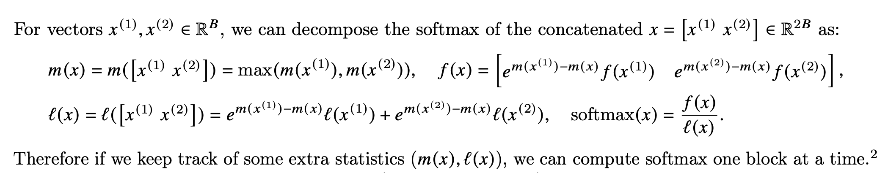
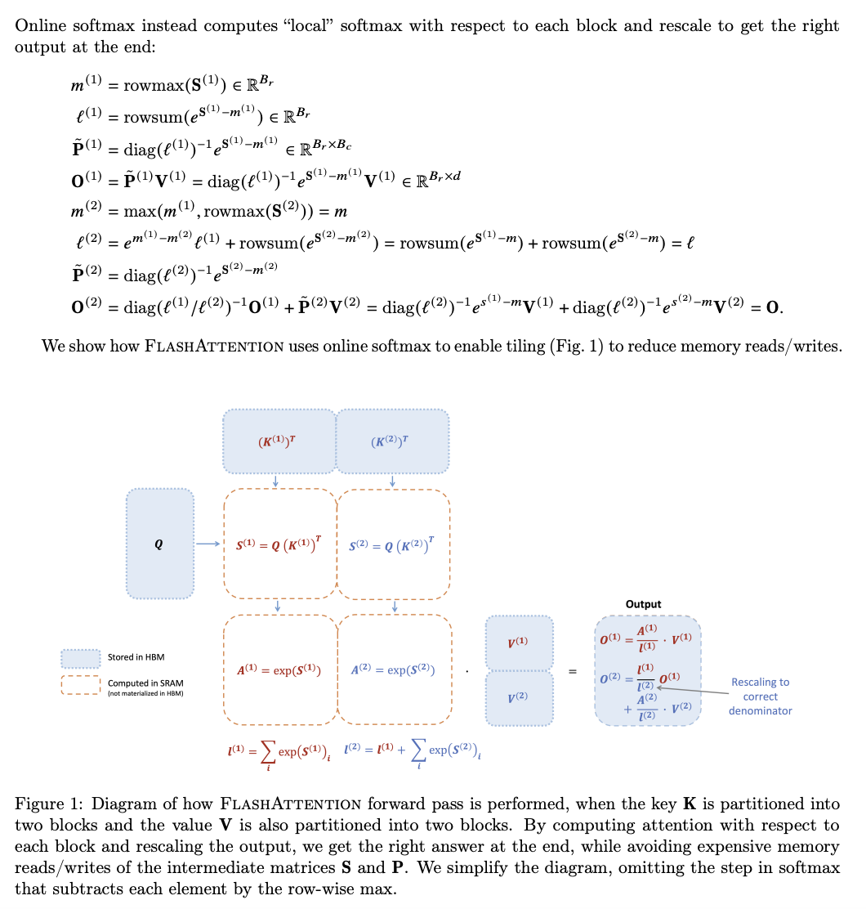

# Transformer

下面只考虑 Decoder-only 的 Transformer。

## 计算过程

输入 $n$ 个 Token，通过 Text 和 Position Embedding 后，得到一个尺寸为 $(n, d_{model})$ 的矩阵，其中 $d_{model}$ 为 Embedding 向量的长度。

接着，经过 $n_{layer}$ 个层，每层中要进行如下的计算：

1. 从上一层的输出 $(n, d_{model})$，每个 head 上乘以三个 $(d_{model}, d_{head})$ 的矩阵，得到 Q，K 和 V，尺寸为 $(n, d_{head})$
2. 按照 attention 激活公式，得到 Z，尺寸为 $(n, d_{head})$
3. 把所有 head 的 Z 矩阵拼起来，保证 $d_{model} = n_{head} * d_{head}$，那么所有的 Z 拼起来以后得到的矩阵的尺寸为 $(n, d_{head})$
4. 乘以一个尺寸为 $(d_{model}, d_{model})$ 的 Projection 矩阵，得到新矩阵 $(n, d_{model})$
5. 经过一个 MLP，MLP 第一层是 $(d_{model}, 4*d_{model})$，第二层是 $(4*d_{model}, d_{model})$
6. MLP 输出的矩阵尺寸为 $(n, d_{model})$

## KV cache

在推理的时候，是在已有的 context 的基础上，生成一个新 token，再把 token 加到 context，继续生成下一个 token。计算的时候，由于 Attention 会带 Mask，旧 token 不会依赖新 token，因此旧 token 的部分不会变，可以只考虑新引入的 token 带来的变化。

那么，计算新的 token 的 Q K V 以后，在进行 Attention 计算的时候，会发现先前的 token 的 K 和 V 部分不变，先前 token 的 Q 不影响当前 token 的结果。因此可以把之前 token 的 K 和 V 保存下来，不用重新计算，这就是 KV cache。

## 参数量和浮点计算量

考虑每层的参数量和浮点计算量：

1. 计算 Q，K 和 V：参数是三个 $(d_{model}, d_{model})$ 的矩阵，计算量是 $2 * 3 * n * d_{model}^2$
2. 乘以 Projection 矩阵：参数是 $(d_{model}, d_{model})$ 的矩阵，计算量是 $2 * n * d_{model}^2$
3. 乘以 MLP 第一层：参数是 $(d_{model}, 4*d_{model})$ 的矩阵，计算量是 $2 * 4 * n * d_{model}^2$
4. 乘以 MLP 第二层：参数是 $(4*d_{model}, d_{model})$ 的矩阵，计算量是 $2 * 4 * n * d_{model}^2$

其余部分的参数量和计算量可以忽略不计。

因此总参数量（不考虑 Embedding）为：

$$
12n_{layer}d_{model}^2
$$

每个 Token 的浮点计算量为：

$$
24n_{layer}d_{model}^2 \mathrm{FLOP}
$$

## Llama 2 7B

以 Llama 2 7B 为例，下面分析 Transformer 推理的计算过程，它的参数如下：

- hidden size: 4096
- intermediate size（MLP 的中间层的维度）: 11008
- hidden layers: 32
- attention heads: 32
- key value heads: 32
- head dim: 4096 / 32 = 128
- vocab size: 32000

参考 [HuggingFace 源码](https://github.com/huggingface/transformers/blob/main/src/transformers/models/llama/modeling_llama.py)。

Llama2 的主要计算过程是 32 层 LlamaDecoderLayer，每个 LlamaDecoderLayer 包括：

1. `hidden_states = self.input_layernorm(hidden_states)`: 见 LlamaRMSNorm
2. `hidden_states, self_attn_weights, present_key_value = self.self_attn()`：见 LlamaAttention
3. `hidden_states = residual + hidden_states`: `aten::add([1, 1, 4096], [1, 1, 4096]) = [1, 1, 4096]`
4. `hidden_states = self.post_attention_layernorm(hidden_states)`: 见 LlamaRMSNorm
5. `hidden_states = self.mlp(hidden_states)`：见 LlamaMLP
6. `hidden_states = residual + hidden_states`: `aten::add([1, 1, 4096], [1, 1, 4096]) = [1, 1, 4096]`

hidden_states 的规模是 `[1, 1, 4096]`。

LlamaRMSNorm 包括：

1. `hidden_states = hidden_states.to(torch.float32)`: `aten::to([1, 1, 4096]) = [1, 1, 4096]`
2. `v1 = hidden_states.pow(2)`: `aten::pow([1, 1, 4096]) = [1, 1, 4096]`
3. `variance = v2.mean(-1, keepdim=True)`: `aten::mean([1, 1, 4096]) = [1, 1, 1]`
4. `v3 = variance + self.variance_epsilon`: `aten::add([1, 1, 1]) = [1, 1, 1]`, 1 FLOP
5. `v4 = torch.rsqrt(v3)`: `aten::rsqrt([1, 1, 1]) = [1, 1, 1]`
6. `hidden_states = hidden_states * v4`: `aten::mul([1, 1, 4096], [1, 1, 1]) = [1, 1, 4096]`, 4096 FLOP
7. `v5 = hidden_states.to(input_dtype)`: `aten::to([1, 1, 4096]) = [1, 1, 4096]`
8. `return self.weight * v5`: `aten::mul([4096], [1, 1, 4096])`, 4096 FLOP

LlamaAttention 包括：

1. `query_states = self.q_proj(hidden_states)`: `aten::linear([1, 1, 4096], [4096, 4096]) = [1, 1, 4096]`, 33554432 FLOP
2. `key_states = self.k_proj(hidden_states)`: `aten::linear([1, 1, 4096], [4096, 4096]) = [1, 1, 4096]`, 33554432 FLOP
3. `value_states = self.v_proj(hidden_states)`: `aten::linear([1, 1, 4096], [4096, 4096]) = [1, 1, 4096]`, 33554432 FLOP
4. `v1 = query_states.view(bsz, q_len, self.num_heads, self.head_dim)`: `aten::view([1, 1, 4096]) = [1, 1, 32, 128]`
5. `query_states = v1.transpose(1, 2)`: `aten::transpose([1, 1, 32, 128]) = [1, 32, 1, 128]`
6. `v2 = key_states.view(bsz, q_len, self.num_key_value_heads, self.head_dim)`: `aten::view([1, 1, 4096]) = [1, 1, 32, 128]`
7. `key_states = v2.transpose(1, 2)`: `aten::transpose([1, 1, 32, 128]) = [1, 32, 1, 128]`
8. `v3 = value_states = value_states.view(bsz, q_len, self.num_key_value_heads, self.head_dim)`: `aten::view([1, 1, 4096]) = [1, 1, 32, 128]`
9. `value_states = v3.transpose(1, 2)`: `aten::transpose([1, 1, 32, 128]) = [1, 32, 1, 128]`
10. `cos, sin = self.rotary_emb(value_states, seq_len=kv_seq_len)`: 见 LlamaRotaryEmebdding
11. `query_states, key_states = apply_rotary_pos_emb(query_states, key_states, cos, sin, position_ids)`: 见 apply_rotary_pos_emb
12. `key_states = torch.cat([past_key_value[0], key_states], dim=2)`: `aten::cat([1, 32, C-1, 128], [1, 32, 1, 128]) = [1, 32, C, 128]`
13. `value_states = torch.cat([past_key_value[1], value_states], dim=2)`: `aten::cat([1, 32, C-1, 128], [1, 32, 1, 128]) = [1, 32, C, 128]`
14. `v4 = key_states.transpose(2, 3)`: `aten::transpose([1, 32, C, 128]) = [1, 32, 128, C]`
15. `v5 = torch.matmul(query_states, v4)`: `aten::matmul([1, 32, 1, 128], [1, 32, 128, C]) = [1, 32, 1, C]`, 8192*C FLOP
16. `attn_weights = v1 / math.sqrt(self.head_dim)`: `aten::div([1, 32, 1, C]) = [1, 32, 1, C]`
17. `attn_weights = attn_weights + attention_mask`: `aten::add([1, 32, 1, C], [1, 1, 1, C]) = [1, 32, 1, C]`, 32*C FLOP
18. `v6 = nn.functional.softmax(attn_weights, dim=-1, dtype=torch.float32).to(query_states.dtype)`: `aten::softmax([1, 32, 1, C]) = [1, 32, 1, C]`
19. `attn_weights = v6.to(query_states.dtype)`: `aten::to([1, 32, 1, C]) = [1, 32, 1, C]`
20. `attn_output = torch.matmul(attn_weights, value_states)`: `aten::matmul([1, 32, 1, C], [1, 32, C, 128]) = [1, 32, 1, 128]`: 8192*C FLOP
21. `attn_output = attn_output.transpose(1, 2).contiguous()`: `aten::transpose([1, 32, 1, 128]) = [1, 1, 32, 128]`
22. `attn_output = attn_output.reshape(bsz, q_len, self.hidden_size)`: `aten::reshape([1, 1, 32, 128]) = [1, 1, 4096]`
23. `attn_output = self.o_proj(attn_output)`: `aten::linear([1, 1, 4096], [4096, 4096]) = [1, 1, 4096]`, 33554432 FLOP

LlamaRotaryEmbedding 包括：

1. `self.cos_cached[:, :, :seq_len, ...].to(dtype=x.dtype),`: `aten::slice([1, 1, 4096, 128])`
2. `self.sin_cached[:, :, :seq_len, ...].to(dtype=x.dtype),`: `aten::slice([1, 1, 4096, 128])`

apply_rotary_pos_emb 包括：

1. `v1 = cos.squeeze(1)`: `aten::squeeze([1, 1, 10, 128])`
2. `cos = v1.squeeze(0)`: `aten::squeeze([1, 10, 128])`
3. `v2 = cos.squeeze(1)`: `aten::squeeze([1, 1, 10, 128])`
4. `sin = v2.squeeze(0)`: `aten::squeeze([1, 10, 128])`
5. `v3 = cos[position_ids]`: `aten::index([10, 128])`
6. `cos = v3.unsqueeze(1)`: `aten::unsqueeze([1, 1, 128]) = [1, 1, 1, 128]`
7. `v4 = sin[position_ids]`: `aten::index([10, 128])`
8. `sin = v4.unsqueeze(1)`: `aten::unsqueeze([1, 1, 128]) = [1, 1, 1, 128]`
9. `v5 = q * cos`: `aten::mul([1, 32, 1, 128], [1, 1, 1, 128]) = [1, 32, 1, 128]`, 4096 FLOP
10. `v6 = rotate_half(q)`: 见 rotate_half
11. `v7 = v6 * sin`: `aten::mul([1, 32, 1, 128], [1, 1, 1, 128]) = [1, 32, 1, 128]`, 4096 FLOP
12. `q_embed = v5 + v7`: `aten::add([1, 32, 1, 128], [1, 32, 1, 128]) = [1, 32, 1, 128]`, 4096 FLOP
13. `v8 = k * cos`: `aten::mul([1, 32, 1, 128], [1, 1, 1, 128]) = [1, 32, 1, 128]`, 4096 FLOP
14. `v9 = rotate_half(k)`: 见 rotate_half
15. `v10 = v9 * sin`: `aten::mul([1, 32, 1, 128], [1, 1, 1, 128]) = [1, 32, 1, 128]`, 4096 FLOP
16. `k_embed = v8 + v10`: `aten::add([1, 32, 1, 128], [1, 32, 1, 128]) = [1, 32, 1, 128]`, 4096 FLOP

rotate_half 包括：

1. `x1 = x[..., : x.shape[-1] // 2]`: `aten::slice([1, 3, 1, 128])`
2. `x2 = x[..., x.shape[-1] // 2 :]`: `aten::slice([1, 3, 1, 128])`
1. `v1 = -x2`: `aten::neg([1, 3, 1, 64])`
2. `return torch.cat((v1, x1), dim=-1)`: `aten::cat([1, 3, 1, 64], [1, 3, 1, 64]) = [1, 3, 1, 128]`

LlamaMLP 包括：

1. `v1 = self.gate_proj(x)`: `aten::linear([1, 1, 4096], [11008, 4096]) = [1, 1, 11008]`, 90177536 FLOP
2. `v2 = self.act_fn(v1)`: `aten::silu([1, 1, 11008]) = [1, 1, 11008]`
3. `v3 = self.up_proj(x)`: `aten::linear([1, 1, 4096], [11008, 4096]) = [1, 1, 11008]`, 90177536 FLOP
4. `v4 = v2 * v3`: `aten::mul([1, 1, 11008], [1, 1, 11008]) = [1, 1, 11008]`, 11008 FLOP
5. `v5 = self.down_proj(v4)`: `aten::linear([1, 1, 11008], [4096, 11008]) = [1, 1, 4096]`, 90177536 FLOP

最后一个 LlamaDecoderLayer 的输出会经过 lm_head 得到 logits：

1. `logits = self.lm_head(hidden_states)`: `aten::linear([1, 1, 4096], [32000, 4096]) = [1, 1, 32000]`, 262144000 FLOP

所有 aten 算子：

- aten::add
- aten::cat
- aten::div
- aten::index
- aten::linear
- aten::matmul
- aten::mean
- aten::mul
- aten::neg
- aten::pow
- aten::reshape
- aten::rsqrt
- aten::sequeeze
- aten::silu
- aten::slice
- aten::softmax
- aten::to
- aten::transpose
- aten::unsqueeze
- aten::view

## FlashAttention

论文：[FlashAttention: Fast and Memory-Efficient Exact Attention with IO-Awareness](https://arxiv.org/abs/2205.14135)

代码：[Dao-AILab/flash-attention](https://github.com/Dao-AILab/flash-attention)

推荐阅读：[FlashAttention 核心逻辑以及 V1 V2 差异总结](https://zhuanlan.zhihu.com/p/665170554)

主要针对 Transformer 训练中的 Attention 计算进行优化。Attention 计算的是：

\(S = QK^T, P = \mathrm{softmax}(S), O = PV\)

其中 Q、K 和 V 矩阵规模都是 $N*d$，S 和 P 矩阵规模是 $N*N$，O 矩阵规模是 $N*d$，N 是序列长度，d 是 head dimension。实际上 $S$ 矩阵还会除以一个系数，但是这个优化起来比较简单，就忽略了。朴素算法就是这三个步骤分别算，但是就比较慢。核心问题是 softmax 操作。softmax 的定义是：

\(\mathrm{softmax}(x) = \frac{e^{x_i}}{\Sigma_j e^{x_j}}\)

分子是对应项的 exp，分母是所有项的 exp 之和。所以 softmax 的按定义算的方法就是：所有元素求 exp，然后求 exp 的和，再集体做除法。

但是这么算会有一个问题：元素的 exp 可能会很大，导致精度比较差。因此实际计算的时候，会先计算出元素的最大值 $x_m$，然后分子分母同时除以最大值的 exp：

\(\mathrm{softmax}(x) = \frac{e^{x_i-x_m}}{\Sigma_j e^{x_j-x_m}}\)

这样计算的精度会比较好，因为 exp 的值都在 0 和 1 之间。这也意味着 softmax 的计算需要先求 max，然后每个元素减去 max 后，求 exp，再求元素的 exp 之和，最后每个元素再除以 exp 之和。准确地说，因为这里的输入是矩阵，所以是对矩阵的每一行分别算 softmax。

但是这样的求法意味着需要先把完整的 softmax 输入求出来，使得 tiling 变得困难。为了 tiling，FlashAttention 采用了一种分块的 softmax 计算方法：首先对每一块分别做 softmax，但是按照定义，max 和 sum 都应该是完整向量的 max 和 sum，而如果分块去计算 softmax，此时的 max 和 sum 是块内的，因此需要进行后处理，把分块的 softmax 纠正成正确的 softmax：

假如有两个块分别做了 softmax，结果是两个向量 $x_1$ 和 $x_2$，计算时的 max 记为 $m_1$ 和 $m_2$，分子记为 $f(x_1)$ 和 $f(x_2)$，分母记为 $l(x_1)$ 和 $l(x_2)$。那么合并后的向量的 max 就是 $m=\max(m_1, m_2)$，接下来计算出完整的 softmax：分子来自于两个向量，但是需要把 $m_1$ $m_2$ 和 $m$ 的差异补上，那就是 $e^{m_1-m}f(x_1)$ 和 $e^{m_2-m}f(x_2)$ 两部分拼接起来；分母则是两个向量的部分，把 max 差异纠正后再求和：$e^{m_1-m}l(x_1)+e^{m_2-m}l(x_2)$。论文中是这么表示的：

<figure markdown>
  { width="600" }
  <figcaption>分块 softmax（来源：FlashAttention: Fast and Memory-Efficient Exact Attention with IO-Awareness）</figcaption>
</figure>

因此计算 softmax 的时候可以先分块进行，最后再把结果纠正过来。能分块了以后，就可以做 kernel fusion，和矩阵乘法、Masking、Dropout 合并起来，让中间结果在 GPU 内部完成，而不是先写到显存里再读回来。

论文的 Algorithm 1 和 2 给出了融合后的 Kernel 的伪代码。思路是：

1. 对 Q、K 和 V 分块
2. 对于每个块，计算当前块的 $QK^T$ 结果，然后计算 rowmax（每行计算出一个最大值），每个元素减去 rowmax 再 exp，得到 softmax 函数的分子；再求和，得到 softmax 函数的分母
3. 把刚算出来的 softmax 结果和之前计算的 softmax 结果合并，得到一组新的 softmax 系数
4. 更新当前的输出矩阵：把旧的分母乘回来，就得到旧的分子，把旧的分子乘上 exp 系数，再加上新的分子，结果再除以新的分子；这一步和迭代更新平均值很像：旧的平均值乘以旧的元素个数，加上新的元素再除以新的元素个数

然后在中间穿插 dropout 和 masking 等细节，就得到了最终的实现。对这个过程讲的比较清楚的是下面这个图：

<figure markdown>
  { width="600" }
  <figcaption>Flash Attention（来源：FlashAttention-2: Faster Attention with Better Parallelism and Work Partitioning）</figcaption>
</figure>

右下角 Rescaling to correct denominator 就是上面说的，把旧的分母乘回来，再计算出新的值。标量乘矩阵在上面的式子里表示成了对角矩阵和矩阵的乘法。

不过，这份伪代码距离实际的 CUDA 实现，还有很多细节上的优化。此外，论文还对梯度反向传播进行了优化，毕竟是服务于训练：思路是，前向计算的时候，因为 kernel fusion 的原因，跳过了中间结果的运算，所以反向传播的时候，就重新计算一下 attention，再求梯度。

## FlashAttention 2

论文：[FlashAttention-2: Faster Attention with Better Parallelism and Work Partitioning](https://tridao.me/publications/flash2/flash2.pdf)

代码：[Dao-AILab/flash-attention](https://github.com/Dao-AILab/flash-attention)

FlashAttention 2 相比 FlashAttention 的主要区别是并行的方式。第一个版本是在 batch 和 head 维度上进行并行，也就是说，每个 CUDA thread block 对应一个 batch size 和一个 attention head，一共有 batch size 乘以 head 个数那么多个 thread block。

而第二个版本在 sequence length 维度上也引入了并行，使得 GPU 的利用率可以继续提升。此外，在计算局部 softmax 的时候，也做了修改：不着急计算局部的 softmax，而是分别维护分子和分母，到算完了以后，再算分子除以坟墓。

## FlashDecoding

博客：[Flash-Decoding for long-context inference](https://crfm.stanford.edu/2023/10/12/flashdecoding.html)

Flash Decoding 是针对长上下文场景下的推理：KV cache 的读取变成了一个瓶颈。所以 Flash-Decoding 的思路就是，并行读取 KV-cache，并且在 sequence length 维度上并行 attention 计算。当然了，并行了以后，就要拆成多块分别求 softmax，也需要 Flash Attention 的合并方法来保证最终 softmax 结果的正确性。

## FlashDecoding++

论文：[FLASHDECODING++: FASTER LARGE LANGUAGE MODEL INFERENCE ON GPUS](https://arxiv.org/pdf/2311.01282.pdf)

这篇论文也是针对 transformer 推理的优化，主要的优化点：

1. Flash Attention 论文解决了 softmax 的分块计算问题，但是每次需要计算一个 max；FlashDecoding++ 选择根据数据的分布去估计一个 max，之后再纠正，可以减少一些同步
2. 针对 batch 维度小的矩阵乘法进行优化

## 参考文献

- [Speeding up the GPT - KV cache](https://www.dipkumar.dev/becoming-the-unbeatable/posts/gpt-kvcache/)
- [最新最全 GPT-3 模型网络结构详细解析](https://zhuanlan.zhihu.com/p/174782647)
- [Transformer Inference Arithmetic](https://kipp.ly/transformer-inference-arithmetic/)
- [Understanding FLOPs-per-token estimates from OpenAI’s scaling laws](https://discuss.huggingface.co/t/understanding-flops-per-token-estimates-from-openais-scaling-laws/23133)
- [拆 Transformer 系列二：Multi-Head Attention 机制详解](https://zhuanlan.zhihu.com/p/109983672)
- [Past_key_values - why not past_key_values_queries?](https://discuss.huggingface.co/t/past-key-values-why-not-past-key-values-queries/31941/4)